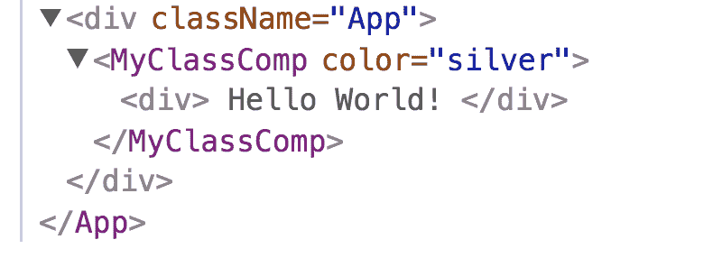
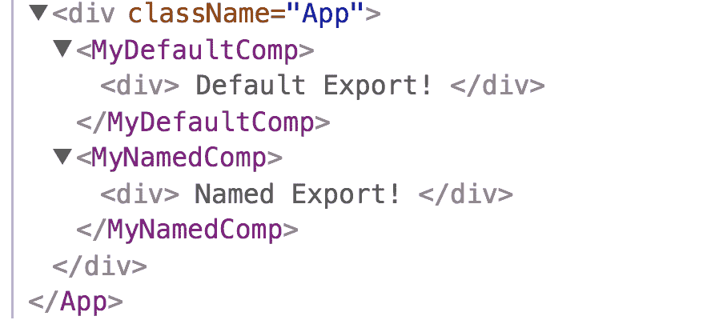
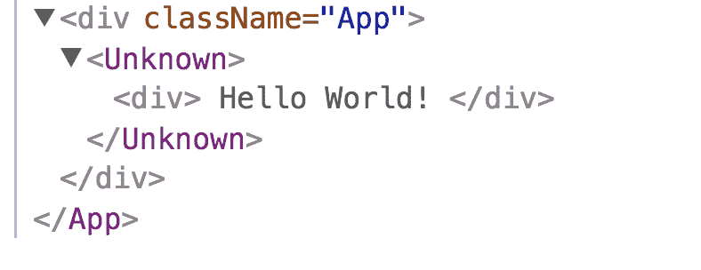
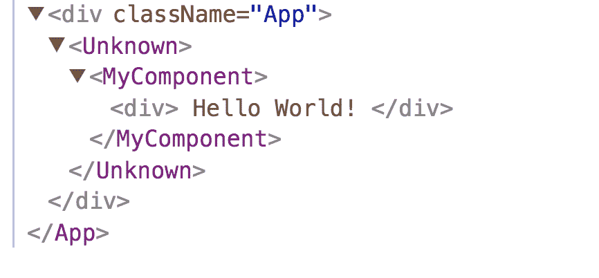
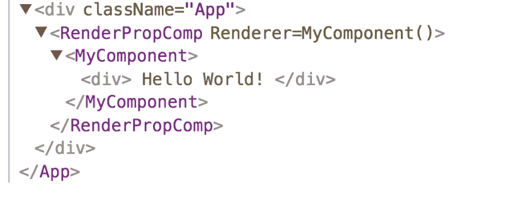

# 反应 DevTools 和未知组件

> 原文：<https://dev.to/fargrim/react-devtools-and-unknown-components-3ni6>

我已经在 React 工作了大约 2 年，占了我专业工作的 95%。大多数问题都很容易找到解决方案，但我看到人们有一个似乎没有太多文档的问题，那就是使用 React DevTools 时的`<Unknown>`组件的情况。

一般来说，React 会根据提供的函数或类名来推断组件的名称。大多数时候，这是你需要知道的，你不应该遇到任何问题。但是，有几种创建 React 组件的方法可能会导致问题。我收集了一些常见的例子，以及它们将如何出现在 React DevTools 中。

在这篇文章中，我将使用 ES6 语法。

## 类组件

类组件非常简单。我认为大多数人倾向于在导出类之前给它们命名。

```
// MyClassComp.js
class MyClassComp extends React.Component {
  render() {
    return <div> Hello World! </div>;
  };
}

export default MyClassComp;

// App.js
import MyClassComp from './MyClassComp';

class App extends React.Component {
  render() {
    return (
      <div className="App">
        <MyClassComp />
      </div>
    );
  }
} 
```

Enter fullscreen mode Exit fullscreen mode

[T2】](https://postimg.cc/image/rrp23ph37/)

这里没有真正的惊喜，React 可以很容易地破译你的组件的名称。如果我们直接导出类呢？

```
// MyClassComp.js
export default class extends React.Component {
  render() {
    return <div> Hello World! </div>;
  };
}

// App.js
import MyClassComp from './MyClassComp';

class App extends React.Component {
  render() {
    return (
      <div className="App">
        <MyClassComp />
      </div>
    );
  }
} 
```

Enter fullscreen mode Exit fullscreen mode

[T2】](https://postimg.cc/image/yuwxjbu8j/)

嗯，不完全是`<Unknown>`但仍然不是非常有用的信息。

## 功能组件

功能组件通常和类组件一样工作。然而，以多种方式创建和导出功能组件更容易，所以您必须有更多的认识。

这是一个命名导出和默认导出的示例。

```
// MyDefaultComp.js
export const MyNamedComp = props => <div> Named Export! </div>; 
const MyDefaultComp = props => <div> Default Export! </div>; export default MyDefaultComp;

// App.js
import MyDefaultComp, {MyNamedComp} from './MyDefaultComp';

class App extends React.Component {
  render() {
    return (
      <div className="App">
        <MyNamedComp />
        <MyDefaultComp />
      </div>
    );
  }
} 
```

Enter fullscreen mode Exit fullscreen mode

[T2】](https://postimg.cc/image/oxlwq9ucj/)

如您所见，两者在 DevTools 中都被正确命名。但是如果我们要导出一个匿名函数呢？

```
// MyFunctionalComp.js
export default props => <div> Hello World! </div>; 

// App.js
import MyFunctionalComp from './MyFunctionalComp';

class App extends React.Component {
  render() {
    return (
      <div className="App">
        <MyFunctionalComp />
      </div>
    );
  }
} 
```

Enter fullscreen mode Exit fullscreen mode

[T2】](https://postimg.cc/image/t6qmsfagj/)

我认为 DevTools 现在提供一个`<Unknown>`组件并不令人震惊。我们在导出组件时没有为它提供名称，所以 React 不能为我们推断它。

## 高阶分量

高阶元件稍微复杂一些。这是一个高阶程序，它将一个组件作为参数并呈现它。

```
// HigherOrderComp.js
const HigherOrderComp = Wrapped => props => <Wrapped />;

export default HigherOrderComp;

// App.js
import HigherOrder from './HigherOrder';

const MyComponent = props => <div> Hello World! </div>; const MyHOC = HigherOrder(MyComponent);

class App extends React.Component {
  render() {
    return (
      <div className="App">
        <MyHOC />
      </div>
    );
  }
} 
```

Enter fullscreen mode Exit fullscreen mode

[T2】](https://postimg.cc/image/r269rd3oz/)

有意思！尽管为我们的高阶组件定义了一个名称，但是这个名称在 DevTools 中丢失了。此外，被包装的组件保留其名称！

## 渲染道具

使用渲染道具的更高级技术的最后一个例子。

```
// RenderPropComp.js
class RenderPropComp extends React.Component {

  render() {
    const { Renderer } = this.props
    return <Renderer />;
  }
}

export default RenderPropComp;

// App.js
import TakesRenderer from './TakesRenderer';

const MyComponent = props => <div> Hello World! </div>; 
class App extends React.Component {
  render() {
    return (
      <div className="App">
        <TakesRenderer
          Renderer={MyComponent}
        />
      </div>
    );
  }
} 
```

Enter fullscreen mode Exit fullscreen mode

[T2】](https://postimg.cc/image/65a1mpddv/)

太好了，这保留了两个组件的名称！

* * *

最大的收获是在定义/导出 React 组件时提供一个显式名称，这将大大简化调试。就我个人而言，我创建的每个组件都放在一个单独的文件中，有特定的名称和显式的导出。在组合组件的情况下，我更喜欢 render props 模式，而不是使用更高阶的组件。

这是几个简单的例子，但我认为它们值得考虑。当 React DevTools 是一片`<Unknown>`的海洋时，它可能会非常混乱。考虑这些模式可以使您的 React 调试更加容易。

### 链接和进一步阅读

*   [代码示例](https://gitlab.com/Fargrim/react-devtools-unknown-components)
*   [`displayName`类属性](https://reactjs.org/docs/react-component.html#displayname)
*   [高阶组件](https://reactjs.org/docs/higher-order-components.html)
*   [渲染道具](https://reactjs.org/docs/render-props.html)