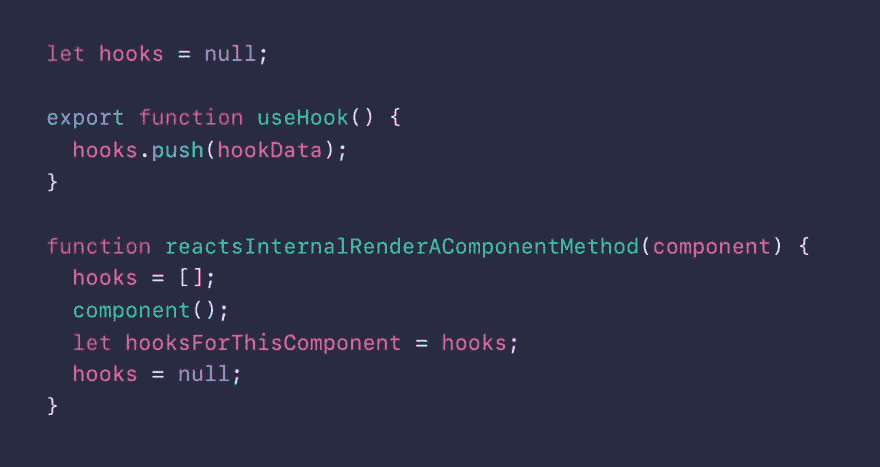
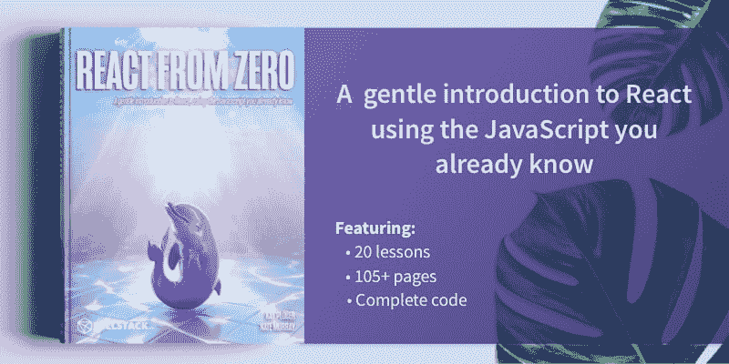

# React 钩子去神秘化

> 原文：<https://dev.to/kayis/react-hooks-demystified-2af6>

*[封面图片由米盖尔·迪卡特拍摄，在 Flickr 上](https://www.flickr.com/photos/miguel_discart_vrac_2/)*

在 ReactConf 上，React 周围的团队提出了一种用 React 实现交互式组件的新方法，称为[钩子](https://reactjs.org/docs/hooks-intro.html)。

他们发布了一个 RFC，这样 React 开发者可以在 T2 讨论这是不是一个好主意。

在本文中，我们将研究如何实现这样的功能。

## 什么

钩子是你可以在你的**功能组件**中调用的函数，为了获得功能，你通常只能用**组件类**来获得。

## 为什么

hooks 背后的基本思想是简化 React 开发，但我不会详细介绍，您可以从 React 核心开发人员 Dan Abramov 那里了解更多信息。

## 免责声明

**先看[份文件](https://reactjs.org/docs/hooks-intro.html)！**

这是 React 的一个 **ALPHA** 特性，不应该在生产代码中使用。

在这篇文章中，我们不会使用 React，而是用几行代码来说明钩子是如何工作的。

## 如何

许多人认为钩子很神奇，违背了 React 的哲学，我不能责怪他们。如果我们看这个例子，它并没有告诉我们发生了什么。

```
import React, {useState} from "react";

function CounterButtton(props) {
  let [count, setCount] = useState(0);
  return <button onClick={() => setCount(count + 1)}>Count: {count}</button>; } 
```

Enter fullscreen mode Exit fullscreen mode

它使用一个简单的函数调用`useState`并设法让我们得到当前状态**，**允许我们改变它并用新值重新呈现组件。

JavaScript 专业人士会发现这里的罪魁祸首:全局变量！

如果`useState`函数不干涉调用栈来访问我们的调用组件函数，它必须全局存储数据。

如果你读了丹的文章，你可能会发现这条推文:

> 布尔👻🐶🏳️‍🌈[@ Jamie builds](https://dev.to/jamiebuilds)[@ Erik ras](https://twitter.com/erikras)[@ sophiebits](https://twitter.com/sophiebits)[@ Dan _ abra mov](https://twitter.com/dan_abramov)错误#1:假设某事是神奇的，因为你还不知道它是如何运作的
> 
> 这是基本的想法19:15PM-2018 年 10 月 25 日

1.  JavaScript 是单线程的，如果有人在调用我们的钩子函数之前清除了全局变量，我们将会写一个新的全局变量，当我们的函数运行时，只要我们只进行同步调用，任何人都不能做任何事情。
2.  React 调用我们的**功能组件**，因此它可以控制调用前后发生的事情。

## 钩子示例

下面，我试图写一个简单的例子来说明我们如何实现钩子的“魔力”。这与官方的 React 实现无关，而是展示了这个想法是如何工作的。

首先，我们有一些组件定义:

```
function NumberButton() {
  let [valueA, setValueA] = useState(0);
  let [valueB, setValueB] = useState(100);

  return {
    type: "button",
    props: {
      children: `A:${valueA} B:${valueB}`,
      onClick() {
        setValueA(valueA + 1);
        setValueB(valueB - 1);
      }
    }
  };
} 
```

Enter fullscreen mode Exit fullscreen mode

`NumberButton`函数调用`useState`函数，该函数具有与反应`useState`函数相同的接口。

它返回一个对象，该对象是带有一些文本和一个处理程序的`<button>`元素的定义。

将所有内容呈现到 DOM 中的函数如下所示:

```
function run(components, target) {
  let savedHooks = new Map();
  render();

  function render() {
    target.innerHTML = "";
    components.forEach(function(component) {
      globalHooks = savedHooks.get(component);

      if (!globalHooks) globalHooks = new Map();

      renderToDom(component, target);

      for (let [id, hookData] of globalHooks.entries()) {
        hookData.calls = 0;
        hookData.render = render;
      }

      savedHooks.set(component, globalHooks);

      globalHooks = null;
    });
  }
}

function renderToDom(component, target) {
  let { props, type } = component();

  let element = document.createElement(type);
  element.innerHTML = props.children;
  element.onclick = props.onClick;
  target.appendChild(element);
} 
```

Enter fullscreen mode Exit fullscreen mode

它接受一个组件数组和一个 DOM 元素作为呈现目标。

为了简单起见，它只能呈现平面的组件列表，不能嵌套。它也不做任何 DOM 差分。

1.  它创建一个**局部**变量`savedHooks`来存储所有钩子的状态。
2.  它调用它的本地`render`函数来进行实际的渲染。
3.  `render`函数清除`target` DOM 元素，并在`components`数组中循环。
4.  **神奇的事情发生了:**`globalHooks`变量在组件函数被使用之前被覆盖，要么使用上次运行时已经存储的数据，要么使用一个新的`Map`对象。
5.  组件完成它的工作，比如调用`useState`函数。
6.  由我们的组件调用`useState`存储的`hookData`得到一个对本地`render`函数的引用，因此它可以启动重新渲染，并且它的`calls`属性被重置。
7.  `globalHooks`数据保存在**本地**用于下次运行。
8.  `globalHooks`被设置为`null`，如果有下一个组件，它就不能再通过`globalHooks`访问我们的数据了。

实际的钩子函数是这样的:

```
let globalHooks;
function useState(defaultValue) {
  let hookData = globalHooks.get(useState);

  if (!hookData) hookData = { calls: 0, store: [] };

  if (hookData.store[hookData.calls] === undefined)
    hookData.store[hookData.calls] = defaultValue;

  let value = hookData.store[hookData.calls];

  let calls = hookData.calls;
  let setValue = function(newValue) {
    hookData.store[calls] = newValue;
    hookData.render();
  };

  hookData.calls += 1;
  globalHooks.set(useState, hookData);

  return [value, setValue];
} 
```

Enter fullscreen mode Exit fullscreen mode

让我们一步一步来看:

1.  它得到一个应该在第一次调用时返回的`defaultValue`。
2.  它试图从最后一次运行的`globalHooks`变量中获取它的状态。这是一个在我们的组件函数被调用之前由我们的`run`函数设置的`Map`对象。要么它有上次运行的数据，要么我们需要创建自己的`hookData`。
3.  `hookData.store`数组用于存储上次调用的值，而`hookData.calls`值用于跟踪这个函数被组件调用了多少次。
4.  使用`hookData.store[hookData.calls]`,我们可以获取这个调用存储的最后一个值；如果它不存在，我们必须使用`defaultValue`。
5.  `setValue`回调用于更新我们的值，例如当点击按钮时。它获得对`calls`的引用，因此它知道自己属于`setState`函数的哪个调用。然后，它使用`render`函数提供的`hookData.render`回调来启动所有组件的重新呈现。
6.  `hookData.calls`计数器增加。
7.  `hookData`存储在`globalHooks`变量中，所以在组件函数返回后，它可以被`render`函数使用。

我们可以这样运行这个例子:

```
let target = document.getElementById("app");
run([NumberButton], target); 
```

Enter fullscreen mode Exit fullscreen mode

[你可以在 GitHub](https://github.com/kay-is/hook-example) 上找到一个带有示例组件的工作实现

## 结论

虽然我所采用的实现方法与实际的 React 实现相差甚远，但我认为它证明了钩子并不是疯狂的开发魔术，而是使用 JavaScript 约束的一种聪明方式，您可以自己实现。

# 我的第一本书

在过去的几个月里，我不像以前那样经常写博客了。那是因为我写了一本关于学习 React 基础知识的书:

[T2】](https://www.fullstackreact.com/react-from-zero/)

如果你喜欢通过拆开 React 来了解它是如何工作的，那么你可能会喜欢我的书 *React From Zero* 。在书中，我通过研究组件如何工作、元素如何呈现以及如何创建自己的虚拟 DOM 来剖析 React 是如何工作的。

你可以在这里免费下载第一章。