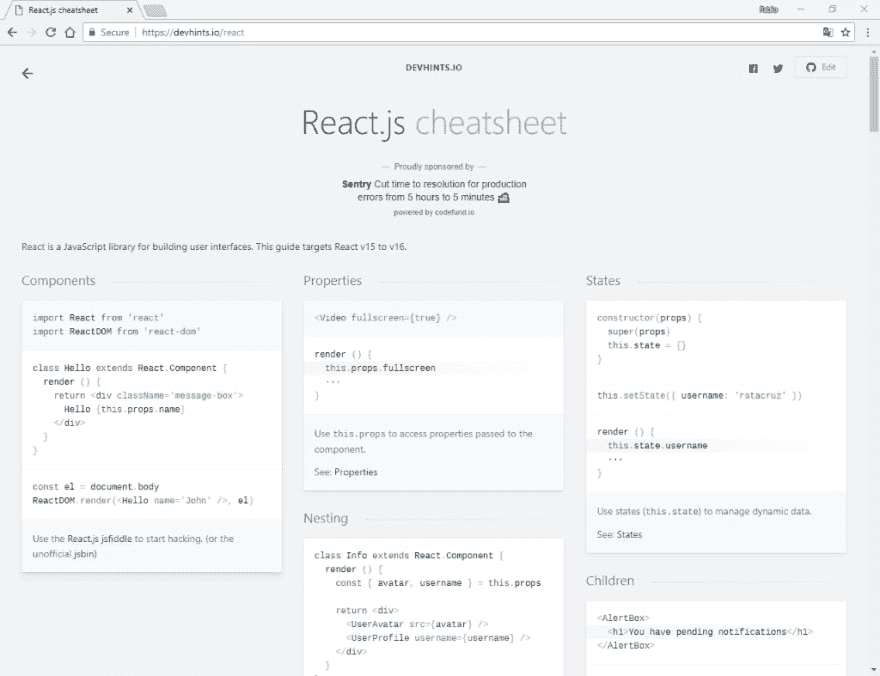

# React.js 备忘单

> 原文：<https://dev.to/fabiofranzini/react-js-cheatsheet-pp6>

<figure>

<figcaption>react . js cheat sheet</figcaption>

</figure>

使用 SharePoint 框架(SPFx)开发 SharePoint 解决方案我们不必使用特定的框架，但我们可以随意使用。

这对开发者来说是一个巨大的好处，但是在有些情况下，这并不是真的。

事实上，在两种情况下，我们几乎被迫使用 Reactjs:

*   使用为“ [Office UI Fabric](https://developer.microsoft.com/en-us/fabric) ”库开发的 react.js 控件
*   重用在 SPFx 的各种示例和解决方案中已经开发的大量代码，例如，新的“ [SharePoint Starter Kit](https://github.com/SharePoint/sp-starter-kit) ”。

好的，我必须能够计算出 react.js！

学习这个框架有很多资源，免费的在线课程和非，官方文档等。

事实上，在学习了框架之后，它有一个相当简单的学习曲线，总是需要有一个备忘单来快速记住可用的 API。

然后我与你分享我找到的这个页面:[https://devhints.io/react](https://devhints.io/react)
T3】事实上在主站点上你会找到许多框架的备忘单，但是在这里，react.js 的那个，我发现它真的很有趣。