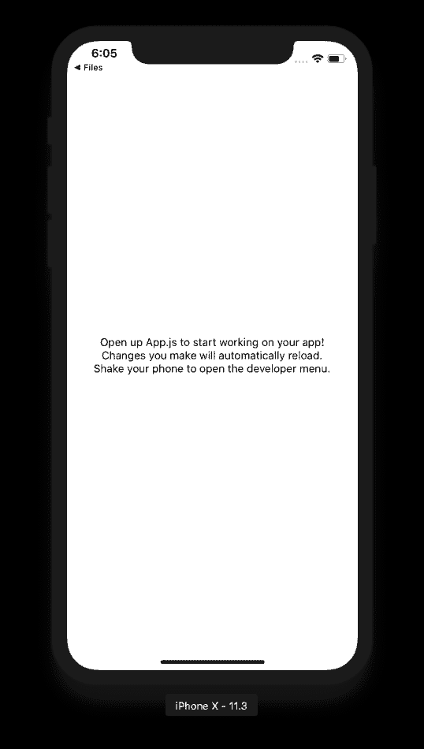
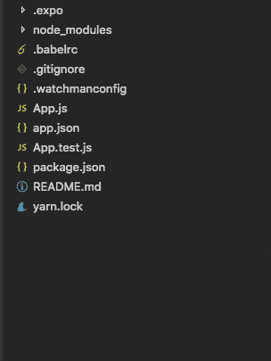

# 反应自然—简介

> 原文：<https://dev.to/nedimb86/react-native--intro-1n5i>

继我之前的[文章](https://dev.to/nedimb86/starting-with-react-native-2edb)之后，我们将继续介绍 React Native。假设您已经做好了一切准备，并且已经创建了您的第一个项目，并且已经看过了“Hello world！”在屏幕上，接下来是什么？

嗯……我们被指示打开 **App.js** 并进行修改。那么，让我们来看看项目文件夹。

[T2】](https://res.cloudinary.com/practicaldev/image/fetch/s--qOpB0Th0--/c_limit%2Cf_auto%2Cfl_progressive%2Cq_auto%2Cw_880/https://cdn-images-1.medium.com/max/538/1%2A5taeffaDQ4KwCq98Tf1g2g.png)

[](https://res.cloudinary.com/practicaldev/image/fetch/s--E06znvF6--/c_limit%2Cf_auto%2Cfl_progressive%2Cq_auto%2Cw_880/https://cdn-images-1.medium.com/max/304/1%2AaC-F0fHpOv5qTmZ5L0L-8Q.png) 

<figcaption>项目文件夹结构和初始屏幕—使用 create-react-native-app</figcaption>

创建

在我们继续之前，我想提一下，在本课中，我使用的是 **create-react-native-app** ，因此，如果您使用 **react-native-cli** 或**ignite-CLI**创建了您的项目，那么项目文件夹将与我将要提到的不同。

就是它了。App.js .尽管打开它很诱人，但让我们先看看我们能从 **README.md** 中学到什么。

如果我们想让我们的项目保持最新，我们将需要更新我们的依赖关系，这应该是一个非常简单的任务。但是要小心[依赖兼容性](https://github.com/react-community/create-react-native-app/blob/master/VERSIONS.md)。创建 React 原生应用依赖于 3 个依赖项: **react-native、react** 和 **expo** ，每个都兼容另外两个的缩小版。别忘了，博览会还需要有具体的 ***SDK 版本*** ，可以在 ***app.json*** 文件中设置。除了指定 SDK 版本，app.json 还可以帮助我们命名我们的应用程序，给它一个图标，版本，指定支持的平台，构建细节，[以及设置许多其他设置](https://docs.expo.io/versions/latest/guides/configuration.html)。

接下来，我们将看到有 5 个预定义的脚本:

*   npm start 或 yarn start 用于在开发模式下运行应用程序。如果需要清除缓存，请运行 npm start - reset-cache flag。
*   用于运行测试的 npm 测试。该项目被设置为使用 **jest** ，但你可以根据自己的喜好随意更改。如果你决定继续使用 jest，你需要做的就是在一个 *__test__* 文件夹中或者用*创建文件。test* extension，您的测试就可以运行了。
*   npm run ios 用于在 ios 模拟器上运行项目。使用 npm start 也可以达到同样的效果，因为其中一个可用选项是在 iOS Simulator 上运行应用程序。
*   npm 运行 android 将在 Android 设备或模拟器上运行应用程序。请记住，在运行这个脚本之前，您需要连接一个设备或启动模拟器。至于前面的脚本，这个也一样，这个应用程序也可以在 Android 上运行 npm start。
*   npm run eject 如果您发现自己需要添加本机代码，请不要担心，运行此脚本会将您置于与使用 react-native-cli 创建应用程序相同的轨道上，但请确保您已经全局安装了 react-native-cli。

如果你是倒霉的一个，第一次尝试一切都不顺利，这里有一个 [**故障排除**](https://github.com/react-community/create-react-native-app/blob/master/react-native-scripts/template/README.md#troubleshooting) 建议与*联网、iOS 模拟器不运行、二维码不扫描*相关。

我们已经拖延开放 *App.js* 够久了。所以我们来看看。

```
import React from 'react';
import { StyleSheet, Text, View } from 'react-native';

export default class App extends React.Component {
  render() {
    return (
      <View style={styles.container}>
        <Text>Open up App.js to start working on your app!</Text>
        <Text>Changes you make will automatically reload.</Text>
        <Text>Shake your phone to open the developer menu.</Text>
      </View>
    );
  }
}

const styles = StyleSheet.create({
  container: {
    flex: 1,
    backgroundColor: '#fff',
    alignItems: 'center',
    justifyContent: 'center',
  },
}); 
```

#### 我们这里有什么？

首先，我们可以注意到代码是用 ***ES6*** 编写的。我假设我们都在某种程度上熟悉它。想了解更多的请点击 [*这个链接*](https://babeljs.io/learn-es2015/) 。

React Native 自带 ES6 支持，无需担心兼容性问题。为了让你知道如何使用 ES6 编写代码更简单，这里有一个*[*链接*](https://babeljs.io/repl/#?babili=false&browsers=&build=&builtIns=false&code_lz=JYWwDg9gTgLgBAJQKYEMDG8BmUIjgcilQ3wG4AoUSWOAbzgGUYBPAGyQYAskkYAaOABUkAD35wAasCQB3OAF842XASLoYAWgB2KGMABuSMuXKjq8ACZJMKAK6t4aVigDOLuAEEwYOKJhItC3dkdQA6AGFcSC0A-FpyODgiQKQoAAoASjoExKTeWygtODSc3LgAHilZOBcWdgBeWlq2JBdQtAgtGBRgGKh5AD5SsorhMQGAeTAAuFsfLzBQgCt3GAga7poZaABrXoBzOE64ZggCuBRvAEJygHoxmCGR3PKHgfDOFC191pOzuBAKB2SDgMmArFYF1sa0BejQKAhzDyrAgKAsoTub2GZVefgGXCBINO5zAnE6ILWR2mRRg3DgVkMKOmUABAVsGPueOxFVuVRkT1yGQoiXk5FF5A6WlqGxa7nqjDqHG4vHaan8aXiiUl3V6qQAXNkyph2CIDQBGPjDABG6B2-xwtkCkRRUAN-AAxJgvfhLWUEcB9loAJL-EAuN1oWKpH3DJa2WrATDMSJdWIRqNQGMiy3yIVAA&debug=false&forceAllTransforms=false&shippedProposals=false&circleciRepo=&evaluate=false&fileSize=true&lineWrap=true&presets=es2015%2Creact%2Cstage-2&prettier=false&targets=&version=6.26.0&envVersion=) 到编译后的代码。*

 *往前走我们可以看到 <text>Lorem Ipsum</text> ，这对我们有些人来说可能是不寻常的。这是***【JSX】***， *React* 特性，用于在 *JavaScript* 中嵌入 *XML* 。与其他让你将代码嵌入标记语言的框架语言相反，React 让我们在代码中编写标记语言。这就是为什么我们让 *React* 成为我们的依赖之一的原因之一。

### 做出反应

正如我们已经看到的，如果我们想写*反应本土*，我们需要知道*反应*，但是不要担心，如果你不知道*反应*，你仍然可以跟上。也就是说，我们将研究控制*反应*组件和两种不同类型组件的两种类型的数据。

```
import React, { Component } from 'react';
import { Text, View } from 'react-native';

const Greeting = ({name}) => <Text>Hello {name}!</Text>;

export default class GreetPeople extends Component {
    constructor(props) {
        super(props);
        this.state = {
            doeName: 'Doe'
        };
    }
    render() {
        const janesName = 'Jane';
        return (
            <View style={{marginTop:40, marginLeft:20}}>
                <Greeting name='John' />
                <Greeting name={janesName} />
                <Greeting name={this.state.doeName} />
            </View>
        );
    }
} 
```

上面的代码是我们所需要的，所以让我们来分解它。

#### 功能组件

也称为表示组件或无状态组件。它们是转储组件，不应该包含任何复杂的逻辑，应该用于显示上下文的特定部分或作为应用特定样式的包装器。

```
const Greeting = (props) => {
return (
 <Text>Hello {props.name}!</Text>
 )
};

----- or after shortening the code -----

const Greeting = ({name}) => <Text>Hello {name}!</Text>; 
```

#### 类组件

更复杂的组件应该处理显示内容所需的所有逻辑。 *React* 有一个叫做*的组件生命周期*，这些应该在类组件内部处理。*生命周期*的一个例子是*构造器*。其他的一些是 *componentDidMount，componentwillun 螺母，*和其他。我们将在需要时覆盖它们。

```
export default class GreetPeople extends Component {
    constructor(props) {
        super(props);
        this.state = {
            doeName: 'Doe'
        };
    }
render() {
        const janesName = 'Jane';
        return (
            <View style={{marginTop:40, marginLeft:20}}>
                <Greeting name='John' />
                <Greeting name={janesName} />
                <Greeting name={this.state.doeName} />
            </View>
        );
    }
} 
```

我想指出的是，我们不需要在每个类组件中都有构造函数。

#### 道具

道具用于定制组件。在我们的例子中，<greeting>组件有一个合适的名字，正如我们已经看到的，我们可以直接给它传递一个字符串，或者给它传递一个花括号内的康铜。</greeting>

```
const janesName = 'Jane';
    return (
        <View style={{marginTop:40, marginLeft:20}}>
            <Greeting name='John' />
            <Greeting name={janesName} />
        </View>
    ); 
```

如果我们将 prop，比方说 fullName，传递给一个类组件，我们将使用 *this.props.fullName* 来访问它，而在一个函数组件中，我们将使用 *props.fullName* (我们将省略 *this* 关键字)。

#### 状态

当*道具*从父代传递到子代时，*状态*是我们将要对组件本身使用的。我们可以在*构造函数*中初始化*状态*，但是如果我们想改变它，我们应该使用 this.setState()函数。它接受两个参数，一个是将更新状态的对象，另一个是状态更新后将执行的回调函数。我们不应该担心重新渲染组件，因为每次组件的状态或属性改变时，它都会重新渲染。

```
constructor(props) {
    super(props);
    this.state = {
        doeName: 'Doe'
    };
}

componentDidMount(){
    setTimeout(
        () => this.setState({doeName:'Alex'}),
        3000
    )
} 
```

好吧！我想我们现在已经受够了反应。让我们回到*反应原生*。

### 造型

嗯，我们迟早会厌倦一遍又一遍地看同样的风格。那么，我们能做些什么呢？很简单。我们将创建 CSS 文件，添加我们的风格，然后…不！ *React Native* 不是这么玩的。但不用担心。造型*反应原生*一点也不复杂。我们将使用 JavaScript 编写我们的样式。

所有核心组件都接受名为 *style* 的 prop，它接受一个包含我们样式的对象，我们编写的样式类似于 CSS。不同之处在于，我们使用的是骆驼大小写而不是破折号(我们将使用 fontFamily 而不是 font-family)，并且我们的值需要用引号括起来(颜色:蓝色是颜色:'蓝色')。事不宜迟，让我们看看我们的风格*如何反应原生*组件。

```
import React, { Component } from 'react';
import { StyleSheet, Text, View } from 'react-native';

export default class LotsOfStyles extends Component {
    render() {
        return (
            <View style={{margin:40}}>
                <Text style={styles.red}>just red</Text>
                <Text style={styles.bigblue}>just bigblue</Text>
                <Text style={[styles.bigblue, styles.red]}>bigblue, then red</Text>
                <Text style={[styles.red, styles.bigblue]}>red, then bigblue</Text>
                <Text style={{color:'yellow'}}>yellow</Text>
                <Text style={[styles.bigblue, {color:'green'}]}>bigblue, then green</Text>
            </View>
        );
    }
}

const styles = StyleSheet.create({
    bigblue: {
        color: 'blue',
        fontWeight: 'bold',
        fontSize: 30,
    },
    red: {
        color: 'red',
    },
}); 
```

正如我们已经看到的，我们可以有两种不同的方法，有点类似于内联风格和基于类的风格。还要注意，我们可以通过将一组对象传递给 *style* prop 而不是一个对象来轻松地组合样式。

### 尺寸

我们应该不奇怪，我们可以使用高度和宽度来确定屏幕上的组件大小。此外，我们可以假设我们的维度可以是固定的和灵活的。因此，我们如何设置每个人在*反应原生。*

至于固定，就是设置高度和宽度那么简单。诀窍在于，*中所有维度反应原生的*是**无单位的**，并代表**密度无关的像素**。

```
import React, { Component } from 'react';
import { View } from 'react-native';

export default class FlexDimensionsBasics extends Component {
    render() {
        return (
            <View style={{flex: 1}}>
                <View style={{flex: 3, backgroundColor: 'powderblue'}} >
                    <View style={{width: 50, height: 50, backgroundColor: 'orange'}} />
                    <View style={{width: '50%', height: 50, backgroundColor: 'green'}} />
                    <View style={{width: 150, height: 50, backgroundColor: 'red'}} />
                </View>
                <View style={{flex: 2, backgroundColor: 'skyblue'}} />
                <View style={{flex: 1, backgroundColor: 'steelblue'}} />
            </View>
        );
    }
} 
```

现在让我们来看看可变尺寸。这可以通过 *flex* 属性来实现。

> [**一个组件只有在其父组件的维度大于 0 时才能扩展以填充可用空间。如果父对象既没有固定的**](https://facebook.github.io/react-native/docs/height-and-width.html) [**宽度和**](https://facebook.github.io/react-native/docs/height-and-width.html) [**高度，也没有**](https://facebook.github.io/react-native/docs/height-and-width.html) [**伸缩，则父对象的尺寸将为 0，并且**](https://facebook.github.io/react-native/docs/height-and-width.html) [**伸缩子对象将不可见。**T19】](https://facebook.github.io/react-native/docs/height-and-width.html)

当谈到 flex 时，我们需要说我们可以使用 flexbox 原理来布局我们的组件。我们需要记住的是，React Naive 中的 flexbox 与我们在网络上使用的略有不同。

> 除了一些例外，Flexbox 在 React Native 中的工作方式与在 web 上的 CSS 中的工作方式相同。默认设置不同，用 [**flexDirection 默认为**](https://facebook.github.io/react-native/docs/flexbox.html) [**列而不是**](https://facebook.github.io/react-native/docs/flexbox.html) [**行，并且**](https://facebook.github.io/react-native/docs/flexbox.html) [**flex 参数只支持单个数字。**T19】](https://facebook.github.io/react-native/docs/flexbox.html)

### 组件

现在我们知道了如何将一个基本的风格应用到我们的应用程序中。接下来去哪里？嗯……我们需要一些东西来做造型。而那东西是*反应原生*成分。所以让我们来看看几个。

**视图**:构建 UI 最基础的组件——作为网页的 div

**文本:**用于显示文本——标题， web 的段落

**TextInput:** 用于通过键盘向应用程序输入文本—web 的输入

**样式表:**创建样式—web 的行为样式标签

**图像:**用于显示图像—与 web 上的 img 相同

**按钮:**给我们按钮—类似 web 的行为

**平台:**帮助我们 AlertIOS: 顾名思义—JavaScript alert message

**scroll view:**帮助我们滚动比我们的设备

**更高或更宽的内容 FlatList:** 显示类似结构的数据； 与 ScrollView 不同，它只呈现可见的项目

**可触摸的“组件”:**创建可触摸的视图——类似于网页上的锚标签

让我们不要过分列举组件。这些是我们将最常用的一些基本方法。至于其他，我们将在适当情况下提及。

在我们的例子中，我们已经看到了如何设计文本和 T2 视图的样式。给别人造型也差不了多少。关于样式属性的完整列表，您可以查看官方文档。

### 结论

我认为我们在这篇文章中已经谈得够多了。我们现在知道如何使用 *create-react-native-app* 创建项目，并且我们对这样做时开箱即用有了基本的了解。我们已经学习了足够的 React 来为我们的应用程序编写代码。我们已经展示了如何对 React 本地组件进行样式化，以及如何赋予它维度。除此之外，我们还提到了基本的 React 本地组件，以便在我们想要构建一个简单的应用程序时做好准备。

这里使用的代码可以在我的 GitHub 存储库中找到:

[nedimb 86/MyReactNativeApp](https://github.com/nedimb86/MyReactNativeApp)

* * **