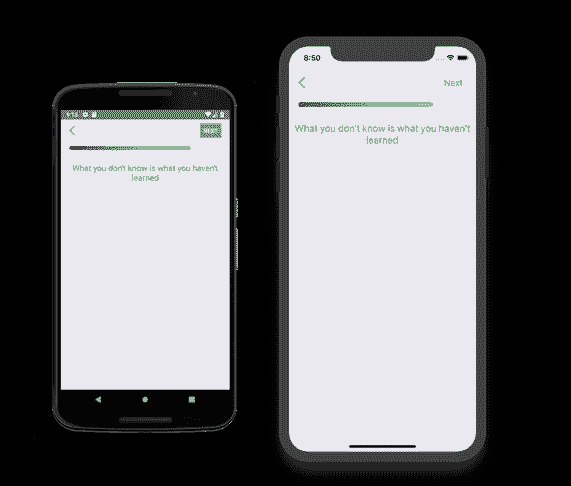
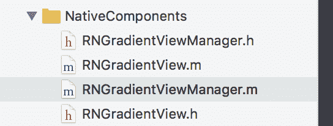
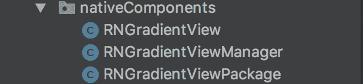

# React Native Bridging —如何制作线性渐变视图

> 原文：<https://dev.to/onmyway133/react-native-bridginghow-to-make-linear-gradient-view-5f1>

[T2】](https://res.cloudinary.com/practicaldev/image/fetch/s--2bK0Eq0V--/c_limit%2Cf_auto%2Cfl_progressive%2Cq_auto%2Cw_880/https://cdn-images-1.medium.com/max/2000/0%2A5s38dDBsBUBRLo6O.jpg)

React Native 让我们只使用 Javascript 就能构建移动应用。它的工作原理是提供一个通用接口，与原生 iOS 和 Android 组件对话。有足够的基本组件可以开始使用，但更酷的是我们很容易构建自己的组件，因此我们不会受到 React Native 的限制。在这篇文章中，我们将使用原生 UI 组件，特别是 iOS 中的 CAGradientLayer 和 Android 中的 GradientDrawable，实现 React Native 中默认不支持的线性渐变视图。

在 Javascript 中，一个问题有数百个库，你应该检查你是否真的需要它。在谷歌上搜索线性渐变会显示一堆库，比如[react-native-linear-gradient](https://github.com/react-native-community/react-native-linear-gradient)。[依赖](https://medium.com/fantageek/what-is-create-react-native-app-9f3bc5a6c2a3)越少越好。线性梯度实际上非常容易建立，我们可能不需要添加额外的依赖。另外，[整合](https://dev.to/acro5piano/struggle-to-install-react-native-linear-gradient--2omm) [和](https://medium.com/react-native-training/fixing-react-native-issues-and-happy-deploy-to-bitrise-fabric-circleci-44da4ab1487b) [跟随](https://medium.com/react-native-training/firebase-sdk-with-firestore-for-react-native-apps-in-2018-aa89a67d6934) [更新](https://medium.com/react-native-training/facebook-sdk-with-login-for-react-native-apps-in-2018-196601804f66)到第三库是痛苦的，我会尽可能避免。

[T2】](https://res.cloudinary.com/practicaldev/image/fetch/s--MFyGkQMp--/c_limit%2Cf_auto%2Cfl_progressive%2Cq_auto%2Cw_880/https://cdn-images-1.medium.com/max/2000/1%2ASZnOwVTr15PY7uHYqaeaXw.png)

## 原生 UI 组件 vs 原生模块

在 React Native 中，有原生 UI 组件和原生模块。React Native 移动速度非常快，所以大多数文章都会过时，最好查阅官方文档以获得最新的 React Native 版本。这篇文章将试图给你一个整体的概述，因为现在官方指南似乎还没有完成。

*   [iOS 中的原生模块](https://facebook.github.io/react-native/docs/native-modules-ios)

*   [Android 中的原生模块](https://facebook.github.io/react-native/docs/native-modules-android)

*   [iOS 中的原生 UI 组件](https://facebook.github.io/react-native/docs/native-components-ios)

*   [Android 中的原生 UI 组件](https://facebook.github.io/react-native/docs/native-components-android)

简单解释，原生 UI 组件就是让 iOS 中的 UIView 或者 Android 中的 View 可以作为 React 使用。组件，并在 Javascript 的呈现函数中使用。

> 有大量的原生 UI 小部件可以在最新的应用程序中使用——其中一些是平台的一部分，另一些是第三方库，还有更多可能在您自己的产品组合中使用。React Native 已经包装了几个最关键的平台组件，如 ScrollView 和 TextInput，但不是所有的组件，当然也不是你自己为以前的应用程序编写的组件。

原生模块更加通用，因为我们可以在 Javascript 中使用任何原生类。

> 有时候一个 app 需要访问平台 API，React Native 还没有对应的模块。也许你想重用一些现有的 Objective-C、Swift 或 C++代码，而不必用 JavaScript 重新实现，或者编写一些高性能、多线程的代码，如用于图像处理、数据库或任何数量的高级扩展。

## 视图管理器

为了暴露原生 UI 视图，我们使用 ViewManager 作为桥梁，它是 iOS 中的 RCTViewManager 和 Android 中的 SimpleViewManager。然后在这个视图管理器中，我们可以返回我们的自定义视图。我看到 ViewManager 使用 Objective C/Java 来匹配 React 原生类是很好的，自定义视图我们可以在 iOS 中使用 Swift/Objective C，在 Android 中使用 Kotlin/Java。

我更喜欢使用 Swift，但在本文中，为了消除将桥接报头从 Swift 引入 Objective C 的开销，为了简单起见，我们使用 Objective C。我们还将原生源代码直接添加到 iOS 和 Android 项目中，但将来我们可以轻松地将它们提取到 React 原生库中。

现在让我们使用 RNGradientViewManager 和 RNGradientView 这个名称来保持 iOS 和 Android 之间的一致性。RN 前缀是任意的，你可以使用任何你想要的前缀，但是在这里我用它来表示这些类应该在 React Native 的 Javascript 端使用。

## 在 iOS 中实现

### 项目结构

将这些 Objective-C 类添加到项目中，我通常将它们放在 NativeComponents 文件夹中

[T2】](https://res.cloudinary.com/practicaldev/image/fetch/s--vAd746XS--/c_limit%2Cf_auto%2Cfl_progressive%2Cq_auto%2Cw_880/https://cdn-images-1.medium.com/max/2000/1%2Av9ecOYKhfHenOfFD_YyXjA.png)

> 本地视图由 RCTViewManager 的子类创建和操作。这些子类在功能上类似于视图控制器，但本质上是单例的——桥只创建每个子类的一个实例。它们向 RCTUIManager 公开本地视图，RCTUIManager 根据需要委托给它们来设置和更新视图的属性。RCTViewManagers 通常也是视图的代表，通过桥将事件发送回 JavaScript。

### RNGradientViewManager

创建从 RCTViewManager 继承的 RNGradientViewManager

**RNGradientViewManager.h**

```
#import <React/RCTViewManager.h>
@interface RNGradientViewManager : RCTViewManager
@end 
```

**RNGradientViewManager.m**

```
#import "RNGradientViewManager.h"
#import "RNGradientView.h"

[@implementation](http://twitter.com/implementation) RNGradientViewManager

RCT_EXPORT_MODULE()

- (UIView *)view {
  return [[RNGradientView alloc] init];
}

RCT_EXPORT_VIEW_PROPERTY(progress, NSNumber);
RCT_EXPORT_VIEW_PROPERTY(cornerRadius, NSNumber);
RCT_EXPORT_VIEW_PROPERTY(fromColor, UIColor);
RCT_EXPORT_VIEW_PROPERTY(toColor, UIColor);

[@end](http://twitter.com/end) 
```

在 iOS 中，我们使用宏 RCT _ 导出 _ 模块()在模块加载时自动向网桥注册模块。可选的 js_name 参数将被用作 js 模块名。如果省略，JS 模块名将匹配 Objective-C 类名。

```
#define RCT_EXPORT_MODULE(js_name) 
```

视图管理器，而不是视图，是 Javascript 端的门面，所以我们使用 RCT _ 导出 _ 视图 _ 属性来公开属性。请注意，我们是在@ implementation RNGradientViewManager 中这样做的

这里我们将类型指定为 NSNumber 和 UIColor，稍后在 Javascript 中我们可以传递数字和颜色十六进制字符串，React Native 可以为我们进行转换。在 React Native 的老版本中，我们需要 Javascript 中的 processColor 或者 iOS 端的 RCTConvert color，但是现在不需要进行手动转换。

### RNGradientView

在 iOS 的原生 UI 组件[示例](https://facebook.github.io/react-native/docs/native-components-ios)中，他们使用 WKWebView，但在这里我们制作了一个 RNGradientView，它从 [RCTView](https://github.com/facebook/react-native/blob/master/React/Views/RCTView.h) 继承而来，以利用 React 原生视图的许多功能，并避免使用普通 UIView 时可能出现的一些问题

**RNGradientView.h**

```
#import <UIKit/UIKit.h>
#import <React/RCTView.h>

[@interface](http://twitter.com/interface) RNGradientView : RCTView

[@end](http://twitter.com/end) 
```

**RNGradientView.m**

```
#import "RNGradientView.h"
#import <UIKit/UIKit.h>

[@interface](http://twitter.com/interface) RNGradientView()
[@property](http://twitter.com/property) CAGradientLayer *gradientLayer;

[@property](http://twitter.com/property) UIColor *_fromColor;
[@property](http://twitter.com/property) UIColor *_toColor;
[@property](http://twitter.com/property) NSNumber *_progress;
[@property](http://twitter.com/property) NSNumber *_cornerRadius;
[@end](http://twitter.com/end)

[@implementation](http://twitter.com/implementation) RNGradientView

// MARK: - Init

- (instancetype)initWithFrame:(CGRect)frame
{
  self = [super initWithFrame:frame];
  if (self) {
    self.gradientLayer = [self makeGradientLayer];
    [self.layer addSublayer:self.gradientLayer];

self._fromColor = [UIColor blackColor];
    self._toColor = [UIColor whiteColor];
    self._progress = [@0](http://twitter.com/0).5;

[self update];
  }
  return self;
}

// MARK: - Life cycle

- (void)layoutSubviews {
  [super layoutSubviews];

self.gradientLayer.frame = CGRectMake(
    0, 0,
    self.bounds.size.width*self._progress.floatValue,
    self.bounds.size.height
  );
}

// MARK: - Properties

- (void)setFromColor:(UIColor *)color {
  self._fromColor = color;
  [self update];
}

- (void)setToColor:(UIColor *)color {
  self._toColor = color;
  [self update];
}

- (void)setProgress:(NSNumber *)progress {
  self._progress = progress;
  [self update];
}

- (void)setCornerRadius:(NSNumber *)cornerRadius {
  self._cornerRadius = cornerRadius;
  [self update];
}

// MARK: - Helper

- (void)update {
  self.gradientLayer.colors = @[
    (id)self._fromColor.CGColor,
    (id)self._toColor.CGColor
  ];

self.gradientLayer.cornerRadius = self._cornerRadius.floatValue;

[self setNeedsLayout];
}

- (CAGradientLayer *)makeGradientLayer {
  CAGradientLayer *gradientLayer = [CAGradientLayer layer];

gradientLayer.masksToBounds = true;

gradientLayer.startPoint = CGPointMake(0.0, 0.5);
  gradientLayer.endPoint = CGPointMake(1.0, 0.5);
  gradientLayer.anchorPoint = CGPointZero;

return gradientLayer;
}

[@end](http://twitter.com/end) 
```

我们可以在这个原生视图中实现我们想要的任何东西，在这个例子中，我们使用 CAGradientLayer 来很好地显示线性渐变。由于 RNGradientViewManager 公开了一些属性，如 progress、cornerRadius、fromColor、toColor，我们需要实现一些 setters，因为当我们在 Javascript 端更新值时，React Native 将调用它们。在 setter 中，我们调用 setNeedsLayout 来告诉视图使布局无效，因此将再次调用 layoutSubviews。

### 需要 NativeComponent

在 Visual Studio 代码中打开项目，将 GradientView.js 添加到 src/nativeComponents。文件夹的名字是随意的，但是保持有序是有好处的。

```
import { requireNativeComponent } from 'react-native'

module.exports = requireNativeComponent('RNGradientView', null) 
```

这里我们使用 [requireNativeComponent](https://github.com/facebook/react-native/blob/master/Libraries/ReactNative/requireNativeComponent.js) 来加载我们的 RNGradientView。我们只需要这个 Javascript 文件来与 iOS 和 Android 交互。您可以将模块命名为 RNGradientView，但我认为 Javascript 中的惯例是我们不使用前缀，所以我们只命名为 GradientView。

```
const requireNativeComponent = (uiViewClassName: string): string =>
  createReactNativeComponentClass(uiViewClassName, () =>
    getNativeComponentAttributes(uiViewClassName),
  );

module.exports = requireNativeComponent; 
```

之前，我尝试对本地组件使用 export default，但是这样的话，即使我将它包装在 React 中，视图也不会被渲染。组件。似乎我们必须使用 module.exports 来正确加载本地组件。

现在使用它就像用 JSX 语法声明 GradientView 一样简单

```
import GradientView from 'nativeComponents/GradientView'

export default class Profile extends React.Component {
  render() {
    return (
      <SafeAreaView style={styles.container}>
        <GradientView
          style={styles.progress}
          fromColor={R.colors.progress.from}
          toColor={R.colors.progress.to}
          cornerRadius={5.0}
          progress={0.8} />
    )
  }
} 
```

## 在安卓中实现

### 项目结构

将这些 Java 类添加到项目中，我通常将它们放在 nativeComponents 文件夹中

[T2】](https://res.cloudinary.com/practicaldev/image/fetch/s--xqTFX_Lx--/c_limit%2Cf_auto%2Cfl_progressive%2Cq_auto%2Cw_880/https://cdn-images-1.medium.com/max/2000/1%2A7v9qtfOAGPF2lqvWrrOysg.png)

### RNGradientManager

创建一个扩展简单视图管理器
**RNGradientManager.java**的 RNGradientManager

```
package com.onmyway133.myApp.nativeComponents;

import android.support.annotation.Nullable;
import com.facebook.react.uimanager.SimpleViewManager;
import com.facebook.react.uimanager.ThemedReactContext;
import com.facebook.react.uimanager.annotations.ReactProp;

public class RNGradientViewManager extends SimpleViewManager<RNGradientView> {
    [@Override](http://twitter.com/Override)
    public String getName() {
        return "RNGradientView";
    }

[@Override](http://twitter.com/Override)
    protected RNGradientView createViewInstance(ThemedReactContext reactContext) {
        return new RNGradientView(reactContext);
    }

// Properties

[@ReactProp](http://twitter.com/ReactProp)(name = "progress")
    public void setProgress(RNGradientView view, [@Nullable](http://twitter.com/Nullable) float progress) {
        view.setProgress(progress);
    }

[@ReactProp](http://twitter.com/ReactProp)(name = "cornerRadius")
    public void setCornerRadius(RNGradientView view, [@Nullable](http://twitter.com/Nullable) float cornerRadius) {
        view.setCornerRadius(cornerRadius);
    }

[@ReactProp](http://twitter.com/ReactProp)(name = "fromColor", customType = "Color")
    public void setFromColor(RNGradientView view, [@Nullable](http://twitter.com/Nullable) int color) {
        view.setFromColor(color);
    }

[@ReactProp](http://twitter.com/ReactProp)(name = "toColor", customType = "Color")
    public void setToColor(RNGradientView view, [@Nullable](http://twitter.com/Nullable) int color) {
        view.setToColor(color);
    }
} 
```

我们通常使用 [Color](https://developer.android.com/reference/android/graphics/Color) 作为 android.graphics.Color，但是对于我们将要使用的 GradientDrawable，它使用 Color 作为 ARGB 整数。因此，React Native 将颜色作为 int 类型处理是很棒的。我们还需要指定 customType = "Color ",因为颜色是一种定制。

### RNGradientView

这是我们实现我们观点的地方，如果我们愿意，我们可以在科特林这样做。

**RNGradientView.java**

```
package com.onmyway133.myApp.nativeComponents;

import android.content.Context;
import android.graphics.drawable.GradientDrawable;
import android.graphics.drawable.ScaleDrawable;
import android.support.annotation.Nullable;
import android.util.AttributeSet;
import android.view.Gravity;
import android.view.View;

public class RNGradientView extends View {

    float progress;
    float cornerRadius;
    int fromColor;
    int toColor;

    public RNGradientView(Context context) {
        super(context);
    }

    public RNGradientView(Context context, @Nullable AttributeSet attrs) {
        super(context, attrs);
    }

    public RNGradientView(Context context, @Nullable AttributeSet attrs, int defStyleAttr) {
        super(context, attrs, defStyleAttr);
    }

    public RNGradientView(Context context, @Nullable AttributeSet attrs, int defStyleAttr, int defStyleRes) {
        super(context, attrs, defStyleAttr, defStyleRes);
    }

    // update

    void update() {
        GradientDrawable gradient = new GradientDrawable();
        gradient.setColors(new int[] {
            this.fromColor,
            this.toColor
        });
         gradient.setOrientation(GradientDrawable.Orientation.*LEFT_RIGHT*);
        gradient.setGradientType(GradientDrawable.*LINEAR_GRADIENT*);
        gradient.setShape(GradientDrawable.*RECTANGLE*);
        gradient.setCornerRadius(this.cornerRadius * 4);

        ScaleDrawable scale = new ScaleDrawable(gradient, Gravity.*LEFT*, 1, -1);
        scale.setLevel((int)(this.progress * 10000));

        this.setBackground(scale);
    }

    // Getter & setter

    public void setProgress(float progress) {
        this.progress = progress;
        this.update();
    }

    public void setCornerRadius(float cornerRadius) {
        this.cornerRadius = cornerRadius;
        this.update();
    }

    public void setFromColor(int fromColor) {
        this.fromColor = fromColor;
        this.update();
    }

    public void setToColor(int toColor) {
        this.toColor = toColor;
        this.update();
    }
} 
```

注意 [setColors](https://developer.android.com/reference/android/graphics/drawable/GradientDrawable.html#setColors(int%5B%5D)) ，因为它使用了一个 int 数组

> 设置用于绘制渐变的颜色。
> 每种颜色都被指定为一个 ARGB 整数，该数组必须包含至少两种颜色。

如果我们用 GradientDrawable 调用 setBackground，它将被拉伸以填充视图。在我们的例子中，我们希望支持决定渐变应该显示多长时间的进度。为了解决这个问题，我们使用了 [ScaleDrawable](https://developer.android.com/reference/android/graphics/drawable/ScaleDrawable) ，它是一个 Drawable，可以根据当前级别值改变另一个 Drawable 的大小。

对于 cornerRadius 来说，相同的值在 iOS 中也适用，但对于 Android，我们需要使用更高的值，这就是为什么 gradient . setcornerradius(this . corner radius * 4)中的乘法

### 形状可画

另一种实现渐变的方法是使用 xml 的 Shape Drawable，这相当于在 iOS 中使用 xib。我们可以创建类似 gradient.xml 的东西，并把它放在/res/drawable 中

```
<?xml version="1.0" encoding="utf-8"?>
<shape xmlns:android="[http://schemas.android.com/apk/res/android](http://schemas.android.com/apk/res/android)"
    android:shape="rectangle">
    <gradient
        android:startColor="#3B5998"
        android:endColor="#00000000"
        android:angle="45"/>    
</shape> 
```

更多信息可以阅读
[**Android Shape Drawables 教程**
*你有没有想过缩小你的 Android 应用程序的尺寸或者让它看起来更有趣？如果是，那么你……* Android . JL else . eu](https://android.jlelse.eu/android-shape-drawables-tutorial-17fbece6fef5)

我们也可以在代码中直接使用类 [ShapeDrawable](https://developer.android.com/reference/android/graphics/drawable/ShapeDrawable)

> 绘制原始形状的可绘制对象。ShapeDrawable 接受一个[形状](https://developer.android.com/reference/android/graphics/drawable/shapes/Shape.html)对象，并管理它在屏幕上的显示。如果没有给定形状，那么 ShapeDrawable 将默认为一个[矩形](https://developer.android.com/reference/android/graphics/drawable/shapes/RectShape.html)。
> 这个对象可以用元素在 XML 文件中定义。

### GradientManagerPackage

在 iOS 中，我们使用 RCT 导出模块来注册组件，但在 Android 中，事情是使用包显式完成的。一个包可以注册本机模块和本机 UI 组件。在这种情况下，我们只处理 UI 组件，所以让我们在 createViewManagers 中返回 RNGradientManager

**GradientManagerPackage.java**

```
package com.onmyway133.myApp.nativeComponents;

import com.facebook.react.ReactPackage;
import com.facebook.react.bridge.NativeModule;
import com.facebook.react.bridge.ReactApplicationContext;
import com.facebook.react.uimanager.ViewManager;
import java.util.Arrays;
import java.util.Collections;
import java.util.List;

public class RNGradientViewPackage implements ReactPackage {
    [@Override](http://twitter.com/Override)
    public List<NativeModule> createNativeModules(ReactApplicationContext reactContext) {
        return Collections.emptyList();
    }

[@Override](http://twitter.com/Override)
    public List<ViewManager> createViewManagers(ReactApplicationContext reactContext) {
        return Arrays.<ViewManager>asList(
            new RNGradientViewManager()
        );
    }
} 
```

然后前往 MainApplication.java 申报我们的包裹

```
[@Override](http://twitter.com/Override)
protected List<ReactPackage> getPackages() {
  return Arrays.<ReactPackage>asList(
      new MainReactPackage(),
      new RNGradientViewPackage()
  );
} 
```

安卓就是这样。我们已经有了之前编写的 GradientView.js，当在 Android 中运行该应用程序时，它会查找并加载我们的 RNGradientView

## 何去何从

希望你对原生 UI 组件有所了解。在这篇文章中，我们只触及了原生 UI 组件能做什么的表面，它只是将配置从 Javascript 传递到原生 UI。还有更多的发现，像事件处理，线程，风格，自定义类型，请参考官方文件的正确指导。

*   [iOS 的原生 UI 组件](https://facebook.github.io/react-native/docs/native-components-ios)

*   【Android 原生 UI 组件

原故事[https://medium . com/react-native-training/react-native-bridging-how-to-make-linear-gradient-view-83c 3805373 B7](https://medium.com/react-native-training/react-native-bridging-how-to-make-linear-gradient-view-83c3805373b7)