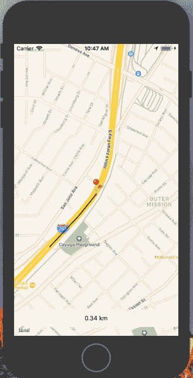

# 反应本地位置跟踪

> 原文：<https://dev.to/vikrantnegi/react-native-location-tracking-32o7>

[T2】](https://res.cloudinary.com/practicaldev/image/fetch/s--p8I29wXY--/c_limit%2Cf_auto%2Cfl_progressive%2Cq_66%2Cw_880/https://thepracticaldev.s3.amazonaws.com/i/z8404b4p03988nb64m6q.gif)

如果你一直在使用 React Native，你一定用过或者听说过 react-native-maps。React native maps 是一个 React native 包，它为 react native 提供了 Google Maps API。使用静态谷歌地图是非常常见的，但今天我们将使用谷歌地图的一个广泛使用的功能，使用 React native 进行位置跟踪。

> 在此找到项目回购

## 入门

首先创建一个 React 原生项目，并随意命名。我使用的是 react-native-cli，但 [create-react-native-app](https://github.com/react-community/create-react-native-app) 应该也能正常工作。

`react-native init locationTracking`

## [T1】安装 react-native-maps](#installing-reactnativemaps)

首先，从 npm 下载这个库:

`npm install react-native-maps --save`

安装 react-native-maps 需要在原生 iOS 和 Android 文件中添加代码。遵循 react-native-maps 提供的安装说明。安装后，确保项目成功构建，然后再继续。

安装 react-native-maps 不是一项简单的任务。如果你是第一次这样做，我建议仔细阅读[安装](https://github.com/react-community/react-native-maps/blob/master/docs/installation.md)说明。相信我，这将是本教程中最困难的任务。如果你遇到任何错误，请使用谷歌。

## 使用 react-native-map

很好，现在您已经成功安装了 react-native-maps。让我们进入有趣的部分，真正的奇迹发生了。让我们首先设置一些将用于这个项目的初始状态。

```
constructor(props) {
  super(props);
  this.state = {
    latitude: LATITUDE,
    longitude: LONGITUDE,
    routeCoordinates: [],
    distanceTravelled: 0,
    prevLatLng: {},
    coordinate: new AnimatedRegion({
     latitude: LATITUDE,
     longitude: LONGITUDE
    })
  };
} 
```

我们将在应用程序的后面使用这些状态，这里唯一感兴趣的是新的`AnimatedRegion`，它将帮助我们在位置更新时激活我们的标记。

## 注意位置变化

现在我们需要获得用户每次移动的位置坐标。谷歌地图地理定位 API 有一个`watchPosition`方法，无论何时位置坐标发生变化，它都会帮助我们获取位置坐标。

```
componentDidMount() {
  this.watchID = navigator.geolocation.watchPosition(
    position => {
      const { coordinate, routeCoordinates, distanceTravelled } =   this.state;
      const { latitude, longitude } = position.coords;

      const newCoordinate = {
        latitude,
        longitude
      };
      if (Platform.OS === "android") {
        if (this.marker) {
          this.marker._component.animateMarkerToCoordinate(
            newCoordinate,
            500
          );
         }
       } else {
         coordinate.timing(newCoordinate).start();
       }
       this.setState({
         latitude,
         longitude,
         routeCoordinates: routeCoordinates.concat([newCoordinate]),
         distanceTravelled:
         distanceTravelled + this.calcDistance(newCoordinate),
         prevLatLng: newCoordinate
       });
     },
     error => console.log(error),
     { enableHighAccuracy: true, timeout: 20000, maximumAge: 1000 }
  );
} 
```

每当用户的位置发生变化时，监视位置就会给我们提供有关用户位置的信息。然后，我们使用 ES6 [析构](https://developer.mozilla.org/en-US/docs/Web/JavaScript/Reference/Operators/Destructuring_assignment)从位置坐标获得纬度&经度。同样，我们将获得坐标，从初始状态移动的路径坐标&距离。

然后，我们将创建 newCoordinate 变量，该变量将存储我们从 position.coords 收到的这些新的更新位置坐标。现在我们已经获得了更新坐标，我们将根据这些新坐标制作标记动画。Android 和 iOS 有不同的处理方式，所以我们将使用[平台特定代码](https://facebook.github.io/react-native/docs/platform-specific-code.html)来处理这个问题。

```
if (Platform.OS === "android") {
  if (this.marker) {
  this.marker._component.animateMarkerToCoordinate(
    newCoordinate,
    500
   );
  }
} else {
  coordinate.timing(newCoordinate).start();
} 
```

现在是用新的状态更新初始状态的时候了。

```
this.setState({
  latitude,
  longitude,
  routeCoordinates: routeCoordinates.concat([newCoordinate]),
  distanceTravelled: distanceTravelled + this.calcDistance(newCoordinate),
  prevLatLng: newCoordinate
}); 
```

## 计算行进的距离

我们使用 distance travelled 状态变量来存储用户行驶的距离。为了计算这个距离，我们将创建一个新的函数 calcDistance，它将 newLatLng 作为参数，prevLatLng 作为状态变量，并将返回距离。

```
calcDistance = newLatLng => {
  const { prevLatLng } = this.state;
  return haversine(prevLatLng, newLatLng) || 0;
}; 
```

看着这个函数，你可能想知道什么时候计算距离变得如此复杂。显然，由于地球的曲率，借助纬度和经度计算距离并不那么简单。地球有一些曲线。

为了使用纬度和经度计算距离，我们需要使用[哈弗辛](https://en.wikipedia.org/wiki/Haversine_formula)公式。如果你像我一样纠结于数学😅哈佛大学的 npm 软件包有望帮助我们使用纬度和经度计算距离。使用以下命令安装 haversine npm 包。

`npm install haversine`

## 渲染 MapView

因为组件需要接受带有位置坐标对象的区域属性。我们将创建一个函数，返回所需的所有必要信息。

```
getMapRegion = () => ({
  latitude: this.state.latitude,
  longitude: this.state.longitude,
  latitudeDelta: LATITUDE_DELTA,
  longitudeDelta: LONGITUDE_DELTA
}); 
```

现在我们有了渲染地图所需的所有信息。

```
<MapView
  style={styles.map}
  showUserLocation
  followUserLocation
  loadingEnabled
  region={this.getMapRegion()}
>
  <Polyline coordinates={this.state.routeCoordinates} strokeWidth={5} />
  <Marker.Animated
    ref={marker => {
      this.marker = marker;
    }}
    coordinate={this.state.coordinate}
  />
</MapView> 
```

我们还使用谷歌地图折线来绘制用户移动的路径。折线有一个坐标属性，它接受一个坐标数组，这个数组可以从我们的 routeCoordinates 中获得。我们还将 strokeWidth 设置为，这样我们可以清楚地看到路径。

接下来显示动画标记，我们将使用标记。在用户当前位置显示标记的动画组件。它有坐标属性，可以从状态中获取坐标对象。

## 显示行驶的距离

最后，为了显示用户走过的距离，我们将设置一个应用了适当样式的视图。

```
<View style={styles.buttonContainer}>
  <TouchableOpacity style={[styles.bubble, styles.button]}>
    <Text style={styles.bottomBarContent}>
      {parseFloat(this.state.distanceTravelled).toFixed(2)} km
    </Text>
  </TouchableOpacity>
</View> 
```

## 测试

现在我们已经准备好了所有必要的部分，我们终于可以运行我们的应用程序了。

为了在 iOS 模拟器上测试该应用程序，我们将使用 iOS 模拟器中可用的定位模式。运行应用程序后，进入模拟器中的`Debug` > `Location` > `Freeway Drive`设置以打开此功能。这样做应该会产生类似下面的结果。

[T2】](https://res.cloudinary.com/practicaldev/image/fetch/s--p8I29wXY--/c_limit%2Cf_auto%2Cfl_progressive%2Cq_66%2Cw_880/https://thepracticaldev.s3.amazonaws.com/i/z8404b4p03988nb64m6q.gif)

对于 Android，这并不简单，因为 Android 模拟器没有任何内置功能来测试动态位置变化。为了测试它，你可以通过步行一段距离来手动改变你的位置，或者你可以使用第三方模拟定位应用程序。我能够在 Android 上使用 [GPS 操纵杆](https://play.google.com/store/apps/details?id=com.theappninjas.gpsjoystick&hl=en_IN)应用程序来测试这一点。

## 结论

我们已经成功创建了一个 React 本机应用程序，它可以跟踪用户位置并绘制路径。它还可以计算用户行进的距离。

我已经跳过了这个应用程序需要的样式和一些其他样板代码，但你可以在 github repo [这里](https://github.com/vikrantnegi/react-native-location-tracking)找到。

我希望这能帮助你理解谷歌地图 API。也许你可以从中获得灵感来建造一些令人惊叹的东西。请随时留下任何反馈，我一直在寻找更好的解决方案！

> 最初发表于[媒体](https://medium.com/@vikrantnegi/react-native-location-tracking-14ab2c9e2db8)