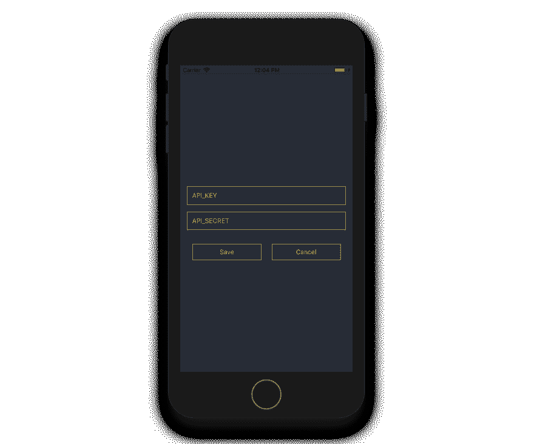

# React 原生 Mobx 教程-第 2 部分

> 原文：<https://dev.to/satansdeer/react-native-mobx-tutorial---part-2--12km>

这是 MobX tutodial 系列的第二部分，今天我们将设置项目并添加我们的 MobX 商店。

## 目录

1.  [什么是 MobX](http://maksimivanov.com/posts/react-native-mobx-tutorial)
2.  [制作反应型 app](#)
3.  [测试商店](#)
4.  [用酶测试视图](#)

## 设置

好了，掷骰子玩够了，让我们做真正的事。

我们将使用`create-react-native-app`来设置我们的项目结构。

运行以下命令:

```
$ yarn global add create-react-native-app
$ create-react-native-app binance-tracker
$ cd binance-tracker 
```

Enter fullscreen mode Exit fullscreen mode

现在你可以执行`yarn start`来运行 **Expo** app 中的项目，或者在模拟器运行`yarn ios`或`yarn android`中执行你的 app。

安装依赖项:

```
$ yarn add mobx mobx-react react-navigation 
```

Enter fullscreen mode Exit fullscreen mode

*   状态管理需要 Mobx
*   `mobx-react`将提供`@observer`装饰器
*   `react-navigation`将提供必要的导航功能

让我们开始添加功能。

## 应用结构

我们的应用程序将有两个屏幕。`ProfileScreen`我们将允许更新币安凭证，而`HomeScreen`我们将显示余额和一些其他信息。

下面是我们的`App.js`的样子:

```
import React from "react";
import { StyleSheet, View, Text, SafeAreaView } from "react-native";
import { StackNavigator } from "react-navigation";
import HomeScreen from "./src/HomeScreen";
import ProfileScreen from "./src/ProfileScreen";
import { Provider } from "mobx-react";
import stores from "./src/stores";

const styles = StyleSheet.create({
  safeArea: {
    flex: 1,
    backgroundColor: "#272C36"
  },
  navigator: {
    backgroundColor: "#272C36"
  }
});

const Navigator = StackNavigator(
  {
    Home: { screen: HomeScreen },
    Profile: { screen: ProfileScreen }
  },
  {
    mode: "modal",
    headerMode: "none"
  }
);

export default class App extends React.Component {
  render() {
    return (
      <Provider {...stores}>
        <SafeAreaView style={styles.safeArea}>
          <Navigator style={styles.navigator} />
        </SafeAreaView>
      </Provider>
    );
  }
} 
```

Enter fullscreen mode Exit fullscreen mode

这里我们使用`react-navigation`包中的`StackNavigator`来临时添加`ProfileScreen`到`HomeScreen`之上。它处理动画和历史。因此，我们可以很容易地回到上一个屏幕。

只有 IphoneX 才需要,`SafeAreaView`增加了垂直边距，以免影响其外形。

然后我们把所有东西都打包成`Provider`。它允许使用`@inject` decorator(或者 function，如果你不喜欢 decorator 的话)将定义好的存储注入到它的子组件中。

商店是在`src/stores/index.js`中定义的，它将商店导出到一个对象中:

```
import ApiKeysStore from './ApiKeysStore';
import BinanceApiStore from './BinanceApiStore';

const apiKeysStore = new ApiKeysStore()
const binanceApiStore = new BinanceApiStore(apiKeysStore)

export default {
  apiKeysStore: apiKeysStore,
  binanceApiStore: binanceApiStore,
}; 
```

Enter fullscreen mode Exit fullscreen mode

现在我们将能够使用这个对象键将它们注入到组件中。

像这样:

```
@inject('apiKeysStore')
@observer
export default class ProfileScreen extends React.Component { 
```

Enter fullscreen mode Exit fullscreen mode

## 获取 API 密钥

为了与币安通信，我们首先需要得到`API_KEY`和`API_SECRET`。为此——[在](https://www.binance.com/?ref=12930619)创建新账户(是的，这是我的代销商链接，如果你不想让我从你那里获得任何代销商佣金，请删除`ref`属性)。

从您的帐户页面转到 [api 设置页面](https://www.binance.com/userCenter/createApi.html)。

创建 api 密钥/秘密并保存在某个地方，我们稍后会用到它们。

## 添加首屏

我们需要能够以某种方式保存这些 API 键。让我们创建第一个有两个输入和提交按钮的屏幕。

[](https://res.cloudinary.com/practicaldev/image/fetch/s--yJRJlX_i--/c_limit%2Cf_auto%2Cfl_progressive%2Cq_auto%2Cw_880/http://d33wubrfki0l68.cloudfront.net/091f802910efd98af6ba896125f0165c5e8ae9a5/aa574/asseimg/binance_profile.png)T3】

```
/* Imports omitted */

/* Style declarations omitted */

@inject("apiKeysStore")
@observer
export default class ProfileScreen extends Component {
  /* Handler functions omitted */

  render() {
    return (
      <View style={styles.container}>
        <TextInput
          style={styles.input}
          onChangeText={this.props.apiKeysStore.setApiKey}
          value={this.props.apiKeysStore.apiKey}
          placeholder="API_KEY"
        />

        <TextInput
          style={styles.input}
          onChangeText={this.props.apiKeysStore.setApiSecret}
          value={this.props.apiKeysStore.apiSecret}
          placeholder="API_SECRET"
          placeholderTextColor="#DDBC44"
        />

        <View style={styles.buttonsContainer}>
          <TouchableOpacity style={styles.button} onPress={this.updateKeys}>
            <Text style={styles.buttonText}>Save</Text>
          </TouchableOpacity>

          <TouchableOpacity
            style={styles.button}
            onPress={this.handlePressCancel}
          >
            <Text style={styles.buttonText}>Cancel</Text>
          </TouchableOpacity>
        </View>
      </View>
    );
  }
} 
```

Enter fullscreen mode Exit fullscreen mode

正如你在这里看到的，在我们注入了`apiKeyStore`之后，它就可以作为`prop`变量被访问了。

## API key store

```
import {observable, computed, action} from 'mobx';
import { AsyncStorage } from 'react-native';

export default class ApiKeysStore {
  @observable apiKey = '';
  @observable apiSecret = '';

  async saveApiKeys() {
    try{
      await AsyncStorage.setItem('@ApiKeysStore:apiKey', this.apiKey);
      await AsyncStorage.setItem('@ApiKeysStore:apiSecret', this.apiSecret);
    } catch(e) {
      console.log(e)
    }
  }

  @action setApiKey(apiKey) {
    this.apiKey = apiKey;
  }

  @action setApiSecret(apiSecret) {
    this.apiSecret = apiSecret;
  }

  @action async loadApiKeys() {
    try {
      this.apiKey = await AsyncStorage.getItem('@ApiKeysStore:apiKey');
      this.apiSecret = await AsyncStorage.getItem('@ApiKeysStore:apiSecret');
    } catch (e) {
      console.log(e);
    }
  }

  @computed get apiKeysExist() {
    return this.apiKey && this.apiSecret;
  }
} 
```

Enter fullscreen mode Exit fullscreen mode

这个存储非常简单，它有两个可观察的属性(`apiKey`和`apiSecret`)，设置这些属性的动作和用`AsyncStorage`保存和加载这些键的函数。

## 从 API 获取数据

`BinanceApiStore`引用了`ApiKeysStore`，所以它可以使用这些键来访问币安 API。

有一个获取账户数据的函数(包含拥有的密码数量的信息)和一个获取当前报价的函数(包含每个密码的价格)。

它更新它的可观察属性，并提供一堆计算属性，这样我们就可以显示我们的数据。

```
/* Imports ommited */

export default class BinanceApiStore {
  constructor(apiKeysStore){
    this.apiKeysStore = apiKeysStore;
  }

  @observable apiKeysStore = null;
  @observable balances = [];
  @observable oldBalances = [];
  @observable tickers = [];

  @computed get tickersMap() {
    /* Function content ommited */
  }

  @computed get oldBalancesMap() {
    /* Function content ommited */
  }

  @computed get computedBalances() {
    /* Function content ommited */
  }

  @action setTickers(tickers) {
    this.tickers = tickers;
  }

  @action setBalances(balances) {
    this.balances = balances;
  }

  @action setOldBalances(balances) {
    this.oldBalances = balances;
  }

  async loadBookTickers() {
    /* Function content ommited */
  }

  async loadAccountData() {
    /* Function content ommited */
  }

  async loadOldComputedBalances() {
    const balancesJson = await AsyncStorage.getItem('@BinanceApiStore:oldComputedBalances');
    const balances = JSON.parse(balancesJson)
    this.setOldBalances(balances)
  }

  saveComputedBalancesDisposer = autorunAsync(() => {
    this.computedBalances.length && AsyncStorage.setItem('@BinanceApiStore:oldComputedBalances',
      JSON.stringify(this.computedBalances));
  }, 0)
} 
```

Enter fullscreen mode Exit fullscreen mode

此外，它将旧的计算值存储到`AsyncStorage`中，并允许计算与您上次检查余额的差异。

## 显示数据

这里是`HomeScreen`布局。

```
/* Imports ommited */

/* Styles ommited */

@inject("apiKeysStore", "binanceApiStore")
@observer
export default class HomeScreen extends Component {
  async componentDidMount() {
    const { apiKeysStore, binanceApiStore, navigation } = this.props;

    await apiKeysStore.loadApiKeys();
    try {
      await binanceApiStore.loadBookTickers();
      await binanceApiStore.loadAccountData();
      await binanceApiStore.loadOldComputedBalances();
    } catch (e) {
      navigation.navigate("Profile");
    }
  }

  render() {
    const { binanceApiStore, navigation } = this.props;

    return (
      <View style={styles.container}>
        <CurrenciesListHeader />
        <FlatList
          style={styles.list}
          data={binanceApiStore.computedBalances}
          keyExtractor={item => item.asset}
          renderItem={({ item }) => (
            <View style={styles.item}>
              <SymbolAndAmount style={styles.itemSection} item={item} />
              <AmountInBtcAndUsd
                style={styles.itemSection}
                volUsd={item.amountInUsd}
                volBtc={item.amountInBtc}
              />
              <ChangePercentage
                style={styles.itemSection}
                value={item.priceChange}
              />
            </View>
          )}
        />
        <TouchableOpacity
          style={styles.secretsButton}
          onPress={() => navigation.navigate("Profile")}
        >
          <Text style={styles.secretsButtonText}>Set API_KEY & API_SECRET</Text>
        </TouchableOpacity>
      </View>
    );
  }
} 
```

Enter fullscreen mode Exit fullscreen mode

首先，我们让`ApiKeyStore`加载 API 密钥，然后我们`try`加载帐户和报价机数据，如果我们得到一个错误，我们导航用户到`ProfileScreen`输入有效的凭证。

当一切正常并且我们得到了`computedBalances`时，我们使用`FlatList`显示它们。我们将在上一篇文章中更仔细地观察渲染组件，我们将使用`Enzyme`对它们进行视图测试。

## 总结

在本文中，我提交了许多代码，在下一篇文章中，当我们用测试覆盖它们时，我们将更仔细地看一下我们的存储。