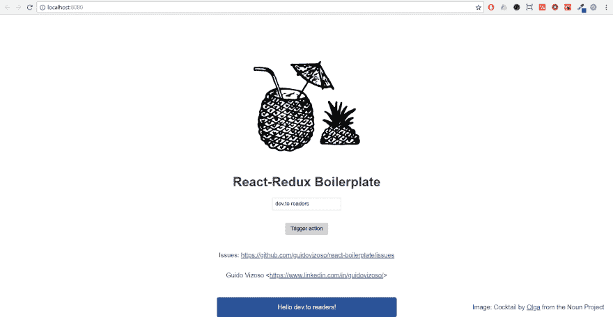

# React-Redux 为忙碌的人开了个头

> 原文：<https://dev.to/guidovizoso/react-redux-headstart-for-busy-people-g50>

嗨读者！这相当于我以前的帖子:

[](/guidovizoso) [## 为忙碌的人做好准备

### Guido Vizoso 5 月 26 日 181 分钟阅读

#react #boilerplate #javascript #webdev](/guidovizoso/react-headstart-for-busy-people-5aid)

## 动机

它开始是为了简化我的开发过程，但是我发现是时候发布和记录我所做的事情了...我们到了！

## 内容

我认为这个样板文件是任何 react-redux 应用程序的最小结构:Wepack、Babel、react、redux、Styled Components 和 ESlint。
Github 回购:[https://github.com/guidovizoso/react-redux-boilerplate](https://github.com/guidovizoso/react-redux-boilerplate)

## 如何使用

安装:

```
git clone https://github.com/guidovizoso/react-redux-boilerplate.git
npm install 
```

Enter fullscreen mode Exit fullscreen mode

命令:

```
npm run dev /* Runs webpack dev server and live reloading */
npm run start /* Runs webpack in production mode with optimizations */ 
```

Enter fullscreen mode Exit fullscreen mode

搞定了。

[T2】](https://res.cloudinary.com/practicaldev/image/fetch/s--vy1ErL-P--/c_limit%2Cf_auto%2Cfl_progressive%2Cq_auto%2Cw_880/https://thepracticaldev.s3.amazonaws.com/i/jhvhqsg273598aivpxrc.png)

## 文件夹结构

```
├── src
│   ├── index.js // Renders everything
│   ├── App.jsx // Main component
│   ├── store.js // Redux store generator
│   ├── components // Pretty much explains itself
│   ├── actions // Dispatch executers
│   ├── reducers // Redux Reducers
│   └── assets // Images and stuff goes here
├── dist // Compiled files goes here
├── package.json
├── .babelrc
├── .eslintrc
├── webpack.common.js
├── webpack.dev.js
├── webpack.prod.js
└── .gitignore 
```

Enter fullscreen mode Exit fullscreen mode

## 问题

如果你在使用这个样板文件并遇到任何问题，请让我知道！
[https://github . com/guidovizoso/react-redux-boilerplate/isues](https://github.com/guidovizoso/react-redux-boilerplate/isues)

## 未来的岗位

React & Redux 有一个陡峭的学习曲线，这是肯定的。如果你想要这方面的指导，就把它注释掉。祝您愉快！