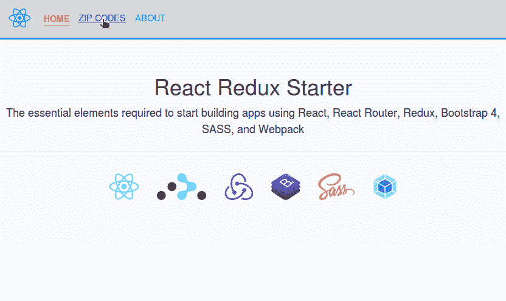

# 反应还原启动器

> 原文：<https://dev.to/drminnaar/react-redux-starter--4176>

## 总结

最近，我更新了我的 [react-starter](https://github.com/drminnaar/react-starter) 项目，添加了以下值得注意的变化:

*   适应多种构建配置(开发和生产)
*   允许用户指定插件(bundleanalyzer，bundlebuddy)作为 NPM 脚本的一部分
*   添加了 webpack-dashboard 作为可选的 NPM 运行脚本

我不知道是否要引入更高级的库，比如说 [Redux](https://redux.js.org/) 和 [React-Router](https://reacttraining.com/react-router/) 。最后，我决定创建一个名为 [react-redux-starter](https://github.com/drminnaar/react-redux-starter) 的新启动项目，对于那些除 react 之外还想使用 [Redux](https://redux.js.org/) 和 [React-Router](https://reacttraining.com/react-router/) 的人来说，它更像是一个高级启动项目。因此，在这篇文章中，我将描述在 [react-redux-starter](https://github.com/drminnaar/react-redux-starter) 项目中有什么可用的。

## 项目概述

[react-redux-starter](https://github.com/drminnaar/react-redux-starter) 项目是一个基本模板，它包含了使用 [React](https://reactjs.org) 、 [React Router](https://reacttraining.com/react-router/) 、 [Redux](https://redux.js.org/) 、 [Bootstrap 4](https://getbootstrap.com/docs/4.0/getting-started/introduction/) 、 [Sass](https://sass-lang.com/) 和 [Webpack](https://webpack.js.org/) 开始构建单页面应用程序(SPA)所需的基本元素。

虽然我称这个项目为某种模板，但它也是一个迷你应用程序，因为它展示了架构的完整垂直切片。这意味着，有一个 Redux 和 React-Router 在运行的例子。我提供了一个非常简单的组件来获取邮政编码列表。我通过一个*‘邮政编码 JSON 文件’*提供数据来保持例子的简单。然而，这个简单的组件演示了 Redux 动作、Redux 容器和 Redux 存储的使用。

下图说明了如何使用 Redux 和一个*邮政编码服务*获取数据:

[T2】](https://res.cloudinary.com/practicaldev/image/fetch/s--f_Ewt5pY--/c_limit%2Cf_auto%2Cfl_progressive%2Cq_auto%2Cw_880/https://user-images.githubusercontent.com/33935506/36661103-035bd11a-1ae3-11e8-8c01-0224860801f8.png)

## 特性

该模板包括:

*   典型的项目布局结构
*   巴别塔设置和配置
*   Webpack 设置和配置
*   ESLint 设置和配置
*   SCSS 设置和配置
*   显示邮政编码列表的 React 组件示例
*   处理邮政编码状态的 Redux 设置
*   React 路由器设置显示基本导航

此外，该模板还提供了开发和生产 webpack 配置。

该模板还允许用户将特定的插件作为构建的一部分。[请点击此处了解更多详情](#build-application-with-bundleanalayzer-plugin-included)

* * *

## 展柜

下面的动画 gif 展示了这个应用程序的样子。

### 桌面

[T2】](https://res.cloudinary.com/practicaldev/image/fetch/s--Ap74-jMl--/c_limit%2Cf_auto%2Cfl_progressive%2Cq_66%2Cw_880/https://user-images.githubusercontent.com/33935506/36639642-ce08ea3a-1a19-11e8-8f97-0bcb29276aaf.gif)

### 移动

[T2】](https://res.cloudinary.com/practicaldev/image/fetch/s--C888TArI--/c_limit%2Cf_auto%2Cfl_progressive%2Cq_66%2Cw_880/https://user-images.githubusercontent.com/33935506/36639643-ce440ad4-1a19-11e8-9728-3a4b5f1bd800.gif)

* * *

## 发达了

*   [Visual Studio Code](https://code.visualstudio.com/)——微软为 Windows、Linux 和 macOS 开发的源代码编辑器。它包括对调试、嵌入式 Git 控件、语法高亮、智能代码完成、代码片段和代码重构的支持
*   [Node.js](https://nodejs.org/en/) - Javascript 运行时
*   一个用于构建用户界面的 javascript 库
*   [React 路由器](https://reacttraining.com/react-router/)-React 的声明式路由
*   Redux 是 JavaScript 应用程序的一个可预测的状态容器。
*   [Redux-Promise-Middleware](https://github.com/pburtchaell/redux-promise-middleware)-Redux 中间件，用于承诺、异步功能和条件乐观更新
*   [Redux-Thunk](https://github.com/gaearon/redux-thunk) -用于 Redux 的 Thunk 中间件
*   Babel -一个 javascript 的翻译器
*   [网络包](https://webpack.js.org/) -一个模块捆绑器
*   css 一种 CSS 元语言
*   Bootstrap 4 - Bootstrap 是一个开源工具包，用于开发 HTML、CSS 和 JS

* * *

## 入门

在这里找到 [react-redux-starter 项目。](https://github.com/drminnaar/react-redux-starter.git)

这些说明将为您提供一个项目的副本，并在您的本地机器上运行，用于开发和测试目的。

### 先决条件

您的系统需要安装以下软件:

*   节点 8.x
*   Npm 3.x

在终端中键入以下命令，以验证您的节点和 npm 版本

```
 node -v
  npm -v 
```

Enter fullscreen mode Exit fullscreen mode

### 安装

按照以下步骤运行开发环境。

*   从 GitHub 克隆*‘react-redux-starter’*存储库

```
 git clone https://github.com/drminnaar/react-redux-starter.git 
```

Enter fullscreen mode Exit fullscreen mode

*或者使用 SSH*

```
 git clone git@github.com:drminnaar/react-redux-starter.git 
```

Enter fullscreen mode Exit fullscreen mode

*   安装节点模块

```
 cd react-redux-starter
   npm install 
```

Enter fullscreen mode Exit fullscreen mode

### 打造

#### 构建应用程序

| 偏差 | 刺针 |
| --- | --- |
| npm 运行构建:开发 | npm 运行构建:生产 |

#### 构建应用程序并观察变化

| 偏差 | 刺针 |
| --- | --- |
| npm 运行构建:开发:观察 | npm 运行构建:生产:观察 |

#### 构建包含 BundleAnalayzer 插件的应用程序

| 偏差 | 刺针 |
| --- | --- |
| npm 运行构建:开发:bundleanalyze | npm 运行构建:产品:bundleanalyze |

运行上述命令后，将打开一个浏览器窗口，显示类似下图的交互式图形:

[T2】](https://res.cloudinary.com/practicaldev/image/fetch/s--th6uJNAo--/c_limit%2Cf_auto%2Cfl_progressive%2Cq_auto%2Cw_880/https://user-images.githubusercontent.com/33935506/36639476-30f9479c-1a16-11e8-9d09-1b80355a089b.png)

#### 构建包含 BundleBuddy 插件的应用

| 偏差 | 刺针 |
| --- | --- |
| npm 运行构建:开发:bundlebuddy | npm 运行版本:产品:bundlebuddy |

### 运行斯洛文尼亚语

#### Lint 项目使用 ESLint

```
 npm run lint 
```

Enter fullscreen mode Exit fullscreen mode

#### Lint 项目使用 ESLint，并自动修复

```
 npm run lint:fix 
```

Enter fullscreen mode Exit fullscreen mode

### 运行

#### 运行开始

这将运行*‘服务:开发’*NPM 任务

```
npm start 
```

Enter fullscreen mode Exit fullscreen mode

#### 运行开发服务器

```
npm run serve:dev 
```

Enter fullscreen mode Exit fullscreen mode

#### 使用仪表板运行开发服务器

```
npm run serve:dev:dashboard 
```

Enter fullscreen mode Exit fullscreen mode

上述命令将在您的控制台中显示一个类似下图的仪表板视图:

[T2】](https://res.cloudinary.com/practicaldev/image/fetch/s--0BCA8BuN--/c_limit%2Cf_auto%2Cfl_progressive%2Cq_auto%2Cw_880/https://user-images.githubusercontent.com/33935506/36639594-589409e8-1a18-11e8-84fe-29f7bdafcaa6.png)

#### 运行生产服务器

该命令将使用生产设置构建应用程序，并使用*实时服务器*
启动应用程序

```
npm run serve:prod 
```

Enter fullscreen mode Exit fullscreen mode

* * *

## 结论

提供一个简单但足够详细的起点来说明一些重要的概念总是很困难的。我希望这个项目有助于实现这个目标。我将随着时间的推移进行更新和调整，尝试将该项目作为学习如何使用 Redux、Webpack 和 React Router 构建 React 应用程序的理想起点。