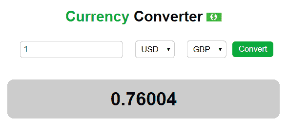

# React 一次性应用 1:货币转换器

> 原文：<https://dev.to/fleepgeek/react-throwaway-app-1-currency-converter--52c7>

## [T1】简介](#intro)

去年的某个时候，我偶然看到了戴夫·塞迪亚写的一篇关于如何学习 React 的文章。
他清楚地说明了在你的学习之旅中学习的顺序。

我喜欢他的想法，在学习完纯反应后，做一些东西，然后扔掉；文章的第二步。这是一个好主意，因为听课和阅读编程书籍的问题是，你觉得你知道并理解了所涵盖的概念。很抱歉，你不能，除非你已经启动了你最喜欢的代码编辑器，并根据你所学的知识构建了一些东西。

新开发者非常容易陷入 [**教程炼狱**](https://dev.to/tonymastrorio/escaping-tutorial-purgatory-as-a-new-developer-1kf3) 。这仅仅意味着消耗了如此多的教程，却从来没有感觉到你已经学到了足够的东西去构建。

## 你以为你知道反应吗？

在这个系列中，我们将测试我们自己，看看我们是否可以构建小的'**一次性项目**,以表明我们理解 React 并在 React 中思考。
知道一个概念是一回事。知道如何将这些知识结合起来，以及何时将它们用在另一方面。

## 我们要实现什么

你将构建'**一次性应用程序**，显示你在 react 中思考并理解其基本概念。这个系列将涵盖大约 6 个应用程序(你可以建议更多的一次性应用程序，因为我现在想不出更多)。

您将在本系列中构建的应用程序:

1.  货币转换器
2.  [电影搜索](https://dev.to/fleepgeek/react-throwaway-app-2-movie-search-app-3f3d)
3.  ....会随着我们的进步想到更多

## 规则

*   你的应用程序应该在 60 分钟内完成。
*   必须是纯 React(无 react-router 或 redux)。
*   必须在一周后删除该项目。为什么？这些都是基本的应用程序，你应该能够随时创建，不值得在一个严肃的工作面试中展示。
*   不要花太多时间在设计上。记住，这个想法是检查你是否在反应中思考。60 分钟后，你可以根据自己的口味来设计发型。
*   在你完成你的答案之前，不要看我的答案。否则，你将遭受 5 年的“辅导炼狱”

## App 1:货币转换器

你要建立一个货币转换器。
以下是截图:

[](https://res.cloudinary.com/practicaldev/image/fetch/s--Owd34APN--/c_limit%2Cf_auto%2Cfl_progressive%2Cq_auto%2Cw_880/https://thepracticaldev.s3.amazonaws.com/i/39e5ho0vdsgbfb3uqxja.PNG) 
你可以使用由 [OpenRates.io](http://www.openrates.io/)
提供的免费 api，这个应用程序将向你展示如何理解:

*   组件和状态工作
*   从 api 请求数据
*   组件生命周期方法
*   使用事件

### 你的时间现在开始！！

## 我的解决方案

我使用 OpenRates api 获取我的汇率，并使用 create-react-app 为我的项目生成一个基础结构。此外，我使用“axios”来处理我的请求。下面是我对转换器组件的目录结构:

[T2】](https://res.cloudinary.com/practicaldev/image/fetch/s--99TWRXvo--/c_limit%2Cf_auto%2Cfl_progressive%2Cq_auto%2Cw_880/https://thepracticaldev.s3.amazonaws.com/i/bd152b7vxejao50ht1i4.PNG)

下面是完整的 Converter.js

```
import React, { Component } from "react";
import axios from "axios";

import './Converter.css';

class Converter extends Component {
    state = {
        result: null,
        fromCurrency: "USD",
        toCurrency: "GBP",
        amount: 1,
        currencies: [],
    };

    // Initializes the currencies with values from the api
    componentDidMount() {
        axios
            .get("http://api.openrates.io/latest")
            .then(response => {
                // Initialized with 'EUR' because the base currency is 'EUR'
                // and it is not included in the response
                const currencyAr = ["EUR"]
                for (const key in response.data.rates) {
                    currencyAr.push(key)
                }
                this.setState({ currencies: currencyAr.sort() })
            })
            .catch(err => {
                console.log("Opps", err.message);
            });
    }

    // Event handler for the conversion
    convertHandler = () => {
        if (this.state.fromCurrency !== this.state.toCurrency) {
            axios
                .get(`http://api.openrates.io/latest?base=${this.state.fromCurrency}&symbols=${this.state.toCurrency}`)
                .then(response => {
                    const result = this.state.amount * (response.data.rates[this.state.toCurrency]);
                    this.setState({ result: result.toFixed(5) })
                })
                .catch(err => {
                    console.log("Opps", err.message);
                });
        } else {
            this.setState({ result: "You cant convert the same currency!" })
        }
    };

    // Updates the states based on the dropdown that was changed
    selectHandler = (event) => {
        if (event.target.name === "from") {
            this.setState({ fromCurrency: event.target.value })
        }
        if (event.target.name === "to") {
            this.setState({ toCurrency: event.target.value })
        }
    }

    render() {
        return (
            <div className="Converter">
                <h2><span>Currency </span> Converter <span role="img" aria-label="money">&#x1f4b5;</span> </h2>
                <div className="Form">
                    <input
                        name="amount"
                        type="text"
                        value={this.state.amount}
                        onChange={event =>
                            this.setState({ amount: event.target.value })
                        }
                    />
                    <select
                        name="from"
                        onChange={(event) => this.selectHandler(event)}
                        value={this.state.fromCurrency}
                    >
                        {this.state.currencies.map(cur => (
                            <option key={cur}>{cur}</option>
                        ))}
                    </select>
                    <select
                        name="to"
                        onChange={(event) => this.selectHandler(event)}
                        value={this.state.toCurrency}
                    >
                        {this.state.currencies.map(cur => (
                            <option key={cur}>{cur}</option>
                        ))}
                    </select>
                    <button onClick={this.convertHandler}>Convert</button>
                </div>
                {this.state.result && 
                    <h3>{this.state.result}</h3>
                }
            </div>
        );
    }
}

export default Converter; 
```

Enter fullscreen mode Exit fullscreen mode

我不会深入讨论上述代码的细节，因为我相信您已经知道 React(这就是您最初开始阅读本文的原因，对吗？)但我会概述一下正在发生的事情。

货币列表在`componentDidMount()`中初始化。这些值是从 OpenRates API 获得的，将用于填充我们的下拉列表。
`convertHandler()`是转换发生的地方，由按钮的`onClick`事件触发。
还有，我有一个`selectHandler()`是两个下拉共用的。这个函数根据哪个下拉菜单被改变来有条件地更新状态(这就是为什么我给了下拉菜单`name`属性)。如果你喜欢给每个概念命名，你可以称之为**条件共享事件**。
你完全可以在下拉菜单上执行内联事件触发器，就像我对输入文本字段所做的那样，我只是展示了我们可以让不同的相似组件共享一个事件处理程序。
最后，我将`Converter`组件导入到我的 App.js 文件中，并在它的`render`函数中调用它。

```
//This is also correct
onChange={(event) => this.setState({ fromCurrency: event.target.value })} 
```

Enter fullscreen mode Exit fullscreen mode

下面是 css: **Converter.css**

```
.Converter {
    width: 100%;
    padding: 0 15%;
    box-sizing: border-box; 
    text-align: center;
}

.Form {
    display: flex;
    margin: 0 auto;
    align-items: center;
    justify-content: center;
    flex-wrap: wrap;
    width: 100%;
}

.Form input, select {
    padding: 5px;
    margin: 5px 10px;
    border-radius: 5px;
    border: 1px solid rgba(119, 119, 119, 0.5);
}

.Form button {
    padding: 5px 10px;
    border-radius: 5px;
    background: rgb(11, 170, 59);
    color: white;
    border: none;
}

.Converter h3 {
    background-color: #ccc;
    border-radius: 10px;
    padding: 15px;
    font-size: 30px;
}

.Converter h2 span {
    color: rgb(11, 170, 59);
} 
```

Enter fullscreen mode Exit fullscreen mode

## 结论

我希望这是一次很好的锻炼，你喜欢吗？如果你不用看我的就成功编写了应用程序:干得好。
如果你不能:也做得很好。这表明你渴望挑战自己，这是一个开发人员的良好品质。随着时间的推移，你会理解这些概念。

请记住，作为开发人员，我们总是需要不断地测试我们的知识，我希望这个简单的练习能有所帮助。
明天见，参加下一场“**一次性应用**挑战赛。感谢阅读！！

链接到下一个一次性应用:[电影搜索](https://dev.to/fleepgeek/react-throwaway-app-2-movie-search-app-3f3d)