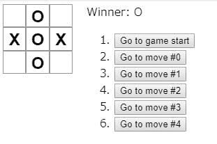

# 无状态功能组件和 Redux 中的 React 教程代码

> 原文：<https://dev.to/origamium/react-tutorial-code-in-stateless-functional-components-and-redux--3kp>

# TL；速度三角形定位法(dead reckoning)

光用 Redux 的话大脑会变得奇怪的

# 是的

你好。 我已经累了。 然后看看这个。

[https://stackblitz.com/edit/react-tutorial-sfc-and-redux](https://stackblitz.com/edit/react-tutorial-sfc-and-redux)
(github 仓库在这里是)

我不知道怎么嵌入。 我已经困了，无所谓。

[T2】](https://res.cloudinary.com/practicaldev/image/fetch/s--kMOKUfdV--/c_limit%2Cf_auto%2Cfl_progressive%2Cq_auto%2Cw_880/https://thepracticaldev.s3.amazonaws.com/i/mfljyqci2nvt0lgjqqf1.jpg)

内容是将 React 的[在这一页](https://reactjs.org/tutorial/tutorial.html)中写的多点游戏( tic-tac-toe )转换为 stateless functional components + redux ( react-redux，redux-) 我有代码比较脏的自信。

# 结论

## Redux 即使用小规模的程序写也只是很麻烦

已经如标题所示。
但是，我想在学习的意义上应该没那么浪费吧。

## 原本使用 Redux 的意思

虽然这里面包含了一些 POM 元素(完全是个人的见解)，但是由于 Redux 要求将项目的结构稍微复杂化，从而将每个动作的责任分割得较小，所以在具有一定规模且涉及多人的项目中充分发挥其效果

“规模”很重要，变得多大 Redux 才能发挥威力呢？
那是夹着渐变的模糊边界线的问题，在这里就不赘述了，既然这么小规模的话，Redux 反而只会徒劳地增加代码的分量，变得繁杂，所以“不使用 Redux”的选择还是足够的。