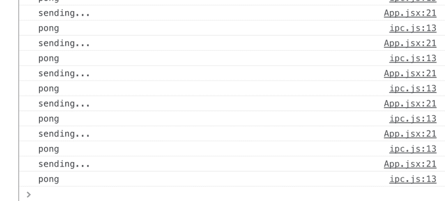

# React 和 Electron 之间数据收发的方法和一例

> 原文：<https://dev.to/origamium/reactelectron-2gdo>

# Attention!

本文中的几个项目已经 outdated 了。 特别是`remote.require`已过时。

是虚拟油管博主。 大家也是虚拟油管博主吗？

在上次的[制作 react + electron APP 的故事](https://dev.to/origamium/create-reactelectron-application-in-quickly--36nl)中只说了制作 APP 之前的事情。 而且，如果在 React 和 Redux 上事情已经基本解决了的话，就不会为 Electron 和 Node.js 而深深烦恼了吧。

但是，如果想用 Electron 制作 APP，应该有使用 Node.js 以及在其上运行的软件包，或者想在 React 上显示在 Electron 上获取的数据的愿望
这里的问题是如何处理其 Electron-主进程-和 React+Redux-渲染器进程-之间。

# `remote.require`

以下代码是渲染器进程中使用的部分。

```
// レンダラプロセス
//@flow
const { remote } = window.require('electron');
const app = remote.require('electron').app;

export default (): Promise<string> => new Promise((resolve) => {
    resolve(app.getAppPath()); //アプリケーションの実行場所が絶対パスとして返ります
}); 
```

Enter fullscreen mode Exit fullscreen mode

只要认为`remote.require`是渲染器进程中可以利用的`require`的变化就足够了。 内部利用内部进程通信( IPC )调用主进程的方法，可以最简单地与主进程进行交互。
基本上，只要是可以序列化的数据就可以进行交接。

```
// レンダラプロセス
//@flow
const { remote } = window.require('electron');
const app = remote.require('electron').app;
const fs = remote.require('fs');

export default (): Promise<any> => new Promise((resolve, reject) => {
    try {
        fs.writeFileSync(app.getAppPath()+"/internet.json", {googlePublicDns: "8:8.8.8"});
        resolve();
    } catch (e) {
        reject(e);
    }
}); 
```

Enter fullscreen mode Exit fullscreen mode

# `ipcMain`、`ipcRenderer`

`ipcMain`和`ipcRenderer`分别是通过 Event-Driven 的方法实现主进程和渲染器进程的数据传递的功能。 基本的使用方法记载在[Electron ipcMain](https://electronjs.org/docs/api/ipc-main) 的文档中，但实际使用时(因为想在 redux 上完成所有的数据流)要利用 redux 及其 middleware
虽然会稍微复杂一点，但是使用`redux-saga`并使用`ipcRenderer`的例子如下代码所示。

```
// レンダラプロセス
// @flow
import { eventChannel, END } from "redux-saga";
import { fork, take } from 'redux-saga/effects';

const { ipcRenderer } = window.require('electron');

const ipc = function* () {
    try {
        const channel = yield eventChannel(emit => {
            ipcRenderer.on('asynchronous-reply', (event, arg) => {
                console.log(arg);
                emit({type: "EVENT_RECEIVED", payload: {}});
            });

            return () => {};
        });

        while (true) {
            yield take(channel)
        }
    } catch (e) {
        console.error("ipc connection disconnected with unknown error");
    }
};

export default function*() { // redux-sagaのrootsagaで1 度だけ呼び出す
    yield fork(ipc);
} 
```

Enter fullscreen mode Exit fullscreen mode

`eventChannel`常用于监控事件发射器。 可以在`emit => {}`中安装侦听器，在`emit`中 dispatch action。
本来应该在发送 onclose 某物的时候利用`emit(END)`向 saga 通知事件已经结束，但是 ipcRenderer 中没有，所以可以忽略。

```
// メインプロセス
ipcMain.on('asynchronous-message', (event, arg) => {
    console.log(arg); // prints "ping"
    event.sender.send('asynchronous-reply', 'pong')
}); 
```

Enter fullscreen mode Exit fullscreen mode

在这种情况下，如果从渲染器进程发送了名为`asynchronous-message`的事件，则主进程将发回`asynchronous-reply`事件，并作为数据发回`'pong'`。 当然，事件名称可以是任何名称，只要它在渲染器进程和主进程中的名称一致即可。
而且，果然只要是可以序列化的东西，都可以发送接收。

试着在渲染器过程的适当位置扔出`'asynchronous-message'`活动吧。

```
// レンダラプロセス
const ipcRenderer = window.require('electron').ipcRenderer;

setInterval(() => {
    console.log('sending...');
    ipcRenderer.send('asynchronous-message', 'ping');
}, 1000); 
```

Enter fullscreen mode Exit fullscreen mode

如果成功，控制台将显示以下内容:

[T2】](https://res.cloudinary.com/practicaldev/image/fetch/s--2Oa9Q7Pk--/c_limit%2Cf_auto%2Cfl_progressive%2Cq_auto%2Cw_880/https://thepracticaldev.s3.amazonaws.com/i/rvhcj47zt58qrq76eivw.png)

# `WebContents.send`

你注意到`ipcMain`的文档中没有单向发送到渲染器进程的方法吗？
虽然可以从渲染器进程单方面发送到主进程，但是在`ipcMain`中基本上只能“发回”。
有时会想单方面地从主进程向渲染器进程发送某些东西。 那个时候用`WebContents.send`。

```
// メインプロセス
// BrowserWindowのインスタンスmainWindowがあることを前提にしています
mainWindow.webContents.send("asynchronous-message-from-love", "yeah"); 
```

Enter fullscreen mode Exit fullscreen mode

8

读到这里的话应该已经知道了，正在发送`"asynchronous-message-from-love"`活动。 要接收这个，只需反复使用刚才的 ipcRenderer 实现就可以了。

# `WebContents.executeJavaScript`

这是相当直截了当的做法。 将执行您看到的代码。

```
// メインプロセス
// BrowserWindowのインスタンスmainWindowがあることを前提にしています
mainWindow.webContents.executeJavascript("console.log('yeah')"); 
```

Enter fullscreen mode Exit fullscreen mode

执行此代码后，渲染器端的控制台上将显示`yeah`。 组合字符串可以执行最强的代码。 但是，和`eval`一样，也有安全上的危险，所以基本上应该只通过硬涂字符串的组合来执行`executeJavascript`。

# 结论

*   在渲染器进程中利用`remote.require`、`ipcRenderer`即可
*   在主流程中利用`webContents.send`、`ipcMain`、`webContents.executeJavasSript`即可

结束