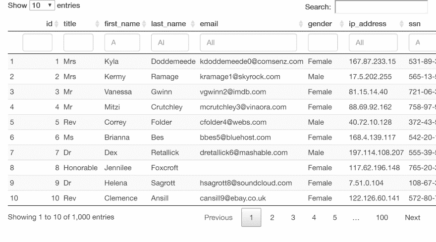
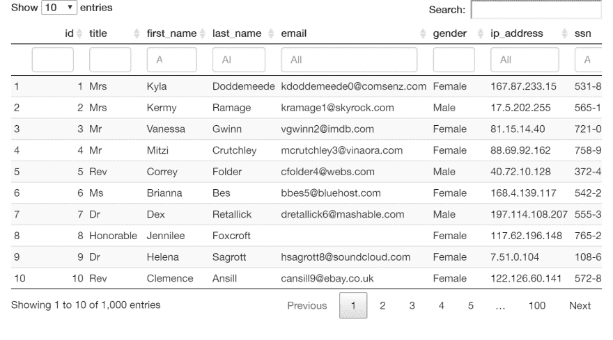
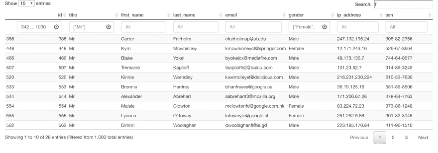
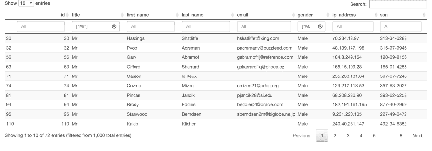

# 具有持久过滤器的 R 中的反应式数据表

> 原文：<https://dev.to/awwsmm/reactive-datatables-in-r-with-persistent-filters-l26>

*(本文使用的虚假数据由 [Mockaroo](https://www.mockaroo.com/) 生成)。)*

我想要的只是一个带有持久过滤器的反应式数据表。亲爱的读者，我花了生命中的几个小时，这样你就可以比我在 R Shiny 中创建一个动态数据表更轻松。下面是一些用 DT 制作数据表并在 Shiny 中显示的基本 R 代码:

```
library(shiny)  #  Shiny web app  library(DT)  #  for data tables  # user interface just shows the table  ui  <-  fluidPage(fluidRow(column(12,  div(dataTableOutput("dataTable")))))  # server is where all calculations are done, tables are pre-rendered  server  <-  function(input,  output,  session)  {  # load CSV file  myCSV  <-  read.csv('www/MOCK_DATA.csv')  #-----------------------------------------------------------------------------  #  render data table  #-----------------------------------------------------------------------------  output$dataTable  <-  renderDT(  myCSV,  # data  class  =  "display nowrap compact",  # style  filter  =  "top"  # location of column filters  )  }  # run the app  shinyApp(ui,  server) 
```

Enter fullscreen mode Exit fullscreen mode

下面是用 R 语言呈现的代码(本文中的所有图片都链接到托管在 [shinyapps.io](https://www.shinyapps.io/) 上的闪亮应用程序):

[T2】](https://awwsmm.shinyapps.io/rpdtv0)

*( [这里](https://www.utilitylog.com/full-page-screenshot-chrome/)你可以学习如何在不添加任何浏览器扩展的情况下，在 Chrome 中截屏一个网页。)*

看起来很棒，对吧？有一个“全局过滤器”(右上角的搜索栏)，每列上方有“列过滤器”。全局过滤器在*任何*单元格中搜索特定字符串，并返回包含这些单元格的行，而列过滤器允许您基于范围、因子或值集限制您看到的条目。

但是，如果您的数据正在发生变化，该怎么办？像这样面向用户的应用程序访问当前处于变化状态的数据并不少见。当用户盯着表格时，可以添加或删除新记录。在这种情况下，我们需要稍微修改一下代码，并使用一个 [`reactiveFileReader`](https://shiny.rstudio.com/reference/shiny/0.14/reactiveFileReader.html) ，它将在预定义的时间间隔检查文件的变更。让我们编辑代码来做到这一点。同样，让我们允许表格在水平方向滚动，这样它就不会像上面那样被切断:

```
library(shiny)  #  Shiny web app  library(DT)  #  for data tables  # user interface just shows the table  ui  <-  fluidPage(fluidRow(column(12,  div(dataTableOutput("dataTable")))))  # server is where all calculations are done, tables are pre-rendered  server  <-  function(input,  output,  session)  {  # load reactive CSV file  myCSV  <-  reactiveFileReader(100,  session,  'MOCK_DATA.csv',  read.csv)  #-----------------------------------------------------------------------------  #  render data table  #-----------------------------------------------------------------------------  output$dataTable  <-  renderDT(  myCSV(),  # reactive data  class  =  "display nowrap compact",  # style  filter  =  "top",  # location of column filters  options  =  list(  # options  scrollX  =  TRUE  # allow user to scroll wide tables horizontally  )  )  }  # run the app  shinyApp(ui,  server) 
```

Enter fullscreen mode Exit fullscreen mode

特别要注意的是，`reactiveFileReader`和`renderDT()`中的数据现在必须跟一对括号`()`，因为它现在是一个反应对象。我们现在有一个水平滚动条，我们的应用程序将对数据文件中的任何变化做出反应:

[T2】](https://awwsmm.shinyapps.io/rpdtv1/)

太棒了。我们还能做什么？嗯，我们可以添加一些默认的搜索词:

```
library(shiny)  #  Shiny web app  library(DT)  #  for data tables  # default global search value  if  (!exists("default_search"))  default_search  <-  ""  # default column search values  if  (!exists("default_search_columns"))  default_search_columns  <-  NULL  # user interface just shows the table  ui  <-  fluidPage(fluidRow(column(12,  div(dataTableOutput("dataTable")))))  # server is where all calculations are done, tables are pre-rendered  server  <-  function(input,  output,  session)  {  # load reactive CSV file  myCSV  <-  reactiveFileReader(100,  session,  'MOCK_DATA.csv',  read.csv)  #-----------------------------------------------------------------------------  #  render data table  #-----------------------------------------------------------------------------  output$dataTable  <-  renderDT(  myCSV(),  # reactive data  class  =  "display nowrap compact",  # style  filter  =  "top",  # location of column filters  options  =  list(  # options  scrollX  =  TRUE,  # allow user to scroll wide tables horizontally  # default column search strings and global search string  searchCols  =  default_search_columns,  search  =  list(regex  =  FALSE,  caseInsensitive  =  FALSE,  search  =  default_search)  )  )  }  # run the app  shinyApp(ui,  server) 
```

Enter fullscreen mode Exit fullscreen mode

问题是，当表刷新时，这些术语不是持久的 T2。每当`MOCK_DATA.csv`被更新时，它们被替换为默认值:

[T2】](https://awwsmm.shinyapps.io/rpdtv2/)

对此规定的解决方案是在`renderDT()`的选项列表中设置`stateSave = TRUE`，并用[访问数据表信息，这些变量在 Shiny 的 DT 指南](https://rstudio.github.io/DT/shiny.html)的第 2.2 节中定义。这是可行的，但前提是你要花几个小时试图弄清楚什么时候被刷新。我已经为你做了那些艰苦的、令人烦恼的工作，所以我不打算把它作为一个教学练习，我打算做我希望别人在我之前已经做过的事情，并给你答案。下面是当数据文件刷新时如何维护这些过滤器:

```
library(shiny)  #  Shiny web app  library(DT)  #  for data tables  # default global search value  if  (!exists("default_search"))  default_search  <-  ""  # default column search values  if  (!exists("default_search_columns"))  default_search_columns  <-  NULL  # user interface just shows the table  ui  <-  fluidPage(fluidRow(column(12,  div(dataTableOutput("dataTable")))))  # server is where all calculations are done, tables are pre-rendered  server  <-  function(input,  output,  session)  {  # load reactive CSV file  myCSV  <-  reactiveFileReader(100,  session,  'MOCK_DATA.csv',  read.csv)  #-----------------------------------------------------------------------------  #  update search strings  #-----------------------------------------------------------------------------  # watch for when myCSV updates, i.e. when the file changes  observe({  myCSV()  # when it updates, save the search strings so they're not lost  isolate({  # update global search and column search strings  default_search  <-  input$dataTable_search  default_search_columns  <-  c("",  input$dataTable_search_columns)  # update the search terms on the proxy table (see below)  proxy  %>%  updateSearch(keywords  =  list(global  =  default_search,  columns  =  default_search_columns))  })  })  #-----------------------------------------------------------------------------  #  render data table  #-----------------------------------------------------------------------------  output$dataTable  <-  renderDT(  myCSV(),  # reactive data  class  =  "display nowrap compact",  # style  filter  =  "top",  # location of column filters  options  =  list(  # options  scrollX  =  TRUE,  # allow user to scroll wide tables horizontally  stateSave  =  FALSE,  # default column search strings and global search string  searchCols  =  default_search_columns,  search  =  list(regex  =  FALSE,  caseInsensitive  =  FALSE,  search  =  default_search)  )  )  # make a proxy of the data table so it can be edited after it's been rendered  proxy  <-  dataTableProxy('dataTable')  }  # run the app  shinyApp(ui,  server) 
```

Enter fullscreen mode Exit fullscreen mode

这里它运行在 shinyapps.io 上:

[T2】](https://awwsmm.shinyapps.io/rpdtv3/)

请注意，如果您将上面的代码复制并粘贴到 RStudio 中，并从 Mockaroo 下载一个模拟数据文件并在本地完成，可能会更容易。要“更新”文件，不需要添加或删除行，只需打开并保存即可。这将更新磁盘上的“最后修改时间”，并且`reactiveFileReader`将重新加载文件。

# 解释

让我们一步一步来看:

```
library(shiny)  #  Shiny web app  library(DT)  #  for data tables 
```

Enter fullscreen mode Exit fullscreen mode

这些是我们在 R 中创建一个闪亮的应用程序并在该应用程序中创建一个数据表对象([从 JavaScript](https://rstudio.github.io/DT/) 移植到 R)所需的库。

```
# default global search value  if  (!exists("default_search"))  default_search  <-  ""  # default column search values  if  (!exists("default_search_columns"))  default_search_columns  <-  NULL 
```

Enter fullscreen mode Exit fullscreen mode

这些是全局过滤器和列过滤器的默认值。[全局过滤器是一个单独的字符串，但是列过滤器是一个列表列表](https://github.com/rstudio/DT/issues/319)的列表形式:

```
searchCols  =  list(NULL,  list(search  =  "1 ... 2"),  list(search  =  '["Male"]'),  ... 
```

Enter fullscreen mode Exit fullscreen mode

...其中，范围采用格式`A ... B`表示，单个项或因子采用格式`'["X"]'`表示。如果一列当前没有被过滤，它是`NULL`。通过设置`searchCols = NULL`，我们可以有一个根本没有列过滤器的默认设置，这就是我们在上面脚本的最终版本中所做的。

```
# user interface just shows the table  ui  <-  fluidPage(fluidRow(column(12,  div(dataTableOutput("dataTable"))))) 
```

Enter fullscreen mode Exit fullscreen mode

这是整个用户界面(`ui`)——在页面的一行中只有一个宽度为 12 的列(共 12 列)。该表包含在一个 div 中。这个 R 代码生成的 HTML 只是:

```
 <div class="container-fluid">
    <div class="row">
      <div class="col-sm-12">
        <div>
          <div id="dataTable" style="width:100%; height:auto; " class="datatables html-widget html-widget-output"></div>
        </div>
      </div>
    </div>
  </div> 
```

Enter fullscreen mode Exit fullscreen mode

...包含数据表的 div，在列中，在行中，在流动页面中。就是这样！

```
# server is where all calculations are done, tables are pre-rendered  server  <-  function(input,  output,  session)  { 
```

Enter fullscreen mode Exit fullscreen mode

这一行打开了服务器对象的定义，当一个新用户试图访问应用程序时会调用这个对象。请注意，在第一次运行 Shiny 应用程序时，在`server`之外定义的默认搜索只被调用一次。多个用户可以访问正在运行的应用程序的同一个实例，因此这些对象不会被实例化多次。([了解更多关于 Shiny 作用域的信息。](http://rstudio.github.io/shiny/tutorial/#scoping) )

```
 # load reactive CSV file  myCSV  <-  reactiveFileReader(100,  session,  'MOCK_DATA.csv',  read.csv) 
```

Enter fullscreen mode Exit fullscreen mode

这里是我们初始化反应 CSV 文件的地方。它每`100`毫秒检查一次更新，并且必须绑定到一个`session`——换句话说，它必须在`server`内运行。我们想要查看的文件是`MOCK_DATA.csv`，我们用来读取数据的方法是`read.csv`。

```
 # watch for when myCSV updates, i.e. when the file changes  observe({  myCSV()  # when it updates, save the search strings so they're not lost  isolate({  # update global search and column search strings  default_search  <-  input$dataTable_search  default_search_columns  <-  c("",  input$dataTable_search_columns)  # update the search terms on the proxy table (see below)  proxy  %>%  updateSearch(keywords  =  list(global  =  default_search,  columns  =  default_search_columns))  })  }) 
```

Enter fullscreen mode Exit fullscreen mode

这个代码块是整个脚本中最重要的部分。 `observe()` [是不返回值](https://shiny.rstudio.com/reference/shiny/0.14/observe.html)的反应式表达式。它依赖于`()` *内的每一个无功值，除了`isolate()`调用内的*值。这意味着上述块在`myCSV()`更新时更新，而*仅在`myCSV()`更新时*更新。(而不是，例如，当`input$dataTable_search`更新时。)当文件改变时，则触发`observe()`块并执行其中的`isolate()`块；默认过滤器用当前表中的值更新，而`proxy`表(稍后将详细介绍)用这些过滤器术语更新。

```
 output$dataTable  <-  renderDT(  myCSV(),  # reactive data  class  =  "display nowrap compact",  # style  filter  =  "top",  # location of column filters  options  =  list(  # options  scrollX  =  TRUE,  # allow user to scroll wide tables horizontally  stateSave  =  FALSE,  # default column search strings and global search string  searchCols  =  default_search_columns,  search  =  list(regex  =  FALSE,  caseInsensitive  =  FALSE,  search  =  default_search)  )  ) 
```

Enter fullscreen mode Exit fullscreen mode

这是呈现数据表的块。第一个参数是(反应性)数据集，后面是一些样式(`class`)和过滤框相对于列的位置(在它们的`top`上)。`options`是呈现表格的选项列表——如果表格太宽，无法在网页上显示，我们允许用户水平滚动(`scrollX`)，并且我们不保存表格的状态(`stateSave`)。后一个选项意味着列过滤器不会自动重新应用。当此设置为`true`时，有时过滤器会在服务器端重新应用，但不会出现在客户端:看起来好像没有应用过滤器，但表格会显示类似“Showing _ to _ _ of _ _ _ entries(filtered from _ _ _ _ _ total entries)”的内容。

最后两个选项是默认的列过滤器(或“search”)和默认的全局过滤器。这些在这里并不是绝对必要的，但是它们被留下来是为了显示我们之前手动设置过滤器时在`proxy`表中访问了什么。

```
 # make a proxy of the data table so it can be edited after it's been rendered  proxy  <-  dataTableProxy('dataTable') 
```

Enter fullscreen mode Exit fullscreen mode

这个位是[代理数据表](https://www.rdocumentation.org/packages/DT/versions/0.4/topics/dataTableProxy)，我们可以用它在客户端编辑表格，比如更新表格标题和用`updateSearch()`编辑过滤器。由于过滤器应用于服务器端的数据，但应用于客户端的 UI，如果我们希望以编程方式填充过滤器，我们需要手动管理这两者。请注意，如果用户手动更改 UI 中的过滤器，所有这些都是不必要的，因为客户端会处理图形更新，而服务器会监听这些更改并相应地更新数据。

```
# run the app  shinyApp(ui,  server) 
```

Enter fullscreen mode Exit fullscreen mode

最后，这个位接受`ui`和`server`对象并将它们编织在一起，创建

# 帮助

这太恶心了。在我看来，`dataTableProxy`有一个叫做 [`reloadData()`](https://www.rdocumentation.org/packages/DT/versions/0.4/topics/dataTableProxy) 的方法，它应该在不改变过滤器的情况下重新加载数据。但是据我所知，我上面概述的步骤是唯一的方法。而且很丑。我花了两天时间试图筛选文档和错误报告以及随机的谷歌碎片，这是我想到的最好的解决方案。如果有人知道一个更简单的方法，用 R 语言制作一个带有持久过滤的反应表，我洗耳恭听！