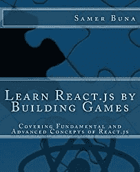

# React.js 常见问题

> 原文：<https://dev.to/pluralsight/reactjs-frequently-facedproblems--l5g>

[T2】](https://res.cloudinary.com/practicaldev/image/fetch/s--YCW2sbg1--/c_limit%2Cf_auto%2Cfl_progressive%2Cq_auto%2Cw_880/https://cdn-images-1.medium.com/max/2000/1%2ADX7mdH16kcPMxE5MWs66FQ.png)

在 [**jsComplete**](https://jscomplete.com) ，我们管理一个 [slack 账户](https://slackin-bfcnswvsih.now.sh/)，致力于帮助代码学习者摆脱困境。我们不时会收到一些有趣的问题，但大多数问题都是常见问题。我创建这个资源来为初学者 React.js 学习者通常面临的常见问题编写详细的说明，以便我可以在这里引用它们，而不是一遍又一遍地输入。

* * *

#### 1 —组件名称不以大写字母开头

React 组件的名称必须以大写字母开头。

如果组件名不是以大写字母开头，组件的使用将被视为一个*内置*元素，如`div`或`span`。

例如:

```
class greeting extends React.Component { 
  // ...
} 
```

Enter fullscreen mode Exit fullscreen mode

如果你尝试渲染`<greeting />`，React 会忽略上面的，你会得到一个警告:

```
Warning: The tag <greeting> is unrecognized in this browser. 
If you meant to render a React component, 
start its name with an uppercase letter. 
```

Enter fullscreen mode Exit fullscreen mode

这里更大的问题是当你决定将你的组件命名为`button`或`img`时。React 将忽略你的组件，只呈现一个普通的 HTML `button`或`img`标签。

[T2】](https://res.cloudinary.com/practicaldev/image/fetch/s--JBXEY0w3--/c_limit%2Cf_auto%2Cfl_progressive%2Cq_auto%2Cw_880/https://cdn-images-1.medium.com/max/2000/1%2A1DVD4DOgHfqAYXhQX1YYSw.png)

请注意上面的“我的牛逼按钮”并没有呈现，React 只是呈现了一个空的 HTML 按钮元素。在这种情况下，React 不会警告您。

#### 2 —使用单引号而不是反勾号

用反勾号(`创建的字符串...`)不同于用单引号('...'创建的字符串).

*在大多数键盘上，可以使用`tab`键*上方的键来键入反勾(`)字符。

当我们需要在字符串中包含动态表达式时，我们使用反勾号创建一个字符串(不需要求助于字符串连接)。

```
`This is a string template literal that can include expressions`

'This is just a string, you cannot include expressions here' 
```

Enter fullscreen mode Exit fullscreen mode

假设您想要一个总是报告当前时间的字符串:

`“Time is ...”`

```
// Current time string
const time = new Date().toLocaleTimeString();

// When using regular strings (single or double quotes),
// you need to use string concatenation:
'Time is ' + time

// When using back-ticks,
// you can inject the time in the string using ${}
`Time is ${time}` 
```

Enter fullscreen mode Exit fullscreen mode

此外，当使用字符串文字(带反勾号)时，您可以创建一个跨多行的字符串:

```
const template = `I

CAN

SPAN

Multiple Lines`; 
```

Enter fullscreen mode Exit fullscreen mode

你不能用普通的弦做到这一点。

* * *

#### 3—使用 React。属性类型

从 React 中移除了`PropTypes`对象。它曾经以`React.PropTypes`的名字出现，但是你不能再用它了。

相反，您需要:

1.  将新的**道具类型**包添加到你的项目:`npm install prop-types`
2.  导入它:`import PropTypes from 'prop-types'`

那你就可以用了。比如:`PropTypes.string`。

如果您错误地使用了`React.PropTypes`，您将得到如下错误:

```
TypeError: Cannot read property 'string' of undefined 
```

Enter fullscreen mode Exit fullscreen mode

* * *

#### 4 —没有使用教程使用的正确版本

当观看或阅读有关编码的内容并跟进它们所提供的示例时，请确保您使用的是该内容所使用的工具的正确版本。通常，使用每个工具的最新版本是安全的，但是如果内容有点旧，您可能会遇到一些不推荐使用的问题。

为了安全起见，请坚持使用所用工具的主要版本。比如教程用的是 React 16，就不要跟进用 React 15。

这对 Node.js 也特别重要。如果您使用较旧版本的 Node，将会面临一些重大问题。例如，如果您正在跟随使用`Object.values`的教程，并且您正在使用 Node 6.x，那么那个方法在当时是不存在的。您需要 Node 7.x 或更高版本。

* * *

#### 5—混淆函数和类

你能看出下面的代码有什么问题吗？

```
class Numbers extends React.Component { 
  const arrayOfNumbers = _.range(1, 10);
  // ...
} 
```

Enter fullscreen mode Exit fullscreen mode

上面的代码是无效的，因为在 JavaScript 类的主体中，你没有做任何事情的自由。您只能使用有限的语法来定义方法和属性。

*这有点令人困惑，因为类语法中使用的* `{}` *看起来像普通的块范围，但实际上不是。*

在基于函数的组件中，你可以自由地做任何事情:

```
// Totally Okay:

const Number = (props) => { 
  const arrayOfNumbers = _.range(1, 10);
  // ...
}; 
```

Enter fullscreen mode Exit fullscreen mode

* * *

#### 6 —将数字作为字符串传递

你可以用一个字符串传递一个属性值:

```
<Greeting name="World" /> 
```

Enter fullscreen mode Exit fullscreen mode

如果你需要传递一个数值，不要使用字符串:

```
// Don't do this
<Greeting counter="7" /> 
```

Enter fullscreen mode Exit fullscreen mode

相反，使用花括号来传递一个实际的数值:

```
// Do this instead
<Greeting counter={7} /> 
```

Enter fullscreen mode Exit fullscreen mode

使用`{7}`，在`Greeting`组件中，`this.props.counter`将拥有实际的数字`7`值，对其进行数学运算是安全的。如果你把它作为`“7”`传递，然后把它当作一个数字，你可能会遇到意想不到的结果。

* * *

#### 7 —忘记另一个应用实例仍在使用同一个端口

要运行一个 web 服务器，您需要使用一个主机(如 127.0.0.1)和一个端口(如 8080)来让服务器侦听有效 http 地址上的请求。

一旦 web 服务器成功运行，它就可以控制该端口。您不能将同一个端口用于任何其他用途。港口会很忙。

如果您尝试在另一个终端上运行相同的服务器，您会得到一个错误消息，说明端口“正在使用中”。大概是:

```
Error: listen EADDRINUSE 127.0.0.1:8080 
```

Enter fullscreen mode Exit fullscreen mode

请注意，有时 web 服务器可能运行在*后台*或一个分离的 screen/tmux 会话中。你没看到，但它还在占着港口。要重启你的服务器，你需要“杀死”那个还在运行的服务器。

要识别正在使用某个端口的进程，您可以使用类似于`ps`(和`grep`的命令来描述您的应用程序)或者如果您知道端口号，您可以使用`lsof`命令:

```
lsof -i :8080 
```

Enter fullscreen mode Exit fullscreen mode

* * *

#### 8 —忘记创建环境变量

有些项目依赖于 shell 环境变量的存在才能启动。如果您在没有所需环境变量的情况下运行这些项目，它们会尝试为它们使用未定义的值，并且可能会给您一些隐藏的错误。

例如，如果一个项目连接到一个像 MongoDB 这样的数据库，它很可能使用一个像`process.env.MONGO_URI`这样的环境变量来连接它。这使得该项目可以在不同的环境中与不同的 MongoDB 实例一起使用。

要在本地运行连接到 MongoDB 的项目，您必须首先导出一个`MONGO_URI`环境变量。例如，如果您有一个本地 MongoDB 运行在端口`27017`上，那么您需要在运行项目
之前这样做

```
export MONGO_URI="mongodb://localhost:27017/mydb" 
```

Enter fullscreen mode Exit fullscreen mode

你可以 *grep* 用于`process.env`的项目源代码，以计算出它需要什么环境变量来正确工作。

#### 9—混淆花括号{}和圆括号()

而不是:

```
return { 
  something();
}; 
```

Enter fullscreen mode Exit fullscreen mode

你需要:

```
return ( 
  something();
); 
```

Enter fullscreen mode Exit fullscreen mode

第一个将尝试(并失败)返回一个对象，而第二个将正确调用`something()`函数并返回该函数返回的内容。

由于 JSX 中的任何一个`<tag>`都将转化为一个函数调用，这个问题在返回任何一个 JSX 时都会出现。

这个问题在箭头函数的*短*语法中也很常见。

而不是:

```
const Greeting = () => { 
  <div> 
    Hello World 
  </div> }; 
```

Enter fullscreen mode Exit fullscreen mode

你需要:

```
const Greeting = () => ( 
  <div> 
    Hello World 
  </div>
); 
```

Enter fullscreen mode Exit fullscreen mode

当您将花括号与箭头函数一起使用时，您正在开始该函数的作用域。箭头函数的短语法不使用花括号。

* * *

#### 10 —不用括号将对象括起来

当您想要创建一个返回普通对象的短箭头函数时，上面的花括号与圆括号的问题也令人困惑。

而不是:

```
const myAction = () => { type: 'DO_THIS' }; 
```

Enter fullscreen mode Exit fullscreen mode

你需要:

```
const myAction = () => ({ type: 'DO_THIS'}); 
```

Enter fullscreen mode Exit fullscreen mode

如果不将对象括在括号中，就不会使用短语法。您实际上将为一个字符串定义一个标签！

这在`setState`方法的*更新器*函数中很常见，因为它需要返回一个对象。如果要使用短箭头函数语法，需要用括号将该对象括起来。

而不是:

```
this.setState(prevState => { answer: 42 }); 
```

Enter fullscreen mode Exit fullscreen mode

你需要:

```
this.setState(prevState => ({ answer: 42 })); 
```

Enter fullscreen mode Exit fullscreen mode

* * *

#### 11 —没有使用 API 元素和属性的正确大写

是`React.Component`，不是`React.component`。是`componentDidMount`，不是`ComponentDidMount`。一般是*`ReactDOM`，不是`ReactDom`。*

 *注意您需要的 API 大写。如果您使用不正确的大写，您将得到的错误可能不会清楚地说明问题是什么。

当从`react`和`react-dom`导入时，确保导入正确的名称，并且使用的名称与导入的名称完全相同。ESLint 可以帮助你指出哪些没有被使用。

这个问题在访问组件道具时也很常见:

```
<Greeting userName="Max" />

// Inside the component, you need 
props.userName 
```

Enter fullscreen mode Exit fullscreen mode

如果你没有使用`props.userName`，而是错误地使用了`props.username`或`props.UserName`，你将使用一个未定义的值。注意这一点，或者更好的是，让您的 ESLint 配置也指出这些问题。

* * *

#### 12-混淆状态对象和实例属性

在一个类组件中，你可以定义一个本地的`state`对象，然后用`this` :
来访问它

```
class Greeting extends React.Component { 
  state = { 
    name: "World", 
  };

  render() { 
    return `Hello ${this.state.name}`;
  }
} 
```

Enter fullscreen mode Exit fullscreen mode

上面会输出“Hello World”。

除了 state:
之外，您还可以定义其他本地即时属性

```
class Greeting extends React.Component { 
  user = { 
    name: "World", 
  };

  render() { 
    return `Hello ${this.user.name}`;
  }
} 
```

Enter fullscreen mode Exit fullscreen mode

上面还会输出“Hello World”。

`state`实例属性是一个特殊的属性，因为 React 将管理它。你只能通过`setState`改变它，当你这样做的时候*会对*做出反应。但是，您定义的所有其他实例属性对渲染算法没有影响。你可以随意改变上面例子中的`this.user`，React 不会在 React 中触发渲染循环。

* * *

#### 13 —混淆<标签/ >与</标签>

不要在结束标签中放错`/`字符。诚然，有时你可以使用`<tag/>`，而其他时候你需要`</tag>`。

在 HTML 中，有一种东西叫做“自结束标签”(又名 void 标签)。这些标签代表没有任何子节点的元素。例如，`img`标签是一个自结束标签:

```


// You don't use </img> 
```

Enter fullscreen mode Exit fullscreen mode

一个`div`标签可以有子标签，所以你使用开始和结束标签:

```
<div> 
  Children here...
</div> 
```

Enter fullscreen mode Exit fullscreen mode

这同样适用于 React 组件。如果组件有子内容，它可能是这样的:

```
<Greeting>Hello!</Greeting>

// Notice the position of the / character. 
```

Enter fullscreen mode Exit fullscreen mode

如果组件没有子组件，你可以用开始/结束标签或者一个自结束标签来编写它:

```
// 2 valid ways

<Greeting></Greeting>

<Greeting />

// Notice how the / character moves based on whether the element 
// is self-closing or not 
```

Enter fullscreen mode Exit fullscreen mode

以下用法无效:

```
// Wrong

<Greeting><Greeting /> 
```

Enter fullscreen mode Exit fullscreen mode

如果您放错了`/`字符，您将得到如下错误:

```
Syntax error: Unterminated JSX contents 
```

Enter fullscreen mode Exit fullscreen mode

* * *

#### 14 —假设导入/导出可以正常工作

导入/导出功能是 JavaScript 中的一个官方功能(从 2015 年开始)。然而，它是 ES2015 中唯一一个在现代浏览器和最新节点中尚未完全支持的功能。

React 项目的流行配置使用 Webpack 和 Babel。两者都允许使用这个特性，并把它编译成所有浏览器都能理解的东西。如果您的流程中有 Webpack 或 Babel 之类的东西，您只能使用导入/导出。

然而，在你的 React 捆绑应用中有导入/导出并不意味着你可以在任何你想要的地方使用它们！例如，如果您还通过最新的节点进行服务器端渲染，事情将不会为您工作。您很可能会得到一个“*意外令牌*错误。

为了让 Node 也理解导入/导出(如果你在前端使用它们并且你也想做 SSR，这是你需要的)，你将不得不用一个 Babel 预置(像 *env* 预置)来运行 Node 本身，它可以传输它们。你可以使用像 *pm2* 、 *nodemon* 和 *babel-watch* 这样的工具在开发中这样做，并在每次你改变一些东西时让 Node 重启。

* * *

#### 15 —不绑定处理程序方法

我把这个留到最后，因为它是一个大问题，也是一个非常普遍的问题。

您可以在 React 组件中定义类方法，然后在组件的`render`方法中使用它们。比如:

```
class Greeting extends React.Component { 
  whoIsThis() { 
    console.dir(this); // "this" is the caller of whoIsThis 
    return "World"; 
  }

  render() { 
    return `Hello ${this.whoIsThis()}`; 
  }
}

ReactDOM.render(<Greeting />, mountNode); 
```

Enter fullscreen mode Exit fullscreen mode

我在带有`this.whoIsThis`的`render`方法中使用了`whoIsThis`方法，因为在`render`中，`this`关键字指的是与表示组件的 DOM 元素相关联的组件实例。

React 内部确保其类方法中的“`this`”引用实例。然而，当您使用对`whoIsThis`方法的*引用*时，JavaScript 不会自动绑定实例。

`whoIsThis`中的`console.dir`行将正确报告组件实例，因为该方法是用一个*显式*调用者(`this`)从`render`方法中直接调用*。当您执行上面的代码时，您应该会在控制台中看到`Greeting`对象:*

[T2】](https://res.cloudinary.com/practicaldev/image/fetch/s--xPDiGjhR--/c_limit%2Cf_auto%2Cfl_progressive%2Cq_auto%2Cw_880/https://cdn-images-1.medium.com/max/2000/1%2Akaoe2WU6rYWm2M5pTNfdlg.png)

然而，当您在一个*延迟执行*通道中使用相同的方法时，比如一个*事件处理程序*，调用者将不再是显式的，并且`console.dir`行将不会报告组件实例。

参见下面的代码和输出(点击后)。

[T2】](https://res.cloudinary.com/practicaldev/image/fetch/s--Ge2hfjj4--/c_limit%2Cf_auto%2Cfl_progressive%2Cq_auto%2Cw_880/https://cdn-images-1.medium.com/max/2000/1%2A0A_QcuHnHG3IjMTiTySFaA.png)

在上面的代码中，当您单击字符串时，React 调用`whoIsThis`方法，但是它不会让您访问其中的组件实例。这就是为什么当我们点击字符串时会得到`undefined`。如果你的类方法需要访问像`this.props`和`this.state`这样的东西，这是一个问题。这根本行不通。

这个问题有很多解决方法。您可以将该方法包装在一个内联函数中，或者使用`.bind`调用来强制该方法记住它的调用者。对于不经常更新的组件，这两种方式都可以。你也可以通过在类的*构造函数*中而不是在 render 方法中优化 bind 方法。然而，这种方法的最佳解决方案是通过 Babel 启用 ECMAScript class-fields 特性(仍然是第 3 阶段),并对处理程序使用一个箭头函数:

```
class Greeting extends React.Component { 
  whoIsThis = () => { 
    console.dir(this); 
  }

  render() { 
    return ( 
      <div onClick={this.whoIsThis}> 
        Hello World 
      </div> 
    ); 
  }
} 
```

Enter fullscreen mode Exit fullscreen mode

这将按预期工作:

[T2】](https://res.cloudinary.com/practicaldev/image/fetch/s--qmLrX8JN--/c_limit%2Cf_auto%2Cfl_progressive%2Cq_auto%2Cw_880/https://cdn-images-1.medium.com/max/2000/1%2AyXSginjJHz7jZsCG_-K6Mw.png)

目前就这些。感谢阅读。

* * *

查看我的[通过构建游戏学习 react . js](https://jscomplete.com/learn-react-js-by-building-games)书:

[T2】](https://jscomplete.com/learn-react-js-by-building-games)

我还有其他几本书，你可能会感兴趣:

*   [用现代 JavaScript 学习编码](https://jscomplete.com/learn-coding-with-modern-javascript)
*   [Node.js 超越基础](https://jscomplete.com/learn-node-js-beyond-the-basics)
*   [职业程序员](https://jscomplete.com/the-professional-programmer)

*本文原载[此处](https://medium.com/@samerbuna/react-js-frequently-faced-problems-45e7060ef884)T3】**