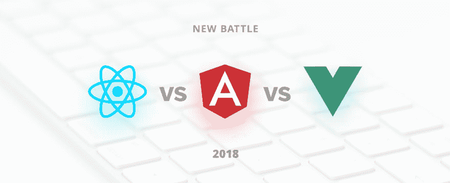
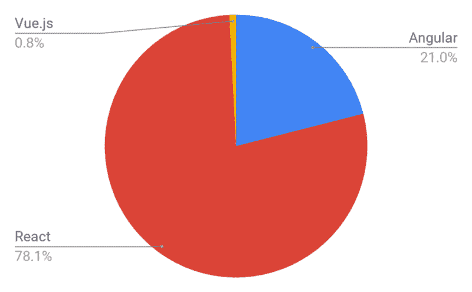

# react js vs angular 5 vs vue . js—2018 年选什么？

> 原文：<https://dev.to/madhu/reactjs-vs-angular5-vs-vuejswhat-to-choose-in-2018-3jfh>

[T2】](https://res.cloudinary.com/practicaldev/image/fetch/s--QuSJl-ZC--/c_limit%2Cf_auto%2Cfl_progressive%2Cq_auto%2Cw_880/https://thepracticaldev.s3.amazonaws.com/i/7mdkaoaozk9sa4buqr64.png)

前段时间我们发表了一篇文章，对比 Angular 2 和 React。在那篇文章中，我们展示了这些框架的利弊，并建议在 2017 年为特定目的选择什么。那么，2018 年的前端花园是什么情况呢？

JavaScript 框架正在以极快的速度发展，这意味着今天我们已经频繁地更新了 Angular、ReactJS 和这个市场上的另一个参与者——vue . js 的版本。

我们分析了全球范围内需要特定框架知识的空缺职位的数量。作为一个来源，我们以 Indeed.com 为例，根据 6 万多份工作机会，得出了以下分布情况。

[T2】](https://res.cloudinary.com/practicaldev/image/fetch/s--yjFl1B9l--/c_limit%2Cf_auto%2Cfl_progressive%2Cq_auto%2Cw_880/https://thepracticaldev.s3.amazonaws.com/i/vah5u7t63f6hpeha4w6n.png)

考虑到以下数据，我们决定分享每个前端框架的主要优点和缺点，并帮助技术专业人员或工程师选择最适合他们开发需求的框架。

# 棱角分明的利弊 5

Angular 是超级英雄 JavaScript MVVM 框架，成立于 2009 年，对于构建高度交互的 web 应用程序来说非常棒。

#### 棱角分明的好处 5:

*   新特性包括增强的 RXJS，更快的编译(不到 3 秒)，新的 HttpClient 启动。
*   详细的文档，允许个人开发者获得所有必要的信息，而无需询问他的同事。然而，这需要更多的教育时间。
*   双向数据绑定，支持应用程序的单一行为，最大限度地降低了可能出现错误的风险。
*   MVVM(模型-视图-视图模型)，允许开发人员使用相同的数据集在相同的应用程序部分单独工作。
*   与组件相关的特性的依赖注入通常具有模块性和模块化。

#### 棱角分明的弊端 5:

*   源自 Angular 的第一个版本的复杂语法。尽管如此，Angular 5 使用的是 TypeScript 2.4，相比之下是最不难学的。
*   从旧版本迁移到最新版本时可能出现的迁移问题。

使用 Angular 5 的公司:Upwork、Freelancer、Udemy、YouTube、Paypal、Nike、Google、Telegram、Weather、iStockphoto、AWS、Crunchbase。

# ReactJS 的利弊

ReactJS 是一个 JavaScript 库，由脸书在 2013 年开源，非常适合构建数据经常变化的大型 web 应用程序。

#### ReactJS 的好处:

*   简单易学。React 更容易学习，因为它在语法方面很简单。工程师只需要回忆一下自己的 HTML 写作技巧就可以了。不需要像 Angular 那样深入学习 TypeScript。
*   高度的灵活性和最大的响应能力。
*   虚拟 DOM(文档对象模型),允许将 HTML、XHTML 或 XML 格式的文档排列成一个树，在解析 web 应用程序的不同元素时，web 浏览器可以更好地接受这个树。
*   结合 ES6/7，ReactJS 可以轻松应对高负载。向下数据绑定，这意味着通过这种数据流，子元素不能影响父数据。
*   100%开源 JavaScript 库，根据全世界开发者的贡献，每天都有很多更新和改进。
*   绝对轻量级，因为在用户端执行的数据可以很容易地同时在服务器端表示。
*   版本之间的迁移通常非常容易，脸书提供了“代码模块”来自动化大部分过程。

#### ReactJS 的弊端:

*   缺乏官方文档 ReactJS 的超快速开发没有为适当的文档留下任何空间，现在这有点混乱，因为许多开发人员在没有任何系统方法的情况下单独贡献它；
*   React 是非个人化的——这意味着开发人员有时有太多的选择；
*   长时间掌握这意味着 React JS 需要深入了解如何将用户界面集成到 MVC 框架中。

使用 ReactJS 的公司有:脸书、Instagram、网飞、纽约时报、雅虎、可汗学院、Whatsapp、Codecademy、Dropbox、Airbnb、Asana、Atlassian、Intercom、微软。

# vue . js 的利弊

Vue.js 是 2013 年推出的 JavaScript 框架，非常适合创建适应性强的用户界面和复杂的单页面应用程序。

#### vue . js 的好处:

*   增强的 HTML。这意味着 Vue.js 与 Angular 有许多相似的特征，这有助于优化使用不同组件的 HTML 块处理。
*   详细的文档。Vue.js 有非常详细的文档，可以加快开发人员的学习曲线，并节省大量时间来开发仅使用 HTML 和 JavaScript 基础知识的应用程序。
*   适应性。由于在设计和架构方面与 Angular 和 React 相似，它提供了从其他框架到 Vue.js 的快速切换期。
*   令人敬畏的整合。Vue.js 既可以用于构建单页面应用程序，也可以用于构建更难的应用程序 web 界面。最重要的是，较小的交互部分可以很容易地集成到现有的基础设施中，而不会对整个系统产生负面影响。
*   大规模。根据其简单的结构，Vue.js 可以帮助开发非常大的可重用模板，无需额外的时间。
*   微小的尺寸。Vue.js 可以重约 20KB，保持其速度和灵活性，与其他框架相比，可以达到更好的性能。

#### vue . js 的弊端:

*   缺乏资源。与 React 或 Angular 相比，Vue.js 的市场份额仍然很小，这意味着该框架中的知识共享仍处于开始阶段。
*   过度灵活的风险。有时候，Vue.js 在集成到大型项目中时可能会遇到问题，并且仍然没有可能的解决方案的经验，但它们肯定会很快出现。
*   缺乏完整的英文文档。这导致了某些开发阶段的部分复杂性，然而，越来越多的资料被翻译成英文。

*更新:*为 [**娜塔莉亚·特普鲁希娜**](https://dev.to/n_tepluhina) 在她的评论中告知，现在
Vue.js 已经全了 [**英文文档**](https://vuejs.org/v2/guide/) 。

使用 Vue.js 的公司:小米、阿里巴巴、WizzAir、EuroNews、Grammarly、Gitlab 和 Laracasts、Adobe、Behance、Codeship、Reuters。

# *结论*

对于一个真正的工程师来说，选择哪个框架并没有实质性的区别，因为只是需要一段时间来适应新的框架。在我们公司，我们主要在 ReactJS 和 Angular 2/4/5 方面发展专业知识，但 Vue.js 也在其中。每个框架都有自己的优点和缺点，这意味着在产品开发过程中，每个案例都应该有一个正确的选择。

来源:https://www.techmagic.co/