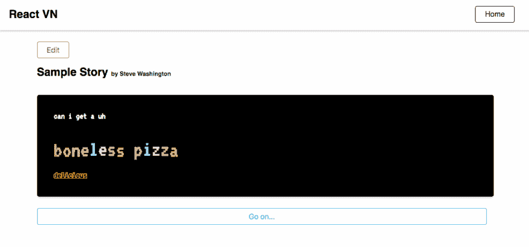
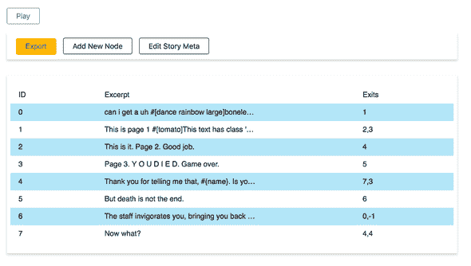
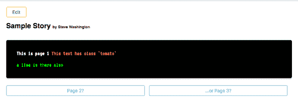
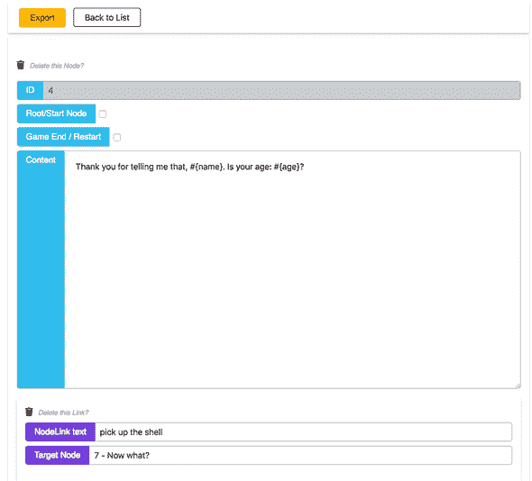
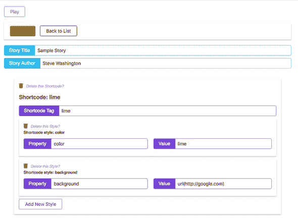

# 反应单位

> 原文：<https://dev.to/washingtonsteven/reactvn-124b>

[T2】](https://res.cloudinary.com/practicaldev/image/fetch/s--2VboWAGB--/c_limit%2Cf_auto%2Cfl_progressive%2Cq_66%2Cw_880/https://stevenwa.sh/static/featured_alpha_20180325-12b62c745e507a65ad151afab244d53d.gif)

React VN 是一个视觉小说编辑器和播放器，用于播放和编写文本冒险。

这是一个老项目，我已经在草稿中搁置了一段时间。这已经在我的网站上发布了一段时间，所以没有时间在这里发布了！这里的一些陈述有点...陈旧的...然而。

## 技术

### 做出反应

React VN 是用 Javascript 为 web 编写的，使用 React 作为数据和管理交互的框架。

### 创建-反应-应用

React 设置是用 [Create React App](https://github.com/facebook/create-react-app) 搭建的，后来因为几个原因被取消了:

*   添加 Sass 编译(使用`sass-loader` ) -促进一个只构建播放器的特殊构建(默认构建包括编辑器)

### React 16.3 上下文 API

这个项目还使用了新的(当时还没有发布)React 上下文 API。在`src/data/StoryContext.js`中设置上下文。在该文件中，有一个`StoryProvider`包装了默认上下文。向消费者提供故事数据的提供者组件。然而，它也公开了几个函数作为`storyData`的 API:helper 函数(用于快速访问节点)和 actions(用于修改节点)。

## 部署

### 概念

该应用程序分为两个独立的部署，一个是“编辑器”构建，另一个是“播放器”构建。该编辑器包括创建新故事、编辑现有故事以及将故事导出到. json 文件的工具。编辑器还会自动打开“调试模式”,在这个模式下，当故事被处理时，你可以看到一些幕后发生的事情。播放器只能加载和播放。json 故事。

### 流程

最初的部署计划是托管这两个 web 应用程序，并允许人们共享。json 文件(在编辑器 webapp 中创建)。一个人会收到别人的。json 并上传到播放器 webapp 播放故事。

很快，一个官方支持的部署将允许编辑下载应用程序的源代码，并在他们的本地机器上运行他们自己的编辑器应用程序，甚至是自己的主机，并为他们的播放器应用程序做同样的事情。在这种情况下，可以设置播放器加载特定的。json 文件，而不是要求加载特定的屏幕。

### 当前状态

目前，这两个应用都通过 Github 部署到 Netlify ( [编辑](http://react-vn.netlify.com)和[玩家](http://react-vn-player.netlify.com))。每个构建也通过 TravisCI 运行测试，并在标记的版本上，将生成一个`player.zip`文件，其中包含托管将附加到 Github 版本的播放器应用程序所需的所有文件。

## 链接

来源:[https://github.com/washingtonsteven/react-vn](https://github.com/washingtonsteven/react-vn)

编辑:[http://react-vn.netlify.com](http://react-vn.netlify.com)

选手:[http://react-vn-player.netlify.com](http://react-vn-player.netlify.com)

## 截图

[T11】](///static/screenshot04-3b871aa51e4ee0cb1682e78476cf49bb-415b9.png)