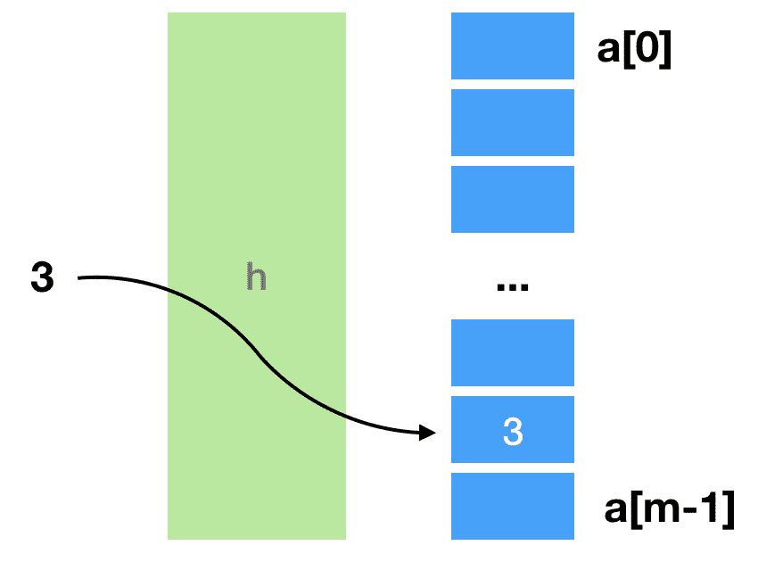
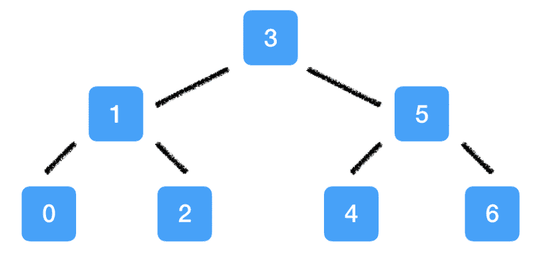
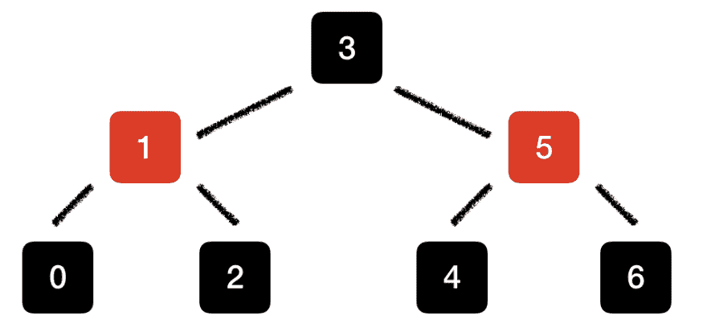
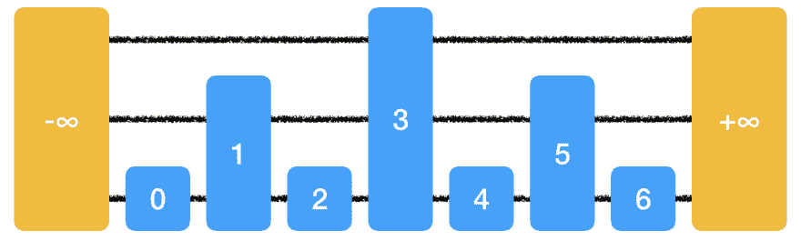
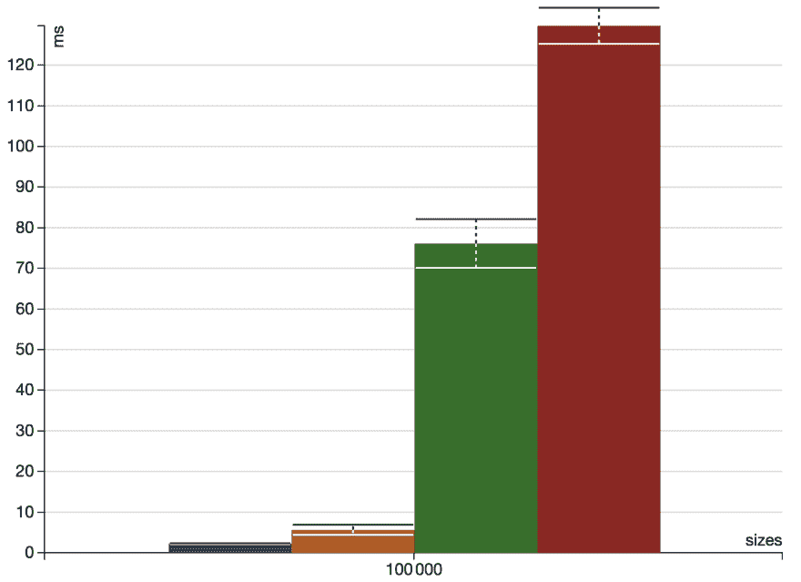
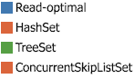

# 读取有效的数据结构

> 原文：<https://dev.to/frosnerd/read-efficient-data-structures-57i5>

# 简介

[之前的博文](https://dev.to/frosnerd/rum-conjecture---reasoning-about-data-access-4781)介绍了 RUM 猜想。它描述了在设计数据结构和访问方法时应该考虑的读取(RO)、更新(UO)和内存(MO)开销之间的权衡。

在这篇文章中，我们想仔细看看实践中常用的为低读取开销而设计的数据结构，即哈希表、红黑树和跳转列表。这篇博文是朗姆酒系列的第二部分:

1.  [RUM 猜想——关于数据访问的推理](https://dev.to/frosnerd/rum-conjecture---reasoning-about-data-access-4781)
2.  [读取高效的数据结构](#)
3.  [更新高效的数据结构](https://dev.to/frosnerd/update-efficient-data-structures-7cn)
4.  [内存高效的数据结构](https://dev.to/frosnerd/memory-efficient-data-structures-2hki)

为了比较不同的实现，我们使用与上一篇文章相同的例子。任务是实现一组整数，这次主要关注少量的读取开销。

该职位的结构如下。在第一部分，我们想回顾一下上一篇文章中读取开销最小的解决方案。接下来的几节将详细介绍三种实用的替代方法，从散列表开始，然后是红黑树，最后是跳过列表。最后一节从理论角度比较了三种不同的数据结构，并进行了简单的运行时实验。

# 最小化读取开销

我们已经看到了在读取开销方面的最佳实现:给定从 0 到 1000 的可能整数，我们可以利用大小为`1001`的布尔数组`a`。数组元素用`false`初始化。为了将一个整数`i`标记为集合的成员，我们设置`a[i] := true`。回想一下以下管理费用:

*   *RO = 1*
*   *UO = 1*
*   *莫→ ∞*

这对于大多数实际情况来说是不切实际的，因为内存开销会随着可能值的数量而增加。虽然理论上对整数使用这种方法是可能的，但是如果我们试图在一个集合中存储字符串，这就变得不可能了。我们如何在不损失太多读取(和写入)性能的情况下减少内存开销？

实际上，这是通过使用基于散列、分类树或列表的方法来实现的。让我们来看看三种数据结构，它们被设计成在不牺牲太多写和内存性能的情况下具有读效率:哈希表、红黑树和跳转列表。

# 哈希表

## 概念

哈希表的思想类似于最佳解决方案中使用的思想。我们没有为每个可能的整数保留一个布尔槽，而是将空间限制为一个大小为 *m* 的整数数组 *a* 。然后我们选择一个函数 *h* 使得对于每个整数 *i: h(i) ∈ [0..m-1]* 。这个函数可以用来计算数组索引，我们可以将 *i* 存储在`a[h(i)]`中。

下图说明了整数 3 如何存储在使用哈希表实现的集合中。我们计算 *h(3)* 并将值存储在数组的相应字段中。

[T2】](https://res.cloudinary.com/practicaldev/image/fetch/s--zvKgfN8A--/c_limit%2Cf_auto%2Cfl_progressive%2Cq_auto%2Cw_880/https://thepracticaldev.s3.amazonaws.com/i/bj1cw270wi72zfgb73yv.png)

我们如何挑选 *h* ？对于 *h* 的实际选择是重用现有的加密哈希函数(例如 [MD5](https://en.wikipedia.org/wiki/MD5) )并取结果值模 *m* 。缺点是这些散列函数可能很慢。这就是为什么 Java 依赖于每种数据类型的定制散列函数(例如 [`String`](http://grepcode.com/file/repository.grepcode.com/java/root/jdk/openjdk/6-b14/java/lang/String.java#String.hashCode%28%29) )。

如果我们预先知道所有可能的值，我们可以选择一个[完美的散列函数](https://en.wikipedia.org/wiki/Perfect_hash_function)。但这在大多数时候是不可能的。如果两个整数 *i* 和 *j* 被映射到同一个索引 *h(i) = h(j)* ，我们该怎么办？有不同的技术来解决这些所谓的冲突。

一种冲突解决方法是[分离链接](https://en.wikipedia.org/wiki/Hash_table#Separate_chaining)。在独立链接中，我们不将实际值存储在数组中，而是存储在另一层数据结构中。通过首先计算数组索引，然后查询存储在那里的数据结构，从哈希表中读取一个值。可能的候选结构是基于树或列表的结构，如以下部分所介绍的。但是如果预计冲突的数量很少，那么简单地使用链表也是很常见的。

另一种常用的方法叫做[开放式寻址](https://en.wikipedia.org/wiki/Open_addressing)。如果发生冲突，我们基于某种探测策略计算新的索引，例如使用 *h(i) + 1* 的线性探测。

## 朗姆酒饮料

哈希表实现的 RUM 开销很大程度上取决于所选的哈希函数、数组大小 *m* ，以及冲突解决策略。这使得调整哈希表的 RUM 开销成为可能。

如果没有冲突，读取开销只受计算开销 *h(i)* 的影响。评估散列函数的开销越小，总读取开销就越小。在冲突的情况下，会有额外的开销，这取决于解决策略。虽然通过选择几乎完美的散列函数来避免冲突是有用的，但是如果我们使散列函数相当快，并且在解决冲突时有一些额外的操作，总开销可能会更小。

因为更新首先需要读操作，所以更新开销等于读开销加上在单独链接的情况下对数组或链接的数据结构的插入/删除操作。

内存开销与加载因子( *n/m* )间接成正比。如果我们使用单独的链接来解决冲突，我们还必须考虑额外的内存。

如果我们插入越来越多的数据，内存开销就会减少。然而，由于我们必须解决更多的冲突，读取开销会增加。在这种情况下，可以重新调整哈希表，这需要将现有数据的完整副本放入一个更大的数组中，并重新计算所有哈希值。

## 渐近复杂性

读取和更新操作平均具有恒定的渐近复杂度，因为计算哈希值需要恒定的时间，与表中存储的数据量无关。在最坏的情况下(所有的 *n* 输入值得到相同的哈希值)，我们有 *n - 1* 个冲突要解决。因此，最坏情况下的性能就像我们将数据存储在无序数组中并执行全扫描一样糟糕。如果将 *m* 选择得尽可能小，并且如果需要的话调整散列表的大小，则分摊的存储器需求与存储在集合中的值的数量成线性关系。

| 类型 | 平均的 | 最坏情况 |
| --- | --- | --- |
| 阅读 | *O(1)* | *O(n)* |
| 更新 | *O(1)* | *O(n)* |
| 记忆 | *O(n)* | *O(n)* |

基于散列表的数据结构的读取性能平均来说是恒定的。然而，根据其设计，它只有效地支持点查询。如果您的访问模式包含范围查询，例如检查整数 *[0..500]* 包含在集合中，哈希集合不是正确的选择。为了有效地支持范围查询，我们可以以排序的方式存储数据。这种用例最常见的数据结构类型之一是二分搜索法树。

# 红黑树

## 概念

在[二叉查找树](https://en.wikipedia.org/wiki/Binary_search_tree)中，数据存储在节点中。每个节点最多有两个子节点。左边的子树只包含比当前节点小的元素。右边的子树只包含较大的元素。如果树是平衡的，即对于所有节点，左右子树的高度最多相差 1，则搜索节点需要对数时间。下图说明了如何存储器械包 *{0..6}* 在二叉查找树。

[T2】](https://res.cloudinary.com/practicaldev/image/fetch/s--HrsZFTZj--/c_limit%2Cf_auto%2Cfl_progressive%2Cq_auto%2Cw_880/https://thepracticaldev.s3.amazonaws.com/i/yqy1fxkchdm2trqr8t3m.png)

问题是我们如何在插入和删除元素时保持树的平衡？我们需要相应地设计我们的插入和删除算法，以使树自平衡。这种自平衡二分搜索法树的一种广泛使用的变体是红黑树[1]。

在[红黑树](https://en.wikipedia.org/wiki/Red%E2%80%93black_tree)中，每个节点除了存储实际值之外，还存储它的颜色。插入或删除节点时会使用颜色信息来确定如何重新平衡树。重新平衡是通过改变颜色和递归地围绕父树旋转子树直到树再次平衡来完成的。

详细解释算法超出了这篇文章的范围，所以请随意自行查找。还有一个由大卫·加勒创作的令人惊叹的红黑树互动可视化,值得一看。现在让我们来看看同一个例子集 *{0..6}* 存放在红黑树中。

[T2】](https://res.cloudinary.com/practicaldev/image/fetch/s--XL1Z6z6p--/c_limit%2Cf_auto%2Cfl_progressive%2Cq_auto%2Cw_880/https://thepracticaldev.s3.amazonaws.com/i/dm6ki4yv0l950r1ihsln.png)

请注意，红黑树不一定完全平衡，而是根据子树中黑色节点的高度来平衡。由于红黑树的不变量，平衡的红黑树永远不会比完全平衡的树差太多，即它们具有相同的搜索渐近复杂度。

## 朗姆酒饮料

自平衡二分搜索法树中的 RUM 开销依赖于保持树平衡的算法。在红黑树中，重新平衡是递归发生的，可能会影响节点，直到根节点。

读操作包括遍历树，直到找到元素。如果元素存储在一个叶节点中，它最多需要 *log(n) + c* 个遍历步骤，如果树不是完全平衡的，那么 *c* 是潜在的开销。

如同在基于散列表的实现中一样，在基于红黑树的集合上的更新操作首先需要读操作。除了读取开销之外，更新开销还取决于要更新的值、是否应该插入和移除该值，以及树的当前结构。在最普通的情况下，更新只需要在父节点上进行单个操作，即修改指向子节点的指针。最坏的情况是我们必须重新平衡树的根部。

## 渐近复杂性

由于红黑树是平衡的，读取操作具有对数复杂度，因此搜索一个值在概念上对应于一个[二分搜索法](https://en.wikipedia.org/wiki/Binary_search_algorithm)。更新操作具有相同的复杂性，因为它们需要对数搜索，加上从叶到根的最坏情况再平衡操作，这也是对数的。因为我们要求每个值一个节点，所以内存需求是线性的。

| 类型 | 平均的 | 最坏情况 |
| --- | --- | --- |
| 阅读 | *O(对数 n)* | *O(对数 n)* |
| 更新 | *O(对数 n)* | *O(对数 n)* |
| 记忆 | *O(n)* | *O(n)* |

我们已经看到，如果需要范围查询或者数据应该以排序的方式呈现给用户，自平衡二分搜索法树是有用的数据结构。然而，使它们自平衡所需的算法相当复杂。此外，如果我们想要支持并发访问，我们必须在重新平衡期间锁定树的某些部分。如果需要大量的重新平衡，这可能会导致不可预测的减速。

怎样才能设计出一个同时支持对数搜索代价的并发友好的数据结构？

# 跳过列表

## 概念

按照设计，链表是非常并发友好的，因为更新是高度本地化和缓存友好的[3]。如果我们的数据是一个有序序列，我们可以利用二分搜索法来实现对数读取复杂度。然而，排序链表的问题是我们不能访问链表中的随机元素。因此，二分搜索法是不可能的。或者是？这就是跳过列表的用武之地。

跳表是平衡树的概率替代[4，5，6]。跳转列表的核心思想是使用跳转指针为后面的数据部分提供快速通道。

为了执行二分搜索法，我们必须将我们的查询与中位数进行比较。如果中值不是我们要找的元素，我们就取左边或右边的子列表，递归地重复中值比较。这意味着我们并不真的需要完全随机访问，而是访问当前子列表的中间值。下图说明了我们如何使用跳过指针来实现这一点。

[T2】](https://res.cloudinary.com/practicaldev/image/fetch/s--LTW6srWn--/c_limit%2Cf_auto%2Cfl_progressive%2Cq_auto%2Cw_880/https://thepracticaldev.s3.amazonaws.com/i/omhubcge7dt50dodwkl1.png)

这个跳过列表有三个级别。最低级别包含整数的完整集合 *{0..6}* 。下一级只有 *{1，3，5}* ，上一级只有 *{3}* 。我们正在添加两个人工节点 *-∞* 和 *∞* 。每个节点保存一个值和一个指针数组，每个指针指向相应级别上的每个后继节点。如果我们现在想检查 *4* 是否是器械包的成员，我们按以下步骤进行。

*   从最左边的元素( *-∞* )开始，指针在最上面(级别 3)
*   将查询( *4* )与当前级别中的下一个元素( *3* )进行比较
*   作为 *3 < 4* ，我们向右移动一个元素(到 *3*
*   然后，我们再次将查询( *4* )与当前级别中的下一个元素( *∞* )进行比较
*   当 *∞ > = 4* 时，我们向下移动一级(到第二级)
*   然后，我们再次将查询( *4* )与当前级别中的下一个元素( *5* )进行比较
*   由于 *5 > = 4* ，我们向下移动一级(到第 1 级)
*   然后，我们再次将查询( *4* )与当前级别中的下一个元素( *4* )进行比较
*   当 *4 = 4* 时，查询成功返回

如果列表是静态的，并且我们可以建立跳转指针来支持我们的二分搜索法，那么这个算法就能很好地工作。然而，在现实生活中，我们希望能够插入或删除元素。我们怎样才能有效地支持插入和删除，而又不失去恰当放置的跳转指针的良好特性呢？在每次修改后完全重建跳过列表是不切实际的。最后，我们希望有高度本地化的更新来支持高并发性。

我们引入了跳表作为平衡树的概率替代。概率部分正是解决在哪里以及如何放置跳转指针的问题所需要的部分。

对于我们想要插入到跳过列表中的每个元素，我们首先搜索它在现有元素中的位置。然后我们把它插入最底层。之后我们掷硬币。如果硬币显示反面，我们就完了。如果它显示了 heads，我们将该元素“提升”到下一个级别，将其插入到更高级别的列表中，并重复该过程。为了删除一个元素，我们搜索它，然后简单地从所有级别中删除它。请随意查看这个令人惊叹的[交互式跳过列表可视化](https://people.ok.ubc.ca/ylucet/DS/SkipList.html)。

由于插入算法的不确定性，现实生活中的跳转列表看起来不像上图中的列表那样理想。它们看起来很可能会更乱。然而，可以表明，预期的搜索复杂性仍然是对数[7]。

## 朗姆酒饮料

跳转列表中的 RUM 开销是不确定的。这也是渐近复杂性分析比通常更复杂的原因，因为它也涉及概率论。尽管如此，我们还是要在概念层面上看一下不同的开销。

读操作需要遍历一系列水平和垂直指针，在此过程中将查询与不同的列表元素进行比较。这意味着在查询可以返回之前，可能会有大量的辅助读取。

正如您可能已经猜到的那样，在执行更新之前，我们需要一个读操作。辅助更新(即提升)的数量是不确定的。然而，它们完全是本地的，不依赖于剩余的跳转列表的结构。这使得并行更新变得容易。

内存开销取决于促销的数量，因为我们必须为每次促销存储额外的指针。通过使用一个不公平的硬币，即使用一个提升/不提升的概率【T0[p，1-p]】T1，其中 *0 < p < 1* 而不是 *[0.5，0.5]* ，我们实际上可以调整内存开销，潜在地权衡额外的读取和更新开销。如果我们选择 *p = 0* ，我们将得到一个链表，它具有我们在这个数据结构中可以达到的最小内存开销。如果我们选择 *p* 太大，我相信内存和读取开销都会增加，因为我们可能需要沿着不同的层次执行大量的垂直移动。

## 渐近复杂性

有不同的方法来分析跳表的渐近复杂性。两种常用的方法是查看预期的渐近复杂性或以高概率保持[的渐近复杂性。出于简单的原因，让我们看看这里预期的复杂性。](https://en.wikipedia.org/wiki/With_high_probability)

当实现如上所述的跳转列表时，有很小的机会以无限提升的元素结束。而期望的级数是 *O(log(n))* ，理论上是无界的。为了解决这个问题，可以选择一个元素可以升级的最大等级数 *M* 。如果 *M* 足够大，实际上没有负面影响。

在一般情况下，预期的读取和更新复杂度是对数的。跳转列表的预期高度是 *O(log(n))* 。然而，更高级的元素不太可能，这允许我们导出线性预期内存需求[8]。

对于有界列表来说，分析最坏情况更有趣，因为无界最坏情况是无限高的跳过列表。在有界列表的最坏情况下，我们将每个元素提升到最高级。如果我们选择最大水平来依赖于 *n* ，我们可以导出读取和更新操作的线性复杂度。

| 类型 | 平均的 | 最坏情况(*M*-有界) | 最坏情况(无界) |
| --- | --- | --- | --- |
| 阅读 | *O(对数 n)* | *O(n)* | *∞* |
| 更新 | *O(对数 n)* | *O(n)* | *∞* |
| 记忆 | *O(n)* | *O(nM)* | *∞* |

现在，我们已经了解了在行业中广泛使用的三种不同类型的数据结构。我们从理论的角度一个一个地研究它们。下一节包含一个静态比较，总结了我们的发现，以及一些使用 Java 标准库中的实现的运行时实验。

# 比较

## 理论对比

从我们今天所学的内容来看，可以肯定地说，高效读取数据结构的目标是亚线性读取开销。哈希表非常适合内存中的映射或集合。缺点在于，如果数据增长，需要重新调整底层数组，以及缺少范围查询支持。如果关心范围查询或排序输出，基于树的数据结构是一个很好的选择。跳过列表有时比树更受欢迎，因为它们简单，尤其是在无锁实现的时候。

一些数据结构在 RUM 开销方面是可配置的。通过调整冲突解决策略或所需的负载因子等参数，我们可以在哈希表中权衡内存开销和读取开销。在跳转列表中，我们可以通过修改提升概率来实现这一点。

下表总结了平均渐进读取、更新和内存需求，以及我们在本文中看到的三种数据结构的 RUM 可调性。

|  | 散列表 | 红黑树 | 跳过列表 |
| --- | --- | --- | --- |
| 平均值。阅读 | *O(1)* | *O(对数 n)* | *O(对数 n)* |
| 平均值。更新 | *O(1)* | *O(对数 n)* | *O(对数 n)* |
| 平均值。记忆 | *O(n)* | *O(n)* | *O(n)* |
| RUM 调谐参数 | 负载系数、哈希函数、冲突解决策略 | - | 晋升概率 |

## 运行时实验

最后，我们想看看三种 Java 标准库数据结构的实际读取性能: [`HashSet`](https://docs.oracle.com/javase/8/docs/api/java/util/HashSet.html) 、 [`TreeSet`](https://docs.oracle.com/javase/8/docs/api/java/util/TreeSet.html) 、 [`ConcurrentSkipListSet`](https://docs.oracle.com/javase/8/docs/api/java/util/concurrent/ConcurrentSkipListSet.html) 。

`HashSet`使用单独的链接来解决冲突。如果桶中的元素数量足够少，它们将被存储在一个列表中。如果数量超过 [`TREEIFY_THRESHOLD`](http://hg.openjdk.java.net/jdk8u/jdk8u/jdk/file/a006fa0a9e8f/src/share/classes/java/util/HashMap.java#l257) ，则迁移到红黑树。`TreeSet`是用红黑树实现的。`HashSet`和`TreeSet`都不是线程安全的，不支持并发修改。顾名思义，`ConcurrentSkipListSet`支持并发访问。基本列表使用 Harris-Maged 链接有序集算法的变体[9，10]。

作为基准，我们从 *n 个*随机整数中生成一个集合，并将其分别复制到`HashSet`、`TreeSet`和`ConcurrentSkipListSet`中。我们还从这些数字中创建一个最佳读取集，即使用一个巨大的布尔数组。然后，我们创建一个由 *n* 个随机点查询组成的列表，并测量完成所有查询的运行时间。

我们使用 [ScalaMeter](http://scalameter.github.io/) 来测量运行时性能。请随意查看我的[微基准博客帖子](https://dev.to/frosnerd/microbenchmarking-your-scala-code-4885)，其中包含了关于该工具的更多细节。

下图显示了从 100 000 个随机整数生成的不同集合上的 100 000 个点查询的运行时间。

[T6】](https://res.cloudinary.com/practicaldev/image/fetch/s--sguh4m_i--/c_limit%2Cf_auto%2Cfl_progressive%2Cq_auto%2Cw_880/https://thepracticaldev.s3.amazonaws.com/i/nzfe73ah6bb1vxrcz76k.png)

正如预期的那样，读优化实现的性能明显优于所有其他实现。第二个位置是哈希集。最佳读取实现和散列集都有恒定的渐进读取开销。树集合和跳过列表集合的性能要差得多。这也是意料之中的，因为它们具有对数运行时复杂性。

看看这四种实现的其他开销，以及将并发性包括在内，会很有意思。但是我把这个练习留给读者:P 在下一篇文章中，我们将更仔细地看一看被设计成具有低更新开销的写有效数据结构。

# 参考文献

*   [1]吉巴斯，L.J .和塞奇威克，r .，1978 年 10 月。平衡树的双色框架。计算机科学基础，1978 年。，第 19 届年会论文集(第 8-21 页)。IEEE。
*   [2] [流行的 Java 数据类型的内存消耗——第二部分](http://java-performance.info/memory-consumption-of-java-data-types-2/),作者 Mikhail Vorontsov
*   [3] [选择并发友好的数据结构](http://www.drdobbs.com/parallel/choose-concurrency-friendly-data-structu/208801371?pgno=1)
*   [4]西普格，1989 年 8 月。跳过列表:平衡树的概率替代。算法与数据结构工作坊(第 437-449 页)。斯普林格，柏林，海德堡。
*   [5]弗雷泽 k 和哈里斯 t，2007 年。无锁并发编程。《美国计算机学会计算机系统汇刊》(TOCS)，第 25 卷第 2 期，第 5 页
*   [6]m . Herlihy，Lev，y .，Luchangco，v .和 Shavit，n .，2006 年。一个可证明正确的可伸缩并发跳转表。分布式系统原理会议。
*   [7]茨韦塔纳·帕帕达基斯，1993 年。跳表和算法的概率分析。博士论文:滑铁卢大学。
*   [8] [跳过列表](https://www.cs.bgu.ac.il/~ds162/wiki.files/07-skip-list.pdf)——内盖夫本古里安大学数据结构课程
*   [9]哈里斯，T.L .，2001 年 10 月。非阻塞链表的实用实现。分布式计算国际研讨会(第 300-314 页)。斯普林格，柏林，海德堡。
*   [10]迈克尔，文学硕士，2002 年 8 月。高性能动态无锁哈希表和基于列表的集合。在第十四届 ACM 并行算法和体系结构年会论文集(第 73-82 页)。ACM。
*   Smabs Sputzer 的封面图片-这是一个朗姆酒做的...auf flickr，CC BY 2.0，[https://commons.wikimedia.org/w/index.php?curid=59888481](https://commons.wikimedia.org/w/index.php?curid=59888481)