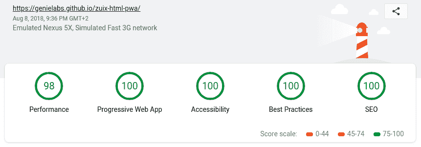
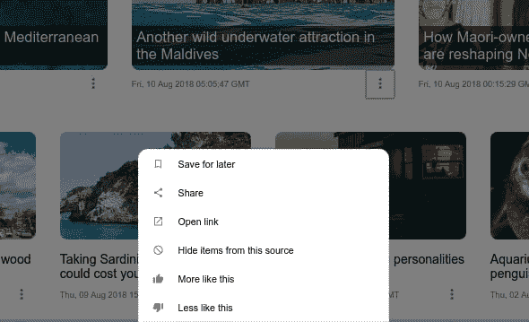

# 准备使用渐进式 Web 应用程序模板

> 原文：<https://dev.to/genejams/ready-to-use-progressive-web-app-template--18o5>

 <small>虽然这篇文章中的主题可能仍然是真实的，但是这些内容引用了一个旧版本的 *zuix.js* 库。最新文档见 [zuix.js](https://zuixjs.org) 网站。</small> 

* * *

它本应该只是一系列示例和教程的一部分，但结果却是作为一个新的开源产品来分享的好东西。
所以，如果你读过我以前的帖子，你就会明白是什么样的模式让我创建了这个*渐进式网络应用*模板:

## t1/[zuix-html pwa](https://github.com/zuixjs/zuix-html-pwa)的缩写形式

### 渐进式 Web 应用程序模板，具有反应灵敏、触摸优先的布局。

<article class="markdown-body entry-content container-lg" itemprop="text">

# zuix-html-pwa

一个渐进式 Web 应用程序模板，具有响应式布局和移动应用程序外观。

这个模板仅使用 HTML、JavaScript 和 CSS 构建，因此它最终可以与您喜欢的开发环境和构建工具集成。

## 特征

*   **P** 进取的 **W** eb **A** pp
*   响应式**先触式**布局
    *   折叠页眉/页脚
    *   抽屉布局(侧面菜单面板)
    *   带有延迟加载项目的新闻列表适配器示例
*   使用 zUIx.js 的模块化和基于组件的结构
*   浏览器内捆绑器:可以将所有资源打包在一个文件中，提高加载速度
*   PWA 灯塔得分 98/100

[T2】](https://camo.githubusercontent.com/c65de26d27f9b35f03f3ddf66714971a33e8f0a2d60104e7093aac7c7228b356/68747470733a2f2f7a7569786a732e6769746875622e696f2f7a7569782d68746d6c2d7077612f696d616765732f6c69676874686f7573652d7265706f72742e706e67)

### 演示网站

[https://zuixjs.github.io/zuix-html-pwa](https://zuixjs.github.io/zuix-html-pwa)

# 如何使用该模板

**。/source** 文件夹包含了*开发*版本的网站，而**。/docs** 文件夹下的*制作*捆绑版本。

## 基本用法

如果您安装了 *Node.js* ，为了快速设置，您可以使用集成的 web 服务器，它将提供来自*的文件。/来源*文件夹。
用`npm install`安装开发依赖项，并…

</article>

[View on GitHub](https://github.com/zuixjs/zuix-html-pwa)

看起来像一个真正的移动应用程序，加上响应式布局，在小屏幕(手机)或桌面/平板电脑屏幕上都可以很好地工作。

熟悉*安卓*和*材质*设计的人一定会注意到与谷歌产品的一些相似之处:

*   [绘制侧菜单面板的布局](https://material.io/design/components/navigation-drawer.html)
*   [折叠](https://material.io/develop/android/components/collapsing-toolbar-layout/)页眉/页脚栏与页面滚动同步
*   [带有查看页面的选项卡](https://material.io/design/components/tabs.html)用于浏览主页的各个部分
*   用于显示新闻项目选项的上下文菜单

[https://www.youtube.com/embed/UmgtHGiOo0w](https://www.youtube.com/embed/UmgtHGiOo0w)

这些组件仅实现交互逻辑和视觉反馈(动画)，因此开发人员可以使用任何 UI 框架或仅使用普通的 HTML 和 CSS 来填充结构内容。

通常我的方法是后者，因为我认为现在简单的 HTML 和 CSS 已经提供了创建漂亮的设计和自由表达你自己的创造力和品味所需的一切。

此外，这个模板不需要任何构建工具。只有 HTML、CSS、JavaScript 和你最喜欢的编辑器，但尽管如此，它仍是一款进步的网络应用，得分相当高:

[T2】](https://res.cloudinary.com/practicaldev/image/fetch/s--aRZjomHX--/c_limit%2Cf_auto%2Cfl_progressive%2Cq_auto%2Cw_880/https://zuixjs.github.io/zuix-html-pimg/lighthouse-report.png)

可以在这里现场看: [HTML-PWA](https://zuixjs.github.io/zuix-html-pwa/) 。

#### 关于上下文菜单组件

在设置这个模板的时候，我也有机会编写一个新的组件，并把它添加到 [zKit](https://zuixjs.github.io/zkit/) 集合，也就是*上下文菜单*。

[T2】](https://res.cloudinary.com/practicaldev/image/fetch/s--XTPZn9QW--/c_limit%2Cf_auto%2Cfl_progressive%2Cq_auto%2Cw_880/https://thepracticaldev.s3.amazonaws.com/i/vlnoa89vnnf62fcdjccx.png)

像所有其他 zKit 集合中的伙伴一样，上下文菜单是一个*框架无关的*组件，可以很容易地集成到任何项目中。

我还没有机会添加文档，但是我将在这里简要地展示如何使用它。

**1** 。添加下面一行，最好是在 HTML 文档的头部分:

```
<script src="https://cdn.jsdelivr.net/npm/zuix-dist@1.0.0/js/zuix.min.js"></script> 
```

Enter fullscreen mode Exit fullscreen mode

**2** 。加载`context_menu`组件，并将菜单项的`HTML`代码放入`<div data-ui-field="menu">`中。

```
<div data-ui-load="@lib/components/context_menu"
     data-ui-context="options-menu">
    <div data-ui-field="menu">

    <!-- place here the menu items -->

    </div>
</div> 
```

Enter fullscreen mode Exit fullscreen mode

**3** 。获取 JavaScript 代码
中对`contextMenu`对象的引用

```
var contextMenu;
zuix.context('options-menu', function(){ contextMenu = this; }); 
```

Enter fullscreen mode Exit fullscreen mode

或者如果你喜欢箭头功能

```
var contextMenu;
zuix.context('options-menu', ctx => contextMenu = ctx ); 
```

Enter fullscreen mode Exit fullscreen mode

**4** 。根据需要以编程方式显示/隐藏菜单

```
// show
contextMenu.show();
// hide
contextMenu.hide() 
```

Enter fullscreen mode Exit fullscreen mode

你已经可以在 [HTML-PWA](https://zuixjs.github.io/zuix-html-pwa/) 网站上尝试了。

*   打开网站
*   按 F12 键(打开浏览器控制台)
*   类型`zuix.context('news-options-menu').show()`...或者`drawerLayout.open()`...或者`viewPager.page(2)`

当所有的东西都是一个组件的时候，就很容易了=)

好了，现在是休息的时候了，以后可能会去游泳。回头再聊。

[T2】](https://i.giphy.com/media/T1wXTcV8KhVHq/giphy.gif)

[](/genejams) [## 网飞克隆 web 应用程序模板(PWA)

### { Gene } Aug 19 ' 181 分钟读取

#showdev #javascript #webdev #zuixjs](/genejams/netflix-clone-web-app-template-pwa--b61)