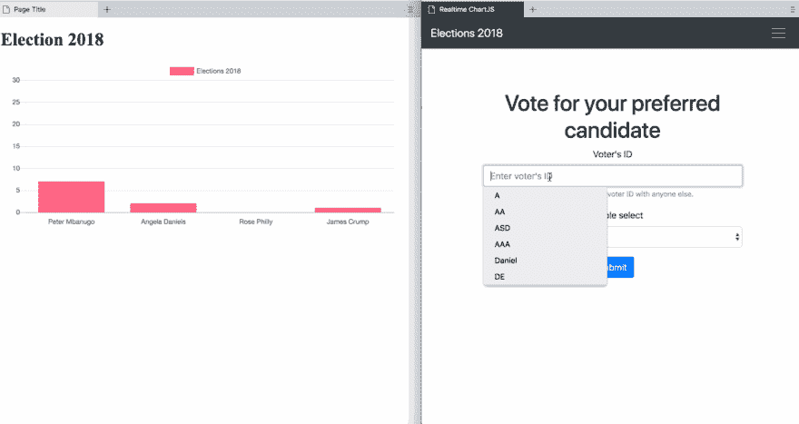
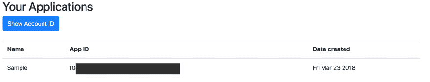

# JavaScript 中的实时图表与 ChartJS 和 Hamoni 同步

> 原文：<https://dev.to/pmbanugo/real-time-chart-in-javascript-with-chartjs-and-hamoni-sync-1nkb>

实时数据是在获取时显示的数据。它通常用于跟踪或监控系统，如交通 GPS 系统、拍卖/投标应用和股票交易应用。图表有助于数据的图形化表示，并帮助查看者轻松做出决定。

在这篇文章中，我将向你展示如何用 JavaScript 制作实时图表。我们将构建一个基本的投票 web 应用程序，其中包含一个投票页面，另一个页面包含一个显示投票结果的实时图表。这里有一个窥视我们将建立什么

[T2】](https://res.cloudinary.com/practicaldev/image/fetch/s--zHwHWzNh--/c_limit%2Cf_auto%2Cfl_progressive%2Cq_66%2Cw_880/https://d2mxuefqeaa7sj.cloudfront.net/s_271D2C4415082D830A5E129B885A0502958EA9373BF02DC765D6BC3010DA0C13_1523603994116_hamoni-chartjs.gif)

我将使用 [Chart.js](http://www.chartjs.org/) 和 [Hamoni Sync](https://www.hamoni.tech/) 来构建它。js 是一个简单的 JavaScript 图表库。Hamoni Sync 是一个实时状态同步服务，使您能够实时同步您的应用程序状态。投票结果是我们希望实时显示给用户的状态。Hamoni Sync 允许您定义应用程序的状态，同时避免围绕发布/订阅系统设计复杂的状态逻辑，从而使这一点变得更加容易。

# 设置代码

我们将使用一个项目模板，其中已经有 HTML 页面和节点应用程序来提供静态文件。按照下面的说明进行设置

1.  通过在命令行运行`git clone https://github.com/pmbanugo/realtime-chartjs-hamoni-starter.git`从 GitHub 克隆 repo。如果你没有使用 git，你可以在这里下载它。
2.  切换到项目目录`cd realtime-chartjs-hamoni-starter`
3.  通过运行`npm install`安装依赖项。这将安装[快速](https://expressjs.com/)和哈莫尼同步节点模块。#后端

**server.js** 文件包含在 **public** 文件夹中服务 HTML 页面的代码。第 9 - 14 行定义了投票应用程序的默认状态。它包含 4 名候选人，他们的票数为 0。

```
 let voteData = [
      { candidate: "Peter Mbanugo", vote: 0 },
      { candidate: "Angela Daniels", vote: 0 },
      { candidate: "Rose Philly", vote: 0 },
      { candidate: "James Crump", vote: 0 }
    ]; 
```

Enter fullscreen mode Exit fullscreen mode

它还为投票定义了一个 REST 端点，从第 18 行到第 30 行定义。当收到投票时，我们可能希望将数据保存到数据库中，然后用最新的投票结果更新图表。图表状态将使用 Hamoni Sync 实时传达。在第 40 行，我声明了一个初始化 Hamoni 的语句，但是我们需要一个帐户 ID 和应用程序 ID。

## 创建哈莫尼账号和 App

登录哈莫尼[仪表盘](https://dashboard.hamoni.tech/)(如果你还没有账户，也可以注册)。登录后，您可以点击`Show Account ID`按钮查看您的帐户 ID。我们需要一个 Hamoni 应用程序 ID，因此我们需要从仪表板创建一个应用程序。应用程序是一个可以保存应用程序状态的容器。您通常希望为您的每个应用程序安装一个单独的 Hamoni 应用程序。

在“创建应用程序”标题下，输入应用程序名称，然后单击“创建”按钮。几秒钟之内，您应该会看到它被创建并显示在应用程序列表部分。

[T2】](https://res.cloudinary.com/practicaldev/image/fetch/s--wxOo7MyY--/c_limit%2Cf_auto%2Cfl_progressive%2Cq_auto%2Cw_880/https://d2mxuefqeaa7sj.cloudfront.net/s_271D2C4415082D830A5E129B885A0502958EA9373BF02DC765D6BC3010DA0C13_1523552120862_Screen%2BShot%2B2018-04-12%2Bat%2B17.54.22.png)

复制应用程序和帐户 ID，并用 **server.js** 中第 40 行的字符串值替换它们

## 在 Hamoni 中创建应用状态

现在我们需要在 Hamoni Sync 中创建状态。为此，我们需要使用同步原语。同步原语是用来定义和操作状态的。它们基本上是一种对要存储的数据进行分类或区分的方式。有 3 种同步原语:

1.  **Value Primitive:** 这种状态保存用字符串、布尔或数字等数据类型表示的简单信息。它最适合于未读消息计数、切换等情况。
2.  **对象原语** **:** 对象状态表示可以被建模为 JavaScript 对象的状态。一个示例用途可以是存储游戏的分数。
3.  List 原语:它保存了一个状态对象列表。状态对象是 JavaScript 对象。您可以根据项目在列表中的索引来更新项目。

在这篇文章中，我将使用一个对象原语。

在 **server.js**
中添加以下函数

```
 function createState() {
      hamoni
        .createObject("election", voteData)
        .then(statePrimitive => {
          console.log("election state created");
          state = statePrimitive;
        })
        .catch(console.log);
    } 
```

Enter fullscreen mode Exit fullscreen mode

这将使用变量`voteData`创建一个名为`election`的状态和状态值。然后我们需要连接到 Hamoni 同步服务器。我们通过调用`hamoni.connect()`来做到这一点。在函数`createState()`
下面添加以下代码

```
 hamoni.connect().then(() => createState()).catch(console.log); 
```

Enter fullscreen mode Exit fullscreen mode

如果它成功地连接到服务器，我们调用`createState()`函数来为我们的图表创建状态。

## 更新应用状态

我们希望在新的投票到来时更新状态。保存我们状态的对象原语有一个`update()`方法，可以用来更新状态。当用户调用我们 API 的`/vote`端点时，我们将更新*选举*状态。在第 27 行下面，添加以下代码来更新状态

```
 app.post("/vote", function(req, res) {
      ....
      state.update(voteData);
      ....
    }); 
```

Enter fullscreen mode Exit fullscreen mode

这将更新状态并将更新广播到连接的客户端。

# 前端

我们的后端已经准备好接受投票并更新状态。现在我们需要建立前端发送投票和显示实时图表。

我们在开始时克隆的 starter 模板有文件 **public/vote.html** 和 **public/js/vote.js.** 这些文件已经包含了在网页中显示表单的代码和发送到服务器的 javascript。我在这里跳过了编写这段代码，因为它是一个基本的 HTML 表单和将表单数据发送到服务器的 JavaScript。如果有任何令人困惑的地方，请留下评论。

该图表将显示在**index.html**的公共文件夹内。【index.html 已经包含 Chart.js 和 Hamoni Sync 的脚本标签(见第 17 和 18 行)

```
 <script src="https://cdnjs.cloudflare.com/ajax/libs/Chart.js/2.7.2/Chart.min.js"></script>
    <script src="https://unpkg.com/hamoni-sync@0.2.0/hamoni.dev.js"></script> 
```

Enter fullscreen mode Exit fullscreen mode

## 渲染图表

打开文件 **public/index.js.** 添加下面的函数在网页中渲染图表。

```
 function renderChart(state) {
      var ctx = document.getElementById("myChart").getContext("2d");
      var chart = new Chart(ctx, {
        // The type of chart we want to create
        type: "bar",
        // The data for our dataset
        data: {
          labels: state.map(s => s.candidate),
          datasets: [
            {
              label: "Elections 2018",
              backgroundColor: "rgb(255, 99, 132)",
              borderColor: "rgb(255, 99, 132)",
              data: state.map(s => s.vote)
            }
          ]
        },
        // Configuration options go here
        options: {
          scales: {
            xAxes: [
              {
                time: {
                  unit: "Vote"
                },
                gridLines: {
                  display: false
                },
                ticks: {
                  maxTicksLimit: 6
                }
              }
            ],
            yAxes: [
              {
                ticks: {
                  min: 0,
                  max: 30,
                  maxTicksLimit: 10
                },
                gridLines: {
                  display: true
                }
              }
            ]
          },
          legend: {
            display: true
          }
        }
      });
    } 
```

Enter fullscreen mode Exit fullscreen mode

这个函数接受一个代表图表状态的参数。type 选项指定了我们想要呈现的图表类型，在本例中是一个条形图。数据选项定义用于显示图表数据的属性。我想让你们注意两个重要的特性。首先是第 8 行的标签属性，`labels: state.map(s => s.candidate)`
它从 state 中获取其值。图表状态是每个选举候选人及其投票的数组。使用这些代码，我们将候选人的名字设置为图表的标签。第二个是 14 号线的`data: state.map( s => s.vote)`。它为图表设置数据。

现在我们需要检索图表状态并呈现图表。

## 获取状态和状态更新

为了检索图表状态，我们需要连接到 Hamoni Sync。添加以下代码以获取状态和状态更新，然后基于此呈现图表:

```
let hamoni = new Hamoni("Account_ID", "APP_ID");
hamoni
  .connect()
  .then(response => {
    hamoni
      .get("election")
      .then(statePrimitive => {
        renderChart(statePrimitive.get());

        statePrimitive.onUpdated(state => renderChart(state));
      })
      .catch(console.log);
  })
  .catch(error => console.log(error)); 
```

Enter fullscreen mode Exit fullscreen mode

如果客户端成功连接到 Hamoni Sync，我们调用`hamoni.get("election")`来获取我们的选举状态。如果成功，我们用状态值调用`renderCharts()`。

为了得到状态更新的通知，我们用一个回调函数调用 state 原语上的`onUpdated()`,每次有更新时都应该执行这个回调函数。

现在我们可以测试我们的代码，看看它的工作情况。打开命令行并运行`npm start`，然后打开浏览器并导航到 [localhost:5000](http://localhost:5000) 。

[T2】](https://res.cloudinary.com/practicaldev/image/fetch/s--DfZG2V31--/c_limit%2Cf_auto%2Cfl_progressive%2Cq_66%2Cw_880/https://d2mxuefqeaa7sj.cloudfront.net/s_271D2C4415082D830A5E129B885A0502958EA9373BF02DC765D6BC3010DA0C13_1523604009149_hamoni-chartjs.gif)

瞧啊。！🚀

更轻松地制作实时图表状态。Chart.js 很好用。Hamoni Sync 减少了围绕发布/订阅系统设计复杂状态逻辑的开发时间和工作量，因为它包含了状态的概念。

你可以在 [GitHub](https://github.com/pmbanugo/realtime-chartjs-hamoni) 上获得完成的源代码。

# 链接

*   [Hamoni Sync](https://www.hamoni.tech/)
*   [Chart.js](http://www.chartjs.org/docs/latest/)
*   [快递](http://expressjs.com/)