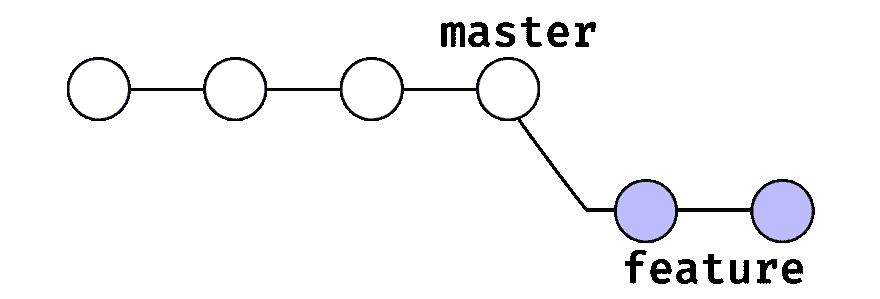
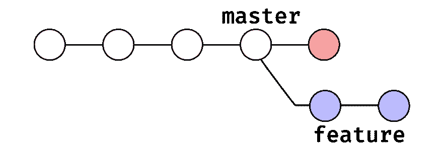
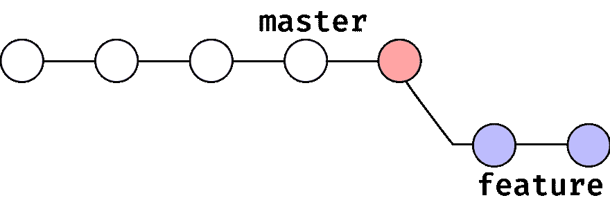
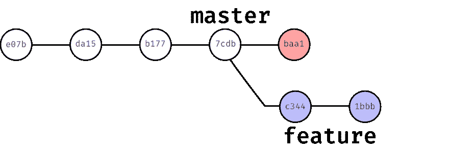
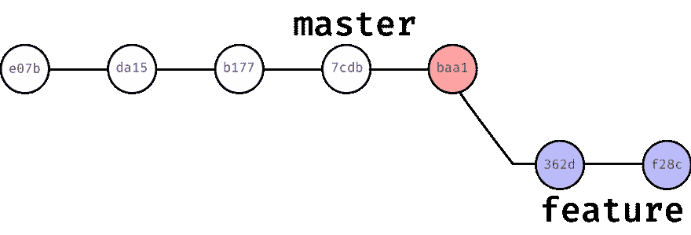
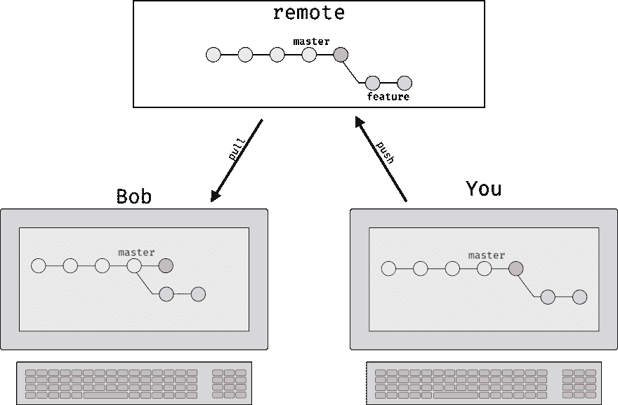

# 面向未来！

> 原文：<https://dev.to/konrad_126/rebase-to-the-future-13j9>

虽然 *rebase* 本身并不是一个复杂的概念，但是很多人理解起来有困难。

我相信这主要是因为新接触 git 的人推迟了或者从来没有学习 rebase 命令，因为他们被所有其他使用 git 所必需的东西淹没了。事实上，他们不断听到 rebase 是一个危险的命令，使他们不断推迟它的学习。

因此，如果这也适用于您，请和我一起学习 git rebase 如何在一个简单的例子中工作。

* * *

假设您在项目的`master`分支上(我们将只显示最后 4 个提交):

[T2】](https://res.cloudinary.com/practicaldev/image/fetch/s--idCsviaN--/c_limit%2Cf_auto%2Cfl_progressive%2Cq_auto%2Cw_880/https://thepracticaldev.s3.amazonaws.com/i/8traaniaq5h361gvjaud.png)

现在你想在一个不同的分支上开发一些很酷的新特性，所以你用`git checkout -b feature`创建一个分支并提交两次。现在你的`master`和`feature`分支看起来像这样:

[T2】](https://res.cloudinary.com/practicaldev/image/fetch/s--nJNzMMYR--/c_limit%2Cf_auto%2Cfl_progressive%2Cq_auto%2Cw_880/https://thepracticaldev.s3.amazonaws.com/i/t62c0inaqpnd101cgptu.png)

但是现在有人报告您的应用程序有一个 bug，您迅速切换到`master`分支来找到并修复这个 bug。过一段时间后，您就可以修复它并推动(和部署)变更。一切又恢复正常，你可以回到你的`feature`分店了。

[T2】](https://res.cloudinary.com/practicaldev/image/fetch/s--ADTYIehE--/c_limit%2Cf_auto%2Cfl_progressive%2Cq_auto%2Cw_880/https://thepracticaldev.s3.amazonaws.com/i/ge9rm07wya4qegb7jugt.png)

但是现在你意识到你有一个小问题。您的`feature`分支仍然有您在`master`分支上修复的相同的错误，您意识到该错误也会影响您在`feature`分支上的新代码，因此您需要将那些错误修复的变更(提交)合并到您的`feature`分支中。但是怎么做呢？嗯，有一些方法可以实现这一点，但是最好的方法是像 Doc 和 Marty 那样回到过去，在制作`feature`分支之前进行错误修复。这样，包含错误修复代码的提交将包含在`feature`分支中(一旦你回到未来)。事实证明你可以做到。我的意思是，不是回到过去，而是改变历史。你可以用 rebase 命令来完成。所以，如果你在你的`feature`分支上，你做了:

```
git rebase master 
```

Enter fullscreen mode Exit fullscreen mode

这是你的树枝之后的样子:

[T2】](https://res.cloudinary.com/practicaldev/image/fetch/s--z85ao_ba--/c_limit%2Cf_auto%2Cfl_progressive%2Cq_auto%2Cw_880/https://thepracticaldev.s3.amazonaws.com/i/mhlbpwgznzgw2wemgma6.png)

如你所见，`feature`分支的历史已经改变。如果有人现在查看它，他/她会认为您在提交 bug 修复后创建(签出)了您的`feature`分支。

* * *

这很棒，对吧？为什么不一直使用它呢？嗯，有一个条件。还记得当博士和马蒂回到未来时，情况有所不同吗？嗯，git rebase 也会发生这种情况，但是不要担心，您的代码将保持不变，只有您的`feature`分支上提交的校验和会发生变化。这些校验和是什么？好吧，你可能注意到了 40 字符长的字符串，当你做`git log` :
的时候，你会在每次提交时看到这个字符串

```
commit f5cad47722bc98419fe5037753f5bbe29d3917c4
Author: John Doe <john@doe.com>
Date:   Mon Apr 23 11:49:07 2018 +0200

Did some stuff:) 
```

Enter fullscreen mode Exit fullscreen mode

那就是*校验和*。你可以认为校验和是提交的唯一标识符，因为 git 生成它们的方式(你可以查看我在 git 的[数据模型](https://hackernoon.com/https-medium-com-zspajich-understanding-git-data-model-95eb16cc99f5)上的博客文章以获得更多信息)，它们在我们的`feature`分支上在 rebase 之后改变。

因此，如果提交在重置之前有这些校验和:
[](https://res.cloudinary.com/practicaldev/image/fetch/s--_8SD12Ud--/c_limit%2Cf_auto%2Cfl_progressive%2Cq_auto%2Cw_880/https://thepracticaldev.s3.amazonaws.com/i/dmw3ja93wua991hvjv6f.png)

然后，在重置基础之后，`feature`分支上的校验和会发生变化:
[](https://res.cloudinary.com/practicaldev/image/fetch/s--B0UldXlr--/c_limit%2Cf_auto%2Cfl_progressive%2Cq_auto%2Cw_880/https://thepracticaldev.s3.amazonaws.com/i/nse4xau2mge7jifxolyn.png)

这就是为什么你一直听到 git rebase 是一个*危险的*命令。因为它改变了历史，你应该谨慎使用。

但是到底为什么这个**危险**以及什么时候危险？好吧，假设你不是唯一一个在`feature`分支工作的人，但是有更多的人对它进行改变。现在你做你的 rebase 和(强制)推动改变到`feature`遥控器。现在，当你的同事 Bob 试图从远程`feature`中拉出时，一切都爆炸了，因为他的本地版本的`feature`分支与远程版本有不同的历史。

[](https://res.cloudinary.com/practicaldev/image/fetch/s--UI6ON4LE--/c_limit%2Cf_auto%2Cfl_progressive%2Cq_auto%2Cw_880/https://thepracticaldev.s3.amazonaws.com/i/yp1wetiyj9ivm9zvp6tr.png) 
好吧，所以鲍勃的电脑实际上不会爆炸，但他没有什么好办法来修复这种情况。因此，作为一个通用的经验法则，如果您正在一个公共分支上工作(其他人正在从中拉取变更)，您将不会在那个分支上做一个 rebase。另一方面，如果您正在处理您的本地分支，并且还没有将它推送到远程服务器，或者您已经推送到远程服务器了，但是仍然只有您在处理那个分支(您必须确定这一点)，那么您可以对它进行重新排序。