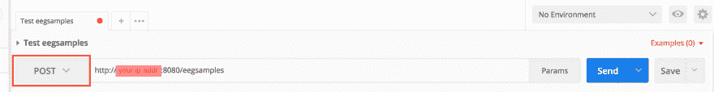

# 用 NodeJS API 记录脑电波- Mongo 数据库

> 原文：<https://dev.to/ladvien/recording-brain-waves-mongo-database-with-a-nodejs-api-5h50>

# 通过节点 REST API 将脑电波保存到远程 MongoDB

在这一节中，我将重点介绍如何使用 MongoDB 和 NodeJS 设置远程 Linux 服务器。这将允许我们向我们的 Linux 服务器发出 POST 请求，保存 EEG 数据。

对于本指南，我将假设你能够 SSH 到你的 Ubuntu 16 LTS 服务器。你没有服务器？没问题。我写了一篇关于建立博客的指南，解释了如何获得一个便宜的 Linux 服务器设置。

*   [在 Linode 上设置 Nginx](https://ladvien.com/creating-jekyll-website/)

## 1。安装 MongoDB

SSH 到您的服务器。我假设这是一个全新 Linux 安装程序。让我们从升级软件包开始。

```
sudo apt-get update -y 
```

Enter fullscreen mode Exit fullscreen mode

我会在 Mongo 网站上寻找在 Ubuntu 上安装 MonogoDB 社区版的指导。

*   [在 Ubuntu 上安装 MongoDB](https://docs.mongodb.com/manual/tutorial/install-mongodb-on-ubuntu/)

让我们开始吧。添加 Debian 包密钥。

```
sudo apt-key adv --keyserver hkp://keyserver.ubuntu.com:80 --recv 9DA31620334BD75D9DCB49F368818C72E52529D4 
```

Enter fullscreen mode Exit fullscreen mode

我们需要创建一个列表文件。

```
echo "deb [ arch=amd64,arm64 ] https://repo.mongodb.org/apt/ubuntu xenial/mongodb-org/4.0 multiverse" | sudo tee /etc/apt/sources.list.d/mongodb-org-4.0.list 
```

Enter fullscreen mode Exit fullscreen mode

现在重新加载数据库

```
sudo apt-get update 
```

Enter fullscreen mode Exit fullscreen mode

如果您尝试更新并遇到此错误

```
E: The method driver /usr/lib/apt/methods/https could not be found.
N: Is the package apt-transport-https installed?
E: Failed to fetch https://repo.mongodb.org/apt/ubuntu/dists/xenial/mongodb-org/4.0/InRelease  
E: Some index files failed to download. They have been ignored, or old ones used instead. 
```

Enter fullscreen mode Exit fullscreen mode

然后安装`apt-transport-https`

```
sudo apt-get install apt-transport-https 
```

Enter fullscreen mode Exit fullscreen mode

现在，让我们安装 MongoDB。

```
sudo apt-get install -y mongodb-org 
```

Enter fullscreen mode Exit fullscreen mode

*看！*

## 2。设置 MongoDB

我们仍然需要做一些设置。首先，让我们检查并确保 Mongo 已完全安装。

```
sudo service mongod start 
```

Enter fullscreen mode Exit fullscreen mode

这将启动 MongoDB 守护进程，该程序在后台运行，等待有人与数据库建立连接。

说到这里，让我们试着连接数据库

```
mongo 
```

Enter fullscreen mode Exit fullscreen mode

您应该得到以下内容:

```
root@localhost:~# mongo
MongoDB shell version v4.0.2
connecting to: mongodb://127.0.0.1:27017
MongoDB server version: 4.0.2
Welcome to the MongoDB shell.
For interactive help, type "help".
For more comprehensive documentation, see
    http://docs.mongodb.org/
Questions? Try the support group
    http://groups.google.com/group/mongodb-user
Server has startup warnings:
2018-09-02T03:52:18.996+0000 I STORAGE  [initandlisten]
2018-09-02T03:52:18.996+0000 I STORAGE  [initandlisten] ** WARNING: Using the XFS filesystem is strongly recommended with the WiredTiger storage engine
2018-09-02T03:52:18.996+0000 I STORAGE  [initandlisten] **        See http://dochub.mongodb.org/core/prodnotes-filesystem
2018-09-02T03:52:19.820+0000 I CONTROL  [initandlisten]
2018-09-02T03:52:19.820+0000 I CONTROL  [initandlisten] ** WARNING: Access control is not enabled for the database.
2018-09-02T03:52:19.820+0000 I CONTROL  [initandlisten] **        Read and write access to data and configuration is unrestricted.
2018-09-02T03:52:19.820+0000 I CONTROL  [initandlisten]
---
Enable MongoDB's free cloud-based monitoring service, which will then receive and display
metrics about your deployment (disk utilization, CPU, operation statistics, etc).

The monitoring data will be available on a MongoDB website with a unique URL accessible to you
and anyone you share the URL with. MongoDB may use this information to make product
improvements and to suggest MongoDB products and deployment options to you.

To enable free monitoring, run the following command: db.enableFreeMonitoring()
To permanently disable this reminder, run the following command: db.disableFreeMonitoring()
---
> 
```

Enter fullscreen mode Exit fullscreen mode

这很好。这意味着 Mongo 已经开始运行了。注意，它正在监听`127.0.0.1:27017`。如果您试图从任何网络访问数据库，除了本地，它将拒绝。让 NodeJS 本地连接到 MongoDB 数据库的计划。然后，将我们所有的数据发送到节点，让它处理安全。

在 Mongo 命令行中键入:

```
quit() 
```

Enter fullscreen mode Exit fullscreen mode

然后回车。这应该会将您带回 Linux 命令提示符。

关于 Ubuntu 上`MongoDB`的几点说明？

*   配置文件位于`/etc/mongod.conf`
*   日志文件位于`/var/log/mongodb/mongod.log`
*   数据库存储在`/var/lib/mongodb`，但是可以在配置文件中更改。

哦，还有最后一点。仍然在 Linux 命令提示符下键入:

```
sudo systemctl enable mongod 
```

Enter fullscreen mode Exit fullscreen mode

你应该回去了

```
Created symlink from /etc/systemd/system/multi-user.target.wants/mongod.service to /lib/systemd/system/mongod.service. 
```

Enter fullscreen mode Exit fullscreen mode

这将设置一个符号链接，使得 Linux 每次启动时都加载 mongod 你不需要手动启动它。

接下来，NodeJS。

## 3。安装 NodeJS 和 npm

类型

```
sudo apt-get install nodejs -y 
```

Enter fullscreen mode Exit fullscreen mode

这应该会安装`NodeJS`，但是我们还需要节点包管理器`npm`。

```
sudo apt-get install npm -y 
```

Enter fullscreen mode Exit fullscreen mode

让我们升级`npm`。这一点很重要，因为`mind-wave-journal-server`依赖于几个包的最新版本，而这些包对于早期版本的`npm`是不可访问的。

以下命令应该为升级准备好`npm`，然后升级。

```
sudo npm cache clean -f
sudo npm install -g n
sudo n stable
sudo n latest 
```

Enter fullscreen mode Exit fullscreen mode

让我们重新启动服务器，以确保所有升级都已就绪。

```
sudo reboot now 
```

Enter fullscreen mode Exit fullscreen mode

当服务器重新启动时，`ssh`返回。

检查并确保您的`mongod`仍在运行

```
mongo 
```

Enter fullscreen mode Exit fullscreen mode

如果`mongo`没有开始，那么重新进行第 2 步。

让我们检查一下我们的`node`和`npm`版本。

```
node -v 
```

Enter fullscreen mode Exit fullscreen mode

我运行的是`node` v10.9.0

```
npm -v 
```

Enter fullscreen mode Exit fullscreen mode

我运行的是 6.2.0 版本

## 4。克隆、安装和运行意识波期刊服务器

我已经创建了一个基本的节点项目，我们可以从我的 Github 帐户中获取。

如果您还没有安装 git，现在就安装吧。

```
sudo apt-get install git -y 
```

Enter fullscreen mode Exit fullscreen mode

现在，获取我构建的 Noder 服务器。

```
git clone https://github.com/Ladvien/mind-wave-journal-server.git
cd mind-wave-journal-server/ 
```

Enter fullscreen mode Exit fullscreen mode

安装所有需要的节点包。

```
npm install 
```

Enter fullscreen mode Exit fullscreen mode

这应该下载了运行我编写的将 EEG 数据存储到 Mongo 数据库的小服务器程序所需的所有包。

让我们运行`mind-wave-journal-server`。

```
node server/server.js 
```

Enter fullscreen mode Exit fullscreen mode

这后面应该跟有:

```
root@localhost:~/mind-wave-journal-server# node server/server.js
(node:1443) DeprecationWarning: current URL string parser is deprecated, and will be removed in a future version. To use the new parser, pass option { useNewUrlParser: true } to MongoClient.connect.
Started on port 8080 
```

Enter fullscreen mode Exit fullscreen mode

## 5。用邮递员测试意识波日志服务器

现在，我们将使用 Postman 来测试我们的新 API。

在接下来的部分，你要么需要一个 Mac，要么需要一个 Chrome，因为 Postman 有一个原生的 Mac 应用程序或 Chrome 应用程序。

我将展示 Chrome 应用程序。

前往 Chrome 应用商店:

*   [邮差 Chrome App](https://chrome.google.com/webstore/detail/postman/fhbjgbiflinjbdggehcddcbncdddomop?hl=en)

[T2】](https://res.cloudinary.com/practicaldev/image/fetch/s--ha86Edty--/c_limit%2Cf_auto%2Cfl_progressive%2Cq_auto%2Cw_880/https://ladvien.cimg/postman-1.png)

添加完 Postman 应用程序后，它会将你重定向到 Chrome 应用程序。点击邮递员图标。

[T2】](https://res.cloudinary.com/practicaldev/image/fetch/s--uFkOisIC--/c_limit%2Cf_auto%2Cfl_progressive%2Cq_auto%2Cw_880/https://ladvien.cimg/postman-2.png)

你的选择，但我现在跳过了注册选项。

[T2】](https://res.cloudinary.com/practicaldev/image/fetch/s--hVwTmNAm--/c_limit%2Cf_auto%2Cfl_progressive%2Cq_auto%2Cw_880/https://ladvien.cimg/postman-3.png)

选择`Create a Request`
[](https://res.cloudinary.com/practicaldev/image/fetch/s--oTS1jgSA--/c_limit%2Cf_auto%2Cfl_progressive%2Cq_auto%2Cw_880/https://ladvien.cimg/postman-4.png)

简单地说，Postman 的目的是，我们将使用它来创建 POST 请求，并将它们发送到`mind-wave-journal-server`以确保它为 iOS 应用程序开始发出 POST 请求做好准备，将 EEG 数据保存到我们的 Mongo 服务器。

让我们创建第一个测试 POST 请求。从命名请求`Test eegsamples`开始。创建一个文件夹来存放新请求，我将其命名为`mind-wave-journal-server`。然后点击

[T2】](https://res.cloudinary.com/practicaldev/image/fetch/s--Uc7dJls2--/c_limit%2Cf_auto%2Cfl_progressive%2Cq_auto%2Cw_880/https://ladvien.cimg/postman-5.png)

您需要将类型设置为`POST`。网址将会是

```
http://your_ip_address:8080/eegsamples 
```

Enter fullscreen mode Exit fullscreen mode

[T2】](https://res.cloudinary.com/practicaldev/image/fetch/s--hhJEsKla--/c_limit%2Cf_auto%2Cfl_progressive%2Cq_auto%2Cw_880/https://ladvien.cimg/postman-6.png)

否。选择`Headers`部分并添加`Content Type: application/json`

[T2】](https://res.cloudinary.com/practicaldev/image/fetch/s--Qk0aNPG6--/c_limit%2Cf_auto%2Cfl_progressive%2Cq_auto%2Cw_880/https://ladvien.cimg/postman-7.png)

最后，选择`Body`，然后选择`raw`，在文本区输入以下 JSON:

```
{  "highBeta":5,  "lowGamma":6,  "theta":55,  "lowAlpha":2,  "highAlpha":3,  "lowBeta":4,  "highGamma":7,  "blink":55,  "attention":8,  "meditation":9,  "time":4  } 
```

Enter fullscreen mode Exit fullscreen mode

然后！点击`Send`

[T2】](https://res.cloudinary.com/practicaldev/image/fetch/s--4Qul8fmd--/c_limit%2Cf_auto%2Cfl_progressive%2Cq_auto%2Cw_880/https://ladvien.cimg/postman-8.png)

如果一切顺利，那么您应该在 Postman response 部分得到类似的响应

[T2】](https://res.cloudinary.com/practicaldev/image/fetch/s--gYv_Alqt--/c_limit%2Cf_auto%2Cfl_progressive%2Cq_auto%2Cw_880/https://ladvien.cimg/postman-9.png)

注意，响应与我们发送的相似。但是，还有附加的`_id`。这太棒了。它是输入数据时 MongoDB 分配给的 id。简而言之，这意味着它成功地保存到数据库中。

## 6。现在怎么办？

几个警告。

首先，每次重启服务器时，你都需要手动启动`mind-waver-journal-server`。你可以把它变成一个 Linux 服务并`enable`它。如果有人对此感兴趣，请在评论中告诉我，我会补充的。

其次，请注意，我目前无法从 MongDB 中检索数据。最简单的方法可能是使用机器人 3T。像第一个警告，如果有人感兴趣，让我知道，我会添加说明。否则，本系列将继续设置 Mongo BI 到数据库的连接，以便在 Tableau 中查看(呃，真恶心)。

iOS 应用程序可以调用您的节点服务器。在下一篇文章中，我将回到在 iOS 中构建 MindWaveJournal 应用程序。