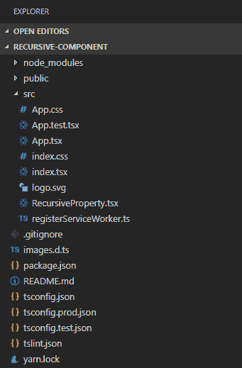
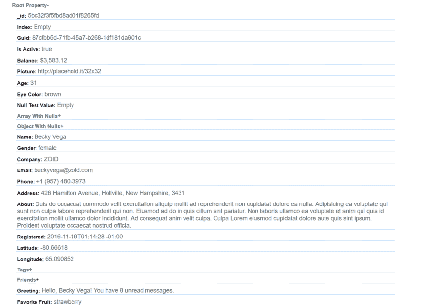

# React 中的递归渲染:构建通用 JSON 渲染器

> 原文：<https://dev.to/baso53/recursive-rendering-in-react-building-a-universal-json-renderer-f59>

在过去的一年里，我一直在与 React 广泛合作，这既是为了工作，也是为了我自己的满意。我偶然发现了一些非常有趣的模式，但我从未见过递归被用于呈现 React 组件。如果你接受过任何形式的计算机科学教育，你可能在很早的时候就知道什么是递归。递归所做的，本质上，是调用与当前完全相同的函数，直到参数是我们定义的一些基本情况。

最近，我有一个任务，创建一个 React 组件，它将呈现一些通过 API 获得的 JSON。如果你是一名 web 开发人员，你可能意识到你永远无法 100%确定一个 API 将返回什么，如果你不认为是这样，我建议你考虑一下，也许你会改变主意。网络并不是静态的。在本文中，我们将假设一件事，API 将总是返回某种 JSON(或者什么也不返回)。

我需要呈现的 JSON 是一个丑陋的嵌套 JSON，有多个层次。你永远不知道这些层是否会被填充，它们是一个空数组还是 null，等等。天真的方法是为每个层次级别创建一个组件，经过几分钟的“哦，不要再来了”的思考，我有了一个递归渲染这些级别的想法，令人兴奋！作为一名计算机程序员，我非常喜欢递归和解决这类问题的有趣方法。

[T2】](https://res.cloudinary.com/practicaldev/image/fetch/s--XQdkRfjv--/c_limit%2Cf_auto%2Cfl_progressive%2Cq_auto%2Cw_880/https://imgs.xkcd.com/comics/the_general_problem.png)

## 创建**组件**

 **我们将要测试的虚拟 JSON 是由 [JSON 生成器](https://www.json-generator.com/)生成的。如您所见，它有空值、空数组、空对象、空值数组和空值对象。我们的最大深度是 4 层。

```
const testJson = {
  "_id": "5bc32f3f5fbd8ad01f8265fd",
  "index": 0,
  "guid": "87cfbb5d-71fb-45a7-b268-1df181da901c",
  "isActive": true,
  "balance": "$3,583.12",
  "picture": "http://placehold.it/32x32",
  "age": 31,
  "eyeColor": "brown",
  "nullTestValue": null,
  "arrayWithNulls": [null, null, null],
  "objectWithNulls": {
     "firstNullValue": null,
     "secondNullValue": null     
  },
  "name": "Becky Vega",
  "gender": "female",
  "company": "ZOID",
  "email": "beckyvega@zoid.com",
  "phone": "+1 (957) 480-3973",
  "address": "426 Hamilton Avenue, Holtville, New Hampshire, 3431",
  "about": "Duis do occaecat commodo velit exercitation aliquip mollit ad reprehenderit non cupidatat dolore ea nulla. Adipisicing ea voluptate qui sunt non culpa labore reprehenderit qui non. Eiusmod ad do in quis cillum sint pariatur. Non laboris ullamco ea voluptate et anim qui quis id exercitation mollit ullamco dolor incididunt. Ad consequat anim velit culpa. Culpa Lorem eiusmod cupidatat dolore aute quis sint ipsum. Proident voluptate occaecat nostrud officia.\r\n",
  "registered": "2016-11-19T01:14:28 -01:00",
  "latitude": -80.66618,
  "longitude": 65.090852,
  "tags": [
    "ea",
    "officia",
    "fugiat",
    "anim",
    "consequat",
    "incididunt",
    "est"
  ],
  "friends": [
    {
      "id": 0,
      "name": "Genevieve Cooke",
      "ownFriends": {
         "1": "Rebbeca",
         "2": "Julia",
         "3": "Chopper only"
      },
    },
    {
      "id": 1,
      "name": "Eaton Buck"
    },
    {
      "id": 2,
      "name": "Darla Cash"
    }
  ],
  "greeting": "Hello, Becky Vega! You have 8 unread messages.",
  "favoriteFruit": "strawberry"
} 
```

Enter fullscreen mode Exit fullscreen mode

我们先用 TypeScript ( *创建一个新的 React 项目，因为谁不喜欢静态类型呢？*)。

```
yarn create react-app recursive-component --scripts-version=react-scripts-ts 
```

Enter fullscreen mode Exit fullscreen mode

接下来，我们可以创建一个新的 React 组件来呈现 JSON。我们可以称之为 **RecursiveProperty** 。原因是，当它到达基本情况时，它将呈现单个 JSON 属性及其值。

我们的组件和文件结构如下所示。

```
import * as React from 'react';

interface IterableObject {
  [s: number]: number | string | boolean | IterableObject;
}

interface Props {
  property: number | string | boolean | IterableObject;
  propertyName: string;
  rootProperty?: boolean;
  excludeBottomBorder: boolean;
}

const RecursiveProperty: React.SFC<Props> = props => {

  return(
    <div>Our future component</div>
  );
}

export default RecursiveProperty; 
```

Enter fullscreen mode Exit fullscreen mode

[T2】](https://res.cloudinary.com/practicaldev/image/fetch/s--Ycf5Z_7I--/c_limit%2Cf_auto%2Cfl_progressive%2Cq_auto%2Cw_880/https://thepracticaldev.s3.amazonaws.com/i/k4rckll2z8zlczsw2u90.png)

我们现在可以在 App.tsx.
中呈现这个组件

```
import * as React from 'react';
import './App.css';

import logo from './logo.svg';
import RecursiveProperty from './RecursiveProperty';

class App extends React.Component {
  public render() {
    return (
      <div className="App">
        <header className="App-header">
          
          <h1 className="App-title">Welcome to React</h1>
        </header>
        <div className="App-intro">
          <RecursiveProperty property={testJson} propertyName="Root Property" excludeBottomBorder={false} rootProperty={true}/>
        </div>
      </div>
    );
  }
}

export default App;

const testJson = ... 
```

Enter fullscreen mode Exit fullscreen mode

我将`App.css`中的`text-align: center`移除，并将`margin: 0 auto`和`width: 60%`添加到`.App-intro`类中，以更好地将我们的列表居中。

接下来，我们需要写出我们的条件。组件必须检查属性是否是一个叶子(层次结构树中的最后一个节点)。如果是，它将呈现属性名及其值。如果没有，它将再次递归调用组件，并将下一个层次结构级别作为属性传递。

我们将为每个属性创建一个容器，这样我们就可以添加一些样式(使用样式组件)。容器将有一个左边距设置，这样每一个层次都比前一个层次多缩进一点。

在这种情况下，我们将只尝试呈现树叶的属性。对于我们的 JSON，它将只呈现“它不是一片叶子”，因为 JSON 文档的根是一个 iterable 对象，我们将在后面处理它。我们知道树叶必须始终是三种基本 JSON 类型之一- *布尔*、*字符串*或*数字*。

```
import * as React from 'react';
import styled from 'styled-components';

interface IterableObject {
  [s: string]: number | string | boolean | IterableObject;
}

interface Props {
  property: number | string | boolean | IterableObject;
  propertyName: string;
  rootProperty?: boolean;
  excludeBottomBorder: boolean;
}

const RecursivePropertyContainer = styled.div`
  padding-top: 10px;
  padding-left: 3px;
  margin-left: 10px; ${(props: { excludeBottomBorder: boolean }) =>
    props.excludeBottomBorder ? '' : 'border-bottom: 1px solid #b2d6ff;'}
  color: #666;    
  font-size: 16px;
`;

export const PropertyName = styled.span`
  color: black;
  font-size: 14px;
  font-weight: bold;
`;

const RecursiveProperty: React.SFC<Props> = props => {
  return (
    <RecursivePropertyContainer excludeBottomBorder={props.excludeBottomBorder}>
      {props.property ? (
        typeof props.property === 'number' ||
        typeof props.property === 'string' ||
        typeof props.property === 'boolean' ? (
          <React.Fragment>
            <PropertyName>{camelCaseToNormal(props.propertyName)}: </PropertyName>
            {props.property.toString()}
          </React.Fragment>
        ) : (
          "It isn't a leaf"
        )
      ) : (
        'Property is empty'
      )}
    </RecursivePropertyContainer>
  );
};

const camelCaseToNormal = (str: string) => str.replace(/([A-Z])/g, ' $1').replace(/^./, str2 => str2.toUpperCase());

export default RecursiveProperty; 
```

Enter fullscreen mode Exit fullscreen mode

方法是不言自明的，它将 camel case 文本转换成带有空格的普通文本。

接下来，我们需要在下一层再次递归调用组件。我们有两种方式来表示 JSON 中的数据列表——一个对象数组，或者一个带有键/值对的可迭代对象。对于这两种情况，我们都需要将属性映射到一个新的 RecursiveProperty。

如果我们有一个 iterable 对象，我们将使用 Object.values()方法来获得一个值数组(这是一个 ES7 方法，所以一定要将其包含在 *tsconfig.json* 的 lib 属性中)。为了将属性名传递给孩子，我们将使用 Object.getOwnPropertyNames()方法。它返回一个属性名数组，我们可以使用。map()方法。这个方法的伟大之处在于它还可以处理数组，返回索引而不是属性键。

我们的组件 return()现在看起来像这样。

```
return (
  <RecursivePropertyContainer excludeBottomBorder={props.excludeBottomBorder}>
    {props.property ? (
      typeof props.property === 'number' ||
      typeof props.property === 'string' ||
      typeof props.property === 'boolean' ? (
        <React.Fragment>
          <PropertyName>{camelCaseToNormal(props.propertyName)}: </PropertyName>
          {props.property.toString()}
        </React.Fragment>
      ) : (
        Object.values(props.property).map((property, index, { length }) => (
          <RecursiveProperty
            key={index}
            property={property}
            propertyName={Object.getOwnPropertyNames(props.property)[index]}
            excludeBottomBorder={index === length - 1}
          />
        ))
      )
    ) : (
      'Property is empty'
    )}
  </RecursivePropertyContainer>
); 
```

Enter fullscreen mode Exit fullscreen mode

现在，如果我们可以折叠和展开嵌套对象，并且只显示初始渲染的叶值，那就太好了。

我们可以为其创建一个名为 **ExpandableProperty** 的新组件。

```
import * as React from 'react';
import styled from 'styled-components';

export const PropertyName = styled.div`
  color: #008080;
  font-size: 14px;
  font-weight: bold;
  cursor: pointer;
`;

interface Props {
  title: string;
  expanded?: boolean;
}

interface State {
  isOpen: boolean;
}

export default class ExpandableProperty extends React.Component<Props, State> {
  state = {
    isOpen: !!this.props.expanded
  };

  render() {
    return (
      <React.Fragment>
        <PropertyName onClick={() => this.setState({ isOpen: !this.state.isOpen })}>
          {this.props.title}
          {this.state.isOpen ? '-' : '+'}
        </PropertyName>
        {this.state.isOpen ? this.props.children : null}
        {React.Children.count(this.props.children) === 0 && this.state.isOpen ? 'The list is empty!' : null}
      </React.Fragment>
    );
  }
} 
```

Enter fullscreen mode Exit fullscreen mode

我们现在可以包装我们的。map()方法，以便在需要时可以扩展它。

```
return (
  <RecursivePropertyContainer excludeBottomBorder={props.excludeBottomBorder}>
    {props.property ? (
      typeof props.property === 'number' ||
      typeof props.property === 'string' ||
      typeof props.property === 'boolean' ? (
        <React.Fragment>
          <PropertyName>{camelCaseToNormal(props.propertyName)}: </PropertyName>
          {props.property.toString()}
        </React.Fragment>
      ) : (
        <ExpandableProperty title={camelCaseToNormal(props.propertyName)} expanded={!!props.rootProperty}>
          {Object.values(props.property).map((property, index, { length }) => (
            <RecursiveProperty
              key={index}
              property={property}
              propertyName={Object.getOwnPropertyNames(props.property)[index]}
              excludeBottomBorder={index === length - 1}
            />
          ))}
        </ExpandableProperty>
      )
    ) : (
      'Property is empty'
    )}
  </RecursivePropertyContainer>
); 
```

Enter fullscreen mode Exit fullscreen mode

终于可以看到它在行动了！

[T2】](https://res.cloudinary.com/practicaldev/image/fetch/s--fmNdp5Ck--/c_limit%2Cf_auto%2Cfl_progressive%2Cq_66%2Cw_880/https://thepracticaldev.s3.amazonaws.com/i/8776b9zxi28gi10g0bb8.gif)

瞧，我们刚刚做了一些有用的东西！递归与 React 配合得很好，它是一个很棒的工具，我将来肯定会更多地使用它。我希望我鼓励你也使用它，它不会咬人！

你可以在[react-recursive-component](https://github.com/baso53/react-recursive-component)找到源代码

干杯！**