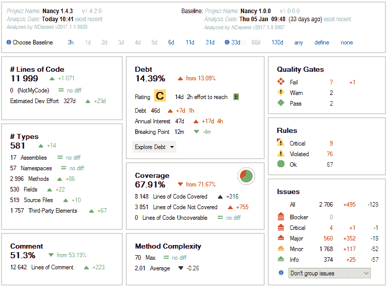

# 重构遗留系统——第 4 部分:重构工具

> 原文：<https://dev.to/jamesmh/refactoring-legacy-monoliths--part-4-refactoring-tools-26ek>

*注:[见我博客](https://www.blog.jamesmichaelhickey.com/refactoring-legacy-monoliths-part-4-refactoring-tools/)的规范帖子 T3】*

作为一名软件开发人员，知道有哪些工具可供您使用是很重要的。单调重复的任务或大型“一次性”耗时任务通常可以通过第三方工具实现自动化。是的，有时甚至值得用你自己的钱来购买这些工具。具体来说，在重构时，我们应该对我们可用的重构工具有所了解。

继续我的“重构遗留系统”系列——我想回顾一下我发现非常有用并且值得投资的一些工具。

为了让这篇博文比产品列表更有用，我将介绍一些代表解决重构项目的高级步骤。

# 第一步:识别问题区域

必须对代码库中的痛点有一个总体的了解。为什么？那么，你怎么知道**肯定**某些代码**应该**被重构呢？因为你*喜欢它*？因为*丑码*？

除非你用衡量真实应用程序性能的方式来衡量你的代码库，否则你不会真正知道问题到底出在哪里。你可能会有*有根据的猜测*关于什么需要改变。但没有客观可量化的结论。

我发现最好的工具是 [NDepend](https://www.ndepend.com/) 来获得你的代码库的这种客观视图。

NDepend 集成到 Visual Studio 中，基本上只是添加了自己的菜单等。它可以通过外部运行。如果你想的话。

NDepend 有如此多的功能，几乎让人应接不暇(这是一件好事)。我将提到几个特性，我发现它们对获得我们代码库的高层次概述最有帮助。

## n 独立特性:代码树形图(或“热图”)

这个特性叫做[树形图](https://www.ndepend.com/features/code-complexity#Diagrams)，但是让我想起了你的代码的热图。它根据代码质量给图中的特定区域(代码中的模块)着色(红色是不好的...).这让我想起了硬盘使用图，它显示了系统中哪些应用程序使用了大量空间等等。

这是一个超级快速和可靠的方式来看看你的调查可能要从哪里开始。大块红色区域是进一步调查的直接候选区域。最有可能的是，它代表了应用程序的某个关键部分。还是那句话，我说的是*最有可能是*。

根据我的专业经验，大面积的红色区域几乎总是对应于软件中大多数“错误”最终被发现的地方。

如果你是一个以任何形式处理代码库的顾问，但更具体地说，是提供代码重构或代码分析服务的顾问，那么我会说这个特性可能值这个工具的全部成本。这很容易上手——尤其是对于庞大的代码库。

## n 独立特征:仪表板

就像任何伟大的软件一样，NDepend 有一个令人敬畏的仪表板。

[T2】](https://res.cloudinary.com/practicaldev/image/fetch/s--rBieYUrh--/c_limit%2Cf_auto%2Cfl_progressive%2Cq_auto%2Cw_880/https://www.ndepend.com/Doc/VS_CQL/Dashboard.png)

从这里，您可以深入到“问题”中，这将为您提供一个列表，按严重性排序，列出您的代码库中的特定问题。记下最常见的广泛传播的问题，可以让您对代码库可能存在的总体技术问题有所了解。

马上，在你的面前，是整个代码库已经积累了多少技术债务的“等级”。这些指标也是可定制的，如果您觉得某些测量不需要分析的话。

这是一个省时的方法，给你超能力去洞察一个代码库是如何构建的，以及需要处理哪些特定的问题。如果你是一个项目的新手，你可以——在 15 分钟内——有能力对那些在那个项目中有经验的人说:

> “嘿[队友]，我快速浏览了一下代码，得到了一个高层次的概述。让我猜猜，[模块名称]可能给你带来了问题？很多虫子？团队大部分人都不喜欢在那个区域工作？”

这是让别人比其他人更快信任你的一种方式。

## 罗斯林分析仪在 C

Roslyn 分析器是您可以在 Visual Studio 中使用的本机 C#代码分析器。Visual Studio 2017 能够对您的整个解决方案运行代码分析，还具有计算代码指标的功能——类似于 NDepend。

如果您已经在使用 Visual Studio，这可能是分析您的代码库的一种简单方法。很酷的一点是，你可以在 Visual Studio 中安装不同的 Roslyn 分析器，以增强你的智能感知、实时建议、构建时错误检查等。

运行这些指标/分析器将显示在您的代码中(以曲线形式)以及 Visual Studio 的错误列表中。您可以将代码度量导出到 excel 文件中，这很好。

这些功能无法与 NDepend 的功能相提并论，但我认为这些代表了 Visual Studio 一直缺乏的一个领域。我很高兴看到微软是否会在分析器上添加一些高级报告，如图表、仪表板等。

# 第二步:通过首先处理更安全的领域来获得动力

一旦你知道问题区域在哪里，我会建议你去解决较小的红色区域(从树形图中)。这些领域没有大量的代码，但确实需要重构。这些区域可能被称为“小”bug 生产者。

把你正在使用的系统想象成一个**“生产洋葱的虫子”**。

> 中间是这个系统中最大、最恐怖、最可怕的部分，它甚至会吓到内心最强大的人。随着我们越来越接近洋葱的外部，我们会遇到系统中容易出错但不那么可怕和不那么重要的部分。

让我们先从外面解开洋葱。

这种方法风险较小，可以让你建立信心和领域知识(如果在一个你不太熟悉的系统中工作)。

但是你如何着手解决这些问题呢？

## n 独立

使用 NDepend 的仪表板，您可以看到特定代码质量问题的列表。深入研究每个问题将为您提供如何解决这些特定问题的提示。我鼓励您自己探索这个特性:)

## 重磨

不过，说到另一个工具， [JetBrain 的 ReSharper](https://www.jetbrains.com/resharper/) 棒极了。就像 NDepend 一样，ReSharper 拥有大量的特性。它无缝集成到 Visual Studio 中。众所周知，对于大型项目/解决方案来说，这是资源密集型的，但是对于重构代码来说，这是非常宝贵的。

### 重新锐化功能:将类型移动到匹配文件中

这是我在重构一个项目时遇到的一个问题。有一个文件包含数百个不同类型的文件(类、接口等)。)在**的一个**文件中，名为“WIP.cs”。那是“工作进行中”的缩写。是的，这是生产代码。一些类型被积极使用。有些不是。而且，有些还附加了版本号——比如“Class2”和“Class3”。好玩。

因此，ReSharper 有一个命令，你可以在这个文件上运行这个命令，它会神奇地为你做到这一点，而不是一个接一个地检查每一个类型并把它们提取到它们自己的文件中。这让我节省了几天的工作时间，更不用说我的理智了。

### ReSharper 特性:调整(解决方案)命名空间

我现在有几百个额外的文件要处理——都在同一个文件夹里。接下来，我需要用一个合适的文件/文件夹结构尽可能好地组织文件。这是手工操作——但是一旦所有的文件都在正确的位置，我们仍然需要为每种类型调整所有的名称空间！

瑞沙伯已经搞定了。只需对特定项目、文件或整个解决方案运行“调整命名空间”命令，每个文件的文件夹结构将自动应用于该文件的命名空间。这又一次为我节省了至少几天的工作时间。

这个特性在进行高级重组重构(即文件结构和文件夹结构的改变)时大放异彩。

从这个真实的例子中，我能够执行原本需要几周时间才能完成的工作，并在几天内完成。赢了！

# 附录:性能和 Web 指标

在您重构代码并进行一些单元测试之后(是的，您真的应该...)，我总是喜欢分析被更改的代码的运行时性能。下一个工具是我一直让 T2 一直运行的工具。作为一个网站开发者(主要是),这个工具是不可谈判的。

## Stackify 前缀

[前缀](https://stackify.com/prefix/)是一个**免费的**实时网页分析器。基本上，你把它安装在你的机器上，然后点击一个分配了前缀的本地 URL。瞧啊。

它会自动向您显示您的机器正在处理的每个 HTTP 请求，以及关于每个请求的**吨**细节。它不是一个通用的性能分析器——Prefix 将向您显示关于每个请求的**特定细节**。我喜欢的功能有:

*   它将向你展示你从来不知道正在发生的隐藏异常(并且正在减慢你的应用程序)

*   所有数据库调用都显示了实际执行的代码、查询花费的时间，甚至从 SQL server 下载数据花费的时间(对于大型数据集很有帮助！)

*   代码“热路径”向您显示代码中哪些方法花费了最多的执行时间(显示实际的度量)

# 结论

总的来说，NDepend、ReSharper 和 Stackify 的前缀都是非常棒的工具，可以增强您的重构能力和从高层次理解代码的能力。他们还为我们提供工具，帮助我们改进代码的细节。

Visual Studio 代码分析工具提供了一个潜力巨大的领域。特别是罗斯林分析器，我认为它是未来集成到图表、仪表板等的潜在领域。是一个有用的补充。

# 保持联系

别忘了在 [twitter](https://twitter.com/jamesmh_dev) 或 [LinkedIn](https://www.linkedin.com/in/jamesmhickey/) 上联系我！

# 导航您的软件开发生涯

一封电子邮件简讯，我将在其中回答订阅者的问题，并就以下主题提供建议:

✔:软件开发人员的一般阶段是什么？✔:我怎么知道自己处于哪个阶段？我如何进入下一阶段？
✔什么是技术领导者，我如何成为一名技术领导者？

听起来有趣吗？加入社区吧！