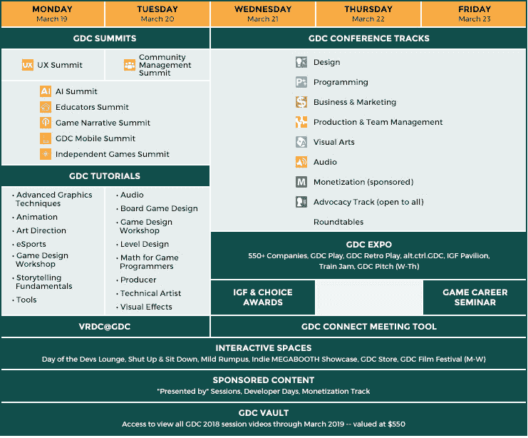
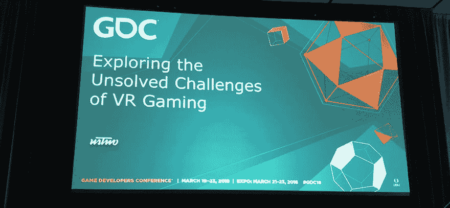
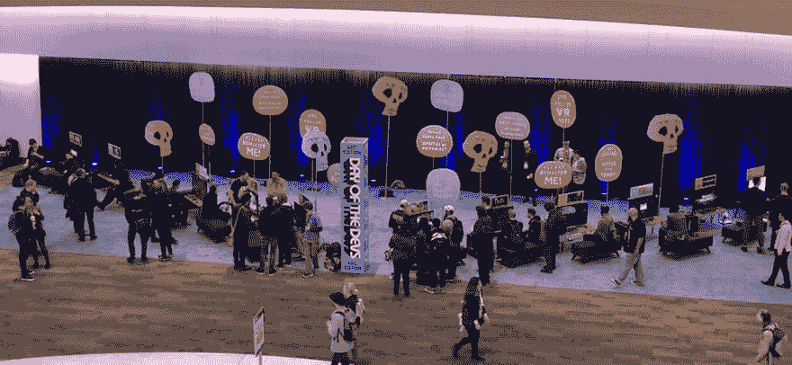
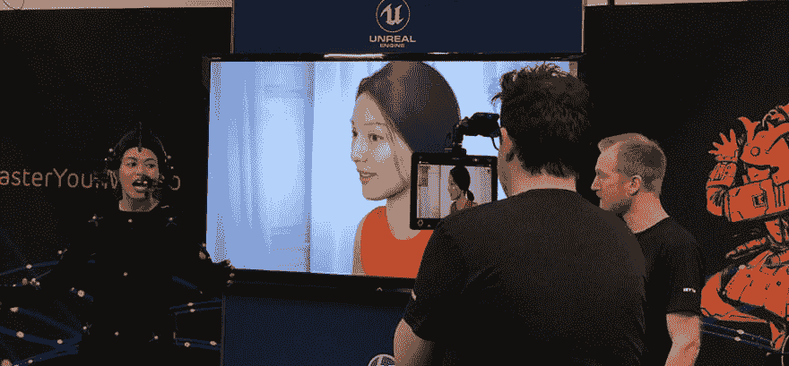

# 对 GDC 2018 的思考

> 原文：<https://dev.to/justinctlam/reflections-on-gdc-2018-1pbo>

# 简介

当我的公司给我参加 GDC 游戏开发者大会的机会时，我感到非常幸运。GDC 是世界上最大的职业游戏行业活动，吸引了世界上最大的游戏开发者聚会，我感到非常惊讶能够成为这些有才华的人之一。在此会议上，艺术家、工程师和设计师等专业人士齐聚一堂，展示、讨论和展示行业内的最新技术和知识。会议形式包括研讨会、峰会、演示、博览会和颁奖仪式。

GDC 2018 是我第一次参加 GDC，在为期五天的会议中，我学到了很多知识，体验了很多技术，并对游戏开发行业的发展感到惊讶。如果你有机会去的话，我想总结一些有趣的花絮，并提供一些如何浏览 GDC 的建议。

这是为期五天的会议中 GDC 的一个快速的高层次视图。

[T2】](https://res.cloudinary.com/practicaldev/image/fetch/s--isJ3lMiN--/c_limit%2Cf_auto%2Cfl_progressive%2Cq_auto%2Cw_880/http://res.cloudinary.com/du0yn38n5/image/upload/v1522127896/Capture_jr6e28.png)

您可以购买不同级别的赛事门票，价格从 250 美元到 2300 美元不等。每种类型的通行证提供了越来越多的活动访问权限，例如，250 美元的世博会通行证仅允许您参观世博会和颁奖仪式，而 2300 美元的全通道通行证则允许您参观 VRDC 赛道、所有 GDC 会议、访问在线视频等。

# VRDC

[T2】](https://res.cloudinary.com/practicaldev/image/fetch/s--c38WjUHQ--/c_limit%2Cf_auto%2Cfl_progressive%2Cq_auto%2Cw_880/http://res.cloudinary.com/du0yn38n5/image/upload/v1522129161/IMG_0176_yp4rob.jpg)

我很幸运地拿到了通行证，头两天我参加了虚拟现实开发者大会，简称 VRDC。在 VRDC，我能够很好地了解 VR、AR、MR 和 XR 的最新发展。在“XR 创作工具中的探索”中，我了解了谷歌如何在 Tilt brush 中构建他们的新灯光面板，UnityLabs 如何在 VR 环境中探索 VR 创作，以及 Oculus 如何设计他们的家庭体验。在一次题为“虚拟现实游戏测试:棕色盒子、间谍相机和毛绒地毯”的会议上，有一些关于用纸箱制作原型的好建议。我还在“1 个游戏，6 个耳机，10 个控制器:带‘平面图’的多平台 VR”中学习了一些构建多个 VR 耳机的良好实践，并在“每个人的房间:社区 VR 的‘娱乐室’方法”和“Pac-Man HoloLens:为棋盘观众开发混合现实游戏”中学习了多用户协作体验的重要性。在题为“探索虚拟现实游戏未解决的挑战”的会议中，演讲者表明，虚拟现实仍在努力传递重量，如何处理阅读文本和移动。但是尽管有这些挑战，还是有一些关于最佳实践的很好的演示，比如在“移动虚拟现实中的精神控制:SingSpace 中激活的凝视”中如何进行凝视控制。

# GDC

[T2】](https://res.cloudinary.com/practicaldev/image/fetch/s--MoIxnzUV--/c_limit%2Cf_auto%2Cfl_progressive%2Cq_auto%2Cw_880/http://res.cloudinary.com/du0yn38n5/image/upload/v1522129161/IMG_0038_dx23h2.jpg)

GDC 会议提供了各种各样的主题，包括工程、艺术、设计和商业。许多讲座都围绕着过去一年中每个学科的最新学习成果。

由于许多演讲都被录制下来，并将发布在 GDC Vault online 上，我决定参加圆桌会议来代替这些演讲。我发现圆桌会议是最值得参加的活动，因为没有记录，所以被认为是非常独特的。圆桌会议将人们聚集在一张大桌子周围谈论一个话题，可以是关于人工智能、动画、工具开发、音频、商业等。在这些圆桌会议上，可以找到从行业内有影响力的大人物到一年级学生的广泛经验。讨论是原始的和令人大开眼界的，因为人们从不同的角度发言，并且来自他们在行业旅程中的不同行业。今年的热门话题似乎是游戏行业是否应该成立工会。

# 世博会

[T2】](https://res.cloudinary.com/practicaldev/image/fetch/s--3RH_sHr6--/c_limit%2Cf_auto%2Cfl_progressive%2Cq_auto%2Cw_880/http://res.cloudinary.com/du0yn38n5/image/upload/v1522129161/IMG_0247_k02g7i.jpg)

GDC 博览会是来自世界各地的公司展示其最新商业产品和最新技术的地方。你可以找到大公司，像微软，亚马逊，谷歌，脸书，虚幻，统一，索尼等。为他们的最新产品制造刺激。微软展台整整三天都挤满了人，在这里你可以尝试混合现实耳机、Xbox 演示以及他们新的 PlayFab 后端基础设施，用于多人游戏和遥测服务。亚马逊也凭借其新的 GameOn 服务和伐木场游戏引擎占据了巨大的市场份额。脸书正在疯狂演示新的 Oculus Go 和 Santa Cruz(移动 6 自由度 HMD)。谷歌有一些白日梦的东西。Unity 在 GDC 上的表现是巨大的，几乎每个中小型开发人员都在使用 Unity，他们有许多性能增强，例如，新的实体组件系统架构，将 C#编译成本机代码，以及新的作业调度系统。虚幻和英伟达展示了他们新的实时光线跟踪技术。一些值得注意的演示包括，实时 CGI 人类木偶，超声波触觉反馈和全身虚拟现实设备。

# 充分利用 GDC

[T2】](https://res.cloudinary.com/practicaldev/image/fetch/s--fkWwbSUW--/c_limit%2Cf_auto%2Cfl_progressive%2Cq_auto%2Cw_880/http://res.cloudinary.com/du0yn38n5/image/upload/v1522129161/IMG_0241_yiopfl.jpg)

GDC 在旧金山市中心的莫斯康中心举行。旧金山是一个美丽的城市，但旧金山市中心可能有点简陋。注意你自己，跟着人群走。

由于这是我的第一次 GDC，我总是担心会错过一些东西，因为有太多的事情正在进行，太多的会议和活动重叠在一起。几乎不可能面面俱到，所以你需要制定一个计划，但也要允许自己灵活地改变这些计划。

如果我必须再做一次，这将是我的策略。

如果你负担得起，一定要在前两天参加 VRDC 讲座或辅导课。这是一次奇妙的经历。但是如果你做不到也不要担心，因为这些会议会被记录下来，并且可以在 GDC Vault online 上获得。虽然 GDC 金库不便宜，如果你没有正确的通行证，估计要 550 美元。

每天给自己两个小时看世博会，如果你有时间的话，可以花更多的时间。看看你是否能在你的时间表中找到你不感兴趣的时段，或者你是否认为你可以在 GDC 保险库观看。但是一定要参加 GDC Pitch days，在那里参与者练习推销他们的游戏鲨鱼坦克风格。看着超级爽。

如果你可以选择是参加圆桌会议还是去听演讲，那就一定要参加圆桌会议。当你在那里时，我鼓励你与人交谈，不要害羞，大胆发言并参与讨论。知道你可以与业内资深人士交流想法，这是一种非常酷的体验。另外，请务必参加 IGF 和游戏开发者选择颁奖典礼。

最后，保持冷静，多喝水，身边常备零食。你将没有时间吃午餐: )

# 结论

总的来说，GDC 是一次令人惊叹的经历。气氛令人兴奋。你可以感觉到游戏开发社区是一个紧密结合的团体，他们非常积极地追求他们的激情。会议期间的颁奖典礼揭示了这个行业的激情。如果我必须再做一次，我会带着名片，花更多的时间和个人谈论他们在这个行业的经历和旅程。我认为在这样的会议上，网络机会非常多。我喜欢它，并且想再次回到过去。