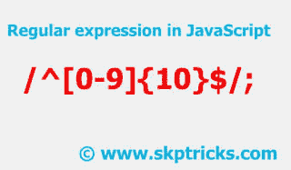

# JavaScript 中的正则表达式验证

> 原文：<https://dev.to/skptricks/regular-expression-validation-in-javascript-186o>

帖子链接:[JavaScript 中的正则表达式验证](https://www.skptricks.com/2018/01/regular-expression-validation-in-javascript.html) 

正则表达式在任何语言中都是一个强大的工具。在本教程中，我们将讨论如何在 JavaScript 中使用正则表达式。正则表达式是表单验证中最重要的部分，它广泛应用于搜索、替换和 web 爬行系统。正则表达式也称为 RegEx。

[T2】](https://res.cloudinary.com/practicaldev/image/fetch/s--rpBvDFjo--/c_limit%2Cf_auto%2Cfl_progressive%2Cq_auto%2Cw_880/https://4.bp.blogspot.com/-TDt5ZvjgOro/WlNkNpEqqeI/AAAAAAAABKc/mVpJJjtrn_YJavluzvkWBbEfZ-lDVLffgCLcBGAs/s320/redular.jpg)

或者简单地说，
正则表达式用于检测文本字符串中的模式。正则表达式提供了一种将字符串匹配到模式的快速而简单的方法。通过正则表达式可以验证手机号码、用户名、电子邮件 id、网站 url。

[阅读更多...](https://www.skptricks.com/2018/01/regular-expression-validation-in-javascript.html)