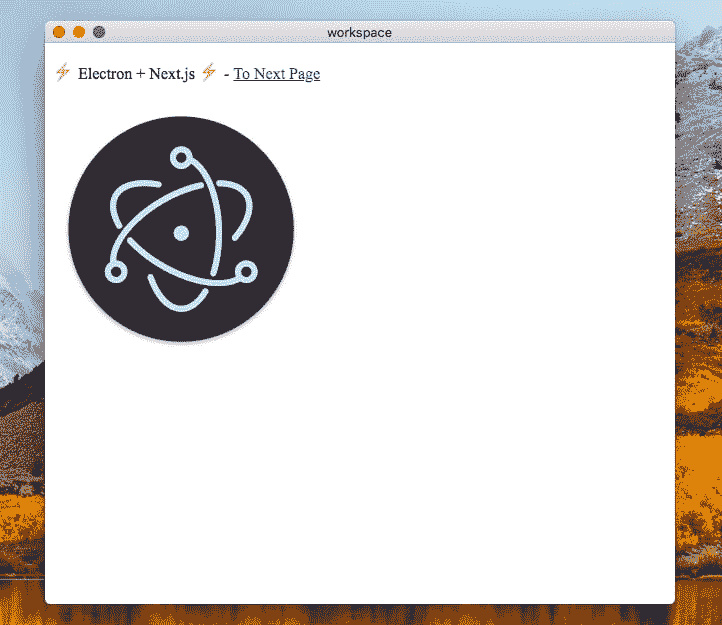

# 发布 Nextron v3，电子与 Next.js 应用生成器

> 原文：<https://dev.to/saltyshiomix/release-nextron-v3-electron-with-nextjs-apps-generator-2hgf>

经过半年的发展， [Nextron](https://github.com/saltyshiomix/nextron) 达到了 v3。

## 什么是 Nextron？

电子与 Next.js apps **生成器**。

可以这样用 Nextron:

```
# install it
$ npm install --global nextron

# use it
$ nextron init my-app --template with-javascript 
```

然后，产生`my-app` :

```
.
├── build
│   ├── build.production.js
│   ├── nextron-build.js
│   ├── nextron-dev.js
│   ├── nextron.js
│   ├── spinner.js
│   ├── webpack.base.config.js
│   └── webpack.main.config.js
├── main
│   ├── background.js
│   ├── env
│   │   ├── development.json
│   │   └── production.json
│   └── helpers
│       ├── create-window.js
│       ├── enable-hot-reload.js
│       └── index.js
├── renderer
│   ├── helpers
│   │   ├── index.js
│   │   └── resolve.js
│   ├── next.config.js
│   ├── pages
│   │   ├── home.jsx
│   │   └── next.jsx
│   └── static
│       └── logo.png
└── resources
│   ├── icon.icns
│   └── icon.ico
├── .gitignore
├── package.json
└── README.md 
```

在`package.json`中，您将看到这些 npm 脚本:

```
{  "scripts":  {  "dev":  "node build/nextron.js",  "build":  "node build/nextron.js build"  }  } 
```

运行`npm run dev`(或`yarn dev`)，你会看到一个运行开发模式的电子窗口。

运行`npm run build`(或`yarn build`)，过一会儿你会看到这些控制台输出:

```
$ yarn build
yarn run v1.10.1
$ node build/nextron.js build
✔ Clearing previous builds
✔ Building renderer process
✔ Building main process
✔ Packaging - please wait a moment

Done! See `dist` directory
✨  Done in 116.04s. 
```

然后，桌面二进制在`dist`目录！

[T2】](https://res.cloudinary.com/practicaldev/image/fetch/s--IfcOt2DF--/c_limit%2Cf_auto%2Cfl_progressive%2Cq_auto%2Cw_880/https://thepracticaldev.s3.amazonaws.com/i/m6et734h6t8q6xfmctpt.png)

## 我对 Nextron 的信念

1.  展示了一种开发桌面应用程序的方法
2.  使用方便
3.  透明(对开放源码软件开发者开放)

## 潜入 Nextron

### 发展模式(`node build/nextron.js dev`)

默认情况下，`nextron-dev.js`通过`next`命令:
启动端口`8888`的开发过程

```
# starts development process by Next.js (http://localhost:8888)
$ npx next --port 8888 ./renderer 
```

接下来，`nextron-dev.js` webpacks **main** 处理并生成`app/background.js`。

最后，`nextron-dev.js`开始电子过程:

```
$ npx electron . 
```

这时，一个带参数`.`(当前目录)的`electron`命令，搜索`package.json#main`属性，然后解析一个主 js 文件。

```
//  package.json  {  "main":  "app/background.js"  } 
```

### 生产打造(`node build/nextron.js build`)

首先，`nextron-build.js`将渲染器进程导出为静态文件:

```
$ npx next build ./renderer
$ npx next export ./renderer 
```

导出的输出在`./renderer/out`目录下，所以`nextron-build.js`将它们复制到`app/**/*`。

接下来，`nextron-build.js`通过 webpack 构建主进程，得到结果`app/background.js` :

```
$ node build/build.production.js 
```

最后，通过`electron-builder` :
打包二进制文件

```
$ npx electron-builder 
```

`electron-builder`默认绑定`app/**/*`和`node_modules`，并在`package.json#build`属性:
中加载额外的配置

```
//  package.json  {  "build":  {  "appId":  "com.example.nextron",  "productName":  "My Nextron App",  "copyright":  "Copyright © ${year} ${author}",  "directories":  {  "output":  "dist",  "buildResources":  "resources"  },  "publish":  null  }  } 
```

最终输出在`dist`目录下。

## 例子

更多信息见[示例](https://github.com/saltyshiomix/nextron/tree/master/examples)文件夹。

也可以通过`nextron init <app-name> --template <example-dirname>`启动示例 app。

### [示例/定制-构建-选项](https://github.com/saltyshiomix/nextron/tree/master/examples/custom-build-options)

```
$ nextron init my-app --template custom-build-options 
```

[T2】](https://res.cloudinary.com/practicaldev/image/fetch/s--1rRXUe6m--/c_limit%2Cf_auto%2Cfl_progressive%2Cq_auto%2Cw_880/https://i.imgur.com/ZWNgF2C.png)

### [例子/用-javascript-ant-design](https://github.com/saltyshiomix/nextron/tree/master/examples/with-javascript-ant-design)

```
$ nextron init my-app --template with-javascript-ant-design 
```

[T2】](https://res.cloudinary.com/practicaldev/image/fetch/s--PGgFMGY_--/c_limit%2Cf_auto%2Cfl_progressive%2Cq_auto%2Cw_880/https://i.imgur.com/PiEKeIZ.png)

### [例子/with-typescript-less](https://github.com/saltyshiomix/nextron/tree/master/examples/with-typescript-less)

```
$ nextron init my-app --template with-typescript-less 
```

[T2】](https://res.cloudinary.com/practicaldev/image/fetch/s--dQv7YiSD--/c_limit%2Cf_auto%2Cfl_progressive%2Cq_auto%2Cw_880/https://i.imgur.com/cWBEdDR.png)

### [例子/with-typescript-material-ui](https://github.com/saltyshiomix/nextron/tree/master/examples/with-typescript-material-ui)

```
$ nextron init my-app --template with-typescript-material-ui 
```

[T2】](https://res.cloudinary.com/practicaldev/image/fetch/s--P4_ztPZE--/c_limit%2Cf_auto%2Cfl_progressive%2Cq_auto%2Cw_880/https://i.imgur.com/DNOsAH0.png)

## 关于支持

| 耐思创 | 然后 |
| --- | --- |
| `v2.x` / `v3.x` | `v7.x` |
| `v1.x` | `v6.x` |

## 关于我

*   。网络和打字爱好者
*   初涉 OSS，热爱 OSS 开发者:)
*   请随时通过 [GitHub](https://github.com/saltyshiomix) 联系我

感谢您阅读本文！:)

最好的，