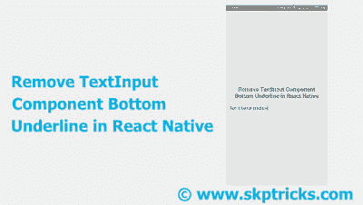

# 移除 React Native 中的 TextInput 组件底部下划线

> 原文：<https://dev.to/skptricks/remove-textinput-component-bottom-underline-in-react-native-1j7a>

帖子链接:[https://www . skp tricks . com/2018/08/remove-textinput-component-bottom-uderline-in-react-native . html](https://www.skptricks.com/2018/08/remove-textinput-component-bottom-uderline-in-react-native.html)

本教程解释了如何隐藏 React 本机应用程序中 TextInput 布局组件的下边框下划线。
文本输入组件默认带有底边下划线，显示在文本输入的正下方。有时开发人员需要删除这条线来使用自定义边框。所以在这里，我们将提供完整的指南来隐藏文本输入组件的底部下划线。underlineColorAndroid 属性会将下划线颜色设置为透明，因此下划线会自动隐藏。
underlineColorAndroid = " transparent "

[T2】](https://res.cloudinary.com/practicaldev/image/fetch/s--deDawRmY--/c_limit%2Cf_auto%2Cfl_progressive%2Cq_auto%2Cw_880/https://2.bp.blogspot.com/-eJ2Lih17rv4/W2_ugA0ZJnI/AAAAAAAABxU/i_0gfvl5Msoi-tX-KVxigqX4v8k4s7qBwCLcBGAs/s400/uder.jpg)

[移除 react native 中 inputText 的下划线](https://www.skptricks.com/2018/08/remove-textinput-component-bottom-uderline-in-react-native.html)
让我们按照以下步骤移除 React Native 应用程序中 TextInput 组件的底部下划线:

步骤 1:创建一个新的 React 本地项目。

步骤 2:在导入块中添加平台、样式表、文本、视图、TextInput 组件。
从“react-native”导入{ Platform，StyleSheet，Text，View，TextInput }；

步骤 3 :
在渲染块中创建 TextInput 组件，并在 TextInput 布局中指定 underlineColorAndroid = " transparent "属性，这有助于隐藏底部下划线。
{/* TextInput 组件帮助接受用户通过键盘的输入...*/}
style=
//使用占位符选项在 TextInput 中添加提示。
placeholder= "输入你的名字"
//使底线透明。
underlineColorAndroid = " transparent "
/>