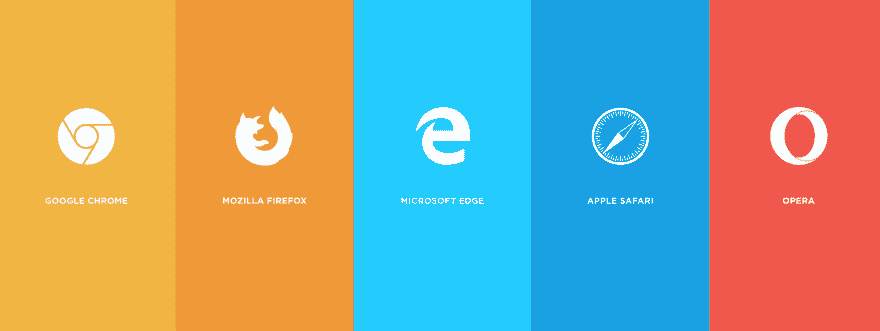

# 使用 React 呈现浏览器特定内容🎉

> 原文：<https://dev.to/flexdinesh/render-browser-specific-content-with-react--amm>

[](https://res.cloudinary.com/practicaldev/image/fetch/s--tlEq4tx0--/c_limit%2Cf_auto%2Cfl_progressive%2Cq_auto%2Cw_880/https://image.ibb.co/c8WZ2d/browser_banner.png)
***TL；DR** -你可以用一行程序在 React 中呈现特定于浏览器的内容。*

你有没有想过给你所有的 IE 用户挂个横幅，让他们用 Chrome/Firefox 试试你的网站？

通过浏览器组件 [RenderInBrowser](https://github.com/flexdinesh/react-render-in-browser) 你可以**呈现特定于浏览器的内容**。

正如几周前我在[帖子](https://dev.to/flexdinesh/i-re-wrote-my-portfolio-and-added-some-magic-22n7)中承诺的那样，我已经从我的另一个项目中移植了代码，编写了全面的测试，并创建了一个**独立的 React 库**，只在指定的浏览器中呈现内容。

语法太简单了。

如果你想只在 Chrome 中渲染一些东西，

```
<RenderInBrowser only chrome>
  <div>Whoa! This super duper text line will be rendered only in Chrome!</div>
</RenderInBrowser> 
```

Enter fullscreen mode Exit fullscreen mode

如果你想在除 IE 之外的所有浏览器中渲染一些东西，

```
<RenderInBrowser except ie>
  <div>Darn, this stuff doesn't work in IE :(</div>
</RenderInBrowser> 
```

Enter fullscreen mode Exit fullscreen mode

这个库可以作为 [NPM 包](https://www.npmjs.com/package/react-render-in-browser)获得，并且仍然处于测试阶段(v 0 . 2 . 0)’因为我想在发布 **v1.0.0** 之前听取反馈并对其进行改进。

这是 GitHub 回购协议的链接。

如果你发现一些可以改进的地方，请留下反馈信息，我非常欢迎。**如果你没有发现任何可以改进的地方，你仍然可以留下一个*你好*，我会*你好*你回来::**

你太棒了！祝你今天开心！玩的开心！⚡️