# 使用 React 虚拟化呈现大型列表

> 原文：<https://dev.to/bnevilleoneill/rendering-large-lists-with-react-virtualized-2p8b>

[](https://github.com/bvaughn/react-virtualized)

<figcaption>[http://www.reactvirtualized.com](http://www.reactvirtualized.com)</figcaption>

web 应用程序中的一个常见需求是显示数据列表。或者带有标题和滚动条的表格。你可能已经做过几百次了。

但是如果你需要同时显示几千行呢？

如果像分页或无限滚动这样的技术不是一个选项(或者可能有，但您仍然必须显示大量信息)，该怎么办？

在本文中，我将向您展示如何使用 [react-virtualized](https://github.com/bvaughn/react-virtualized) 高效地显示大量数据。

首先，您将看到渲染巨大数据集的问题。

然后，您将了解 React Virtualized 如何解决这些问题，以及如何使用 [List](https://bvaughn.github.io/react-virtualized/#/components/List) 和 [Autosizer](https://bvaughn.github.io/react-virtualized/#/components/AutoSizer) 组件高效地呈现第一个示例的列表。

您还将了解另外两个有用的组件。 [CellMeasurer](https://bvaughn.github.io/react-virtualized/#/components/CellMeasurer) ，动态测量行的宽度和高度， [ScrollSync](https://bvaughn.github.io/react-virtualized/#/components/ScrollSync) ，同步两个或更多虚拟化组件之间的滚动。

你可以在 GitHub 库中找到这里使用的例子的完整源代码。

### 问题

让我们从创建一个 React 应用程序开始:

```
npx create-react-app virtualization 
```

这个应用程序将显示一千条评论的列表。大概是这样的:

[T2】](https://res.cloudinary.com/practicaldev/image/fetch/s--K3UI3x7V--/c_limit%2Cf_auto%2Cfl_progressive%2Cq_auto%2Cw_880/https://cdn-images-1.medium.com/max/475/0%2AT-kTrUwEOpwnWfBr.)

占位符文本将由库 [lorem-ipsum](https://github.com/knicklabs/lorem-ipsum.js) 生成，因此将它 cd 到您的应用程序目录并安装:

```
cd virtualization 
```

```
npm install --save lorem-ipsum 
```

现在在`src/App.js`中，导入`lorem-ipsum` :

```
import loremIpsum from 'lorem-ipsum'; 
```

让我们用下面的方法创建一个包含一千个元素的数组:

```
const rowCount = 1000;
class App extends Component {
  constructor() {
    super();
    this.list = Array(rowCount).fill().map((val, idx) => {
      return {
        id: idx, 
        name: 'John Doe',
        image: 'http://via.placeholder.com/40',
        text: loremIpsum({
          count: 1, 
          units: 'sentences',
          sentenceLowerBound: 4,
          sentenceUpperBound: 8 
        })
      }
    });
  }
  //... 
```

上述代码将生成一个包含一千个对象的数组，这些对象具有以下属性:

*   身份证明（identification）
*   名字
*   图像
*   和一个四到八个单词的句子

这样，`render()`方法可以像这样使用数组:

```
render() {
  return (
    <div className="App">
      <header className="App-header">
        
        <h1 className="App-title">Welcome to React</h1>
      </header>
      <div className="list">
        {this.list.map(this.renderRow)}
      </div>
    </div>
  );
} 
```

使用`renderRow()`方法创建每行的布局:

```
renderRow(item) {
  return (
    <div key={item.id} className="row">
      <div className="image">
        
      </div>
      <div className="content">
        <div>{item.name}</div>
        <div>{item.text}</div>
      </div>
    </div>
  );
} 
```

现在，如果你给`src/App.css` :
添加一些 CSS 样式

```
.list {
  padding: 10px;
}
.row { 
  border-bottom: 1px solid #ebeced;
  text-align: left;
  margin: 5px 0;
  display: flex;
  align-items: center;
}
.image {
  margin-right: 10px;
}
.content {
  padding: 10px;
} 
```

并使用 npm start 运行应用程序，您应该会看到类似这样的内容:

[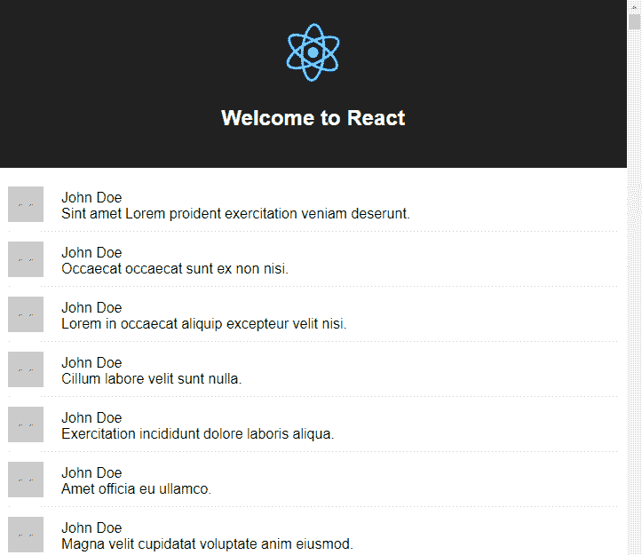T2】](https://res.cloudinary.com/practicaldev/image/fetch/s--wgOtGQy9--/c_limit%2Cf_auto%2Cfl_progressive%2Cq_auto%2Cw_880/https://cdn-images-1.medium.com/max/723/0%2AdYQBJ11Rr7R7EfK_.)

您可以使用浏览器开发工具的“元素”面板来检查页面。

在 DOM 中发现一千个 div 节点并不奇怪:

[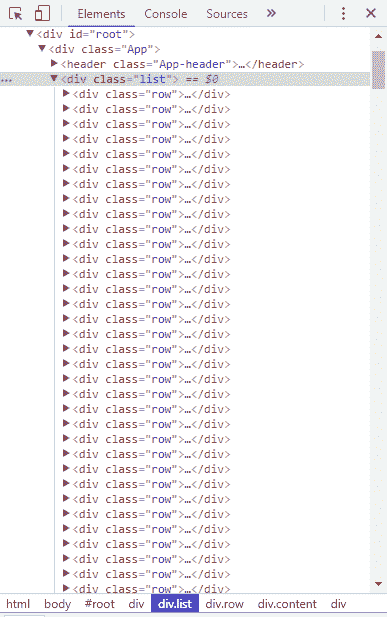T2】](https://res.cloudinary.com/practicaldev/image/fetch/s--OkIjaC_J--/c_limit%2Cf_auto%2Cfl_progressive%2Cq_auto%2Cw_880/https://cdn-images-1.medium.com/max/387/0%2Agcq_T5JFaMADqavT.)

DOM 中如此多的元素会导致两个问题:

*   缓慢的初始渲染
*   滞后滚动

然而，如果你滚动列表，你可能不会注意到任何滞后。我没有。毕竟，这个应用程序并没有渲染复杂的东西。

但如果你使用的是 Chrome，请按照以下步骤做一个快速测试:

1.  打开开发工具面板。
2.  按 Command+Shift+P (Mac)或 Control+Shift+P (Windows、Linux)打开命令菜单。
3.  开始在命令菜单中键入渲染，并选择显示渲染。
4.  在“渲染”标签中，启用 FPS 指示器。
5.  再次滚动列表。

在我的例子中，帧数从每秒 60 帧增加到大约每秒 38 帧:

[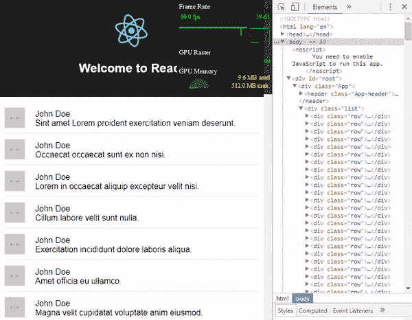T2】](https://res.cloudinary.com/practicaldev/image/fetch/s--2DGf25Yy--/c_limit%2Cf_auto%2Cfl_progressive%2Cq_auto%2Cw_880/https://cdn-images-1.medium.com/max/600/0%2AQxVnGLIypUWyWYw1.)

这可不好。

在功能较弱或布局更复杂的设备中，这可能会冻结用户界面，甚至导致浏览器崩溃。

那么我们如何高效地显示这一千行呢？

一种方法是使用像 react-virtualized 这样的库，它使用一种叫做虚拟渲染的技术。

[T2】](https://logrocket.com/?cid=banner_a)

### react-虚拟化是如何工作的？

虚拟渲染背后的主要概念是只渲染可见的东西。

应用程序中有 1000 条评论，但它在任何时候都只显示大约 10 条(适合屏幕的那些)，直到你滚动显示更多。

因此，只加载可见的元素并在它们不可见时卸载它们(用新的元素替换它们)是有意义的。

React-virtualized 使用一组组件实现虚拟渲染，这些组件基本上以下列方式工作:

*   它们计算在显示列表的区域(视区)内哪些项目是可见的。
*   他们使用一个具有相对定位的容器(div ),通过控制它的 top、left、width 和 height 样式属性来绝对定位其中的子元素。

有五个主要组件:

*   [网格](https://github.com/bvaughn/react-virtualized/blob/master/docs/Grid.md)。它沿着纵轴和横轴呈现表格数据。
*   [列表](https://github.com/bvaughn/react-virtualized/blob/master/docs/List.md)。它在内部使用网格组件呈现元素列表。
*   [表](https://github.com/bvaughn/react-virtualized/blob/master/docs/Table.md)。它呈现一个具有固定标题和可垂直滚动的正文内容的表格。它还在内部使用网格组件。
*   [砌筑](https://github.com/bvaughn/react-virtualized/blob/master/docs/Masonry.md)。它呈现动态大小的、用户定位的单元格，支持垂直滚动。
*   [收藏](https://github.com/bvaughn/react-virtualized/blob/master/docs/Collection.md)。它呈现任意位置和重叠的数据。

这些组件从 [React 延伸而来。PureComponent](https://reactjs.org/docs/react-api.html#reactpurecomponent) ，这意味着在比较对象时，它只比较它们的引用，以提高性能。你可以在这里阅读更多关于这个[的内容。](https://github.com/bvaughn/react-virtualized#pure-components)

另一方面，react-virtualized 还包括一些特定的组件:

*   [箭头键步进器](https://github.com/bvaughn/react-virtualized/blob/master/docs/ArrowKeyStepper.md)。它修饰了另一个组件，使其能够响应箭头键事件。
*   [自动筛分机](https://github.com/bvaughn/react-virtualized/blob/master/docs/AutoSizer.md)。它会自动调整另一个组件的宽度和高度。
*   [细胞测量器](https://github.com/bvaughn/react-virtualized/blob/master/docs/CellMeasurer.md)。它通过以用户不可见的方式临时呈现单元格来自动测量单元格的内容。
*   [ColumnSizer](https://github.com/bvaughn/react-virtualized/blob/master/docs/ColumnSizer.md) 。它计算网格单元的列宽。
*   [InfiniteLoader](https://github.com/bvaughn/react-virtualized/blob/master/docs/InfiniteLoader.md) 。当用户滚动列表、表格或网格时，它管理数据的获取。
*   [多重网格](https://github.com/bvaughn/react-virtualized/blob/master/docs/MultiGrid.md)。它修饰一个网格组件来添加固定的列和/或行。
*   [ScrollSync](https://github.com/bvaughn/react-virtualized/blob/master/docs/ScrollSync.md) 。它在两个或多个组件之间同步滚动。
*   [windows scroller](https://github.com/bvaughn/react-virtualized/blob/master/docs/WindowScroller.md)。它使表格或列表组件能够根据窗口的滚动位置进行滚动。

现在让我们看看如何使用 List 组件来虚拟化一千条评论的示例。

### 虚拟化列表

首先，在 src/App.js 中，从 react-virtualizer 中导入 List 组件:

```
import { List } from "react-virtualized"; 
```

现在，代替以这种方式呈现列表:

```
<div className="list">
{this.list.map(this.renderRow)}
</div> 
```

让我们使用列表组件以虚拟化的方式呈现列表:

```
const listHeight = 600;
const rowHeight = 50;
const rowWidth = 800;
//...
<div className="list">
<List
width={rowWidth}
height={listHeight}
rowHeight={rowHeight}
rowRenderer={this.renderRow}
rowCount={this.list.length} />
</div> 
```

注意两件事。

首先，列表组件要求您指定列表的宽度和高度。它还需要行的高度，这样它就可以计算哪些行将可见。

rowHeight 属性采用一个固定的行高或一个返回给定其索引的行的高度的函数。

其次，组件需要行数(列表长度)和一个函数来呈现每一行。它不直接拿单子。

因此，renderRow 方法的实现需要更改。

这个方法不再接受列表中的对象作为参数。相反，列表组件将传递给它一个具有以下属性的对象:

*   索引。行的索引。
*   isScrolling。指示列表当前是否正在滚动。
*   可见。指示该行在列表中是否可见。
*   钥匙。该行的唯一键。
*   父母。对父列表组件的引用。
*   风格。应用于行以定位行的样式对象。

现在 renderRow 方法将看起来像这样:

```
renderRow({ index, key, style }) {
  return (
    <div key={key} style={style} className="row">
      <div className="image">
        
      </div>
      <div className="content">
        <div>{this.list[index].name}</div>
        <div>{this.list[index].text}</div>
      </div>
    </div>
  );
} 
```

请注意如何使用 index 属性来访问与正在呈现的行相对应的列表元素。

如果你运行这个应用程序，你会看到这样的内容:

[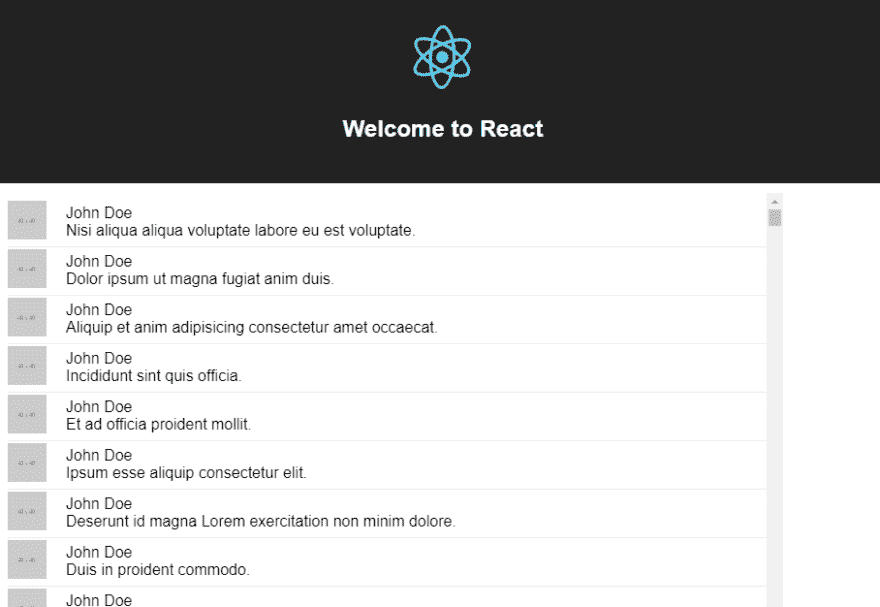T2】](https://res.cloudinary.com/practicaldev/image/fetch/s--eMZNTx9G--/c_limit%2Cf_auto%2Cfl_progressive%2Cq_auto%2Cw_880/https://cdn-images-1.medium.com/max/908/0%2ADaJ-GsW5Aak8Gb0d.)

在我的例子中，可以看到八行半。

如果我们在 developer tools 选项卡中查看页面的元素，您会看到现在这些行被放置在另外两个 div 元素中:

[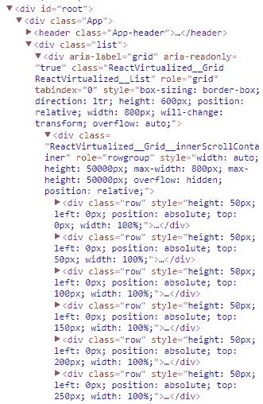T2】](https://res.cloudinary.com/practicaldev/image/fetch/s--GHGZ0R20--/c_limit%2Cf_auto%2Cfl_progressive%2Cq_auto%2Cw_880/https://cdn-images-1.medium.com/max/331/0%2AfhmpCvCkcdJEP1Sk.)

外部 div 元素(具有 CSS 类 ReactVirtualized _ _ GridReactVirtualized _ _ List 的元素)具有组件中指定的宽度和高度(分别为 800px 和 600px)，具有相对位置和值 auto(用于溢出)(用于添加滚动条)。

内部 div 元素(具有 CSS 类 ReactVirtualized _ _ Grid _ _ innerScrollContainer 的元素)的最大宽度为 800px，但高度为 50000px，这是行数(1000)乘以每行高度(50)的结果。它也有一个相对位置，但有一个溢出的隐藏值。

所有的行都是这个 div 元素的子元素，这一次，没有一千个元素。

然而，也不是八个或九个元素。好像还有十多个。

这是因为列表组件呈现了额外的元素，以减少快速滚动导致的闪烁。

附加元素的数量由属性 [overscanRowCount](https://github.com/bvaughn/react-virtualized/blob/master/docs/overscanUsage.md) 控制。例如，如果我设置 3 作为这个属性的值:

```
<List
width={rowWidth}
height={listHeight}
rowHeight={rowHeight}
rowRenderer={this.renderRow}
rowCount={this.list.length}
overscanRowCount={3} /> 
```

我将在元素选项卡中看到的元素数量大约是 12 个。

无论如何，如果您重复帧速率测试，这次您将看到 59/60 fps 的恒定速率:

[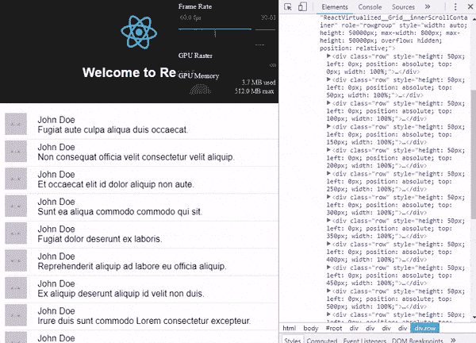T2】](https://res.cloudinary.com/practicaldev/image/fetch/s--e8iZagJF--/c_limit%2Cf_auto%2Cfl_progressive%2Cq_auto%2Cw_880/https://cdn-images-1.medium.com/max/600/0%2AeaSm66VXq87uLqt5.)

此外，看看元素及其顶级样式是如何动态更新的:

[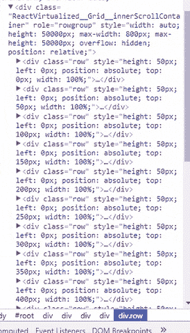T2】](https://res.cloudinary.com/practicaldev/image/fetch/s--Wh3v3Q5P--/c_limit%2Cf_auto%2Cfl_progressive%2Cq_auto%2Cw_880/https://cdn-images-1.medium.com/max/274/0%2AT8JB35D7kE1arqF0.)

缺点是您必须指定列表的宽度和高度以及行的高度。

幸运的是，您可以使用 AutoSizer 和 CellMeasurer 组件来解决这个问题。

让我们从 AutoSizer 开始。

### 自动调整虚拟化列表

像 AutoSizer 这样的组件使用名为[的模式作为子组件](https://medium.com/merrickchristensen/function-as-child-components-5f3920a9ace9)。

顾名思义，不是把一个组件作为子组件传递:

```
<AutoSizer>
<List
...
/>
</AutoSizer> 
```

你必须传递一个函数。在这种情况下，一个接收计算的宽度和高度:

```
<AutoSizer>
({ width, height }) => {
}
</AutoSizer> 
```

这样，该函数将返回配置了宽度和高度的列表组件:

```
<AutoSizer>
({ width, height }) => {
return <List
width={width}
height={height}
rowHeight={rowHeight}
rowRenderer={this.renderRow}
rowCount={this.list.length}
overscanRowCount={3} />
}
</AutoSizer> 
```

AutoSizer 组件将填充其父组件的所有可用空间，因此，如果您想要填充 src/App.css 中标题后的所有空间，您可以将下面一行添加到 list 类:

```
.list {
...
height: calc(100vh - 210px)
} 
```

vh 单位对应于视口的高度(浏览器窗口大小)，因此 100vh 相当于视口高度的 100%。由于头的大小(200px)和 list 类添加的填充(10px ),所以减去了 210px。

如果尚未导入组件，请导入:

```
import { List, AutoSizer } from "react-virtualized"; 
```

当您运行应用程序时，您应该会看到类似这样的内容:

[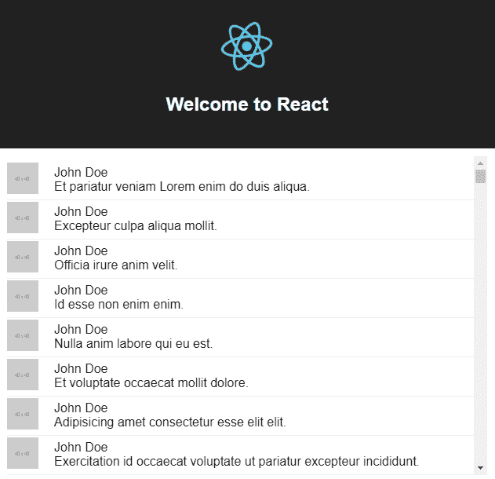T2】](https://res.cloudinary.com/practicaldev/image/fetch/s--c8Jj0mWk--/c_limit%2Cf_auto%2Cfl_progressive%2Cq_auto%2Cw_880/https://cdn-images-1.medium.com/max/631/0%2AgACjNwXyudLInECa.)

如果调整窗口大小，列表高度应该会自动调整:

[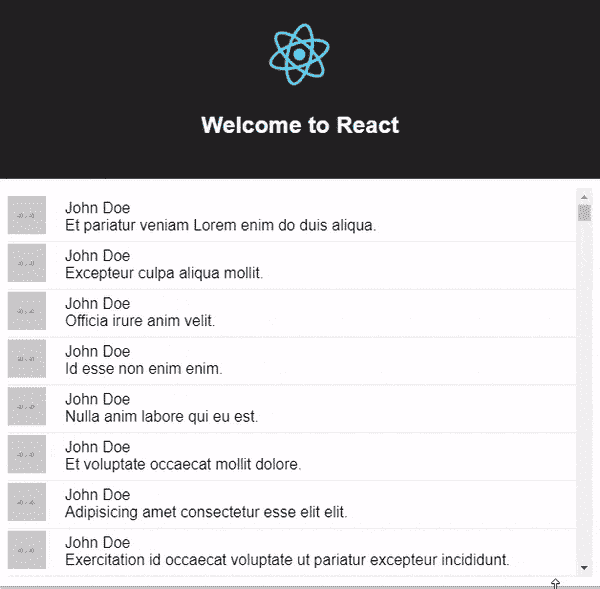T2】](https://res.cloudinary.com/practicaldev/image/fetch/s--1RIsbeTG--/c_limit%2Cf_auto%2Cfl_progressive%2Cq_auto%2Cw_880/https://cdn-images-1.medium.com/max/600/0%2A_bBHhJsVWhAS60Zo.)

### 自动计算一行的高度

该应用程序会生成一个适合一行的短句，但是如果您将 lorem-ipsum 生成器的设置更改为如下所示:

```
this.list = Array(rowCount).fill().map((val, idx) => {
return {
//...
text: loremIpsum({
count: 2,
units: 'sentences',
sentenceLowerBound: 10,
sentenceUpperBound: 100
})
}
}); 
```

一切都变得一团糟:

[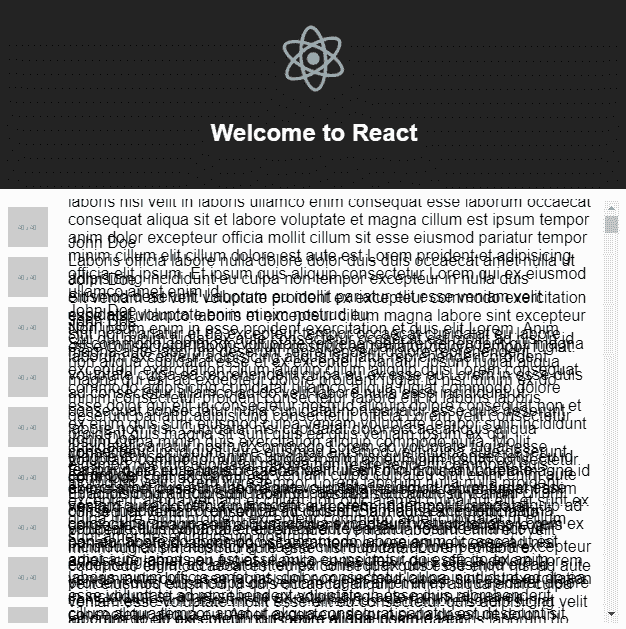T2】](https://res.cloudinary.com/practicaldev/image/fetch/s--gWaWKQAU--/c_limit%2Cf_auto%2Cfl_progressive%2Cq_auto%2Cw_880/https://cdn-images-1.medium.com/max/626/0%2AjF-7d0xv3a_KYVYZ.)

这是因为每个单元格的高度都有一个固定值 50。如果您想要动态高度，您必须使用 CellMeasurer 组件。

该组件与 [CellMeasurerCache](https://github.com/bvaughn/react-virtualized/blob/master/docs/CellMeasurer.md#cellmeasurercache) 协同工作，后者存储测量值以避免一直重新计算。

要使用这些组件，首先导入它们:

```
import { List, AutoSizer, CellMeasurer, CellMeasurerCache } from "react-virtualized"; 
```

接下来，在构造函数中，创建 CellMeasurerCache:
的实例

```
class App extends Component {
  constructor() {
    ...
    this.cache = new CellMeasurerCache({
      fixedWidth: true,
      defaultHeight: 100
    });
  }
  ...
} 
```

因为不需要计算行的宽度，所以 fixedWidth 属性被设置为 true。

与 AutoSizer 不同的是，CellMeasurer 并不把一个函数作为子函数，而是你要测量的组件，所以修改方法 renderRow，这样使用:

```
renderRow({ index, key, style, parent }) {
    return (
      <CellMeasurer 
        key={key}
        cache={this.cache}
        parent={parent}
        columnIndex={0}
        rowIndex={index}>
          <div style={style} className="row">
            <div className="image">
              
            </div>
            <div className="content">
              <div>{this.list[index].name}</div>
              <div>{this.list[index].text}</div>
            </div>
          </div>
      </CellMeasurer>
    );
  } 
```

请注意以下有关 CellMeasuer 的内容:

*   这个组件是用来区分元素的关键。
*   它采用之前配置的缓存。
*   它将父组件(列表)带到要呈现它的地方，所以您也需要这个参数。

最后，您只需要修改列表组件，使其使用缓存并从缓存中获取其高度:

```
<AutoSizer>
{
  ({ width, height }) => {
    return <List
      width={width}
      height={height}
      deferredMeasurementCache={this.cache}
      rowHeight={this.cache.rowHeight}
      rowRenderer={this.renderRow}
      rowCount={this.list.length}
      overscanRowCount={3} />
  }
}
</AutoSizer> 
```

现在，当您运行应用程序时，一切看起来都很好:

[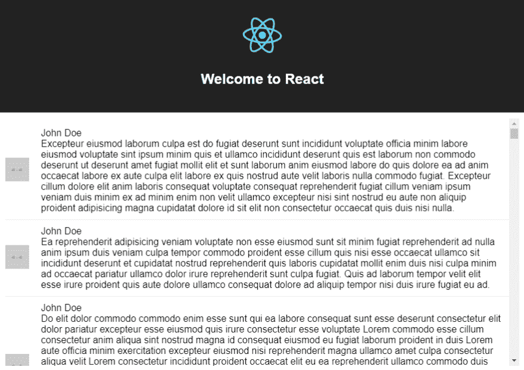T2】](https://res.cloudinary.com/practicaldev/image/fetch/s--f8flgWwM--/c_limit%2Cf_auto%2Cfl_progressive%2Cq_auto%2Cw_880/https://cdn-images-1.medium.com/max/882/0%2Aj-q3iNO6GhxUQuEf.)

### 同步两个列表之间的滚动

另一个有用的组件是 ScrollSync。

对于这个例子，您需要返回到之前的配置，返回一个简短的句子:

```
text: loremIpsum({
count: 1,
units: 'sentences',
sentenceLowerBound: 4,
sentenceUpperBound: 8
}) 
```

原因是您[不能在两个组件](https://stackoverflow.com/questions/45682063/react-virtualized-share-cellmeasurercache-for-multiple-grids/45684069#45684069)之间共享一个 CellMeausure 缓存，所以我接下来要展示的两个列表不能有动态高度，就像前面的例子一样。至少不是以一种简单的方式。

如果你想要动态高度类似于本节的例子，最好使用[多重网格](https://bvaughn.github.io/react-virtualized/#/components/MultiGrid)组件。

继续，导入滚动同步:

```
import { List, AutoSizer, ScrollSync } from "react-virtualized"; 
```

在 render 方法中，在 ScrollSync 组件中用 list 类包装 div 元素，如下所示:

```
<ScrollSync>
  {({ onScroll, scrollTop, scrollLeft }) => (
    <div className="list">
      <AutoSizer>
      {
        ({ width, height }) => {
          return (
                  <List
                    width={width}
                    height={height}
                    rowHeight={rowHeight}
                    onScroll={onScroll}
                    rowRenderer={this.renderRow}
                    rowCount={this.list.length}
                    overscanRowCount={3} />
          )
        }
      }
      </AutoSizer>
    </div>
  )
}
</ScrollSync> 
```

ScrollSync 还以一个函数为子传递一些[参数](https://github.com/bvaughn/react-virtualized/blob/master/docs/ScrollSync.md#children-function)。也许你会经常用到的是:

*   在滚动。一个将触发滚动参数更新以更新其他组件的函数，因此它应该被传递给至少一个子组件。
*   滚动条。当前滚动顶部偏移量，由 onScroll 函数更新。
*   scrollLeft。当前向左滚动的偏移量，由 onScroll 函数更新。

如果你放置一个 span 元素来显示 scrollTop 和 scrollLeft 参数:

```
...
<div className="list">
<span>{scrollTop} - {scrollLeft}</span>
<AutoSizer>
...
</AutoSizer>
</div> 
```

并运行应用程序，您应该看到 scrollTop 参数是如何随着您滚动列表而更新的:

[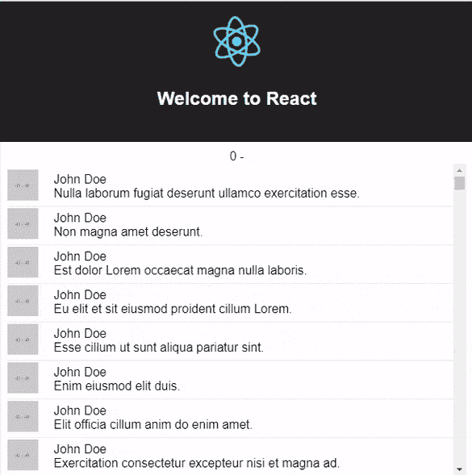T2】](https://res.cloudinary.com/practicaldev/image/fetch/s--TkQusAFh--/c_limit%2Cf_auto%2Cfl_progressive%2Cq_auto%2Cw_880/https://cdn-images-1.medium.com/max/585/0%2AvEUXBthTX1d8GKqw.)

由于列表没有水平滚动，scrollLeft 参数没有值。

现在，对于这个示例，您将添加另一个列表，该列表将显示每个评论的 ID，并且它的滚动将与另一个列表同步。

所以让我们从为这个新列表添加另一个渲染函数开始:

```
renderColumn({ index, key, style }) {
  return (
        <div key={key} style={style} className="row">
          <div className="content">
            <div>{this.list[index].id}</div>
          </div>
        </div>
  );
} 
```

接下来，在 AutoSizer 组件中，禁用宽度计算:

```
<AutoSizer disableWidth>
{
   ({ height }) => {
     ...
   }
}
</AutoSizer> 
```

您不再需要它了，因为您将为两个列表设置一个固定的宽度，并使用绝对位置将它们放在一起。

大概是这样:

```
<div className="list">
  <AutoSizer disableWidth>
  {
    ({ height }) => {
      return (
        <div>
          <div 
            style={{
              position: 'absolute',
              top: 0,
              left: 0,
            }}>
              <List
                className="leftSide"
                width={50}
                height={height}
                rowHeight={rowHeight}
                scrollTop={scrollTop}
                rowRenderer={this.renderColumn}
                rowCount={this.list.length}
                overscanRowCount={3}  />
          </div>
          <div
            style={{
              position: 'absolute',
              top: 0,
              left: 50,
            }}>
              <List
                width={800}
                height={height}
                rowHeight={rowHeight}
                onScroll={onScroll}
                rowRenderer={this.renderRow}
                rowCount={this.list.length}
                overscanRowCount={3}  />
          </div>
        </div>
      )
    }
  }
  </AutoSizer>
</div> 
```

请注意，scrollTop 参数被传递给第一个列表，因此可以自动控制其滚动，onScroll 函数被传递给另一个列表，以更新 scrollTop 值。

第一个列表的左侧类只是隐藏了滚动条(因为你不需要它):

```
.leftSide {
overflow: hidden !important;
} 
```

最后，如果您运行应用程序并滚动右侧列表，您将看到另一个列表也是如何滚动的:

[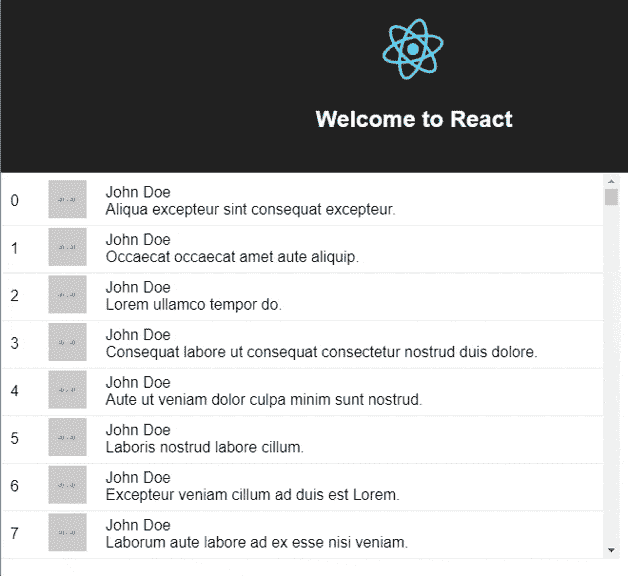T2】](https://res.cloudinary.com/practicaldev/image/fetch/s--9AOqAH_H--/c_limit%2Cf_auto%2Cfl_progressive%2Cq_auto%2Cw_880/https://cdn-images-1.medium.com/max/628/0%2AOuY1Rqwdnbf9h1Aw.)

### 结论

我希望本文向您展示了如何使用 react-virtualized 以高效的方式呈现大型列表。它只涵盖了基础，但有了这个基础，你应该能够使用其他组件，如[网格](https://bvaughn.github.io/react-virtualized/#/components/Grid)和[集合](https://bvaughn.github.io/react-virtualized/#/components/Collection)。

当然，也有其他库是为了同样的目的而构建的，但是 react-virtualized 有很多功能，并且维护得很好。另外，还有一个 [Gitter chat](https://gitter.im/bvaughn/react-virtualized) 和一个用于提问的 [StackOverflow 标签](https://stackoverflow.com/questions/tagged/react-virtualized)。

记住你可以在 GitHub 库中找到所有的例子。

* * *

### Plug: [LogRocket](http://logrocket.com) ，一款适用于网络应用的 DVR

[T2】](http://logrocket.com)

LogRocket 是一个前端日志工具，可以让你回放问题，就像它们发生在你自己的浏览器中一样。LogRocket 不需要猜测错误发生的原因，也不需要向用户询问截图和日志转储，而是让您重放会话以快速了解哪里出错了。它可以与任何应用程序完美配合，不管是什么框架，并且有插件可以记录来自 Redux、Vuex 和@ngrx/store 的额外上下文。

除了记录 Redux 操作和状态，LogRocket 还记录控制台日志、JavaScript 错误、堆栈跟踪、带有头+正文的网络请求/响应、浏览器元数据和自定义日志。它还使用 DOM 来记录页面上的 HTML 和 CSS，甚至为最复杂的单页面应用程序重新创建像素级完美视频。

免费试用。

* * *

用 React 虚拟化渲染大型列表的帖子[首先出现在](https://blog.logrocket.com/rendering-large-lists-with-react-virtualized-82741907a6b3/)[博客](https://blog.logrocket.com)上。