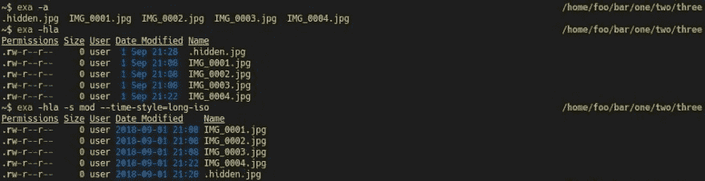
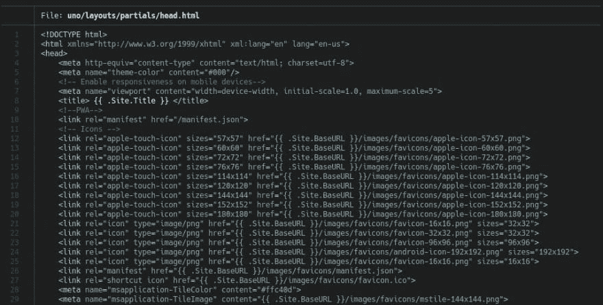
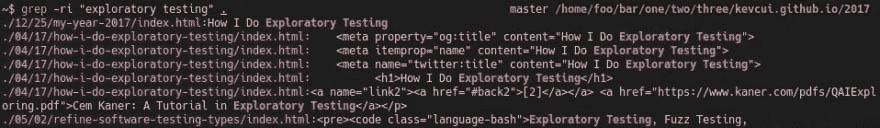
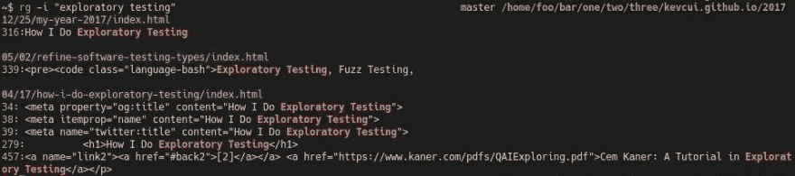
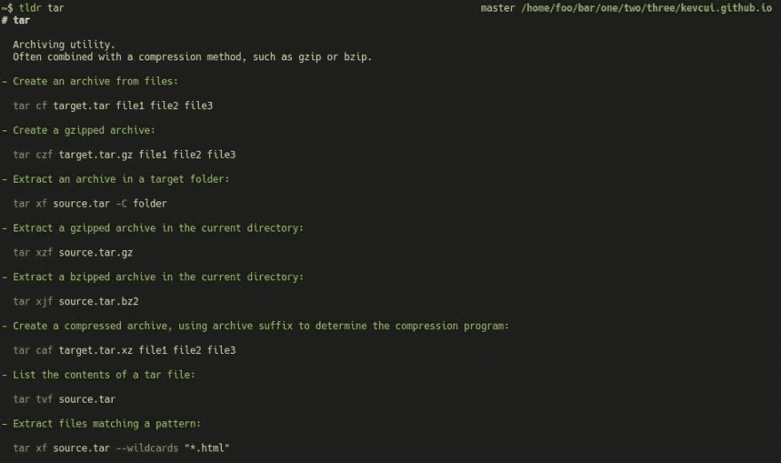

# 替换 8 个常用的 Linux 命令！？

> 原文：<https://dev.to/kevcui/replace-8-frequently-used-linux-commands-p2f>

[T2】](https://res.cloudinary.com/practicaldev/image/fetch/s--qaY5Vx-c--/c_limit%2Cf_auto%2Cfl_progressive%2Cq_auto%2Cw_880/https://cdn-images-1.medium.com/max/1000/1%2AhcY3Bk8YY_1keCJW_b70Vw.jpeg)

差不多十年前，我开始接触命令行界面(CLI)。我现在是一个书呆子式的 CLI 爱好者，我被它的效率迷住了。因此，我总是尝试新的命令行命令。在我的日常工作流程中，有时一些命令会被其他改进的命令所取代。特别是对于一些经常使用的命令，找到更好的替代方法是值得的。

下面是我想与大家分享的改进命令列表:

### cd？z，up 和 fzf！

#### z

z 是一个非常流行的跳跃命令。`z`不需要任何额外的配置。虽然它开箱即用，但你只需要一点点耐心。因为`z`有一个基于“频率”的“神奇”算法，它可以在你的`cd`出现一段时间后，从频繁的既得目录中学习。

一个简单快捷的例子如何`z` :

```
~$ pwd
/home/foo/bar/one/two/three

~$ z tw
~$ pwd
/home/foo/bar/one/two

~$ z foo
~$ pwd
/home/foo

~$ z th
~$ pwd
/home/foo/bar/one/two/three 
```

Enter fullscreen mode Exit fullscreen mode

想知道所有目录的“频率”分数是怎样的吗？简单地运行命令`z -l`会给你一个列表。

想要清理部分/全部保存的目录吗？简单修改一下`$HOME/.z`。

#### 向上

[up](https://github.com/shannonmoeller/up) 是替换`cd ..`的一个有趣的命令，它嘲笑了一个`cd ../../../../`T4

```
~$ pwd
/home/foo/bar/one/two/three

~$ up
~$ pwd
/home/foo/bar/one/two

~$ up 2
~$ pwd
/home/foo/bar

~$ up h
~$ pwd
/home 
```

Enter fullscreen mode Exit fullscreen mode

#### fzf

[fzf](https://github.com/junegunn/fzf) 是一个多功能命令，可以组合在其他命令中。借助其惊人的可搜索性，可以使用[【光盘进入选定目录】](https://github.com/junegunn/fzf/blob/master/shell/key-bindings.zsh):

[fzf 示例](https://kevcui.github.io/videos/fzf-example.svg)

### ls？exa！

[exa](https://github.com/ogham/exa) 的目标是成为`ls`的调制解调器替代品。在我看来，它做到了。exa 真的很好用。它的选择很简单:

[T2】](https://res.cloudinary.com/practicaldev/image/fetch/s--f2MELheO--/c_limit%2Cf_auto%2Cfl_progressive%2Cq_auto%2Cw_880/https://kevcui.github.img/exa-example.jpg)

以下是我的化名:

```
alias ls='exa -s mod --git'
alias ll='exa -l -s mod --git --time-style=long-iso' 
```

Enter fullscreen mode Exit fullscreen mode

调整数据库云服务器的更多选项:[数据库云服务器选项](https://the.exa.website/docs/command-line-options)

### 猫？蝙蝠！

[bat](https://github.com/sharkdp/bat) 是一个`cat`克隆，具有语法高亮、行号和自动分页(使用`less`作为默认分页器)。使用`bat`显示文件的内容看起来像:

[T2】](https://res.cloudinary.com/practicaldev/image/fetch/s--e8cscuGf--/c_limit%2Cf_auto%2Cfl_progressive%2Cq_auto%2Cw_880/https://kevcui.github.img/bat-example.jpg)

可以自定义语法突出显示的主题。它支持崇高的文本语法格式。查看这些默认主题来获得一些灵感: [bat 主题](https://github.com/sharkdp/bat/tree/master/assets/themes)

### grep? rg!

[rg](https://github.com/BurntSushi/ripgrep) ，ripgrep，快&暴怒。它与`grep`命令的参数几乎相同，但输出风格和速度有所改进。

`grep`对我来说的一个主要用途就是找出哪些文件包含了一些特定的内容。一个比较`grep`和`ripgrep`的例子:

[T2】](https://res.cloudinary.com/practicaldev/image/fetch/s--ysEzlymt--/c_limit%2Cf_auto%2Cfl_progressive%2Cq_auto%2Cw_880/https://kevcui.github.img/grep-example.jpg)

[T2】](https://res.cloudinary.com/practicaldev/image/fetch/s--_DP-zWiK--/c_limit%2Cf_auto%2Cfl_progressive%2Cq_auto%2Cw_880/https://kevcui.github.img/ripgrep-example.jpg)

如果你对`rg`能有多快感兴趣？检查一下这个对比: [rg vs. grep vs. ag。不确定现在是否还是这样。但总的来说，ripgrep 对于我的日常使用已经足够快了。](https://github.com/BurntSushi/ripgrep#quick-examples-comparing-tools)

### 找？fd 和 fzf！

#### fd

[fd](https://github.com/sharkdp/fd) 是对`find`的替代，注重用户友好，简化了`find`的选项。例如，我想编辑一个文件，但我不记得它的完整路径实际上是什么。通常，我需要先找到它的完整路径，然后编辑它:

```
~$ find . -ipath "*how*exp*" -name "index.html"
./2017/04/17/how-i-do-exploratory-testing/index.html
~$ vi ./2017/04/17/how-i-do-exploratory-testing/index.html 
```

Enter fullscreen mode Exit fullscreen mode

因为我知道结果只会找到一个文件，所以我也可以在`find`命令中组合`vi`:

```
~$ find . -ipath "*how*exp*" -name "index.html" -exec vi {} \; 
```

Enter fullscreen mode Exit fullscreen mode

有了`fd`，命令可读性更强:

```
~$ fd -p 'how.*exp.*/index'
2017/04/17/how-i-do-exploratory-testing/index.html 
```

Enter fullscreen mode Exit fullscreen mode

#### fzf

[fzf](https://github.com/junegunn/fzf) 拥有极其强大的模糊搜索能力。它可以用另一个命令直接嵌套查找步骤。我绑定[键`ctrl-t`来使能 fzf](https://github.com/junegunn/fzf/blob/master/shell/key-bindings.zsh) 。和上面的例子一样，但是有了`fzf`，这是一个完全不同的故事:

```
~$ vi (press ctrl-t) 
```

Enter fullscreen mode Exit fullscreen mode

[另一个 fzf 例子](https://kevcui.github.io/videos/fzf-example2.svg)

组合`vim`和`fzf`的别名:

```
alias vif='vim $(fzf)' 
```

Enter fullscreen mode Exit fullscreen mode

### 杀？fkill！

[fkill](https://github.com/sindresorhus/fkill) ，它的 **f** 代表“难以置信”(肯定不是我脑子里想的这个词😉).有时候，一些僵尸进程是必要的。`fkill`可以搜索一个进程，交互杀死它。它让杀戮变得时尚:

[fkill 示例](https://kevcui.github.io/videos/fkill-example.svg)

### 手表？循环！

*“UNIX 的缺失循环命令。”*的[回路](https://github.com/Miserlou/Loop)就是为了填补这个空白。替换`watch` :
效果很好

```
# monitor current directory and print file list every 6 seconds

# watch
~$ watch -n 6 ls -l

# loop
~$ loop -e 6s 'ls -l' 
```

Enter fullscreen mode Exit fullscreen mode

此外，`loop`有一些很棒的选项来决定何时停止观看:

```
...
-c, --until-contains <until_contains> Keep going until the output contains this string
-r, --until-error <until_error> Keep going until the command exit status is non-zero, or the value given
-m, --until-match <until_match> Keep going until the output matches this regular expression
-t, --until-time <until_time> Keep going until a future time, ex. "2018-04-20 04:20:00" (Times in UTC.)
... 
```

Enter fullscreen mode Exit fullscreen mode

示例:当`stop-now`文件被创建时停止观察，然后在 vim:
中打开它

```
~$ loop -e 6s 'clear;date;ls -l' -c 'stop-now'; vi stop-now 
```

Enter fullscreen mode Exit fullscreen mode

[循环示例](https://kevcui.github.io/videos/loop-example.svg)

其实用`loop`代替`for`指令也是有前途的，充满乐趣的:

```
# create 10 markdown files: 0.md, 1.md ... 9.md

# for
~$ for ((i=0; i < 10; i++)); do touch ${i}.md; done

# loop
~$ loop -n 10 'touch ${COUNT}.md' 
```

Enter fullscreen mode Exit fullscreen mode

### 男人？tldr，pet 和 how2！

#### tldr

tldr 是手册页的简化版。它返回了一些带有实际示例的命令片段:

[T2】](https://res.cloudinary.com/practicaldev/image/fetch/s--isRN9N45--/c_limit%2Cf_auto%2Cfl_progressive%2Cq_auto%2Cw_880/https://kevcui.github.img/tldr-example.jpg)

#### 宠物

彼得是一个 CLI 代码片段管理器。这是一个方便的工具，可以保存一些容易忘记的命令片段。这个想法是使用`pet`建立自己的参考手册。

#### how2

how2 采用另一种方法来搜索正确的命令:它从 stackoverflow 查询问题和答案！

[how2 示例](https://kevcui.github.io/videos/how2-example.svg)

如果显示的答案不是您想要的，`how2`会向[提供交互模式](https://github.com/santinic/how2#usage)，以便在所有相关问题和答案的列表中进行选择。

从现在开始，我们可以自信地“拯救世界”了！

[T2】](https://res.cloudinary.com/practicaldev/image/fetch/s--C3uS6lmx--/c_limit%2Cf_auto%2Cfl_progressive%2Cq_auto%2Cw_880/https://imgs.xkcd.com/comics/tar.png)

* * *

如果你认为这是其他客户的好读物，请分享这个列表。💝

如果您有其他命令推荐，请给我留言。❤️