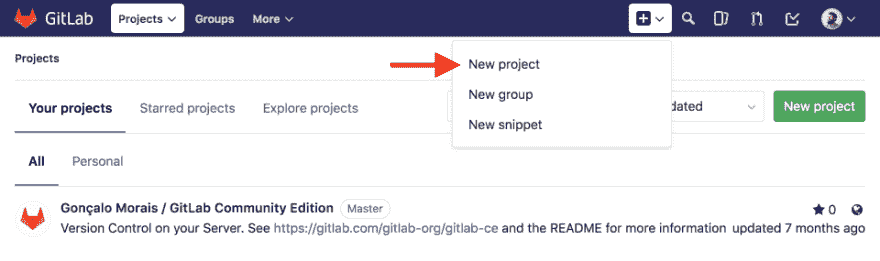
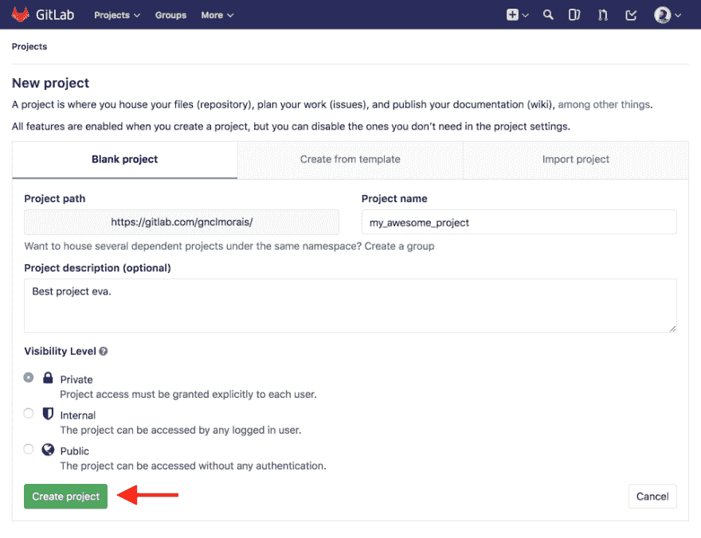
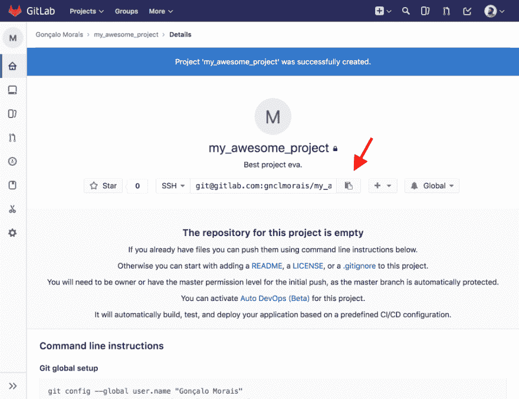

# 更换“git”遥控器

> 原文：<https://dev.to/gnclmorais/replace-a-git-remote-2a2c>

我发现自己有几次等着将整个项目从 GitHub 转移出去，但是我总是忘记这样做的过程。不要误会，GitHub 没有任何问题。但对于我希望保密的项目，当我想到我可以免费将它们保存在 [Bitbucket](https://bitbucket.org) 或 [GitLab](https://about.gitlab.com) 上*和*仍然保留它们的隐私时，我开始怀疑我是否应该将它们都转移到这些平台上，只保留我希望公开发布的内容。
**更新:** GitHub 现在有私人回购了！我也要开始用它们了。🙌🏻

好，让我们假设你在 GiHub 上有一个项目，但是你想把它转移到 GitLab。这样做的过程可能非常简单，主要依赖于更改 git 存储库的`origin` remote。

首先，确保你在 GitLab 上创建了一个新项目: [](https://res.cloudinary.com/practicaldev/image/fetch/s--JInUHtrV--/c_limit%2Cf_auto%2Cfl_progressive%2Cq_auto%2Cw_880/http://blog.gnclmorais.cimg/posts/gitlab_new_project.png)

填写所有你需要的信息，然后点击“创建项目”: [](https://res.cloudinary.com/practicaldev/image/fetch/s--b78YD3Gu--/c_limit%2Cf_auto%2Cfl_progressive%2Cq_auto%2Cw_880/http://blog.gnclmorais.cimg/posts/gitlab_create_project.png)

现在我们有了一个新项目，抓取项目的`git`链接(只要点击就会被复制): [](https://res.cloudinary.com/practicaldev/image/fetch/s--vANukfYc--/c_limit%2Cf_auto%2Cfl_progressive%2Cq_auto%2Cw_880/http://blog.gnclmorais.cimg/posts/gitlab_copy_project.png)

太好了，我们找到了一个远程链接。现在我们进入我们项目的文件夹(我们在 GitHub 上托管的那个)并替换掉`origin` remote，基本上是告诉 git 将它的更改推到云中的不同位置:

```
cd my_awesome_project

# Just check the current remotes you have
git remote -v
# origin git@github.com:gnclmorais/my_awesome_project.git (fetch)
# origin git@github.com:gnclmorais/my_awesome_project.git (push)

# Replace the current origin to GitLab's project
git remote set-url origin git@gitlab.com:gnclmorais/my_awesome_project.git

# Check the changes, notice how it doesn't say 'github' anymore
git remote -v
# origin git@gitlab.com:gnclmorais/my_awesome_project.git (fetch)
# origin git@gitlab.com:gnclmorais/my_awesome_project.git (push)

# Now just `git push` and your project will be on GitLab
git push 
```

Enter fullscreen mode Exit fullscreen mode