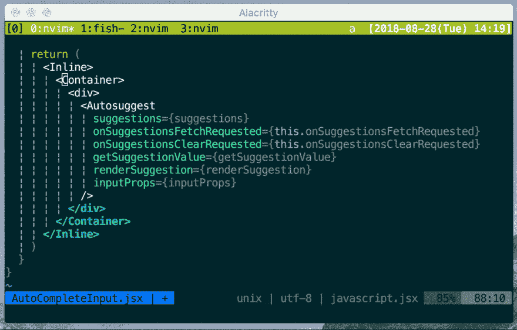

# 同时替换 JSX 的开始标签和结束标签

> 原文：<https://dev.to/acro5piano/replace-jsxs-opening-tag-and-closing-tag-at-the-same-time-4hic>

[T2】](https://res.cloudinary.com/practicaldev/image/fetch/s--77Tf6_FX--/c_limit%2Cf_auto%2Cfl_progressive%2Cq_66%2Cw_880/https://thepracticaldev.s3.amazonaws.com/i/ce6utdca82pczd7f5fdz.gif)

Vim 是我最喜欢的编辑器，而 React 是我最喜欢的前端框架。

当然，我使用 Vim 编辑我的 JSX 文件，但我看到我朋友的 WebStorm 编辑 JSX 标签很容易。WebStorm 可以同时编辑开始和结束标签。

所以我创建了我的 Vim 插件，`vim-jsx-replace-tag`。

[https://github.com/acro5piano/vim-jsx-replace-tag](https://github.com/acro5piano/vim-jsx-replace-tag)

这是一个小的 Vim 插件，但我可以大大提高我的生产力。事实上，Vim 是我最好的编辑。