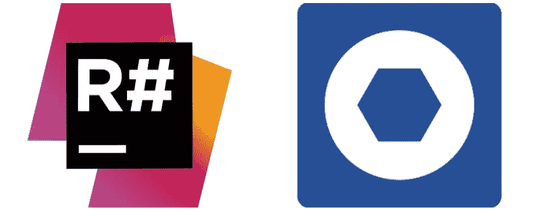

# ReSharper vs. CodeRush:一个快速的肮脏的，不公平的比较

> 原文：<https://dev.to/collinbarrett/resharper-vs-coderush-a-quick-n-dirty-unfair-comparison-41k2>

[T2】](https://collinmbarrett.com/resharper-vs-coderush/)

我的产品团队正在评估购买 [JetBrains ReSharper](https://www.jetbrains.com/resharper/) 或 [DevExpress CodeRush](https://www.devexpress.com/products/coderush/) 来帮助提高我们的代码质量。NET 应用程序组合。我已经使用 ReSharper 好几年了，只是在过去几天才听说并试用 CodeRush。因此，下面的比较确实是不公平的，仅仅是因为我对每个人都有丰富的经验。

## TL；速度三角形定位法(dead reckoning)

我投 ReSharper 一票。

## 观察

我将下面的观察结果按照特征进行了分组，没有特定的顺序。这当然不是一个全面的列表，并且它们没有解释任何产品中的默认配置设置的偏差。

### CodeRush IntelliRush

似乎无关紧要，因为 Visual Studio 2017 包含了本质上相同的功能。

### CodeRush 结构高亮

似乎无关紧要，因为 Visual Studio 2017 包含了本质上相同的功能。

### 键盘快捷键、模板、代码扩展

这两种产品在概念上非常相似，但实现方式不同。不过，我还没有升级到超级用户的快捷方式，因此没有进行超级彻底的比较。

### 代码清理[ `ReSharper++` ]

代码清理是我最喜欢的 ReSharper 特性，我每天都在使用它。CodeRush 也有，但是，在我短暂的试验中，它似乎缺乏。

*   默认情况下，ReSharper 将颜色分级的曲线放在建议的重构下。CodeRush 要求将光标直接放在代码上，然后点击灯泡来查看类似的建议。也许在 CodeRush 中有一个启用高亮显示的选项，但是我没有找到。
*   ReSharper 似乎建议在相同的文件中使用比 CodeRush 更多的重构。同样，我没有实证数据来支持这一点；我刚刚做了一个快速检查。
*   ReSharper 使得像潜在的未处理异常这样的事情比我让 CodeRush 标记的要明显得多。
*   CodeRush 确实能够标记成员名称、评论等中的拼写错误。这是我从未见过 ReSharper 能够做到的。
*   CodeRush 不支持仅对选定的文本运行代码清理。这是关键，因为我只实践重构我已经接触过的方法(因此取得了方法的开发“所有权”)。ReSharper 允许我选择一个我已经在改变的方法(我知道，O/C 原则，但是我们还没有到那一步),并且只针对那个方法运行代码清理。CodeRush 似乎会逐个建议或整个文件进行清理。

### 提取`ReSharper++`

两者都提供了从其他方法中快速提取方法和从其他类中快速提取类的能力。然而，ReSharper 在这样做的时候提供了更全面的向导体验，比如定制返回类型、输入/输出参数、访问级别等。CodeRush 似乎认为你总是想遵循他们固执己见的模式。

### 调试可视化工具[ `ReSharper++` ]

这个特性对 ReSharper 来说是相当新的，但在两个产品中似乎非常相似。我更喜欢 ReSharper 实现的界面，但这很可能是个人偏好。

### 团队分享[ `ReSharper++` ]

每当您在 ReSharper 中更改一个选项时，您都可以将设置保存到您的本地计算机、个人项目特定的配置文件或团队共享的配置文件(以签入源代码控制)。这对于执行团队风格指南策略是非常重要的，并且允许团队设置的更改像任何其他代码更改一样接受代码审查。CodeRush 对这类事情的支持似乎没有那么充实。([看这里](https://www.devexpress.com/Support/Center/Question/Details/T368775/coderush-enforcing-same-code-analysis-rule-set-across-team-and-integrating-with-tfs-ci))

### 测试跑步者

两个产品都有一个单元测试运行程序，但是我没有比较它们，因为遗憾的是实现 TDD 不在我们近期的计划中。

### CodeRush 工具栏切换[ `CodeRush++` ]

我很喜欢 CodeRush 在工具栏中提供快速切换来启用/禁用一些常见和独特的选项，例如:

*   CodeMetrics:我没有在 ReSharper 中看到糖，但不确定它们是否提供了大量的实际价值
*   成员图标:用于识别成员类型的糖，当代码完全折叠时特别方便

### 表演(&罗斯林)`CodeRush++`

CodeRush 已经迁移到 Roslyn 进行静态分析。另一方面，ReSharper 继续使用其专有的建模来实现这一点。因此，ReSharper 往往感觉有点重，表现有点慢。

### 禁用`ReSharper++`

ReSharper 在 Visual Studio 选项中添加了一个窗格，允许您动态挂起/禁用它。可以通过 Visual Studio 扩展和更新模式类似地禁用 CodeRush，但需要重新启动 Visual Studio，这很不方便。

### 社区`ReSharper++`

*   堆栈溢出问题:[ReSharper(~ 4200)](https://stackoverflow.com/tags/resharper/info)vs .[CodeRush(~ 100)](https://stackoverflow.com/tags/coderush/info)
*   谷歌趋势: [ReSharper > CodeRush](https://trends.google.com/trends/explore?date=all&q=ReSharper,CodeRush)
*   在我的专业圈子里，我只见过使用 ReSharper 的开发人员。
*   几周前，JetBrains 赞助了孟菲斯 GiveCamp，并向志愿者参与者发放了一些免费许可证(包括你的会员)。

### 核心业务对齐[ `ReSharper++` ]

JetBrains 在 IDE 工具领域有着良好的记录。他们的核心业务建立在流行的 ide 和 ide 插件组合之上。另一方面，DevExpress 以其 UI 控件而闻名。

### 定价&许可(业务)

撰写本文时的基本产品价格如下。

|  | 第一年 | 第二年 | 三年级以上 |
| --- | --- | --- | --- |
| 终极代码 | $249.99 | $249.99 | $249.99 |
| CodeRush Roslyn | $49.99 | $49.99 | $49.99 |
| ReSharper 终极版 | $399.00 | $319.00 | $239.00 |
| 雷沙尔珀 | $299.00 | $239.00 | $179.00 |

CodeRush Ultimate 是有技术支持的 CodeRush Roslyn。虽然我的 CodeRush 试用时间短得不公平，但获得至少一部分许可的技术支持似乎是值得的。CodeRush 支持 2-5 个许可证的批量折扣:10%，6-10 个许可证:15%，10 个以上许可证:要求定制报价。

ReSharper Ultimate 是带有 [C++](https://www.jetbrains.com/resharper-cpp/) 、 [dotTrace](https://www.jetbrains.com/profiler/) (性能分析器)、 [dotMemory](https://www.jetbrains.com/dotmemory/) (内存分析器)、和 [dotCover](https://www.jetbrains.com/dotcover/) (单元测试运行器和代码覆盖工具)的 ReSharper。ReSharper 支持一种许可服务器模型，为经常变更的团队或者开发人员只需要偶尔访问共享许可的团队提供灵活的浮动许可。

## 结论

我投 ReSharper 一票。

*<small>免责声明:所表达的观点仅是我个人的观点，不代表我的雇主的观点或意见。</small>T3】*