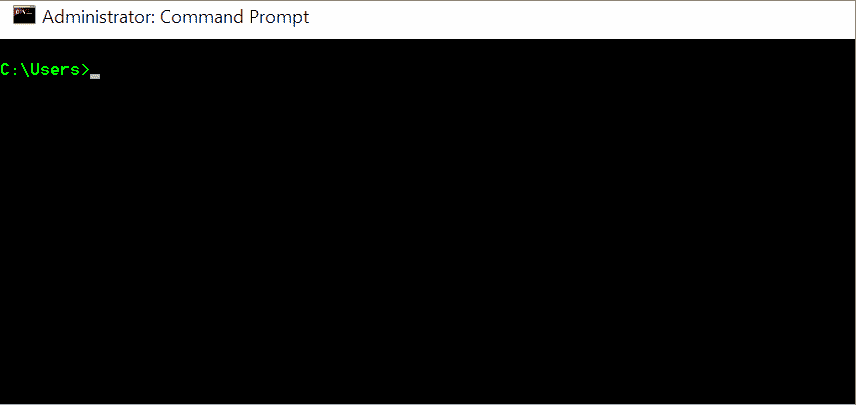

# 解析不同工作站上工具的文件路径

> 原文：<https://dev.to/terrehbyte/resolving-file-paths-to-tools-on-different-workstations-4g55>

*交叉发布自我的[博客](https://terrehbyte.com/resolving-differences-in-tool-paths/)T3】*

在我的台式机、笔记本电脑和 studio 工作空间之间同步设置让我不断迭代我的开发环境设置。无论我在哪里工作，我都可以在任何地方做一个改变，并用它来改进我的工具。

这是通过 GitHub Gists 用[山汗](https://twitter.com/itsShanKhan)的[设置同步扩展](https://marketplace.visualstudio.com/items?itemName=Shan.code-settings-sync)自动传输信息实现的。不幸的是，支持在 VS 代码的设置中使用环境变量目前只是一个[要求的特性](https://github.com/Microsoft/vscode/issues/2809)。这意味着，虽然我的设置将同步，但我每次在除了上传它的工作站之外的任何工作站上下载它时，都必须调整路径。

最近，我找到了一个绕过这个问题的方法:**符号链接**。

## 什么是符号链接？

作为一个概念，符号链接在文件系统中的 A 点和 B 点之间创建一个软链接。点 A 代表“链接”，而点 B 提供“目的地”。任何试图访问 A 点的东西都将从 B 点开始工作，以进行任何后续的目录或文件引用。

[T2】](https://res.cloudinary.com/practicaldev/image/fetch/s--UwCQZ1y_--/c_limit%2Cf_auto%2Cfl_progressive%2Cq_66%2Cw_880/https://thepracticaldev.s3.amazonaws.com/i/i1urknn81jn9875bps08.gif)

创建一个依赖于您的操作系统和可用的工具，但是一般的想法是您将使用命令行应用程序。在 [Windows 10](https://superuser.com/questions/1020821/how-to-create-a-symbolic-link-on-windows-10) 上，这很容易使用`mklink`来完成。

一定要注意行话和术语的区别，例如 [NTFS 连接和符号链接](https://stackoverflow.com/questions/9042542/what-is-the-difference-between-ntfs-junction-points-and-symbolic-links)之间的区别！

## 使用符号链接

我没有预见到在我的台式机和笔记本电脑上使用相同的用户名，导致指向我的用户文件夹的路径不同。(Windows 10 对此没有任何帮助，因为它依赖于您在首次启动时提供的个人信息来创建第一个用户帐户。)为了解决这个问题，我最终创建了一个从`C:\Users\terryn\`到`C:\Users\terry\`的符号链接，这解决了我所有的问题。