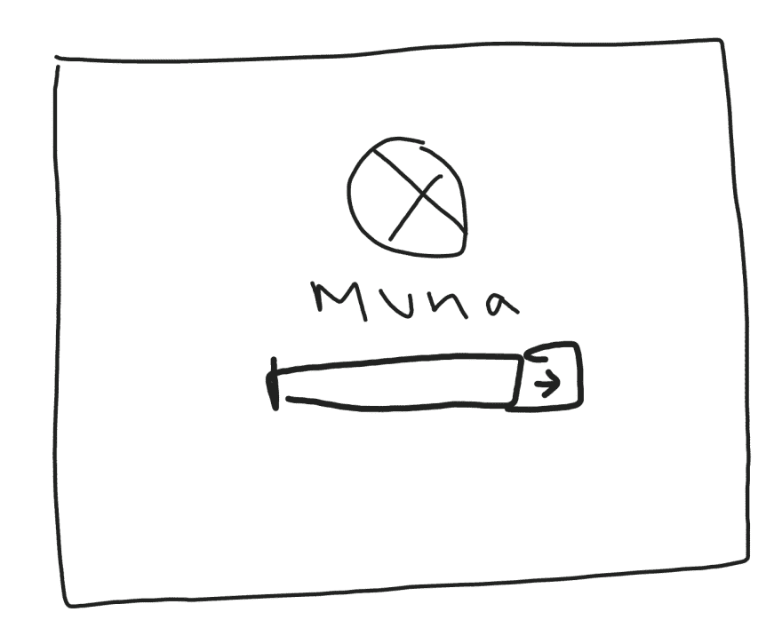
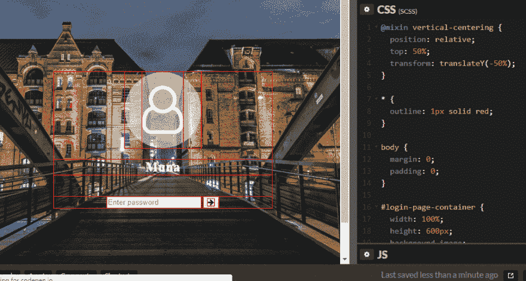
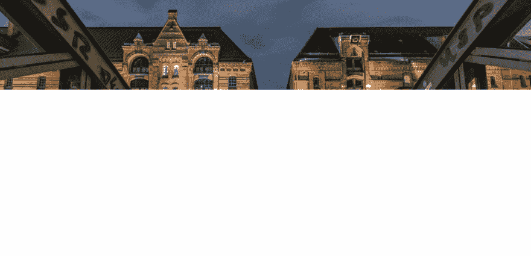

# 响应式 Windows 登录页面 UI 教程-第 1 部分

> 原文：<https://dev.to/munamohamed94/responsive-windows-login-page-ui-tutorial---part-1-----26k1>

[](https://res.cloudinary.com/practicaldev/image/fetch/s--wWoYaim7--/c_limit%2Cf_auto%2Cfl_progressive%2Cq_auto%2Cw_880/https://thepracticaldev.s3.amazonaws.com/i/33rfv1fqpmpg0kx0ipp8.png)
*原本贴在介质上。

在本教程的第 1 部分，我们将使用 HTML 和 SCSS 构建一个 Windows 登录页面的克隆。在本简单教程结束时，您将能够理解如何使用 mixins 编写可重用的代码，以及如何将多个动画应用到本项目的某些组件中。一如既往，本教程是初学者友好的。尽情享受吧！:)

## **草图**

[T2】](https://res.cloudinary.com/practicaldev/image/fetch/s--uMZ7Xdp5--/c_limit%2Cf_auto%2Cfl_progressive%2Cq_auto%2Cw_880/https://thepracticaldev.s3.amazonaws.com/i/34i14hd3nnn5mmp8fbyb.png)

首先，我们需要了解登录页面的布局。我们已经知道了 Windows 登录页面的样子。然而，通过勾勒出组成登录页面的主要组件的基本轮廓，它将帮助我们了解 HTML 代码的结构。这个 Windows 登录页面的草图将作为我们的蓝图。一张地图。

Windows 登录页面的主要组件包括:

*   用户配置文件(显示)图像
*   帐户用户名
*   密码输入框
*   提交按钮

## **HTML**

记住了构成 Windows 登录页面的组件，我们现在可以开始编写 HTML 代码了。

```
<html lang="en">
<head>
  <meta charset="UTF-8">
  <meta name="viewport" content="width=device-width, initial-scale=1.0">
  <meta http-equiv="X-UA-Compatible" content="ie=edge">
  <link rel="stylesheet" href="https://maxcdn.bootstrapcdn.com/font-awesome/4.7.0/css/font-awesome.min.css">
  Windows Login Page UI 
</head>
<body>

   <!--Login Page  -->
    <div id="login-page" class="login-page">
      <div id="login-page-inner">
        <!-- User Icon -->
        <div id="user-icon-container">
          <i class="fa fa-user-o fa-5x"></i>
        </div>    
        <!-- Username -->
        <div id="username-container">
          <h2>Muna</h2>
        </div>      
        <!-- Password box -->
        <div id="input-container">
          <input type="password" id="password" placeholder="Enter password">
          <button id="submit"><i class="fa fa-arrow-right"></i></button>
        </div>

      </div>
    </div>

</body>
</html> 
```

我们将从一个基本的 HTML 框架开始。这里我使用了 Codepen 提供的标准 HTML 框架。您可以通过在 Codepen 的 code playground 中的 HTML 部分键入单词 doc，然后单击键盘上的 tab 键来访问这个基本的 HTML 框架。

我们将使用一个叫做 FontAwesome 的图标库中的几个图标。为了使我们能够利用这个库，我们需要 FontAwesome 的 CDN(内容交付网络)链接。在检索到 FontAwesome 的 CDN 链接后，我们将使用 link 标签将它放在 HTML 中的 head 标签之间，如上所示。为了将来的使用，你可以通过在谷歌或者你选择的任何搜索引擎中输入“Fontawesome cdn link”或者点击这里很容易地找到 FontAwesome 的 CDN 链接。

在 body 部分，我们将输入构成 Windows 登录页面的主要代码。我们将从保存登录页面内容的主容器开始。我们将给主容器一个 id**登录页面容器**。接下来，我们将添加另一个 div，它将使我们能够围绕登录页面 div 容器移动登录页面的组件。这将有助于我们更好地定位组件。我们给这个容器一个 id**登录页面内部**。

接下来，我们将添加组成登录页面的主要组件；用户显示图像、帐户用户名、密码输入框和提交按钮。

让我们从第一个组件开始。用户显示图像。我们将使用 FontAwesome 图标库中的一个图标来表示用户。为了保存这个图标，我们将添加一个 id 为 **user-image-container** 的 div 容器。在 user-image-container div 中是用户图标，它将代表用户配置文件图像。使用 I 标签，我们将添加类 *fa* 、 *fa-user-o* 和 *fa-5x* 。第一个类代表 FontAwesome 图标的前缀，如果没有它，你将无法使用图标库，所以不要忘记包含它。I 标签的第二个类名 *fa-user-o* 表示我们从 FontAwesome 的库中使用的图标的名称。我们 I 标签的最后一个类名， *fa-5x* ，代表图标的大小，用来增加图标大小。

用户图标容器之后的下一个组件是帐户用户名。我们将使用一个 id 为 **username-container** 的 div 作为用户名的容器。在 username-container div 中，我们将使用 heading 标签，在本例中是 h2 标签，作为用户名。

最后两个组件是密码输入框和提交按钮。我们将使用一个 div 容器来保存这两个组件。我们将给这个 div 容器一个 id 名 **input-container** 。在 input-container div 中，我们将有一个表示密码输入框的 input 标记。我们将把输入标记的 type 属性改为 password，因为这将是输入标记将要表示的内容。我们还将给输入标签一个 id**密码**和一个占位符“输入密码”。该占位符属性用于给出该输入字段的预期值的简短描述，在本例中为密码。在我们的输入容器 div 中添加的最后一个组件是 submit 按钮。我们将添加一个按钮标签，并给它一个 id**提交**。在 button 标签之间，我们将插入另一个图标，这次是一个向右箭头图标，使用 I 标签，给它类名 *fa* 和 *fa-arrow-right* 。

## **SCSS**

开始造型！

**有用的提示提醒！**

在我们开始造型之前，我想让你知道我从 Twitter 上的一个开发者那里学到的一个非常有用的技巧(不幸的是，我不记得他是谁了)。为了进行布局调试并能够直观地显示布局以简化编辑，请在样式表的顶部使用以下代码:

```
* { 
   outline: 1px solid red;
} 
```

这是在 HTML 代码的每个元素周围添加一个红色的轮廓。最棒的是，与通过使用 border 属性进行调试不同，使用 outline 不会添加任何额外的像素，因此不会影响我们的布局。随着教程的继续，您将看到这个调试解决方案是如何工作的。

现在让我们开始一些实际的造型！

### **登录页面容器**

```
body {
  margin: 0;
  padding: 0;
}
#login-page-container {
  width: 100%;
  height: 600px;
  background-image: url("http://res.cloudinary.com/mmdirir94/image/upload/v1519167949/architecture-3121009_960_720_lix21u.jpg");
  background-position: center;
  background-repeat: no-repeat;
  background-size: cover;
  font-size: 16px;
  color: white;
} 
```

我们首先通过将边距和填充都设置为 0 来去除 body 标签的默认边距和填充。

开始设计主容器的样式；登录页面容器。

我们将登录页面容器的宽度设置为 100%，这将使它横跨内容区域的整个宽度，并具有响应性，以便背景大小根据浏览器的大小而变化。我们还将给登录页面容器 div 一个 600 像素的高度。

然后，我们将使用 background-image-url 属性向 login-page-container div 插入背景。我们将使用 background-position 属性使背景图像居中，并给它一个值 center。我们将确保背景图像不会在登录页面容器中重复，方法是给它一个 no-repeat 值。接下来，我们将使用 background-size 属性来指定背景图像的大小。通过给 background-size 属性一个 cover 值，它将调整我们的背景图像的大小，使其充满整个登录页面容器，即使这会导致拉伸图像或剪切图像的一部分，它也会这样做。

最后，我们将赋予颜色属性一个白色的值。这将使登录页面容器中的任何文本或其任何子元素的默认颜色为白色。我选择了默认的文本颜色为白色，因为这是最适合我使用的背景图像的颜色，也是使文本在背景图像中最清晰(即容易阅读)的颜色。

### **登录-页面-内部**

```
#login-page-container {
  width: 100%;
  height: 600px;
  background-image: url("http://res.cloudinary.com/mmdirir94/image/upload/v1519167949/architecture-3121009_960_720_lix21u.jpg");
  background-position: center;
  background-repeat: no-repeat;
  background-size: cover;
  font-size: 16px;
  color: white;
  #login-page-inner {
    width: 400px;
    margin: 0 auto;
    @include vertical-centering;
  }
} 
```

转到 login-page-inner div 容器，我们首先将它嵌套在 login-page-container div 中。如果你不熟悉筑巢，这是 SCSS 的众多特色之一。它允许我们创建一个类似于 HTML 代码的可视化层次结构。它不仅使我们的 SCSS 代码更有组织性和可读性，而且一旦 SCSS 代码被编译成 CSS(这是在 Codepen 中自动完成的)，它也使我们的 CSS 更有组织性和可读性。

我们将赋予 log in-page-inner div 400 像素的宽度，并通过使用 margin 属性将其水平居中，并将其值设置为 margin: 0 auto。

要在登录页面容器 div 中垂直居中登录页面内部 div，有几种方法。在这种情况下，我们将使用 position 属性、top 属性和 transform 属性将 login-page-inner div 垂直居中，而不是使用 flexbox。这三个属性组合在一起，允许您将 login-page-inner div 在其父容器 login-page-container 中垂直居中。如果我们稍后需要在代码中垂直居中，我们将使用 mixin 并将其命名为*垂直居中*。

```
@mixin vertical-centering {
  position: relative;
  top: 50%;
  transform: translateY(-50%);
} 
```

我已经将垂直居中的 mixin 放在了 SCSS 样式表的顶部，为了应用它，我使用了 [@include](https://dev.to/include) ，后跟 mixin 的名称。

下面我们可以看到我们的登录页面目前的样子。

[https://codepen.io/Munamohamed94/embed/aqMJOL?editors=1100%20?height=500&default-tab=result&embed-version=2](https://codepen.io/Munamohamed94/embed/aqMJOL?editors=1100%20?height=500&default-tab=result&embed-version=2)

### **登录-页面-内部→动画**

我们将应用一个简单的动画，其中 login-page-inner div，包括嵌套在其中的所有元素，将从上面下降，并从 0 淡入到完全不透明。

```
//Animations
@keyframes fadeIn {
  from {
    opacity: 0;
  }
  to {
    opacity: 1;
  }
} 
```

先说动画中的淡入淡出。为了创建动画，我们使用@keyframes 后跟动画名称，即 fadeIn。然后就很简单了——我们希望 login-page-inner div，包括它的所有内容，不透明度从 0 变为 1(即完全不透明)。

```
@keyframes descend {
  from {
    top: 45%;
  }
  to {
    top: 50%;
  }
} 
```

接下来是动画，它将使 login-page-inner div 以及其中的元素下降。我们希望 login-page-inner-div 向下移动到 login-page-inner div 在 login-page-container 中垂直居中的位置。我们将使用@keyframes 后跟动画名称，在本例中是 descend。接下来，我们将使 login-inner-container div 的起点位于父容器(#login-page-container)的中心上方 5%，终点位于父容器(#login-page-container)的中心。

剩下的工作就是使用 animation 属性将这两个动画应用到 login-page-inner div。

```
...
#login-page-inner {
   ...
   ... animation: fadeIn 1s ease-in-out, descend 0.5s ease-in-out;
} 
```

第一个动画是*fade in*——它将持续 1 秒钟，并具有渐强渐弱的过渡计时功能，这意味着动画将有一个同样缓慢的开始和结束。用逗号隔开，下一个动画是*下凡*。*下降*动画将持续 0.5 秒，类似于*渐强*动画，也将具有渐强渐弱的过渡计时功能。

最终结果将如下所示:

[https://codepen.io/Munamohamed94/embed/rJRwqe%20?height=500&default-tab=result&embed-version=2](https://codepen.io/Munamohamed94/embed/rJRwqe%20?height=500&default-tab=result&embed-version=2)

### **用户图像容器**

```
#login-page-container {
  width: 100%;
  height: 600px;
  background-image: url("http://res.cloudinary.com/mmdirir94/image/upload/v1519167949/architecture-3121009_960_720_lix21u.jpg");
  background-position: center;
  background-repeat: no-repeat;
  background-size: cover;
  font-size: 16px;
  color: white;
  #login-page-inner {
    width: 400px;
    position: relative;
    @include vertical-centering;
    margin: 0 auto;
    animation: fadeIn 1s ease-in-out, descend 0.5s ease-in-out;
    #user-icon-container,
    #username-container,
    #input-container {
      text-align: center;
    }
    #user-image-container {
      margin: 0 auto;
      width: 140px;
      height: 140px;
      font-size: 110%;
      border-radius: 100%;
      background-color: rgba(255, 255, 255, 0.5);
      .fa-user-o {
        line-height: 140px;
      }
    } 
  }
} 
```

从我们到目前为止所做的工作中，我们可以看到 login-page-inner div 中的内容是靠左对齐的。为了解决这个问题，我们将把组成登录页面的所有 3 个主要组件的文本对齐值改为居中。

接下来，我们将设计登录页面的第一个主要组件的样式；用户配置文件图像。让我们从设计用户图像容器 div 开始——这将作为嵌套在用户图像容器 div 中的用户图标的背景。

为了将 user-image-container 在其父容器#login-page-inner 中水平居中，我们将给 user-image-container div 一个“0 auto”的边距。我们将赋予用户图像容器 140 像素的相同宽度和高度。

我们将应用 110%的字体大小，这意味着 user-image-container div 中任何文本(或图标)的字体大小将是我们之前在主父容器#login-page-container 中设置的默认字体大小(16px)的 110%。

作为背景的 user-image-container div 将是圆形的，为此，我们将边界半径值设为 100%。

最后。user-image-container div 的背景色是白色的，稍微透明。为了实现这一点，我们使用 RGBA 颜色，因为它不仅允许我们定义由 RGB 颜色定义的颜色值，还允许我们定义颜色的不透明度。

#### **用户-图像-容器→用户图标**

转到 user-icon，它嵌套在 user-image-container div 中，我们将应用 140 像素的行高。这将使用户图标在用户图像容器 div 中垂直居中。

### **用户名-容器**

```
#login-page-container {
  width: 100%;
  height: 600px;
  background-image: url("http://res.cloudinary.com/mmdirir94/image/upload/v1519167949/architecture-3121009_960_720_lix21u.jpg");
  background-position: center;
  background-repeat: no-repeat;
  background-size: cover;
  font-size: 16px;
  color: white;
  #login-page-inner {
    width: 400px;
    position: relative;
    @include vertical-centering;
    margin: 0 auto;
    #user-image-container,
    #username-container,
    #input-container {
      text-align: center;
    }
    #user-image-container {
      margin: 0 auto;
      width: 140px;
      height: 140px;
      font-size: 110%;
      border-radius: 100%;
      background-color: rgba(255, 255, 255, 0.5);
      .fa-user-o {
        line-height: 140px;
      }
    } 
    #username-container {
      margin-bottom: 40px;
      margin-top: 20px;
      font-family: "Roboto";
      font-size: 105%;
    }
  }
} 
```

登录页面的下一个主要组件是帐户用户名。我们将从用户名-容器 div 开始。

我们将应用 40 像素的底部边距，以便在用户名容器 div 和输入容器 div(包含密码输入框和提交按钮)之间有一些空间。我们还将应用 20 像素的顶部边距，这将在用户名容器和用户名容器上方的用户图像容器 div 之间创建一些空间。

然后，我们将使字体系列的值成为 Roboto。为了使用 Roboto 作为字体系列，我们要么需要使用@import 添加该字体，要么通过在

tag in our HTML. Here, I’ve opted to use @import method — luckily, we can do this easily using the Assets library that is on Codepen already. See the GIF below to see how this is done.

登录页面的下一个主要组件是帐户用户名。我们将从用户名-容器 div 开始。

我们将应用 40 像素的底部边距，以便在用户名容器 div 和输入容器 div(包含密码输入框和提交按钮)之间有一些空间。我们还将应用 20 像素的顶部边距，这将在用户名容器和用户名容器上方的用户图像容器 div 之间创建一些空间。

然后，我们将使字体系列的值成为 Roboto。为了使用 Roboto 作为字体系列，我们需要使用@import 添加这个字体，或者通过在 HTML 的 head 标签之间嵌入字体来添加字体。在这里，我选择了使用@import 方法——幸运的是，我们可以使用 Codepen 上已经存在的资产库轻松地做到这一点。请看下面的 GIF，看看这是怎么做到的。

[T2】](https://res.cloudinary.com/practicaldev/image/fetch/s--yBCTgg2E--/c_limit%2Cf_auto%2Cfl_progressive%2Cq_66%2Cw_880/https://thepracticaldev.s3.amazonaws.com/i/i9zjin3gtutit297nemf.gif)

我们将使我们的字体大小等于 105%,这意味着字体大小将是我们之前在主父容器#login-page-container 中设置的默认字体大小(即 16px)的 105%。

这是我们目前掌握的情况:

[https://codepen.io/Munamohamed94/embed/wyOJJv%20?height=500&default-tab=result&embed-version=2](https://codepen.io/Munamohamed94/embed/wyOJJv%20?height=500&default-tab=result&embed-version=2)

## **输入容器**

```
#login-page-container {
  width: 100%;
  height: 600px;
  background-image: url("http://res.cloudinary.com/mmdirir94/image/upload/v1519167949/architecture-3121009_960_720_lix21u.jpg");
  background-position: center;
  background-repeat: no-repeat;
  background-size: cover;
  font-size: 16px;
  color: white;
  #login-page-inner {
    width: 400px;
    position: relative;
    @include vertical-centering;
    margin: 0 auto;
    animation: fadeIn 1s ease-in-out, descend 0.5s ease-in-out;
    #user-image-container,
    #username-container,
    #input-container {
      text-align: center;
    }
    #user-image-container {
      margin: 0 auto;
      width: 140px;
      height: 140px;
      font-size: 110%;
      border-radius: 100%;
      background-color: rgba(255, 255, 255, 0.5);
      .fa-user-o {
        line-height: 140px;
      }
    }
    #username-container {
      margin-bottom: 40px;
      margin-top: 20px;
      font-family: "Roboto";
      font-size: 105%;
    } 
    #input-container {
      height: 50px;
      #password {
        margin: 0 auto;
        height: 25px;
        width: 300px;
        padding-left: 5px;
      }
      #submit {
        height: 31px;
        padding: 0 10px;
        position: relative;
        right: 5px;
        background-color: #bdbdbd;
        border: none;
        border-top-right-radius: 2px; 
        border-bottom-right-radius: 2px;
        cursor: pointer;
        .fa-arrow-right {
          line-height: 28px;
          color: white;
        }
        &:hover {
          background-color: #9e9e9e;
        }
      } 
    }
  }
} 
```

最后，我们要设计的是包含密码输入框和提交按钮的输入容器。

让我们首先给我们的输入容器 div 一个 50 像素的高度。

#### **输入框→密码输入框**

转到密码输入框(#password)，我们首先将它在输入框中水平居中，边距为 0 auto。我们将赋予它 25 像素的高度和 300 像素的宽度。#password 中的占位符值离#password 的左边界太远，所以我们将应用 5 像素的左填充。

[T2】](https://res.cloudinary.com/practicaldev/image/fetch/s--dkpjzGWd--/c_limit%2Cf_auto%2Cfl_progressive%2Cq_66%2Cw_880/https://thepracticaldev.s3.amazonaws.com/i/dxiy47i1a3iv927xh59k.gif)

#### **输入容器→提交按钮**

最后但同样重要的是，我们的提交按钮。

从我们的 HTML 代码中，我们可以看到嵌套在 button 标签中的是一个 I 标签，它的类名是“fa fa-arrow-right ”,代表我们的箭头图标。按钮元素将作为箭头图标的容器。我们将为提交按钮设置 31 像素的高度和 10 像素的左右填充。这将在箭头图标的两侧添加相等的填充，箭头图标在我们的按钮标记中水平居中，id 为#submit。

提交按钮离密码输入框有点太近，所以我们将首先使用 position 属性应用相对定位，然后使用 right 属性将提交按钮(即#submit)定位在密码输入框(即#password)右侧 5 个像素处。

接下来，我们将把提交按钮的背景色设为#bdbdbd，并通过将 border 属性设为 none 来移除它的边框。为了给 submit 按钮的右上角和右下角一点曲线，我们给它一个 2 像素的 border-top-right-radius 和 border-bottom-right-radius。

为了表明 submit 按钮确实是一个按钮，我们将赋予 cursor 属性一个指针值。除此之外，当你将鼠标悬停在按钮上时，我们会将按钮的颜色从#bdbdbd 更改为#9e9e9e。

确保移除我们在样式表开头应用的红色轮廓，我们的 Windows 登录页面就快完成了。

[T2】](https://res.cloudinary.com/practicaldev/image/fetch/s--n_qeIs4Z--/c_limit%2Cf_auto%2Cfl_progressive%2Cq_66%2Cw_880/https://thepracticaldev.s3.amazonaws.com/i/jswv6kbi4w7aede700f3.gif)

我们已经到了教程第一部分的末尾。在第二部分中，我们将介绍如何使用媒体查询和 mixins 使 Windows 登录页面具有响应性。

为了方便访问，我收集了本教程中的笔，并将它们放在 Codepen 上的一个集合中。你可以点击查看[。](https://codepen.io/collection/AEWVLV/)

嘿，伙计们！自从我在这里发帖已经有一段时间了，所以我想我应该用这个教程重新发帖😄。

我希望你喜欢本教程的第一部分！本教程的第二部分将于下周发布！直到那时！ ✌️

**又及:感谢这几天关注我的所有人，再见！没有 dev.to 团队和我们所在的这个美丽的社区，这是不可能的，所以我希望你在这个平台上享受你的时光！** ❤️