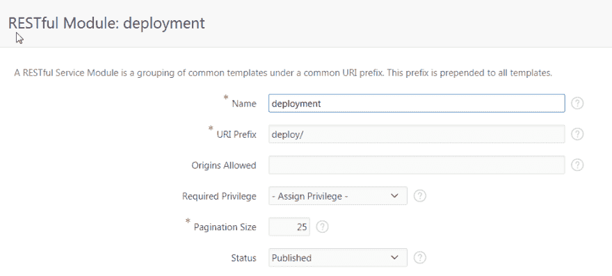
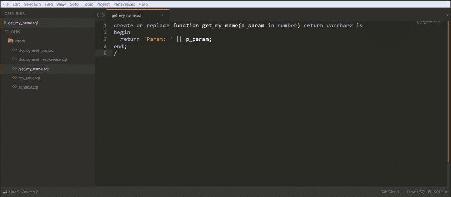

# RESTful 部署

> 原文：<https://dev.to/maikmichel/restful-deployment-23fn>

[T2】](https://res.cloudinary.com/practicaldev/image/fetch/s--dg3ucgPL--/c_limit%2Cf_auto%2Cfl_progressive%2Cq_auto%2Cw_880/https://micodify.de/media/posts/10/ords_logo.png)

多年来，我一直是 APEX 的狂热粉丝。和每个 APEX 粉丝一样，我在 APEX[apex.oracle.com](https://apex.oracle.com)也有一个工作空间。在这里，Oracle 提供了了解 APEX 和主持小型演示项目的可能性。您可以随心所欲地在工作区内进行切换和管理。然而，Oracle 在这里没有提供通过 IDE 或 SQLPlus 对数据库/模式的外部访问。当然，否则 Oracle 将不得不发布 DB 侦听器的端口。

最近我读了彼得·拉甘尼奇的一篇文章。链接:[http://www . Oracle-and-apex . com/streaming-flat-file-data-into-database](http://www.oracle-and-apex.com/streaming-flat-file-data-into-database)

在这里，他描述了如何通过 RESTful 服务上传和评估日志文件。当我读到这个的时候，我有了一个想法。为什么这不应该也适用于我的源代码？

我该说什么呢？有用！有了我目前最喜欢的编辑器 Sublime Text 3，我现在可以将我的各种存储过程(触发器、过程、函数和包)的源代码发送到我的工作区，这个工作区在云中的某个地方，比如在[apex.oracle.com](https://apex.oracle.com)编译它。但是这一切是如何运作的呢？

首先，我们创建一个 RESTful 服务。在 SQL-Workshop 中，我们转到 RESTful Services 并单击 Create。现在我们定义一个 RESTful 服务模块。

[T2】](https://res.cloudinary.com/practicaldev/image/fetch/s--0L2npmXO--/c_limit%2Cf_auto%2Cfl_progressive%2Cq_auto%2Cw_880/https://micodify.de/media/posts/10/2018-02-12-20_34_30-RESTful-Service-Module.png)

然后我们定义一个资源模板。

[T2】](https://res.cloudinary.com/practicaldev/image/fetch/s--AziPgOpt--/c_limit%2Cf_auto%2Cfl_progressive%2Cq_auto%2Cw_880/https://micodify.de/media/posts/10/2018-02-12-20_34_49-Resource-Template.png)

最后，我们定义一个资源处理器。

[T2】](https://res.cloudinary.com/practicaldev/image/fetch/s--xFZvzqom--/c_limit%2Cf_auto%2Cfl_progressive%2Cq_auto%2Cw_880/https://micodify.de/media/posts/10/2018-02-12-20_35_51-Resource-Handler.png)

这个资源处理程序由下面几行代码作为源代码填充。

```
Declare
  v_source_code clob := rtrim(wwv_flow_utilities.blob_to_clob(:body),'/');
  v_err_found boolean := false;
  v_obj_name varchar2(1000) := regexp_substr(lower(dbms_lob.substr(v_source_code, 32000, 1)),
                         'create or replace (function|procedure|package body|package|trigger) ([^ (]*)', 1, 1, null, 2);
Begin
  -- Prepare Header / Output
  owa_util.mime_header('text/plain', true);
  htp.p(''); -- empty

  -- Execute / Compile Code
  execute immediate v_source_code;

  -- Everything is fine, let the user know it
  htp.p('Result: success');
  :status := 200;
Exception
  when others then
    -- Something went wrong
    htp.p('Result: failure');
    htp.p('Object: ' || v_obj_name);
    htp.p('Error: ' || sqlerrm);

    -- Maybe we get the object out of source
    for cur in (select rownum idx, line, position, text
                  from user_errors
                 where name = upper(v_obj_name)
                 order by sequence)
    loop  
      -- FirstRow, let's print heading
      if cur.idx = 1 then
        htp.p(' LINE | POSITION | TEXT');
        v_err_found := true;
      end if;

      -- Print Message
      htp.p(lpad(cur.line, 7, ' ')||' | '||lpad(cur.position, 8, ' ') ||' | '||cur.text);
    end loop;

    if not v_err_found then
      htp.p(dbms_utility.format_error_backtrace);
      htp.p(v_source_code);
    end if;

    :status := 400;
End; 
```

Enter fullscreen mode Exit fullscreen mode

基本上，这几行只是关于“立即执行”执行文件内容的事实。如果出现错误，系统会尝试确定数据库对象并显示相应的错误。现在我们要做的就是上传我们的源代码。此时我选择了旋度。但我也认为 wget 应该是可行的。使用下面的命令，我们加载文件 my_stored_procedure 的内容。sql 到工作区 my_workspace_name，并在那里运行它。

```
curl -X POST \
 --header "Content-Type:text/xml;charset=UTF-8" \
 --data-binary @my_stored_procedure.sql \
 https://apex.oracle.com/pls/apex/my_workspace_name/deploy/compile/ 
```

Enter fullscreen mode Exit fullscreen mode

为了用 Sublime Text 3 直接上传和编译源代码，我们创建了一个 Sublime Text 构建系统使用的批处理文件，例如 D: \my_rest_deploy。蝙蝠。

```
@echo off

REM -- For information only
echo File: %2
echo Path: %1
echo Url: %3
echo

REM -- Change to the directory where the sublime file is
cd %1

REM -- Deploy to https://apex.oracle.com/pls/apex/my_workspace_name/deploy/compile/
curl -X POST --header "Content-Type:text/xml;charset=UTF-8" --data-binary @%2 %3 
```

Enter fullscreen mode Exit fullscreen mode

然后我们创建一个新的构建系统，在 Sublime Text 中的“工具/构建系统/新构建系统…”

```
{
 "cmd":["D:/my_rest_deploy.bat", // Script
        "$file_path", // %1
        "$file_name", // %2
        "https://apex.oracle.com/pls/apex/die21/deploy/compile/" // %3 = RestURL
        ],
 "selector": "source.plsql.oracle",
 "shell":"true"
} 
```

Enter fullscreen mode Exit fullscreen mode

如果我现在编辑我的代码并选择了合适的构建系统，一个简单的 Ctrl+B 就足以将我的包或任何东西放到云中。例如，如果你想为 ALEXA 编写一个技能，但只能通过 web 界面访问数据库，这是非常有用的。

[T2】](https://res.cloudinary.com/practicaldev/image/fetch/s--EVft4pEV--/c_limit%2Cf_auto%2Cfl_progressive%2Cq_66%2Cw_880/https://micodify.de/media/posts/10/sublime_build.gif)

解决方案并不完美，您永远不应该在生产环境中这样做。谁知道这个网址是在最坏的情况下掌握你的数据库！

在这一点上，我要感谢[彼得](https://twitter.com/PeterRaganitsch)和[克里斯瑞斯](https://twitter.com/krisrice)，是他们给了我这个想法…