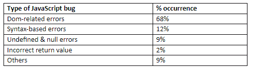

# 了解 JavaScript 错误(以及如何避免它们)的研究结果

> 原文：<https://dev.to/educationecosystem/results-of-a-study-to-understand-javascript-bugs-and-how-to-avoid-them-2e64>

JavaScript 是一种流行的编程语言，广泛用于 web 应用程序中，以增强客户端的用户交互性。

Benhartouz 目前正在使用 JavaScript 教人们如何建立一个搜索工作的网站，他说“不幸的是，这种无处不在的语言容易出现漏洞和错误，这让大多数开发人员皱眉和抓狂。”你可以访问链接来了解更多关于他的项目。

不列颠哥伦比亚大学(UBC)的研究人员最近进行了一项研究[来了解客户端 JavaScript 错误的原因和后果。](http://salt.ece.ubc.ca/publications/docs/frolin-tse16.pdf)

研究人员调查了来自 19 个错误库的 502 个错误报告，发现了一些使 JavaScript 驱动的应用程序行为异常的常见模式。

下表总结了研究结果:

[T2】](https://res.cloudinary.com/practicaldev/image/fetch/s--k-etZwfX--/c_limit%2Cf_auto%2Cfl_progressive%2Cq_auto%2Cw_880/https://thepracticaldev.s3.amazonaws.com/i/umlwyav1c7960l0dpq48.png)

在本文中，我将阐述这项研究的主要发现，以及如何使您的 JavaScript 程序不容易出错和出现性能故障。

## 1。与 DOM 相关的错误

令人惊讶的是，根据 JavaScript bug 报告研究，与 DOM 相关的错误占了大多数，达到 68%。

文档对象模型，通常称为 DOM，是一个动态的树状结构，由应用程序中的组件以及它们之间的交互方式组成。

通过 DOM API 调用，您可以利用 JavaScript 操纵 DOM 的组成部分，使 web 页面具有交互性，而无需重新加载页面。

虽然 DOM 的特性允许开发人员为应用程序添加交互性，但它们也是 JavaScript 应用程序中引入缺陷的主要途径之一。

例如，大多数开发人员犯的一个常见错误是在将 DOM 元素加载到网页之前引用它。

代码如下:

```
<!DOCTYPE html>
<html>
<body>
     <script>

document.getElementById("javascript").innerHTML = "JavaScript is Fun!";

  //it throws an output error
    </script>
    <div id="javascript"></div>
    </body> </html> 
```

如果运行这样的代码，它会抛出一个错误。JavaScript 代码通常按照它在文档中出现的顺序加载和运行；因此，在执行代码时，浏览器不知道被引用的元素。

有几种方法可以解决这个问题:

*   将`<div id="javascript"></div>`放在脚本前面。

```
<!DOCTYPE html>
<html>
<body>

    <div id="javascript"></div> 
    <script>

document.getElementById("javascript").innerHTML = "JavaScript is Fun!";

  //it does not throw an output error

    </script> 
</body> </html> 
```

*   使用 JavaScript `onload`事件属性在页面加载后立即运行代码。

```
<!DOCTYPE html>
<html>
<body onload="bugJS()">

    <div id="javascript"></div> 
    <script>

       function bugJS(){

     document.getElementById("javascript").innerHTML = "JavaScript is Fun, yeah?";

        }

    </script> 

</body> </html> 
```

## 2。基于语法的错误

这项研究发现，12%的 JavaScript 错误是由于 JavaScript 程序中的语法错误造成的。语法错误是由于与 JavaScript 编程语言的标准语法不一致的语法错误造成的。

以下是两个常见的基于语法的错误:

*   不匹配的括号

当您忘记相应地匹配括号时，尤其是在处理复杂的应用程序时，通常会出现此错误。

下面是一个没有相应的右括号的 JavaScript 对象函数的例子。

```
functionPerson(name,street){

this.name = name;

this.street = street;

this.info =function(){

returnthis.name +this.street;

//closing bracket missing here

} 
```

*   缺少分号

尽管在 JavaScript 中不需要用分号来结束每条语句，并且您的代码执行起来不会有任何问题，但是当您有几行代码时，问题通常会出现，其中一些代码最终堆积在同一行上。

因此，为了避免这样的错误，最好总是用分号结束语句。

为了避免在代码中犯这样的语法错误，您需要花时间提高 JavaScript 编程技能。

例如， [Kauress](https://www.liveedu.tv/kauress/lj6eO-how-to-code-a-single-operation-calculator-in-javascript/) ，一位来自美国，拥有四年多 web 编程经验的人，已经完成了一个关于如何使用 JavaScript 编写计算器的项目。

您可以使用他的项目来提高您的 JavaScript 编程技能，并避免犯语法错误。

##3.未定义和空错误

UBC 大学的研究人员发现，误用`undefined`和`null`关键字会导致 9%的 JavaScript 错误。

这项研究的结果表明，大多数 JavaScript 程序员不明白如何正确使用这两个关键字来避免 JS web 应用程序中的编码错误。

`null`关键字是一个赋值，它代表一个不存在的值。它的行为也像一个物体。

这里有一个例子:

```
var bugJS =null;

    console.log(bugJS);

        // null is the output

   console.log(typeof bugJS);

        // object is the output 
```

相反，`undefined`关键字意味着声明的变量或任何其他属性没有赋值。其实本身就是一种类型。

这里有一个例子:

```
var bugJS;

   console.log(bugJS);

        // undefined is the output

   console.log(typeof bugJS);

        // undefined is the output 
```

此外，当使用相等和相同运算符将`null`和`undefined`关键字相互比较时，只有前者认为它们相等。

```
console.log(null==undefined);

       //true

  console.log(null===undefined);

       //false 
```

## 4。return 语句的不正确用法

`return`语句用于告诉解释器一个 JavaScript 函数的运行已经完成，需要返回值。

根据研究结果，return 语句的不当使用占所有 JavaScript 错误的 2%。

例如，大多数 web 程序员犯的一个常见错误是破坏`return`语句。

下面是一个代码示例:

```
 function bugJS(z) {

    var

    fun =10;

    return 

    z * fun;

}

console.log(bugJS(77));

//it leads to undefined error 
```

运行上述函数将导致一个未定义的错误。

解释器是这样执行代码的:

```
function bugJS(z) {

    var

    fun =10;

    return;//semicolon inserted here automatically

    z * fun;

}

console.log(bugJS(77));

//it leads to undefined error 
```

由于解释器会自动在 return 语句的行尾插入分号，这将导致一个未定义的错误。

这也说明了为什么用分号结束 JavaScript 语句很重要。

## 5。JavaScript 错误的其他原因

最后，研究发现其他 JavaScript 编程错误导致了 9%的 JavaScript 代码错误。

例如，这类错误的一个常见原因是在开发应用程序时忽略了浏览器的差异。

随着对 JavaScript 代码有不同解释的各种 web 浏览器的出现，对于开发人员来说，确保他们的应用程序能够在不同的浏览器中顺利运行是至关重要的。

否则，如果您的代码不能在主流浏览器上很好地工作，您的应用程序可能无法满足目标受众的需求。

例如，大多数现代浏览器都支持的新的 JavaScript arrow 函数不能在老式的 Internet Explorer 浏览器上工作。

下面是一个箭头函数的示例:

```
 var colors =['blue','white', red];

colors.forEach(values =&gt; console.log(values));

//blue

//white

//red 
```

## 结论

如果您想确保您的 JavaScript 程序没有错误，您需要了解这种语言是如何工作的。

而且，掌握这门复杂语言的最好方法是使用 [LiveEdu](https://www.liveedu.tv/guides/programming/javascript/) 提供的项目构建真正的应用程序。

通过实践(大量的实践),您将能够构建出令人惊叹的 web 应用程序来改善用户体验。

快乐的无 JavaScript 编码！