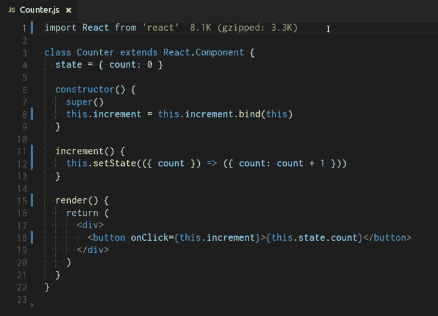

# 重新思考 JavaScript:彻底消除和根除 JavaScript 的 this。

> 原文：<https://dev.to/joelnet/rethinking-javascript-the-complete-elimination-and-eradication-of-javascripts-this-3m3j>

[T2】](https://res.cloudinary.com/practicaldev/image/fetch/s--fm5ZgiO4--/c_limit%2Cf_auto%2Cfl_progressive%2Cq_auto%2Cw_880/https://raw.githubusercontent.com/joelnet/nothis/master/assets/headstone-509x600.png)

[T2】](https://res.cloudinary.com/practicaldev/image/fetch/s--ZDnj5rkN--/c_limit%2Cf_auto%2Cfl_progressive%2Cq_66%2Cw_880/https://github.com/joelnet/nothis/raw/master/assets/nothis.gif)

如果`this`这么难推理，为什么我们不停止使用它呢？说真的。**为什么。不要。我们。只是。停下来。使用。它。**？

如果你读过[我是如何在把 90%的 JavaScript 扔进垃圾桶](https://hackernoon.com/how-i-rediscovered-my-love-for-javascript-after-throwing-90-of-it-in-the-trash-f1baed075d1b)后重新发现我对它的热爱的，那么当我说我要扔掉`this`时，你就不会感到惊讶了。`this`没了。再见。`this`不会错过。

有了函数式 JavaScript，你几乎不会看到`this`。我说几乎从不，因为即使*你的代码*不包含`this`，你对第三方库几乎没有控制权。像 [React](https://reactjs.org/) 、 [jQuery](https://jquery.com/) 、 [eventemitter2](https://www.npmjs.com/package/eventemitter2) 和许多其他的流行库将会强迫`this`进入你的喉咙。

这里有一些关于图书馆如何强迫我们使用`this`的例子。

## 迫本在作出反应

```
// 😞 GROSS: this
class Counter extends React.Component {
  constructor() {
    super()
    this.increment = this.increment.bind(this)
  }

  increment() {
    this.setState(s => ({ count: s.count + 1 }))
  }

  render() {
    return (
      <div>
        <button onClick={() => this.increment}>{this.state.count}</button>
        <button onClick={this.increment.bind(this)}>{this.state.count}</button>
      </div>
    )
  })
} 
```

Enter fullscreen mode Exit fullscreen mode

## 在 jQuery 中强制此

```
// 😞 GROSS: this
$('p').on('click', function() {
  console.log($(this).text())
}) 
```

Enter fullscreen mode Exit fullscreen mode

## 在 eventemitter2 中强制此

```
const events = new EventEmitter2({ wildcard: true })

// 😞 GROSS: this
events.on('button.*', function() {
  console.log('event:', this.event)
})

events.emit('button.click') 
```

Enter fullscreen mode Exit fullscreen mode

`this`无处不在！

# 那么有什么问题呢？

一个问题是如果你使用箭头函数的话`this`是不可访问的。有时候我更喜欢写一个箭头函数，而不是经典的`function`。好吧，我*总是*喜欢写箭头函数。

另一个问题是`this`可能会被无意中重新分配。所以你的功能可能会因为别人如何使用它而失败。

```
// WTF? these will produce different outputs
const say = cat => cat.speak() //=> "meow"
const say = ({ speak }) => speak() //=> Error: Cannot read property 'sound' of undefined

// WTF? these will produce different outputs
cat.speak() //=> "meow"

const speak = cat.speak
speak() //=> undefined 
```

Enter fullscreen mode Exit fullscreen mode

所以让我们彻底摆脱`this`吧。

# 没有这个。

我创建了一个简单的函数装饰器来去掉`this`。[这里有更多关于函数装饰者的信息](https://dev.to/joelnet/function-decorators-part-2-javascript-4km9)。

在创建了`nothis`之后，我创建了一个包，这样我就可以在我所有的项目中使用它。

你会问这看起来像什么？

## 这不是在反应吗

```
import React from 'react'
import nothisAll from 'nothis/nothisAll'

// 🔥 LIT: no this in sight!
class Counter extends React.Component {
  state = { count: 0 }

  constructor() {
    super()
    nothisAll(this)
  }

  increment({ setState }) {
    setState(({ count }) => ({ count: count + 1 }))
  }

  render({ increment, state }) {
    return (
      <div>
        <button onClick={increment}>{state.count}</button>
      </div>
    )
  }
} 
```

Enter fullscreen mode Exit fullscreen mode

## jQuery 中没有这个

```
$('p').on('click', nothis(ctx => console.log($(ctx).text()))) 
```

Enter fullscreen mode Exit fullscreen mode

## not this in event mitter 2

```
const events = new EventEmitter2({ wildcard: true })

// 🔥 LIT: nothis + destructuring!
events.on('button.*', nothis(({ event }) => console.log('event', event)))

events.emit('button.click') 
```

Enter fullscreen mode Exit fullscreen mode

# 但是等等！还有呢！

`fixthis`可以修复您现有的一些`this`重新绑定问题！

```
import fixthis from 'nothis/fixthis'

const cat = {
  sound: 'meow',
  speak: function() {
    return this.sound
  }
}

// 😞 GROSS: this is unintentionally rebound
const speak = cat.speak;
speak() //=> Error: Cannot read property 'sound' of undefined

// 🔥 LIT: this stays this
const fixedCat = fixthis(cat)
const speak = fixedCat.speak;
speak() //=> "meow" 
```

Enter fullscreen mode Exit fullscreen mode

# 但是我需要帮助...

安装它...

```
npm install -P nothis 
```

Enter fullscreen mode Exit fullscreen mode

将其添加到您的库中...

```
import nothis from 'nothis' 
```

Enter fullscreen mode Exit fullscreen mode

玩它...

...在这里报告错误、请求功能或为项目做贡献[https://github.com/joelnet/nothis](https://github.com/joelnet/nothis)。

这是我的**重新思考 JavaScript 系列**的最新补充。如果这让您感到好奇，请查看本系列中我的其他几篇文章:

*   [if 语句](https://hackernoon.com/rethinking-javascript-the-if-statement-b158a61cd6cb)
*   [For 循环的死亡](https://hackernoon.com/rethinking-javascript-death-of-the-for-loop-c431564c84a8)
*   [通过运行功能取代中断](https://hackernoon.com/rethinking-javascript-break-is-the-goto-of-loops-51b27b1c85f8)
*   [删除 switch 语句以获得更好的代码](https://hackernoon.com/rethinking-javascript-eliminate-the-switch-statement-for-better-code-5c81c044716d)

有任何问题请在推特上联系我