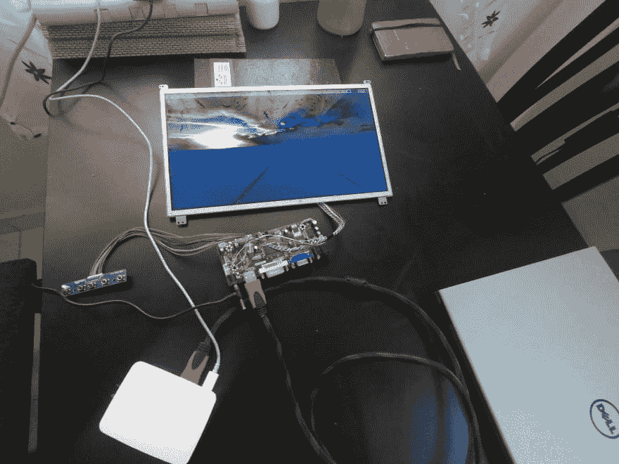

# 用树莓派重新利用旧笔记本电脑的液晶显示器。

> 原文：<https://dev.to/adarshkkumar/reusing-lcd-from-old-laptop-with-raspberry-pi-52p>

所以我把这台旧的 Dell Studio 14 笔记本电脑放在家里。用了将近 5 年，主板才放弃。我想要一个便宜的展示我最近买的树莓派。

我谷歌了一下，发现我们可以用 RaspberryPi 重新使用笔记本电脑的 LCD 面板，但是我们需要一个驱动/控制板。用于通信的接口是 [LVDS](http://https://en.wikipedia.org/wiki/Low-voltage_differential_signaling) 。我从易趣上花 30 美元买了这块板。它很容易安装，现在我的树莓派有了一个 14 英寸的显示屏。

[T2】](https://res.cloudinary.com/practicaldev/image/fetch/s--Ry7z-pz_--/c_limit%2Cf_auto%2Cfl_progressive%2Cq_auto%2Cw_880/https://www.jigsawcode.com/conteimg/2018/06/0.jpeg)

[T2】](https://res.cloudinary.com/practicaldev/image/fetch/s--uR9bfAfZ--/c_limit%2Cf_auto%2Cfl_progressive%2Cq_auto%2Cw_880/https://www.jigsawcode.com/conteimg/2018/06/1.jpeg)

这就是了。我们确实可以将任何支持 HDMI 或 DVI 的东西连接到它，可以用作笔记本电脑的辅助显示器，或者制作一个数码相框。如果你想让它看起来酷一点，看看这个视频吧。

> 最初发布于 [JigsawCode](https://www.jigsawcode.com/)