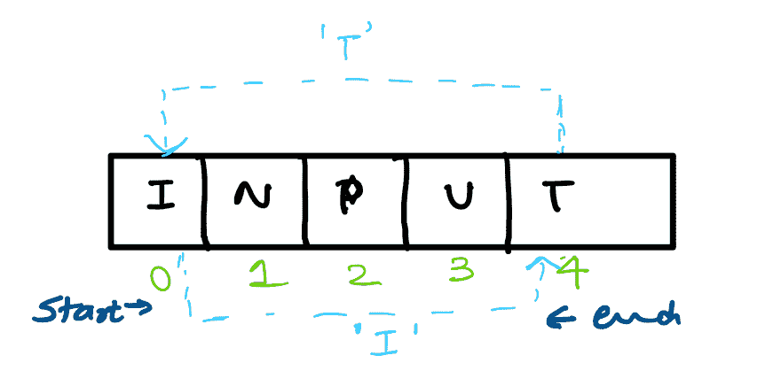
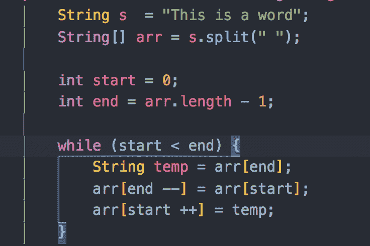
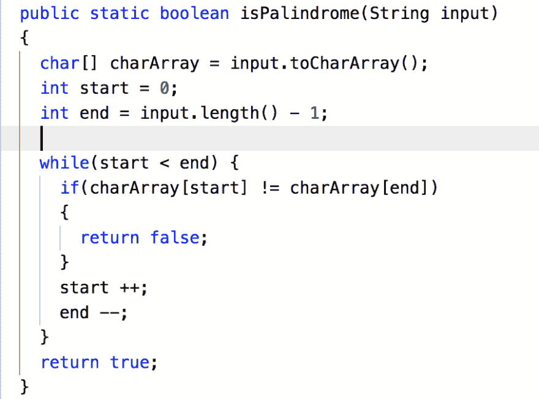

# 倒一个字。

> 原文：<https://dev.to/s_awdesh/reverse-a-word-352m>

我之前在这里和这里[写了几篇关于如何在一个数组中找到重复的文章，我们看到了这个问题的不同种类。我现在想把话题转到与弦相关的问题上。之前关于数组的文章为我们解决字符串相关问题打下了良好的基础，因为字符串本质上是一个字符数组。](https://dev.to/s_awdesh/check-if-duplicate-exists-inside-a-sorted-array-3aa5)

我们得到一个只包含字母字符的单词。考虑到字符串是一个字符数组，解决某些数组问题的最大优势和关键之一是同时向前和向后迭代数组。

我们可以使用两个指针，其中一个从数组的开头开始，另一个从数组的结尾向内移动。

[T2】](https://res.cloudinary.com/practicaldev/image/fetch/s--mIssU1k1--/c_limit%2Cf_auto%2Cfl_progressive%2Cq_auto%2Cw_880/https://thepracticaldev.s3.amazonaws.com/i/j5sns0ihrcrrrxwz2lvl.jpeg)

这些信息对解决这个问题至关重要。让我们使用算法并写下代码。

[https://repl.it/@AwdeshSharma1/SickJumpyMinimalsystem?lite=true](https://repl.it/@AwdeshSharma1/SickJumpyMinimalsystem?lite=true)

我们可以用同样的算法来颠倒一个句子中的单词吗？例如“这是一个单词”应该通过算法变成“单词 a 是这个”。如果我们用一个空格分割字符串，我们将得到一个字符串数组，然后我们可以使用上面的算法来反转一个句子。

[T2】](https://res.cloudinary.com/practicaldev/image/fetch/s--Aj5-FM53--/c_limit%2Cf_auto%2Cfl_progressive%2Cq_auto%2Cw_880/https://thepracticaldev.s3.amazonaws.com/i/wj3xsxkcvwmlzj9wg9h3.png)

另一个我们可以利用相同算法的问题是解决字符串回文问题。当一个单词从后向前读都一样时，它就是一个回文，例如 kayak，noon 等。

现在我们知道，我们可以向前和向后遍历一个字符串，我们可以用这些知识来解决回文问题。

[T2】](https://res.cloudinary.com/practicaldev/image/fetch/s--GW6OM9DS--/c_limit%2Cf_auto%2Cfl_progressive%2Cq_auto%2Cw_880/https://thepracticaldev.s3.amazonaws.com/i/rw0jr5odxx6jjx5k2ykr.png)

这就是这篇文章的内容。我计划在下一篇文章中写更多关于字符串相关的问题。

敬请关注。:)