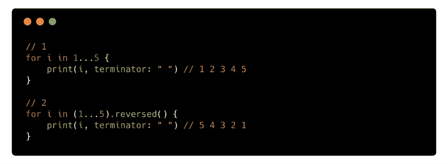
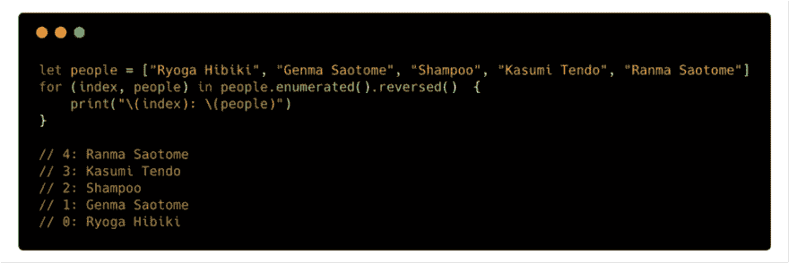

# Swift 4 中的反向收集

> 原文：<https://dev.to/tiptopgs/reverse-collection-in-swift-4-3ph>

曾经需要反转字符串中的字符或者 for 循环中的索引吗？为此，您可以使用 **ReversedCollection** 。

下面是一个在字符串上使用 reversed 的快速示例。

 

<figcaption>反转一串</figcaption>

您也可以将新反转的字符串存储到另一个变量中:

[T2】](https://res.cloudinary.com/practicaldev/image/fetch/s--KkJNph5f--/c_limit%2Cf_auto%2Cfl_progressive%2Cq_auto%2Cw_880/https://cdn-images-1.medium.com/max/1024/1%2A28xkT2rSXX0_YG1bSuaRnA.png)

如下所示，遍历索引及其反转索引非常简单。

 

<figcaption>反转指数</figcaption>

反转的好处在于，您不会创建新的存储。您还可以转换集合中的反转元素，并获得一个新数组:

 

<figcaption>反转数字并转换结果</figcaption>

下面是另一个枚举数组中的索引和反转元素的示例:

 

<figcaption>倒序列举列表</figcaption>

来自苹果的文档:

reversed()方法在应用于具有双向索引的集合时总是懒惰的，但不会隐式地赋予应用于其结果的算法懒惰性。换句话说，对于具有双向索引的普通集合 c:

*   c.reversed()不会创建新的存储
*   c .反转()。map(f)急切地映射并返回一个新数组
*   c.lazy.reversed()。map(f)延迟映射并返回一个 LazyMapCollection

### 从这里去哪里？

你可以在[反向收集](https://developer.apple.com/documentation/swift/reversedcollection)上查看苹果的 API 了解更多信息。