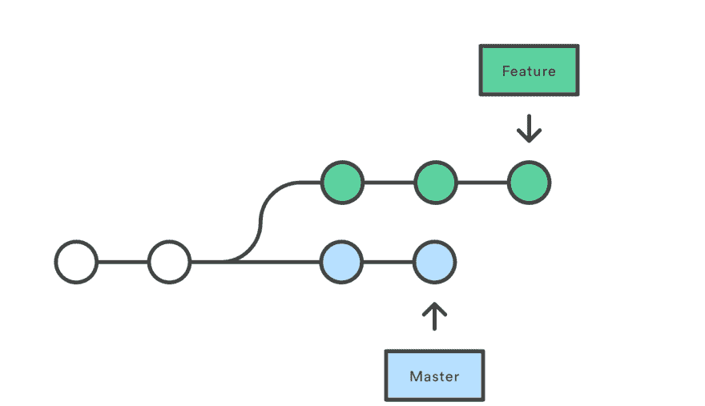
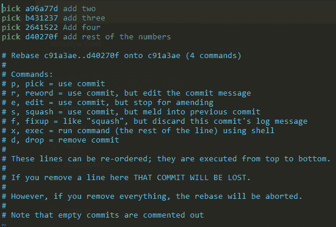
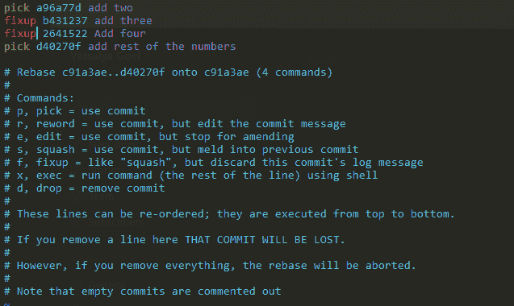
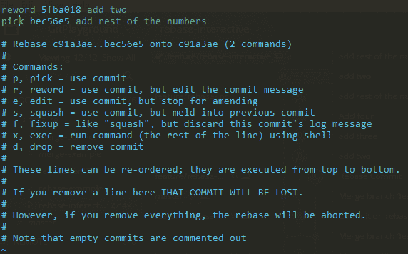

# 重写 Git 历史:对 Git 固执己见

> 原文：<https://dev.to/vatsalyagoel/rewriting-git-history-being-opinionated-about-git-2bn1>

[T2】](https://res.cloudinary.com/practicaldev/image/fetch/s--uB-ygUGs--/c_limit%2Cf_auto%2Cfl_progressive%2Cq_auto%2Cw_880/https://vatsalyagoel.com/conteimg/2018/07/banner.PNG)

在我短暂的开发生涯中，我听到过许多关于如何正确使用 Git 的不同观点。很多时候，答案是“视情况而定”,对于一个刚开始使用 Git 的用户来说，这可能会令人望而生畏。我挑选了一些让我的源码控制习惯更好的技巧，我将在下面提到。每个人的工作流程都是不同的，但是这里是我关于维护源代码控制的建议，这样当一个新的开发人员加入你的团队时，他们就不会对从哪里开始感到困惑。

# 学习`git` CLI

不要误解我的意思，Git 图形用户界面很好，提供了很多功能，如果你使用 cli 会觉得很笨拙，比如比较[差异](https://git-scm.com/docs/git-diff)、反转[大块](http://www.gnu.org/software/diffutils/manual/html_node/Hunks.html)或者只是查看历史。如果你想做的只是提交和推送，GUI 就足够了。Git 提供了许多其他工具，当处理历史而不是内容本身时，cli 是您的好朋友。

# 主干基础发展

给一点上下文，`master`或`trunk`是生产就绪代码应该存在的地方，并且如果您克隆一个新的存储库，它是默认情况下被检出的分支。我曾多次克隆一个 git repo，查看历史记录，发现有一个`develop`或`release`分支比主分支提前 100 次提交，主分支最近一次更新是在 2 个月前，由于过时的依赖关系或没有我需要使用的分支的历史上下文，该分支的代码甚至不再编译。

这引发了许多问题，例如:

1.  我们不再使用 master 了吗？
2.  分支是否被弃用？
3.  我是否只需将主机重置为当前的`head`？

[Trunk Based Development](https://trunkbaseddevelopment.com/) 是一个被定义为“*的工作流，一个源代码控制分支模型，在这个模型中，开发人员在一个名为“Trunk”的分支中就代码进行协作，通过采用文档化的技术来抵制任何创建其他长期开发分支的压力。因此，他们避免合并地狱，不破坏建设，并幸福地生活在一起。*“因此，创建短暂的功能分支，这些分支经常被集成，这样任何未来加入项目的开发人员都会很高兴。

如果你想跟踪发布，那么[标记](https://git-scm.com/book/en/v2/Git-Basics-Tagging)你发布的提交。这就是标签的用途。

# 从不直接承诺`master`

跟进基于主干的开发，不要直接提交给 master。保护您的总分行免受滥用，例如:

1.  "修复了错别字"
2.  " Hack-v2 "
3.  "解决合并冲突"

在`hotfix/typo`或`feature/add-this-feature`上做出你的改变，创建一个[拉请求](https://help.github.com/articles/about-pull-requests/)，让其他人审查你的代码。别害怕，代码审查很好。这还允许您在合并配置项之前运行测试，以便您可以修复由于您的更改而导致的问题。如果你使用一个远程的源库，你可以物理地保护你的分支，这样就没有人能找到事实的来源。

*   [Github](https://help.github.com/articles/configuring-protected-branches/)
*   [VSTS](https://docs.microsoft.com/en-us/vsts/git/branch-policies?view=vsts)

# 合并 vs 重置基础

关于什么是正确的做事方式，这是一个讨论最多的问题。

证明？

[T4】](https://res.cloudinary.com/practicaldev/image/fetch/s--qzOZA6n8--/c_limit%2Cf_auto%2Cfl_progressive%2Cq_auto%2Cw_880/https://vatsalyagoel.com/conteimg/2018/07/merge-vs-rebase.png)

总是重定基础而不是合并。这让你的历史看起来更美好。让 pull 请求创建一个合并提交到 master。这是您唯一一次希望在代码中进行合并。

1.  `git checkout master`
2.  `git pull origin master`
3.  `git checkout feature/feature-youre-working-on`
4.  `git rebase master`
5.  `git push -f origin feature/feature-youre-working-on`

`git push -f`又名强制推送，用于在您的历史记录发生任何变化(如重新设定基准)时覆盖远程分支。

注意:此标志会导致远程存储库丢失提交；小心使用。

现在你可能会说强迫推不是坏事。如果没有其他人和你在同一个分支上工作，也就是说，没有长时间运行的分支，那么你不应该担心强制推送。了解你自己的分支上的变化并操纵它是你的决定，因为 master 是受保护的，你不能修改任何版本。

# 提交消息

编写有意义的提交消息。提交消息很重要，可以帮助新开发人员理解所做更改的上下文。如果使用积压管理系统，将您的提交链接到您的积压工作中的工作项。利用你的信息中有标题和正文的事实。言简意赅，大家都会喜欢你。

# 工具和有用的命令

在我使用 git 的整个过程中，我学会了一些命令，它们帮助我学习 git，重写历史，并使我的日常生活更加轻松。

在我们开始使用命令之前，先来看看这个工具 [GitViz](https://github.com/Readify/GitViz/releases) 。您可以放置任何 git 存储库的路径，它将为您提供存储库的历史和当前状态的实时可视化表示。这对于游乐场来说很棒，但是不要把它当作一个完整的 git UI 工具。

我还推荐克隆这个[游乐场](https://github.com/vatsalyagoel/GitPlayground) git 项目，我创建它是为了模拟你可能遇到的不同场景。在 GitHub 上创建一个空白项目，并通过运行`git remote set-url origin {new repo url}`将原点更改为新的空白资源库

或者，你可以从 GitHub 下载一个浏览器内置的工具。

## 合并解决冲突

在这个场景中，我们涵盖了在一个特征分支上完成的一个变更，该变更导致了与主特征的合并冲突。通过合并修复冲突:

1.  `git checkout master`
2.  `git pull origin master`
3.  `git checkout feature/merge-conflict`
4.  `git merge master`
5.  解决合并冲突
6.  `git merge --continue`
7.  `git push origin feature/merge-conflict`

这会创建一个带有合并冲突解决方案的提交`Merge branch 'master' into feature/merge-conflict`，如果分支随后被合并回主分支，它看起来会非常难看

## 重整旗鼓化解矛盾

上述方法的替代方法是

1.  `git checkout master`
2.  `git pull origin master`
3.  `git checkout feature/rebase-conflict`
4.  `git rebase master`
5.  解决合并冲突
6.  `git rebase --continue`
7.  `git push -f origin feature/rebase-conflict`

这会将分支的父分支更改为最新的主分支，并为您提供一条到达拉请求的直接路径。

[T4】](https://res.cloudinary.com/practicaldev/image/fetch/s--JoZxObR9--/c_limit%2Cf_auto%2Cfl_progressive%2Cq_auto%2Cw_880/https://vatsalyagoel.com/conteimg/2018/07/rebase-then-merge.png)

## 交互式 Rebase

有时仅仅解决合并冲突是不够的。我是经常提交的强烈支持者，然而这可能导致我的特性分支有许多提交，这些提交对于评审者来说没有逻辑意义。

[T4】](https://res.cloudinary.com/practicaldev/image/fetch/s--mK7PyX----/c_limit%2Cf_auto%2Cfl_progressive%2Cq_auto%2Cw_880/https://vatsalyagoel.com/conteimg/2018/07/multiple-small-commits.png)

在这个例子中，我们将使用交互式 rebase，看看我们如何重写分支历史并将多个提交分组到一个逻辑提交中，以便审阅者可以更轻松地审阅您的 pull 请求。

1.  `git checkout master`
2.  `git pull origin master`
3.  `git checkout feature/rebase-interactive`
4.  `git rebase -i master`

这会给你一个这样的输出:

上图中的每一次选择都是一次提交，正如你所看到的，我可能想将许多小的提交组合成一次提交

我们可以编辑上面的输出，将`pick`更改为`fixup`，这将删除提交消息并将更改修改为上面的提交。保存文件并退出将应用更改

1.  `git push -f origin feature/rebase-interactive`

这就产生了这样一段历史

您会注意到，即使合并了更改，提交消息仍然是 add，那么我们如何修复提交消息呢？再次使用 Rebase

1.  `git checkout feature/rebase-interactive`
2.  `git rebase -i master`

这次我们不用`fixup`而是用`reword`

保存并退出文件给我们提供了另一个终端输出，带有提交

让我们将`add two`改为`add two, three and four`

1.  `git push -f origin feature/rebase-interactive`

最后你的历史将看起来像:

总之，git 是一个非常固执己见的话题，每个人都习惯以某种方式使用 Git。我希望我能够看到使用某些 git 工作流的好处，以使您的开发生活更容易，并保持在您之后接管源代码库的人的理智。