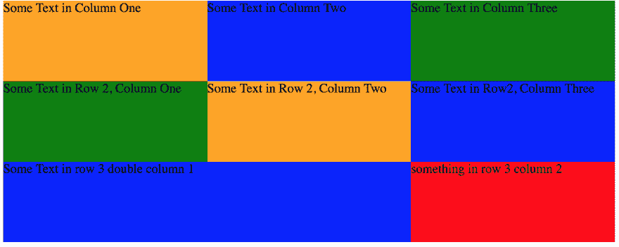
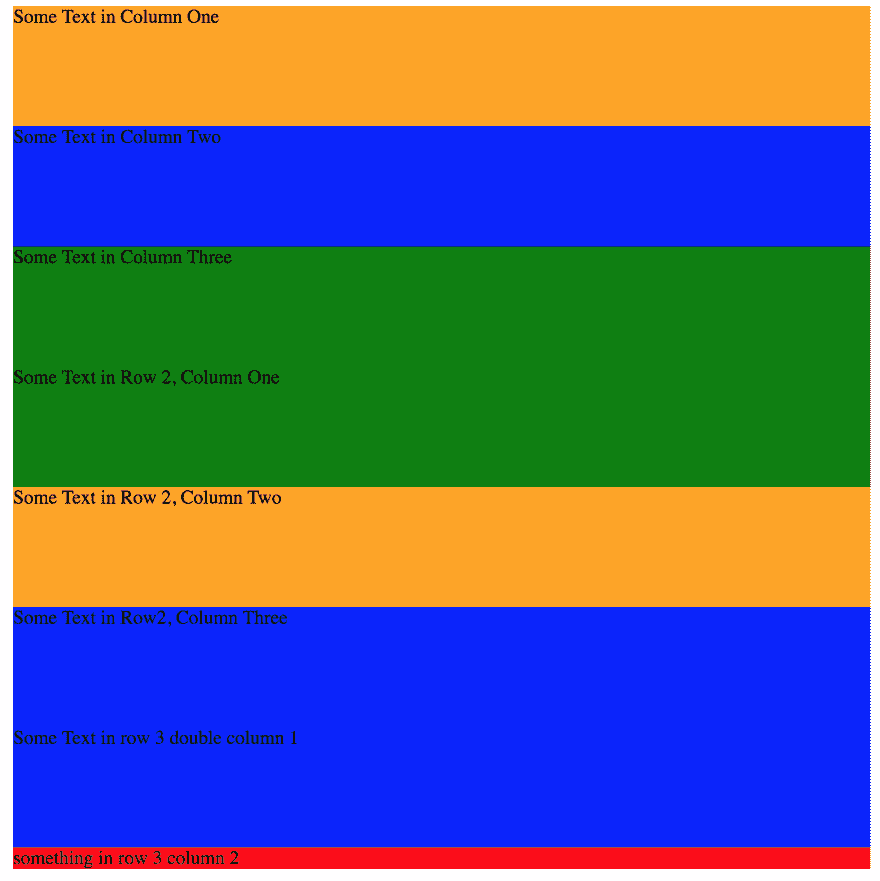

# 使用 Flexbox 灵活两列极其简单的行和列布局

> 原文：<https://dev.to/drews256/ridiculously-easy-row-and-column-layouts-with-flexbox-1k01>

# 超级简单的直上 CSS 中的响应行和列

网格布局是 web 开发设计的面包和黄油，你可能已经接触到了一些东西，比如 Bootstrap 或 Foundation，来使你的布局成为现实。但是，像你们大多数人一样，我不喜欢运行 Bootstrap 或 Foundation 所需的依赖性，也不喜欢页面加载时间的增加。

事实上，当我使用 Bootstrap 开发我正在编写的应用程序时，我真的几乎只在网格布局中使用它，有时我会将它用于通知或基本的相当合理的 CSS 默认设置，但 90%的时候，我想要的只是网格布局。

我也不喜欢只有将列拆分成 12 列或更少的选项。感觉你有时不得不做一些疯狂的工作来获得一列列的列，或者类似的奇怪的东西。

怎样才能更快更简单的做网格布局？Flexbox 就是你的答案。我认为

### Flexbox

在这一点上，flexbox 几乎无处不在。所有主流[浏览器](https://caniuse.com/#feat=flexbox)都支持它。它允许更简单的布局，并且受 React-Native 支持，这意味着当我为 React-Native 布局页面时，我会首先使用 flexbox，但我发现在 web 开发中，我也会首先使用 flexbox。

事实上，我设计的最后一个应用完全是用 flexbox 完成的。我发现很容易使用。

如果你不太了解 flex box。我喜欢这个页面，它很好地展示了 [flexbox](https://css-tricks.com/snippets/css/a-guide-to-flexbox/)

### 布局

首先，我将整个页面包装在一个 div 中。

```
<div class='some-page-wrapper'>
</div> 
```

Enter fullscreen mode Exit fullscreen mode

然后我定义了一个`.row`和`.column`类来帮助布局。

```
.row {
  display: flex;
  flex-direction: row;
  flex-wrap: wrap;
  width: 100%;
}

.column {
  display: flex;
  flex-direction: column;
  flex-basis: 100%;
  flex: 1;
} 
```

Enter fullscreen mode Exit fullscreen mode

现在，如果我们想要两列布局:

```
<div class='some-page-wrapper'>
  <div class='row'>
    <div class='column'>
      <div class='blue-column'>
        Some Text in Column One
      </div>
    </div>
    <div class='column'>
      <div class='green-column'>
        Some Text in Column Two
      </div>
    </div>
  </div>
</div> 
```

Enter fullscreen mode Exit fullscreen mode

CSS 看起来像:

```
.some-page-wrapper {
  margin: 15px;
  background-color: red;
}

.row {
  display: flex;
  flex-direction: row;
  flex-wrap: wrap;
  width: 100%;
}

.column {
  display: flex;
  flex-direction: column;
  flex-basis: 100%;
  flex: 1;
}

.blue-column {
  background-color: blue;
  height: 100px;
}

.green-column {
  background-color: green;
  height: 100px;
} 
```

Enter fullscreen mode Exit fullscreen mode

[https://codepen.io/drews256/embed/zLerNx?height=600&default-tab=result&embed-version=2](https://codepen.io/drews256/embed/zLerNx?height=600&default-tab=result&embed-version=2)

如果我们想增加第三列呢？HTML 很容易更新为:

```
<div class='some-page-wrapper'>
  <div class='row'>
    <div class='column'>
      <div class='blue-column'>
        Some Text in Column One
      </div>
    </div>
    <div class='column'>
      <div class='green-column'>
        Some Text in Column Two
      </div>
    </div>
    <div class='column'>
      <div class='orange-column'>
        Some Text in Column Two
      </div>
    </div>
  </div>
</div> 
```

Enter fullscreen mode Exit fullscreen mode

[https://codepen.io/drews256/embed/djaYKo?height=600&default-tab=result&embed-version=2](https://codepen.io/drews256/embed/djaYKo?height=600&default-tab=result&embed-version=2)

我们增加了第三列。无缝地筑巢在我们这一排。

[https://codepen.io/drews256/embed/djaYKo?height=600&default-tab=result&embed-version=2](https://codepen.io/drews256/embed/djaYKo?height=600&default-tab=result&embed-version=2)

如果我们想要更复杂的布局呢？

我们可以添加更多的行，这很简单。

```
<div class='some-page-wrapper'>
  <div class='row'>
    <div class='column'>
      <div class='orange-column'>
        Some Text in Column One
      </div>
    </div>
    <div class='column'>
      <div class='blue-column'>
        Some Text in Column Two
      </div>
    </div>
    <div class='column'>
      <div class='green-column'>
        Some Text in Column Three
      </div>
    </div>
  </div>
  <div class='row 2'>
    <div class='column'>
      <div class='green-column'>
        Some Text in Row 2, Column One
      </div>
    </div>
    <div class='column'>
      <div class='orange-column'>
        Some Text in Row 2, Column Two
      </div>
    </div>
    <div class='column'>
      <div class='blue-column'>
        Some Text in Row2, Column Three
      </div>
    </div>
  </div>
</div> 
```

Enter fullscreen mode Exit fullscreen mode

[https://codepen.io/drews256/embed/WKPwxN?height=600&default-tab=result&embed-version=2](https://codepen.io/drews256/embed/WKPwxN?height=600&default-tab=result&embed-version=2)

或者我们可以调整列的大小。

要有一个双列，我们可以添加一个`.double-column`类。这可以适用于任何尺寸的色谱柱，例如 60/40、10/10/10/10/10/10/10/10/10/10，老实说，任何组合都是可行的。可以做 1 X 100。或者 10×1，然后 20×3，然后 30×1。选择是无穷无尽的！

在一个布局中，我在我的“列”周围添加了一个大的空白，因为这一行将会换行，所以我有一个包含我需要的那么多“列”的行。这些列是固定宽度的卡片，所以它们会换行到下一行，flexbox 会整齐地响应，将卡片沿屏幕向下换行。

```
.double-column {
  display: flex;
  flex-direction: column;
  flex-basis: 100%;
  flex: 2;
} 
```

Enter fullscreen mode Exit fullscreen mode

[https://codepen.io/drews256/embed/djaMWj?height=600&default-tab=result&embed-version=2](https://codepen.io/drews256/embed/djaMWj?height=600&default-tab=result&embed-version=2)

这不是很有反应，虽然？我们可以使用媒体查询来增加一些响应度。

只需将`flex: 1`和`flex: 2`移动到媒体查询中(大小取决于应用程序，我只是给出一个选项)

```
@media screen and (min-width: 800px) {
  .column {
    flex: 1
  }

  .double-column {
    flex: 2
  }
} 
```

Enter fullscreen mode Exit fullscreen mode

大于 800 像素时:

[T2】](https://res.cloudinary.com/practicaldev/image/fetch/s--DzPqDKUf--/c_limit%2Cf_auto%2Cfl_progressive%2Cq_auto%2Cw_880/https://thepracticaldev.s3.amazonaws.com/i/vzblza9096iap76a55ju.png)

小于 800 像素时:

[T2】](https://res.cloudinary.com/practicaldev/image/fetch/s--dzGLNzsR--/c_limit%2Cf_auto%2Cfl_progressive%2Cq_auto%2Cw_880/https://thepracticaldev.s3.amazonaws.com/i/g4vz31amzqbpn5duuu5l.png)

最终代码笔，提示单击右下角的 1x 或 0.5x 按钮，查看“响应式”布局的差异。

[https://codepen.io/drews256/embed/bjzpvd?height=600&default-tab=result&embed-version=2](https://codepen.io/drews256/embed/bjzpvd?height=600&default-tab=result&embed-version=2)

本质上，我们只是用 20 行 CSS 把 bootstrap 的行/列打得落花流水。我们有一种快速创建行/列布局的方法，由于我们使用 flexbox，我们几乎不用担心布局中断或出现任何问题。它很容易适应各种各样的用途，并允许大量的定制。你对 flexbox 有什么看法？你试过了吗？

另一个隐藏的好处是，如果我以这种方式布局 React 组件，那么布局 React-Native 组件看起来很容易相似。

我通常在我的项目中使用 SCSS，所以如果你看到一些不完美的 CSS 让我知道！