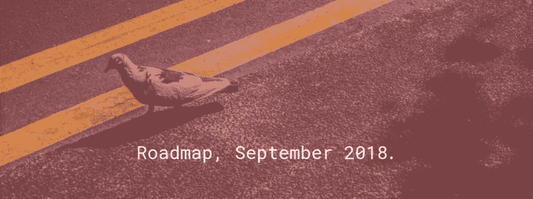

# 路线图，2018 年 9 月

> 原文：<https://dev.to/starbist/roadmap-september-2018-251n>

[T2】](https://res.cloudinary.com/practicaldev/image/fetch/s--x2A5Atwc--/c_limit%2Cf_auto%2Cfl_progressive%2Cq_auto%2Cw_880/https://thepracticaldev.s3.amazonaws.com/i/553rpwxkw5btpx1fzaiq.jpg)

为自己设计路线图的灵感来自于 C. Todd Lombardo 在电视上关于路线图的演讲:[路线图已经死了！路线图万岁！](https://speakerdeck.com/iamctodd/roadmaps-are-dead-long-live-roadmaps-mtpcon-2018)。我制作了这个路线图来提醒自己，为职业生涯制定一个计划是多么重要。如果我没有实现每一个目标，那也没关系，只要我一直在追踪这个愿景。

## 路线图

Lombardo 认为，路线图有五个主要组成部分:

*   视觉，
*   目标，
*   时间框架，
*   主题，以及
*   免责声明。

## 免责声明

制作路线图免责声明是必不可少的。

> 因此，你应该考虑让自己知道这个路线图很容易改变。内容传达的信息只与我相关。还有，一个人不可能是一个项目。â

话虽如此，你可以自由地受到启发，做出自己的职业规划和决定。

## 远景

愿景应该回答你要去哪里，或者未来应该如何寻找你，或者你在某一段时间内看到自己在哪里这样的问题。它不一定是一个单一的想法，它可以是一个完整的文档或一篇博客帖子或其他东西。

> 我目前的愿景是:
> 
> *   为每个客户建立更高性能、更可靠、更易访问的网站，
> *   为了更好地交付像素完美、响应迅速和语义化的用户界面解决方案，
> *   成为更受尊重和认可的开发者，以及
> *   开一家咨询公司。

## 目标

目标是你可以衡量或比较的结果。当设定目标时，你应该问这样的问题，比如你想完成什么，或者你期望什么结果。

> 我目前的目标是:
> 
> *   对所有项目一视同仁，全神贯注，
> *   了解有关 web 工具、技术和原则的更多信息，
> *   多写一些技术类的帖子，
> *   多写职业帖子，
> *   吸引更多的访问者来我的网站，
> *   在社交网络上建立更大的受众群，
> *   落地更具挑战性的项目，
> *   增加小时工资，
> *   做一个我自己的产品，然后
> *   销售咨询服务。

我知道我的目标听起来很理想化，但这正是我的目的。目标应该帮助你跟随愿景。对我来说，最终的目标是通过根据我的专业知识和经验做出决定来帮助客户构建更好的软件，而不需要参考编码。

## 时间范围

时间框架是你期望完成目标的时间段。时间框架可以是一个特定的单位，如一天、一个月或一年，也可以是一个不精确的单位，如现在、不久、下一个或未来。

## 主题

主题是你应该如何工作的组织原则。首先，你有一个问题，然后你定义你需要什么来解决这个问题，然后你设定一个目标。

让我们创建一个主题。问题是高跳出率——我网站上的访问者经常在阅读或不阅读文章后跳出率。我需要的是更多高质量的内容和/或行动号召按钮。目标是吸引更多的访问者，降低跳出率。

Lombardo 谈到对你试图解决的问题反复问“为什么”,直到你找到问题的根本原因:

*   为什么我需要更多优质内容？因为我希望更多的访问者回来阅读更多的内容。
*   为什么游客不回来了？因为访客主要来自我分享一篇文章后的社交网络。
*   为什么访客不是来自谷歌？因为网站不在搜索结果的第一页。
*   为什么网站不在首页？因为 SEO 没有优化。

> 我目前的主题是:
> 
> *   改善搜索引擎优化以获得更高的谷歌排名
> *   在主页上添加更多内容，创造独特的用户体验
> *   更新投资组合，让潜在客户愿意雇用你
> *   为 Smashing 杂志发表一篇文章
> *   发布一个关于静态页面生成器的课程

我已经用完整的路线图创建了一个 Trello 板。你可以看到我已经添加了标签——现在、下一个和以后——来定义时间范围。

## 结论

回顾你所取得的成就可能会给你很大的启发，它会让你思考下一步你想做什么。把你的愿景和目标写在纸上，或者在电脑上打出来，可能会让你从不同的角度看问题。

当我为自己制定路线图时，我觉得我的职业生涯正朝着正确的方向发展。这也让我觉得我永远不会去我想去的地方，但那是一个完全不同的话题。đ