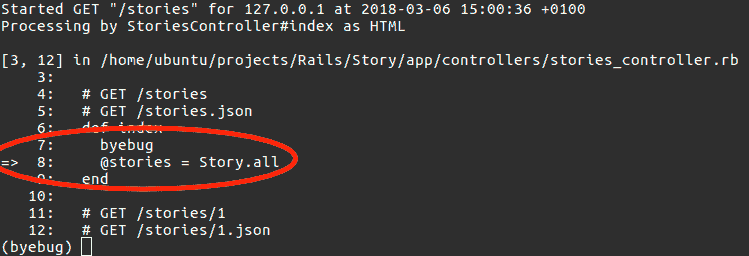
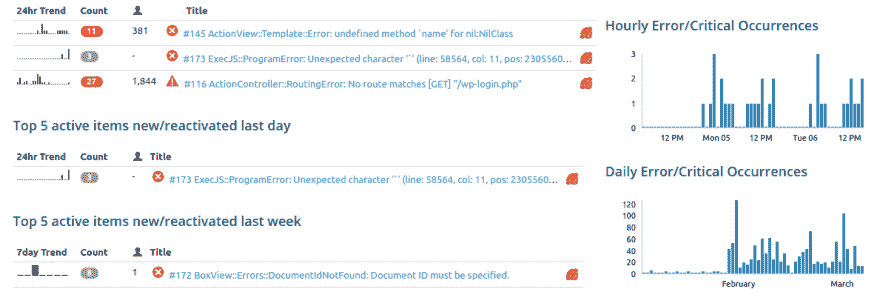

# Ruby on Rails 调试指南

> 原文：<https://dev.to/neshaz/ruby-on-rails-guide-to-debugging-22fg>

即使是世界上最好的 Rails 开发人员也不得不不时地调试他们的代码。与其他框架不同，Rails 使调试代码变得容易，因此您可以限制停机时间，让您的应用程序正常运行。调试从未如此简单！

## Byebug

让我们通过安装 byebug gem 来开始我们的调试会话。这个 gem 使您能够在代码内部用关键字`byebug`标记的**断点**处暂时停止代码执行。当执行到达断点时，一个标记将指向当前行，您将能够键入命令。

使用 byebug，你可以看到在断点之前定义的变量内部的值，只需输入它们的名字。相同的逻辑适用于给定代码块中所有可访问的方法。

[T2】](https://res.cloudinary.com/practicaldev/image/fetch/s--5wjdORvq--/c_limit%2Cf_auto%2Cfl_progressive%2Cq_auto%2Cw_880/https://storage.kraken.io/kk8yWPxzXVfBD3654oMN/ff3fb15714e3dfd81f497a25b86c2d30/byebug.png)

这个宝石提供了大量的**命令**，你可以在这里找到完整的列表[。我们将只提到最有用的:](https://github.com/deivid-rodriguez/byebug#byebugs-commands)

*   `next`命令使您能够转到下一行，跳过执行当前行所调用的所有方法(除非其中存在不同的断点)。
*   `step`命令与`next`命令非常相似，不同之处在于`step`将进入每个被调用的方法(一步一步)，
*   `break`命令停止代码的执行，
*   `continue`命令继续代码执行。

所有的调试 gem 都提供相似的功能，但是使用稍微不同的语法和语义。Rails 中另一个流行的调试工具是 [pry](https://github.com/pry/pry) 。如果你是一名[初级程序员](https://kolosek.com/ruby-programming-beginners-guide/)，也一定要去看看！

## 生产中的调试

**调试宝石** *不应该在生产中使用*——它们应该只在开发模式中使用。你安装它作为一个**开发依赖**。== *那么，如何在生产中调试呢？* ==

### 滚动条

一种方法是实现一个[滚动条](https://rollbar.com/)。**滚动条**提供了错误跟踪软件，它也可以集成到 ruby 中，你只需要[安装它](https://kolosek.com/rails-bundle-install-and-gemfile/)。滚动条的全部目的是为您提供生产中发生的错误的有用**日志。**

[T2】](https://res.cloudinary.com/practicaldev/image/fetch/s--Gd5Jz8kB--/c_limit%2Cf_auto%2Cfl_progressive%2Cq_auto%2Cw_880/https://storage.kraken.io/kk8yWPxzXVfBD3654oMN/ee89a254dc51999c69950074d18eae25/rollbar.png)

您希望在应用程序中使用它有多种原因:

*   它*报告* *所有未处理的错误和异常。
*   允许**手动记录**。
*   它存储了大量有用的信息，比如 http 请求、被请求的用户、引发错误的代码等等。
*   每次在你的生产服务器上发生一些**未处理的异常**时，它都会发送电子邮件通知，以及与 **scrum** 软件一起，这样每一个新条目都会被自动转换成 **bug** 、**问题**或任何 scrum 软件支持的符号。

### 手动

如果你不使用滚动条，另一种方法是当错误发生时，手动查看错误日志。这种方法有点慢，因为没有出错的通知，而且仅通过查看日志文件在本地机器上重现错误可能会更困难。

即使你的代码中没有令人讨厌的 bug，也不是休息的时候！为了确保一切正常运行，请务必使用 [RSpec](https://kolosek.com/rails-rspec-setup/) 和/或 [Capybara](https://kolosek.com/rails-capybara-setup/) 编写一些测试！

### 提示和窍门

*   你*不应该*直接在生产现场修复**生产错误**，应该先在**本地机**上复制并修复后再推向生产。
*   您*可以*在生产站点修复**生产错误**，前提是该错误是由某些服务器配置、特定数据集或生产数据库中更深层次的代码错误引起的。
*   **在推送新版本之前备份每个生产版本**，这样在紧急情况下，您可以简单地恢复到以前的版本。
*   使用**测试服务器**在生产环境中检查和测试你的代码。

希望这篇文章能对你将来的 bug 搜索有所帮助！

*这篇文章最初发表在[科洛塞克博客](https://kolosek.com/rails-debugging/)上。*