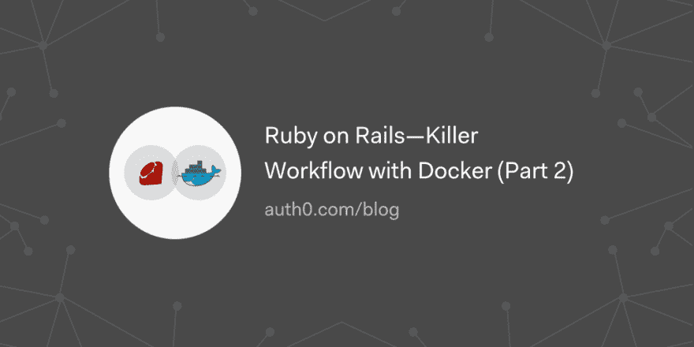

# ruby on Rails——使用 Docker 的黑仔工作流(第 2 部分)

> 原文：<https://dev.to/auth0/ruby-on-railskiller-workflow-with-docker-part-2-kgm>

了解如何建立一个杀手级的工作流，在开发 Ruby on Rails 应用程序时提高您的工作效率。

[读下去💎🐳](https://auth0.com/blog/ruby-on-rails-killer-workflow-with-docker-part-2/?utm_source=dev&utm_medium=sc&utm_campaign=ruby_docker)

[T2】](https://res.cloudinary.com/practicaldev/image/fetch/s--IYpyupwC--/c_limit%2Cf_auto%2Cfl_progressive%2Cq_auto%2Cw_880/https://thepracticaldev.s3.amazonaws.com/i/y5uxxxnioxmco65guky6.png)