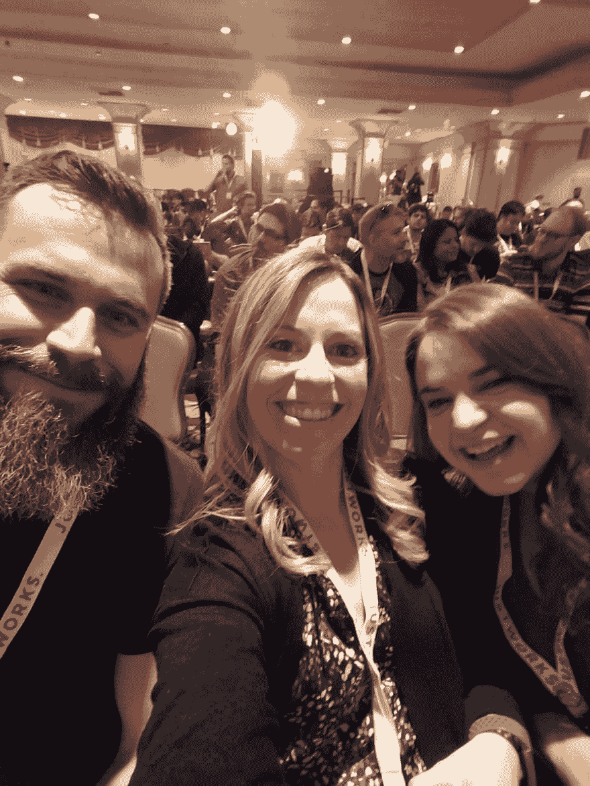
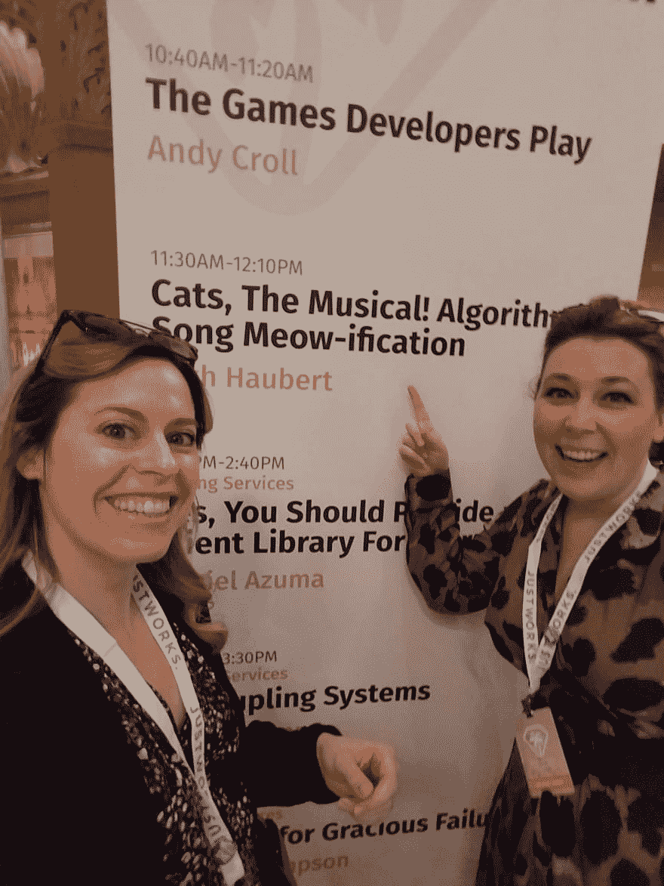
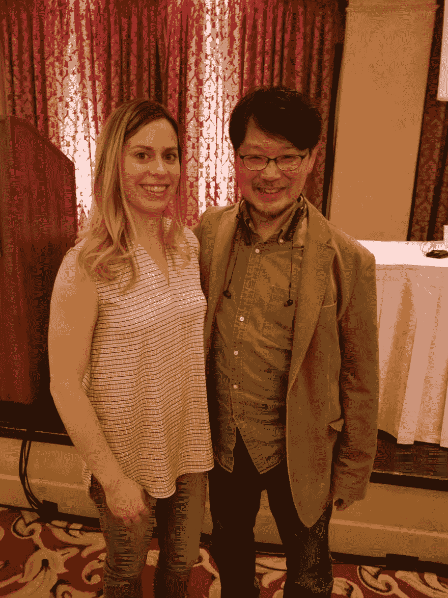
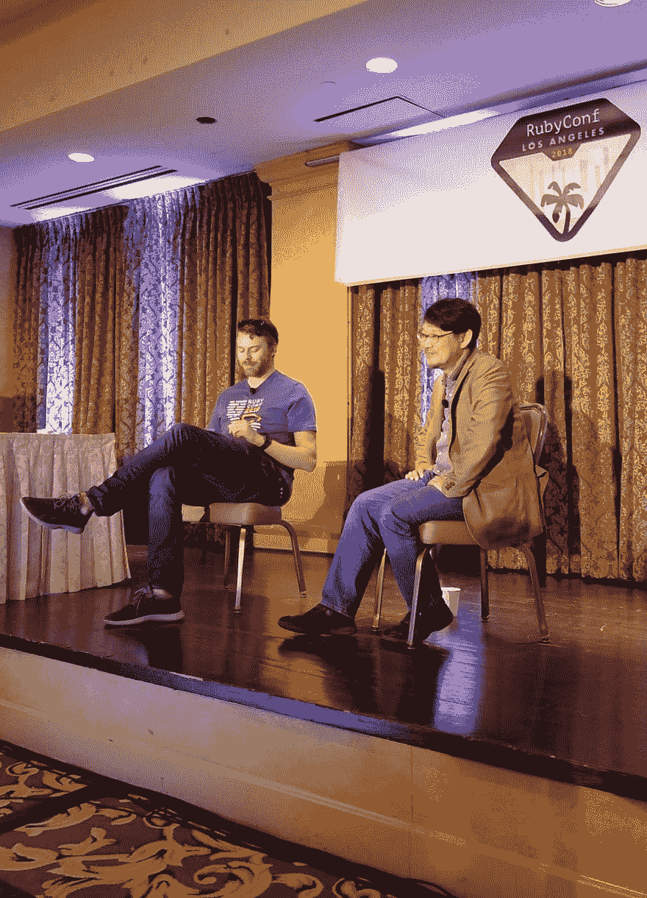

# RubyConf 回顾展

> 原文：<https://dev.to/cseeman/rubyconf-retrospective-53ej>

<figure></figure>

我通过了我的第一次技术会议。社交、网络和聚会比我想象的要多得多。这是为期 1000 天的不间断学习，会见了令人难以置信的人，并成为一个可怕的社区的一部分，我甚至不知道 6 个月前存在。伙计，在这么短的时间里能有这么大的变化真是令人惊讶。

<figure> 

<figcaption>队列 2 领导@erniemiller 和我的牛逼向导@ccmeyers324</figcaption>

</figure>

<figure> 

<figcaption>与@ courthedduchess</figcaption>

</figure>

一起支持@ haubertdashery

<figure> 

<figcaption></figcaption>

</figure>

<figure> 

<figcaption>Q & A 与艾凡凤凰和马茨</figcaption>

</figure>

我可能需要一段时间才能从会议中恢复过来，但我真的等不及要再次见到所有这些人了！让我们把我能在 3 天内完成的事情分解如下:

第 1 天

上午 9:30 与 Matz 一起做主题演讲！

上午 10:40 游戏开发商播放安迪·克罗尔

上午 11:30 猫，音乐剧！算法歌曲模仿贝丝·豪伯特

下午 1:20 鲁比家族恩怨

下午 2:00 揭开科技的男性化奥黛丽·埃施赖特

下午 2:50 解耦系统赋予早期职业开发人员权力梅塞德斯·伯纳德

下午 4:00 鲁比-美国海格:与鲁比一起写哈利·波特亚历克斯·派蒂

下午 4:50 主题演讲与比安卡·埃斯卡兰特

下午 6:群组考拉小组郊游蛋挞面包店

晚上 7 点建国者卖主聚会

第二天

上午 9:30 主题演讲如何打造一个神奇的客厅 Saron Yitbarek

上午 10:30 让我们来看看 Hash 的子类——最坏可能会发生什么？迈克尔·赫罗德

上午 11:20 垃圾对话:垃圾收集选择你自己的冒险科林·富尔顿

下午 1:10 现场暴民重构！

下午 1:50 解剖红宝石:从零到共享代码托尼·德雷克

下午 2:40 减少可枚举性——图解冒险布兰登·韦弗

下午 3:50 缓存为王:从红宝石中获得最大收益莫莉·斯特鲁维

下午 4:40 失踪方法案例——红宝石神秘故事纳迪亚·奥杜纳约

下午 5:30 闪电会谈

下午 7 点 weed

第 3 天

上午 9:30 主题演讲《改变的挑战》杰西·施滕舒斯

晚上 10:30 及时分支泰京·苏莱曼

上午 11:20 与鲁比·卡梅隆·杜特罗

偷情下午 1 点录制了一段[大过码播客](https://www.greaterthancode.com)插曲！就等 ep 吧。108

下午 2:40 Ruby 的新设计文档 ITOYANAGI Sakura

下午 3:40 Q&A 与 Matz

无论从哪个角度来看，这些都不是全部，但它们是我能够达到的。谢天谢地，一切都录制好了，并将于本月晚些时候在 [Confreaks](https://confreaks.tv/events/rubyconf2018) 上发布，因为我错过了很多我迫不及待想看的会议。我是否达到了所有的会议目标？不，但是我认为我确实学到了很多，对社区有了一些感觉，并且知道了一些我想要继续学习 Ruby 的步骤。参加 [Brandon Weaver](https://twitter.com/keystonelemur) 的 [Reducing Enumerable](https://medium.com/@baweaver/reducing-enumerable-part-one-the-journey-begins-ddc1d4108490) 深入研究 Enumerable 的许多方法，以及在 [Nadia Odunayo](http://www.nadiaodunayo.com/) 的[The Case of Missing Method](https://www.youtube.com/watch?v=nbZk7KqGILU)中学习 ghost 元类，我可以学到更多关于 ruby 数据结构的知识。我不认为有任何演讲特别深入到 Ruby 设计模式，但我确实听到 Matz (Ruby 的创造者)多次谈到 Ruby 未来的发展方向(圣诞节前的 2.6 版本)和他对注释的看法(没有)。

[T2】](https://i.giphy.com/media/SiGjBqizFrcXWk5iBb/giphy.gif)

我还会去参加会议吗？很快，我很高兴能加入这个社区，并希望通过成为一名演讲者(甚至是神话般的[奖学金项目](https://rubyconf.org/scholarships)的指导)来参与其中。我想给未来 RubyConf 与会者的建议是，带上一个外部电池，调整自己的速度(这是录音的，所以你可以随时查看演讲，但你不一定要在会议结束后亲自和别人交谈)，不要害怕向演讲者介绍自己，并要求拍照，这就是 [#rubyfriends](https://twitter.com/search?q=%23rubyfriends&src=tyah) 的目的！