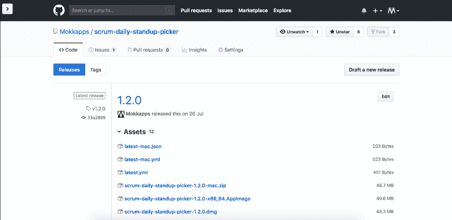

# 使用 Travis CI 运行自动化电子应用程序测试

> 原文：<https://dev.to/mokkapps/run-automated-electron-app-tests-using-travis-ci-10b2>

去年我开发了[站立拾取器](https://dev.to/standup-picker)，这是一个运行在[电子](https://electronjs.org)外壳中的[角度](https://angular.io)应用程序。

当我发布新版本时，老版本已经在使用了，我想在发布我的应用程序的新版本时获得更多的信心。

由于在 GitHub 上可以获得[源代码，我研究了](https://github.com/Mokkapps/scrum-daily-standup-picker) [Jenkins](https://jenkins-ci.org/) 的免费替代品，我们在工作中使用这些替代品进行持续集成(CI)。

我找到了 [Travis](https://travis-ci.org) 这是一个 GitHub 项目的免费持续集成平台。

## 我的期望

[T2】](https://res.cloudinary.com/practicaldev/image/fetch/s--0rIPfZij--/c_limit%2Cf_auto%2Cfl_progressive%2Cq_auto%2Cw_880/https://theagilecoder.files.wordpress.com/2016/12/devops-memes-emcworld-2015-8-638.jpg)

我想在每次发布电子应用程序之前集成自动化 E2E 和单元测试。在我的例子中，如果一些东西已经被合并到 master 中，那么就应该触发一个发布。因此，配置项基本上应该执行以下步骤:

1.  运行单元测试
2.  运行 E2E 测试
3.  为 OS X、Linux 和 Windows 创建电子版本

通过这种方式，我可以非常确定我的发布会像预期的那样工作(至少所有我测试过的东西)。

## 在您的项目中集成 Travis CI

为了能够使用 Travis，您需要确保您有一个 GitHub 帐户，并且您拥有这个托管在 GitHub 上的项目的所有者权限。

下一步是访问[Travis 主页](https://travis-ci.com/)，[注册 GitHub](https://travis-ci.com/signin) 并按照指示操作，直到你可以选择你的项目。

为了能够告诉 Travis CI 应该执行哪些自动化步骤，您需要向存储库的根目录添加一个`.travis.yml`文件。

最后，您需要将`.travis.yml`文件添加到 git 中。如果您随后提交和推送，则会触发 Travis CI 构建。请注意，Travis 只能在将`.travis.yml`文件推送到 git 之后的提交上运行构建。

## 配置 Travis CI

我现在将解释如何为我的电子应用程序配置`.travis.yml`文件。

[T2】](https://res.cloudinary.com/practicaldev/image/fetch/s--1BUrz4Bl--/c_limit%2Cf_auto%2Cfl_progressive%2Cq_auto%2Cw_880/https://res.cloudinary.com/practicaldev/image/fetch/s--o25mzxVZ--/c_limit%252Cf_auto%252Cfl_progressive%252Cq_auto%252Cw_880/http://res.cloudinary.com/lauragift/image/upload/v1529656180/logo-travisci-wide1_lcjhdf.jpg)

### 选择操作系统

我先引用电子制作网站上的一段话，这是一个 NPM 软件包，我用它来制作我的电子新闻稿:

> 不要指望你能在一个平台上构建所有平台的 app。

因为我想为 OS X、Windows、Linux 创建版本，所以我必须定义多个操作系统。主要原因是不可能从 OS X 或 Windows 创建 Linux 版本。

所以我最终在 Linux 和 OS X 上并行运行了我的 Travis 设置。我的脚本检查当前的操作系统，并且只在正确的环境下运行。

查看[官方文档](https://docs.travis-ci.com/user/multi-os/)了解更多详情。

这些是我的`.travis.yml`文件的相关部分:

```
osx_image: xcode8.4 # define OS X image which will be mounted

dist: trusty # use Ubuntu Trusty for Linux operation system

# Note: if you switch to sudo: false, you'll need to launch chrome with --no-sandbox.
# See https://github.com/travis-ci/travis-ci/issues/8836
sudo: required

# Define Node.js as the programming language as we have a web application
language: node_js
node_js: '8'

addons:
  chrome: stable # Install chrome stable on operating systems

# A list of operating systems which are used for tests
os:
  - linux
  - osx 
```

Enter fullscreen mode Exit fullscreen mode

## 电子生成器配置

[T2】](https://camo.githubusercontent.com/627c774e3070482b180c3abd858ef2145d46303b/68747470733a2f2f656c656374726f6e6a732e6f72672f696d616765732f656c656374726f6e2d6c6f676f2e737667)

对于[电子建造者](https://www.electron.build/)，我基于[官方文档](https://www.electron.build/multi-platform-build) :
添加了一些额外的缓存和变量配置

```
env:
  global:
    - ELECTRON_CACHE=$HOME/.cache/electron
    - ELECTRON_BUILDER_CACHE=$HOME/.cache/electron-builder

cache:
  yarn: true
  directories:
    - $HOME/.cache/electron
    - $HOME/.cache/electron-builder
    - $HOME/.npm/_prebuilds

before_cache:
  - if [["$TRAVIS_OS_NAME" == "linux"]]; then rm -rf $HOME/.cache/electron-builder/wine; fi 
```

Enter fullscreen mode Exit fullscreen mode

## 定义脚本

现在我们定义应该由 Travis 执行的脚本:

```
# These commands are executed before the scripts are executed
install:
  # On OS X we first need to install Yarn via Homebrew
  - if [["$TRAVIS_OS_NAME" == "osx"]]; then brew install yarn; fi
  # Install all dependencies listed in your package.json file
  - yarn

script:
  - echo "Unit Tests"
  - if [["$TRAVIS_OS_NAME" == "linux"]]; then xvfb-run yarn test; else yarn test; fi

  - echo "E2E Tests"
  - if [["$TRAVIS_OS_NAME" == "linux"]]; then xvfb-run yarn test:electron; else yarn test:electron; fi

  - echo "Deploy linux version to GitHub"
  - if [["$TRAVIS_BRANCH" == "master"]] && [["$TRAVIS_OS_NAME" == "linux"]]; then yarn release:linux; fi

  - echo "Deploy windows version to GitHub"
  - if [["$TRAVIS_BRANCH" == "master"]] && [["$TRAVIS_OS_NAME" == "osx"]]; then yarn release:win; fi

  - echo "Deploy mac version to GitHub"
  - if [["$TRAVIS_BRANCH" == "master"]] && [["$TRAVIS_OS_NAME" == "osx"]]; then yarn release:mac; fi 
```

Enter fullscreen mode Exit fullscreen mode

### 单位& E2E 测试

电子需要一个显示驱动器，因为它是基于铬。如果 Chromium 找不到显示驱动程序，您将无法执行任何测试(电子将无法启动)。为了解决这个问题，我们需要使用一个虚拟显示驱动程序，比如 Xvfb。

Xvfb 是一个虚拟的帧缓冲区，它使我们的测试能够在内存中运行，而不需要显示实际的屏幕。

在 Linux 上，我们需要通过 OS X 上的`xvfb-run yarn <NPM_SCRIPT_NAME>`运行 NPM 测试脚本，Windows Chromium 已经正确配置。

### GitHub 发布

通过从我的 [package.json](https://github.com/Mokkapps/scrum-daily-standup-picker/blob/master/package.json) 运行`yarn release:<OS>`，如果单元& E2E 测试已经通过，我可以在 GitHub 发布页面上自动创建一个新的发布草案:

[T2】](https://res.cloudinary.com/practicaldev/image/fetch/s--OdVUmj86--/c_limit%2Cf_auto%2Cfl_progressive%2Cq_auto%2Cw_880/https://thepracticaldev.s3.amazonaws.com/i/pofilqqg6ewm0ycebr33.png)

## 结论

我真的不得不投入数小时来为我的应用程序正确配置 Travis。最终，时间的努力是值得的。

新版本已经通过了我的测试，我可以肯定应用程序的基本功能正在工作。