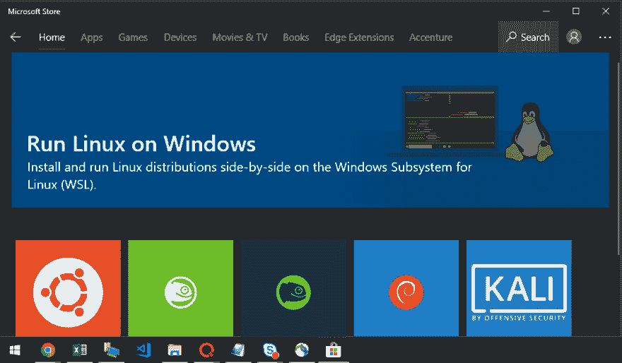
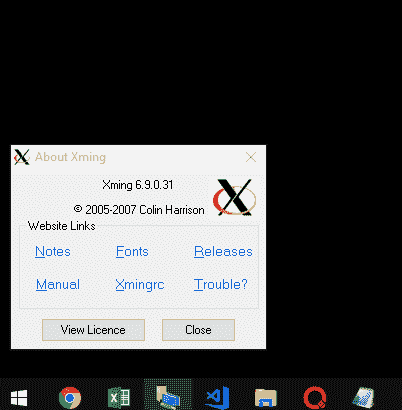
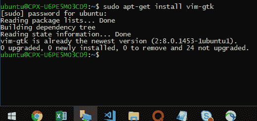
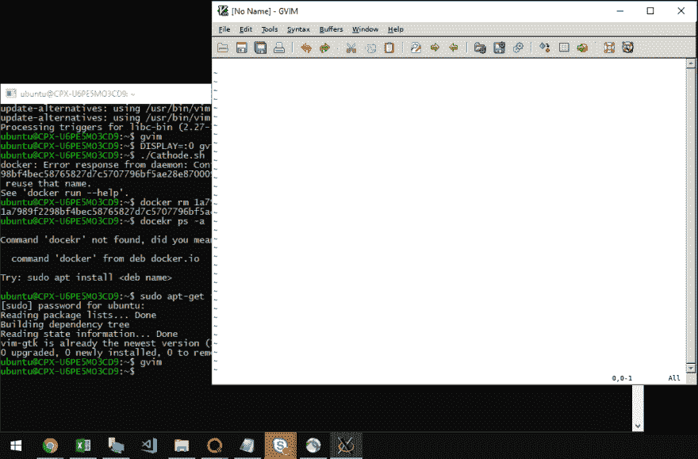

# 在 Windows 10 上运行 Linux GUI 应用

> 原文：<https://dev.to/david_j_eddy/run-linux-gui-applications-on-windows-10-3130>

## 一点背景

尽管我很想在科技界忽略 Windows，但它不能被边缘化。许多用户在许多系统上运行许多应用程序。再加上微软最近进入自由或开源软件(FOSS)世界的举动，Windows 也在 IT /工程界受到重视方面取得了重大进展。

## 时势

在家里我运行 Ubuntu 18.04，在路上是 15 英寸的 MacBook Pro，我的手机是某个版本的 Android，最后在办公室我们在 Windows 10 惠普笔记本上运行。我离用户可能获得的统一体验还很远。鉴于我目前的角色，能够在 Windows 上运行 Linux 程序是一项非常令人向往的能力。Linux 的 Windows 子系统使这一点变得非常容易。我甚至可以在包装在 Windows 中的 Linux 上使用 Docker 运行一个容器。#软件抽象概念。与十年前相比，这是一个惊人的飞跃，当时运行 LAMP stack 与 IIS 一起正常工作是一次疯狂的旅程。互操作性已经发展到现在，在 Windows 上运行 Linux GUI 程序已经成为可能。就这样走过去了。

## 解决方案

从 Windows 应用商店安装 Linux 的 Windows 子系统(WSL)。我选择了 Ubuntu 选项。

<figure>[](https://res.cloudinary.com/practicaldev/image/fetch/s---UUxE-Jn--/c_limit%2Cf_auto%2Cfl_progressive%2Cq_auto%2Cw_880/https://blog.davidjeddy.com/wp-content/uploads/2018/10/image-29.png)

<figcaption>Windows 上的 Linux #神魂颠倒</figcaption>

</figure>

接下来，我们将希望在 Windows 10 上安装 Xming。如果能从[https://sourceforge.net/projects/xming/](https://sourceforge.net/projects/xming/)得到。按照安装程序中显示的安装说明进行操作。

<figure>[](https://res.cloudinary.com/practicaldev/image/fetch/s--4gkwI8HD--/c_limit%2Cf_auto%2Cfl_progressive%2Cq_auto%2Cw_880/https://blog.davidjeddy.com/wp-content/uploads/2018/10/image-28.png) 

<figcaption>退房。Windows 10 上的 X11 服务器。</figcaption>

</figure>

按下开始按钮并键入“wsl”。启动 Linux 程序的 Windows 子系统。当 Linux 终端可用时，让我们安装 gvim。

```
sudo apt-get install vim-gtk

```

<figure>[](https://res.cloudinary.com/practicaldev/image/fetch/s--EGJRtc9q--/c_limit%2Cf_auto%2Cfl_progressive%2Cq_auto%2Cw_880/https://blog.davidjeddy.com/wp-content/uploads/2018/10/image-30.png) 

<figcaption>gvim 安装</figcaption>

</figure>

运行 Linux 应用程序之前的最后一步是告诉 WSL 将视频数据发送到哪个显示器。这将是运行在 Windows 上的 Xming 服务器。

```
export DISPLAY=:0

```

现在，如果一切按预期进行，我们应该能够运行`gvim`并看到应用程序打开。

```
gvim

```

<figure>[](https://res.cloudinary.com/practicaldev/image/fetch/s--qKsamys_--/c_limit%2Cf_auto%2Cfl_progressive%2Cq_auto%2Cw_880/https://blog.davidjeddy.com/wp-content/uploads/2018/10/image-31.png) 

<figcaption>哇，看那个！</figcaption>

</figure>

## 结论

鉴于历史背景，很容易将微软视窗系统视为合法的开发环境。然而，随着容器化、Windows 子系统和微软拥抱 FOSS 社区的进步；Windows 可能只是值得作为家庭/办公室桌面使用。

## 资源

*   [安装 WSL:https://docs.microsoft.com/en-us/windows/wsl/install-win10](https://docs.microsoft.com/en-us/windows/wsl/install-win10)
*   [来源文章:https://www . how togeek . com/261575/how-to-run-graphical-Linux-desktop-applications-from-windows-10s-bash-shell/](https://www.howtogeek.com/261575/how-to-run-graphical-linux-desktop-applications-from-windows-10s-bash-shell/)