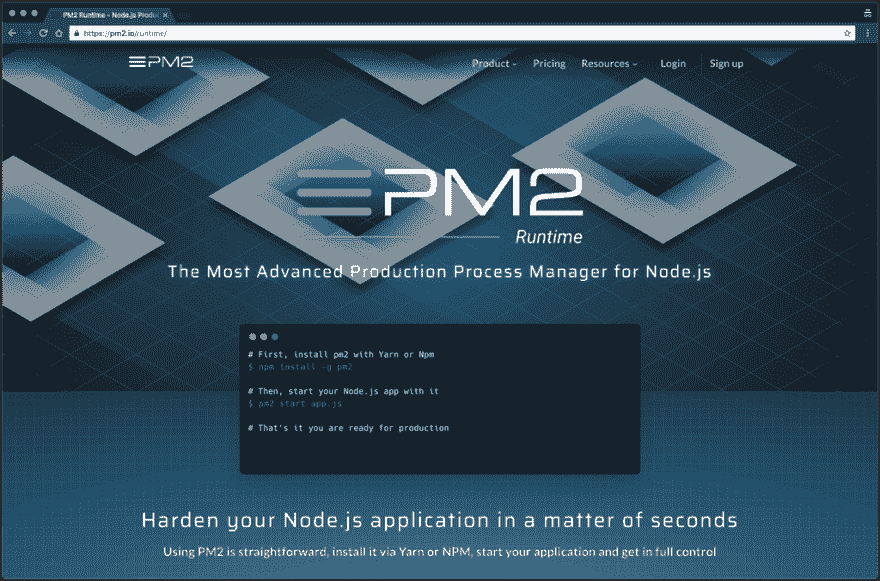
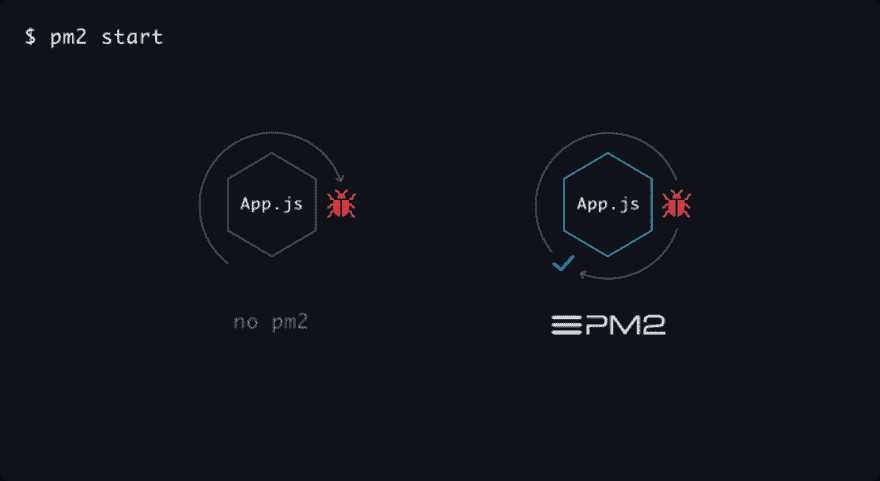
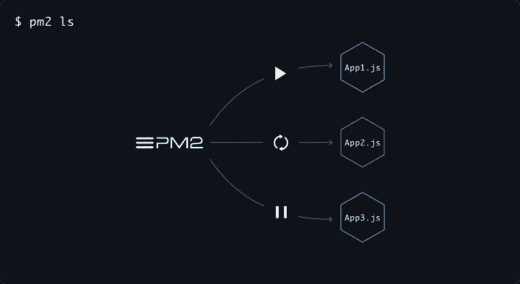
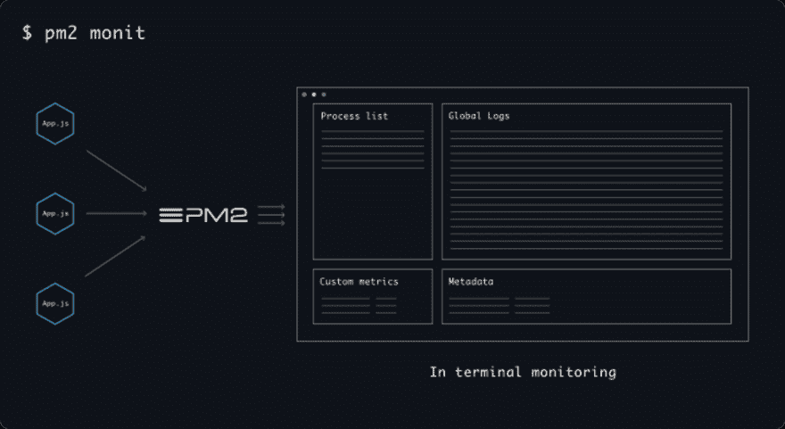
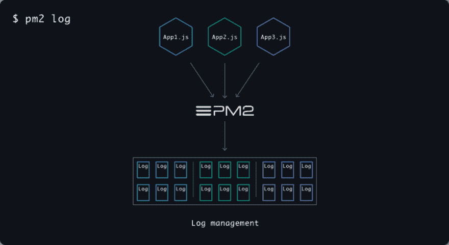

# 在生产环境中运行 PM2 & Node.js

> 原文：<https://dev.to/nickparsons/running-pm2--nodejs-in-production-environments-23i5>

在 Stream，我们构建了许多展示和示例应用程序来展示我们的服务必须提供的令人敬畏的特性。对于我们几乎所有的应用程序，我们在一个实例上托管它们——通常是 [DigitalOcean](https://www.digitalocean.com/) 或 [AWS EC2](https://aws.amazon.com/ec2/) 。

虽然维护您的代码库并保持其相关性很困难，但我们发现维护应用程序时最具挑战性的方面是保持它的活力和运行。此外，由于 Node.js 是我们大多数后端 API 的核心语言，扩展单线程进程可能很难做到；这就是 PM2 的用武之地，也是我们如此喜欢使用它的原因。

有很多流程经理，最著名的是 [Forever](https://github.com/foreverjs/forever) 、 [StrongLoop 的流程经理](http://strong-pm.io/)和 good ol’[SystemD](https://en.wikipedia.org/wiki/Systemd)。然后是 PM2，有超过 6000 万的下载量和 25k GitHub 明星(还在上升！).我们喜欢 PM2，简而言之，因为它易于使用，可以无缝管理生产环境。

# 什么是 PM2？

[T2】](https://res.cloudinary.com/practicaldev/image/fetch/s--mbjzRkHc--/c_limit%2Cf_auto%2Cfl_progressive%2Cq_auto%2Cw_880/https://getstream-blog.imgix.net/blog/wp-content/uploads/2018/08/image3.png%3Fw%3D1024%26h%3D1024)

PM2 是一个久经考验的，生产就绪的运行时和 Node.js 应用程序的进程管理器。它还带有一个内置的[负载平衡器](https://pm2.io/doc/en/runtime/guide/load-balancing/)，这使得扩展应用程序更加容易。最棒的是，它可以在 Linux、Windows 和 macOS 上运行。

通过一个配置文件(process.json ),您可以指定想要运行什么进程以及想要扩展到多少个进程。当启动 PM2 时，您指定 process.json 文件，PM2 负责剩下的工作。(稍后将详细介绍流程文件😉)

所有这一切意味着，PM2 允许您永远保持 Node.js 应用程序的活力，并且当您对应用程序或服务器进行更新时，可以零宕机地重新加载它们。

# 安装 PM2

安装 PM2 是小菜一碟。首先，您需要确保您的 process.json 文件已经准备好放入代码中，这样您就可以开始这个过程了。

如果你在 macOS 上，安装就像运行`yarn add global pm2`一样简单。如果你在 Linux、Windows 上，或者使用 Docker 容器(是的，它也支持 Docker)，遵循这里的指示。

如果你想知道它应该是什么样子，这里有一个例子，是我们的开源 RSS & Podcast 应用程序 Winds 的 process_prod.json 文件:

```
{
    "apps": [
        {
            "name": "api",
            "cwd": "api/dist",
            "script": "server.js",
            "watch": false
        },
        {
            "name": "conductor",
            "cwd": "api/dist/workers",
            "script": "conductor.js",
            "watch": false
        },
        {
            "name": "rss-worker",
            "cwd": "api/dist/workers",
            "script": "rss.js",
            "instances": 2,
            "exec_mode": "cluster",
            "watch": false
        },
        {
            "name": "podcast-worker",
            "cwd": "api/dist/workers",
            "script": "podcast.js",
            "instances": 2,
            "exec_mode": "cluster",
            "watch": false
        },
        {
            "name": "og-worker",
            "cwd": "api/dist/workers",
            "script": "og.js",
            "instances": 2,
            "exec_mode": "cluster",
            "watch": false
        }
    ]
} 
```

如您所见，我们正在运行几个进程，PM2 毫无问题地处理它们，自动使用 Node.js 集群 API 生成多个进程。

# 提示&诡计

对于任何应用程序(或者在我们的例子中是流程管理器)，从以前使用过它的个人那里了解一些技巧和诀窍是很好的。

### 自动重启

[T2】](https://res.cloudinary.com/practicaldev/image/fetch/s--D6G263xH--/c_limit%2Cf_auto%2Cfl_progressive%2Cq_auto%2Cw_880/https://getstream-blog.imgix.net/blog/wp-content/uploads/2018/08/image1.png%3Fw%3D1024%26h%3D1024)

一旦启动，您的应用程序将永远存在，在崩溃和机器重启后自动重启——所有这一切只需一个简单的命令: **pm2 启动**

## 流程管理

[T2】](https://res.cloudinary.com/practicaldev/image/fetch/s--Tctmj6HE--/c_limit%2Cf_auto%2Cfl_progressive%2Cq_auto%2Cw_880/https://getstream-blog.imgix.net/blog/wp-content/uploads/2018/08/image2.png%3Fw%3D1024%26h%3D1024)

无论你运行多少应用程序，PM2 都有一套命令，允许你管理它们各自的状态。下面是一些我们最喜欢的命令(排名不分先后):

*   `pm2 start process_prod.json` -通过进程 JSON 文件启动进程**
*   `pm2 ls` -显示所有应用程序的列表
*   `pm2 stop <app>`–停止特定的应用程序
*   `pm2 start <app>`–启动特定的应用程序
*   `pm2 <app> scale N`–将您指定的应用程序缩放至 N 个实例(可用于放大或缩小)
*   `pm2 kill`–终止所有正在运行的应用程序
*   `pm2 restart`–重启所有正在运行的应用程序
*   `pm2 reload`–重新加载应用程序配置(当您修改应用程序的环境变量时，这很方便)

### 流程管理

[T2】](https://res.cloudinary.com/practicaldev/image/fetch/s--q3OTjzMm--/c_limit%2Cf_auto%2Cfl_progressive%2Cq_auto%2Cw_880/https://getstream-blog.imgix.net/blog/wp-content/uploads/2018/08/image6.png%3Fw%3D1024%26h%3D1024)

运行命令`pm2 monit`将返回一组关于应用健康的丰富数据。例如，您将看到 CPU 利用率、内存使用、每分钟请求数等等！

## 日志管理

[T2】](https://res.cloudinary.com/practicaldev/image/fetch/s--Ucl3-m66--/c_limit%2Cf_auto%2Cfl_progressive%2Cq_auto%2Cw_880/https://getstream-blog.imgix.net/blog/wp-content/uploads/2018/08/image5.png%3Fw%3D1024%26h%3D1024)

PM2 有内置的日志管理。它从您的所有应用程序中聚合日志数据，并将其写入单个源以供查看。您甚至可以实时跟踪日志，查看应用程序的幕后情况。PM2 的日志管理还附带了日志轮换，这很重要，尤其是当您的应用程序频繁输出详细日志时。

**我经常使用三个命令，你也应该使用**:

*   `pm2 logs` -输出所有正在运行的应用程序的日志**
*   `pm2 logs app` -仅从“app”应用程序输出日志
*   `pm2 flush` -刷新所有日志数据，释放磁盘空间

请记住，最重要的事情是启用日志轮转。这样做会将一个巨大的日志文件分割成许多更小的文件，对于 PM2 来说更容易管理。为此，运行以下命令:`pm2 install pm2-logrotate`

关于日志管理的更多信息可以在[这里](https://pm2.io/doc/en/runtime/guide/log-management/)找到。如果您发现您的实例经常被日志填满，可以考虑使用集中式日志服务，比如 [Loggly](https://www.loggly.com/) 、 [Papertrail](https://papertrailapp.com/) 或 [ELK](https://www.elastic.co/elk-stack) 。

# 最佳实践:

一般来说，我喜欢遵守[十二因素应用](https://12factor.net/)中概述的实践。他们会让你充分利用 PM2 的优势。如果你还没有读过这份宣言，它可以归结为 12 条规则:

1.  在修订控制中跟踪一个代码库，部署多个
2.  显式声明和隔离依赖项
3.  在环境中存储配置
4.  将后台服务视为附属资源
5.  严格分离构建和运行阶段
6.  将应用程序作为一个或多个无状态进程执行
7.  通过端口绑定导出服务
8.  通过流程模型向外扩展
9.  快速启动和平稳关闭，最大限度地提高稳定性
10.  让开发、试运行和生产尽可能相似
11.  将日志视为事件流
12.  作为一次性流程运行行政/管理任务

如果你遵循上面的规则，你将能够用 PM2 有效地扩展任何应用程序，几乎没有错误。

# 最后的想法

在 Stream，我们都是开源社区的忠实粉丝，我们非常高兴 PM2 是一个开源项目。它使我们能够专注于构建令人惊叹的应用程序，而不必担心保持应用程序正常运行所需的巨大开销。说到这里，谢谢你 PM2！

如果你想了解更多关于 Stream 和我们的工作，看看我们的 [5 分钟教程](https://getstream.io/try-the-api)，它将带你了解如何使用我们的 API 用几行代码构建一个可伸缩的新闻订阅源。

对于那些正在阅读的人来说，我希望你喜欢这篇短文，并找到一些有用的信息。如果你有任何问题或意见，请在下面的评论中留下！

**感谢您的阅读和快乐编码！**